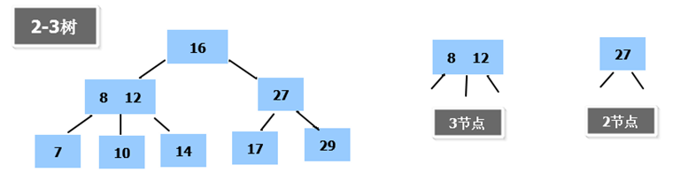
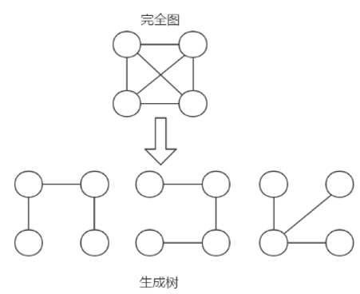
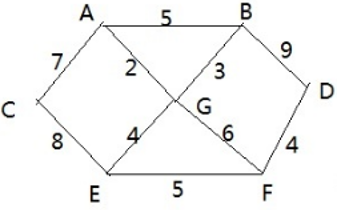
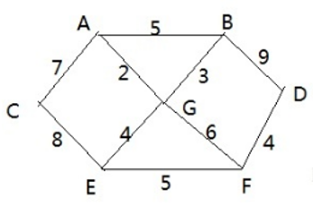
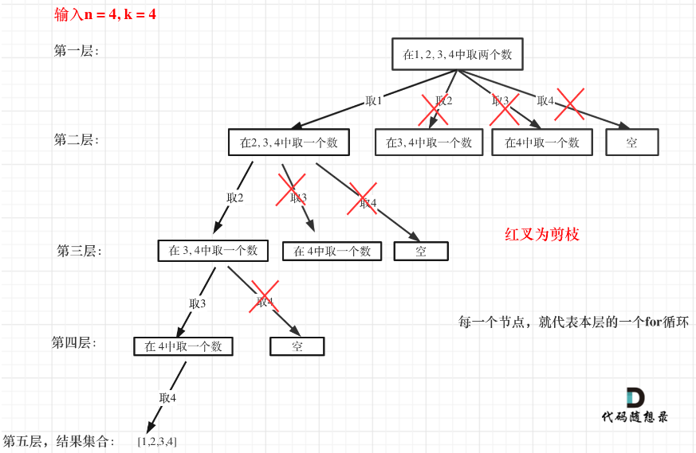

<h1 align="center" style="color: Navy">数据结构与算法</h1>


- [1. 排序算法](#1-排序算法)
  - [1.1. 冒泡排序](#11-冒泡排序)
  - [1.2. 插入排序](#12-插入排序)
  - [1.3. 选择排序](#13-选择排序)
  - [1.4. 希尔排序](#14-希尔排序)
  - [1.5. 快速排序](#15-快速排序)
  - [1.6. 归并排序](#16-归并排序)
  - [1.7. 计数排序](#17-计数排序)
  - [1.8. 基数排序(桶排序)](#18-基数排序桶排序)
  - [1.9. 堆排序](#19-堆排序)
- [2. 查找](#2-查找)
  - [2.1. 二分查找](#21-二分查找)
  - [2.2. 插值查找](#22-插值查找)
  - [2.3. 斐波那契(黄金分割法)查找算法](#23-斐波那契黄金分割法查找算法)
- [3. 哈希表](#3-哈希表)
- [4. 树](#4-树)
  - [4.1. 树的引入](#41-树的引入)
  - [4.2. 二叉树](#42-二叉树)
    - [4.2.1. 二叉树概念](#421-二叉树概念)
    - [4.2.2. 二叉树遍历](#422-二叉树遍历)
      - [4.2.2.1. 前序遍历](#4221-前序遍历)
      - [4.2.2.2. 中序遍历](#4222-中序遍历)
      - [4.2.2.3. 后序遍历](#4223-后序遍历)
      - [4.2.2.4. 层序遍历](#4224-层序遍历)
    - [4.2.3. 二叉树查找](#423-二叉树查找)
      - [4.2.3.1. 前序查找](#4231-前序查找)
      - [4.2.3.2. 中序查找](#4232-中序查找)
      - [4.2.3.3. 后序查找](#4233-后序查找)
    - [4.2.4. 二叉树删除结点](#424-二叉树删除结点)
    - [4.2.5. 顺序存储二叉树](#425-顺序存储二叉树)
    - [4.2.6. 线索化二叉树](#426-线索化二叉树)
  - [4.3. 赫夫曼树](#43-赫夫曼树)
    - [4.3.1. 基本介绍](#431-基本介绍)
    - [4.3.2. 创建思路分析](#432-创建思路分析)
    - [4.3.3. 代码展示](#433-代码展示)
    - [4.3.4. 赫夫曼应用](#434-赫夫曼应用)
      - [4.3.4.1. 赫夫曼编码-数据压缩](#4341-赫夫曼编码-数据压缩)
      - [4.3.4.2. 赫夫曼编码-数据解压](#4342-赫夫曼编码-数据解压)
      - [4.3.4.3. 赫夫曼编码-文件压缩](#4343-赫夫曼编码-文件压缩)
      - [4.3.4.4. 赫夫曼编码-文件解压缩](#4344-赫夫曼编码-文件解压缩)
  - [4.4. 二叉排序树](#44-二叉排序树)
    - [4.4.1. 二叉排序树介绍](#441-二叉排序树介绍)
    - [4.4.2. 二叉排序树的创建](#442-二叉排序树的创建)
    - [4.4.3. 从二叉排序树删除结点](#443-从二叉排序树删除结点)
  - [4.5. 平衡二叉树(AVL树)](#45-平衡二叉树avl树)
    - [4.5.1. 基本介绍](#451-基本介绍)
    - [4.5.2. 二叉树高度求解](#452-二叉树高度求解)
    - [4.5.3. 左旋](#453-左旋)
      - [4.5.3.1. 思路分析](#4531-思路分析)
      - [4.5.3.2. 代码示意](#4532-代码示意)
    - [4.5.4. 右旋](#454-右旋)
      - [4.5.4.1. 思路分析](#4541-思路分析)
      - [4.5.4.2. 代码示意](#4542-代码示意)
    - [4.5.5. 双旋转](#455-双旋转)
      - [4.5.5.1. 思路分析](#4551-思路分析)
      - [4.5.5.2. 代码示意](#4552-代码示意)
  - [4.6. 多路查找树](#46-多路查找树)
    - [4.6.1. 基本介绍](#461-基本介绍)
    - [4.6.2. 2-3树](#462-2-3树)
    - [4.6.3. B树、B+树和B*树](#463-b树b树和b树)
      - [4.6.3.1. B树](#4631-b树)
      - [4.6.3.2. B+树](#4632-b树)
      - [4.6.3.3. B*树](#4633-b树)
- [5. 图](#5-图)
  - [5.1. 图的介绍](#51-图的介绍)
  - [5.2. 图的创建](#52-图的创建)
  - [5.3. 图的遍历](#53-图的遍历)
    - [5.3.1. 深度优先遍历](#531-深度优先遍历)
    - [5.3.2. 广度优先遍历](#532-广度优先遍历)
- [6. 经典算法](#6-经典算法)
  - [6.1. 分治算法](#61-分治算法)
  - [6.2. 动态规划](#62-动态规划)
  - [6.3. KMP](#63-kmp)
    - [6.3.1. 字符串匹配问题](#631-字符串匹配问题)
  - [6.4. 贪心算法](#64-贪心算法)
    - [6.4.1. 集合覆盖问题](#641-集合覆盖问题)
  - [6.5. 普里姆算法](#65-普里姆算法)
    - [6.5.1. 修路问题](#651-修路问题)
    - [6.5.2. 最小生成树](#652-最小生成树)
    - [6.5.3. 普利姆算法流程](#653-普利姆算法流程)
    - [6.5.4. 普利姆算法实现](#654-普利姆算法实现)
  - [6.6. 克鲁斯卡尔算法](#66-克鲁斯卡尔算法)
    - [6.6.1. 公交站问题](#661-公交站问题)
    - [6.6.2. 克鲁斯卡尔算法介绍](#662-克鲁斯卡尔算法介绍)
    - [6.6.3. 克鲁斯卡尔算法实现](#663-克鲁斯卡尔算法实现)
  - [6.7. Dijkstra](#67-dijkstra)
    - [6.7.1. 最短路径问题](#671-最短路径问题)
    - [6.7.2. Dijkstra算法过程](#672-dijkstra算法过程)
    - [6.7.3. Dijkstra代码实现](#673-dijkstra代码实现)
  - [6.8. 弗洛伊德算法](#68-弗洛伊德算法)
    - [6.8.1. 算法介绍](#681-算法介绍)
    - [6.8.2. 算法分析与实现](#682-算法分析与实现)
  - [6.9. 马踏棋盘算法](#69-马踏棋盘算法)
  - [6.10. 回溯算法](#610-回溯算法)
    - [6.10.1. 组合问题](#6101-组合问题)
    - [6.10.2. 排列问题](#6102-排列问题)
    - [6.10.3. 子集问题](#6103-子集问题)
    - [6.10.4. 切割问题](#6104-切割问题)
    - [6.10.5. 总结](#6105-总结)
  - [6.11. 并查集](#611-并查集)
    - [6.11.1. 概述](#6111-概述)
    - [6.11.2. 通用代码](#6112-通用代码)
    - [6.11.3. 总结](#6113-总结)
# 1. 排序算法


## 1.1. 冒泡排序
```java
public static void bubbleSort(int[] arr) {
    int temp;
    //高值会冒泡到最后边。每冒一次泡。向右比较的步数就减少一次，因为肯定比已经冒泡到右边的值小。
    for (int i = 0; i < arr.length; i++) {
        for (int j = 0; j < arr.length -i- 1; j++) {
            if (arr[j] > arr[j + 1]) {
                temp = arr[j];
                arr[j] = arr[j + 1];
                arr[j + 1] = temp;
            }
        }
    }
}
```

## 1.2. 插入排序
插入排序操作类似于摸牌并将其从大到小排列。每次摸到一张牌后，根据其点数插入到确切位置。

```Java
public static void insertSort(int[] arr) {
    int j;
    //从第二个元素开始往前插。前面的数组都是有序的
    for (int i = 1; i < arr.length; i++) {
        int temp = arr[i];
        //往前找到合适的位置。遍历的每个元素往后退
        for (j = i - 1; j >= 0 && temp < arr[j]; j--) {
            arr[j + 1] = arr[j];
        }
        //插入
        arr[j + 1] = temp;
    }
}
```


## 1.3. 选择排序
每一趟从待排序的数据元素中选择最小（或最大）的一个元素作为首元素，直到所有元素排完为止。

```java
public static void selectS(int[] arr) {
    for (int i = 0; i < arr.length; i++) {
        int min = arr[i];
        int minIndex = i;
        //找到最小的值和对应的下标
        for (int j = i + 1; j < arr.length; j++) {
            if (min > arr[j]){
                min = arr[j];
                minIndex = j;
            }
        }
        arr[minIndex] = arr[i];
        arr[i] = min;
    }
}
```

## 1.4. 希尔排序

```java
public static void shellSort(int[] arr) {
    //分组
    for (int gap = arr.length / 2; gap > 0; gap /= 2) {
        //组内插排
        for (int i = gap; i < arr.length; i++) {
            //向前插入
            int j = i-gap,temp = arr[i];
            for (; j >= 0&&temp<arr[j]; j -= gap) {
                arr[j+gap] = arr[j];
            }
            arr[j+gap] = temp;
        }
    }
}
```

## 1.5. 快速排序
通过一趟排序将要排序的数据分割成独立的两部分，其中一部分的所有数据都比另外一部分的所有数据都要小，然后再按此方法对这两部分数据分别进行快速排序，整个排序过程可以递归进行，以此达到整个数据变成有序序列

```Java
public static void quickSort(int[] arr, int left, int right) {
    if (left >= right) return;
    int pivot = arr[left];
    int l = left;
    int r = right;
    int temp;
    while (l < r) {
        //以左边值为基准则右边先动。否则会损害已经排好的顺序。
        while (arr[r] >= pivot && l < r) r--;
        while (arr[l] <= pivot && l < r) l++;
        if (l == r) break;
        temp = arr[r];
        arr[r] = arr[l];
        arr[l] = temp;
    }
    arr[left] = arr[l];
    arr[l] = pivot;
    quickSort(arr, left, r - 1);
    quickSort(arr, l + 1, right);
}
```

## 1.6. 归并排序

```java
public static void mergeSort(int[] res,int[] arr, int left,int right){
    if (left>=right) return;
    int mid = (left+right)/2;
    mergeSort(res,arr,left,mid); //向左递归分解
    mergeSort(res,arr,mid+1,right); //向右递归分解
    merge(res,arr,left,mid,right); //每次分解到顶就开始合并
}

public static void merge(int[] res, int[] arr,int left,int mid,int right){
    int i=left,j=mid+1;
    int index = 0;
    while (i<=mid&&j<=right){
        res[index++] = arr[i]<=arr[j] ? arr[i++]: arr[j++];
    }
    //将剩下的一边填充到res里面
    if (i<=mid) System.arraycopy(arr,i,res,index,mid-i+1);
    else if(j<=right)System.arraycopy(arr,j,res,index,right-j+1);
    //将res拷贝到arr里面。
    System.arraycopy(res,0,arr,left,right-left+1);
}
```

## 1.7. 计数排序
计数排序的核心在于将输入的数据值转化为键存储在额外开辟的数组空间中。作为一种线性时间复杂度的排序，计数排序要求输入的数据必须是有确定范围的整数。
用来计数的数组C的长度取决于待排序数组中数据的范围（等于待排序数组的最大值与最小值的差加上1），然后进行分配、收集处理
1. 分配。扫描一遍原始数组，以当前值-minValue作为下标，将该下标的计数器增1。
2. 收集。扫描一遍计数器数组，按顺序把值收集起来。


```java
public static void countSort(int[] arr) {
    int max = Arrays.stream(arr).max().orElse(0);
    int min = Arrays.stream(arr).min().orElse(0);
    int interval = max - min + 1;
    int[] bucket = new int[interval];
    int[] bucketCount = new int[interval];
    for (int j : arr) {
        int pos = j - min;
        bucketCount[pos]++;
        bucket[pos] = j;
    }
    int index = 0;
    for (int i = 0; i < bucket.length; i++) {
        int val = bucket[i];
        while (bucketCount[i]--!=0) arr[index++] = val;
    }
}
```

## 1.8. 基数排序(桶排序)
将所有待比较数值统一为同样的数位长度，数位较短的数前面补零。然后，从最低位开始，依次进行一次排序。这样从最低位排序一直到最高位排序完成以后, 数列就变成一个有序序列。


```Java
//基数排序
public static void radixSort(int[] arr) {
    int digitOfElement;
    int[][] bucket = new int[10][arr.length]; //将arr中的每个数放到对应桶里。行表示基数0-9，列表示最大桶深。
    int[] bucketElementCounts = new int[10];  //表示每个桶中元素个数
    int max = Arrays.stream(arr).max().orElse(0); //Java 8 找数组最大值
    int maxLength = (max + "").length(); //巧妙方法求最大值位数
    int index;

    //round表示数字第round位，n用来辅助取round位的值。round = 0即表示从个位开始。
    for (int round = 0, n = 1; round < maxLength; round++, n *= 10) {
        for (int k : arr) {
            digitOfElement = k / n % 10;  //取当前位的值
            bucket[digitOfElement][bucketElementCounts[digitOfElement]++] = k; //放入对应的桶中，同时桶深+1。
        }
        index = 0;
        for (int i = 0; i < bucket.length; i++) {
            for (int j = 0; j < bucketElementCounts[i]; j++) {
                arr[index++] = bucket[i][j]; //依次从桶中取出值，完成当前位排序。
            }
            bucketElementCounts[i] = 0; //桶深归零
        }
    }
}
```

## 1.9. 堆排序
1. 堆排序是利用堆这种数据结构而设计的一种排序算法，堆排序是一种选择排序，它的最坏，最好，平均时间复杂度均为O(nlogn)，它也是不稳定排序。
2. 堆是具有以下性质的完全二叉树：每个结点的值都大于或等于其左右孩子结点的值，称为大顶堆, 注意 : 没有要求结点的左孩子的值和右孩子的值的大小关系。`arr[i] >= arr[2*i+1] && arr[i] >= arr[2*i+2]`
3. 每个结点的值都小于或等于其左右孩子结点的值，称为小顶堆。`arr[i] <= arr[2*i+1] && arr[i] <= arr[2*i+2]`
4. 一般升序采用大顶堆，降序采用小顶堆。

<center class="half">
    
    
</center>

堆排序的基本思想是：
1. 将待排序序列构造成一个大顶堆
2. 此时，整个序列的最大值就是堆顶的根节点。
3. 将其与末尾元素进行交换，此时末尾就为最大值。
4. 然后将剩余n-1个元素重新构造成一个堆，这样会得到n个元素的次小值。如此反复执行，便能得到一个有序序列了。

<center></center>

```java
 //堆排序
public static void heapSort(int[] arr){
    int temp = 0;

    //完成大顶堆转换，由下至上。
    for (int i = arr.length/2-1; i >=0 ; i--) {
        adjustHeap(arr,i,arr.length);
    }

    //将堆顶元素与末尾元素交换，将最大元素“沉”到数组末端
    //重新调整结构，使其满足对定义，然后继续交换堆顶元素与当前末尾元素
    //反复执行调整+交换步骤，直到整个序列有序。
    for (int j = arr.length-1; j >0 ; j--) {
        temp = arr[j];
        arr[j] = arr[0];
        arr[0] = temp;
        adjustHeap(arr,0,j); //由上至下
    }
}

/**
    * 完成以 i 对应的非叶子结点的树调整为大顶堆
    * @param arr-待调整数组
    * @param i-表示非叶子结点在数组中的索引
    * @param length-表示对多少元素进行调整，此值在逐渐减少
    * @return void 
    * @author zhaolifeng
    * @date 2022/7/3 23:14
    */
public static void adjustHeap(int[] arr, int i, int length){
    int temp = arr[i];
    //开始调整
    //k=i*2+1表示i结点的左子结点
    for (int k = i*2+1; k < length; k = k*2+1) {
        if (k+1<length && arr[k]<arr[k+1]){
            k++;  //k指向右子结点
        }
        if (arr[k] > temp){
            arr[i] = arr[k]; //把较大的值赋给当前结点
            //这里不需要进行arr[k] = temp的交换，只需要等找到堆顶元素最后的落脚点i再赋值.
            //添加arr[k]=temp的交换也是可以的，但会多几次没必要的赋值操作.
            i = k; //i指向k，继续循环比较
        }else {
            break;
        }
    }
    //当for循环结束后，已经将以i为父结点的树的最大值，放在了最顶端（局部）。
    arr[i] = temp; //找到堆顶元素的落脚点
}
```


# 2. 查找
## 2.1. 二分查找

<center>
    
    <br>
    <div style="color:orange; border-bottom: 1px solid #d9d9d9;
    display: inline-block;
    color: #999;
    padding: 2px;">二分查找思路分析</div>
</center>

```java
/**
 * 二分查找
 * @param arr-有序数组
 * @param left-左边索引
 * @param right-右边索引
 * @param findVal-待查找值
 * @return int-如果找到就返回下标，否则返回-1
 * @author zhaolifeng
 * @date 2022/4/27 0:14
 */
public static int binarySearch(int[] arr,int left,int right, int findVal){
    if (left>right) return -1;
    int mid = (left+right)/2;
    if (arr[mid]>findVal) return binarySearch(arr, left, mid - 1, findVal); //向左递归
    else if(arr[mid]<findVal)  return binarySearch(arr,mid+1,right,findVal); //向右递归
    else return mid;
}
```

```java
/**
 * 二分查找改进版
 * @param arr-有序数组
 * @param left-左边索引
 * @param right-右边索引
 * @param findVal-待查找值
 * @return ArrayList<Integer>-待查找值的下标集合，若没有则为空。
 * @author zhaolifeng
 * @date 2022/4/27 0:34
 */
public static ArrayList<Integer> binarySearch2(int[] arr, int left, int right, int findVal){
    if (left>right) return new ArrayList<>();
    int mid = (left+right)/2;
    if (arr[mid]>findVal) return binarySearch2(arr, left, mid - 1, findVal); //向左递归
    else if(arr[mid]<findVal)  return binarySearch2(arr,mid+1,right,findVal); //向右递归
    else {
        ArrayList<Integer> list = new ArrayList<>();
        list.add(mid);
        int temp = mid -1;
        while (temp >= 0 && arr[temp] == findVal) list.add(temp--);
        temp = mid+1;
        while (temp<=arr.length-1&&arr[temp]==findVal) list.add(temp++);
        return list;
    }
}
```

```java
/**
    * 二分查找-非递归版
    * @param arr-待查找数组
    * @param target-待查找元素
    * @return 找到则返回下标，否则返回-1
    * @author zhaolifeng
    * @date 2022/7/25 21:03
    */
public static int binarySearch(int[] arr, int target) {
    int left = 0;
    int right = arr.length - 1;
    while (left <= right) {
        int mid = (left + right) / 2;
        if (arr[mid] == target) return mid;
        else if (arr[mid] > target) right = mid - 1;
        else left = mid + 1;
    }
    return -1;
}
```

## 2.2. 插值查找
>插值查找是对二分查找的一种自适应改进。二分查找可以看做插值查找的一种特例，二分查找默认查找值在每次所选区间的中间。

**插值查找注意事项：**
1. 对于数据量较大，关键字分布比较均匀的查找表来说，采用插值查找，速度较快。
2. 关键字分布不均匀的情况下，该方法不一定比二分查找好。
<center>
    
    <br>
    <div style="color:orange; border-bottom: 1px solid #d9d9d9;
    display: inline-block;
    color: #999;
    padding: 2px;">插值查找原理</div>
</center>

```java
/**
 * 插值查找
 * @param arr-有序升序数组
 * @param left-左边索引
 * @param right-右边索引
 * @param findVal-待查找值
 * @return int-如果找到就返回下标，否则返回-1
 * @author zhaolifeng
 * @date 2022/4/27 0:51
 */
public static int insertValueSearch(int[] arr,int left,int right,int findVal){
    if (left>right||findVal<arr[0]||findVal>arr[arr.length-1]) return -1; //必须有后两个条件，否则mid会越界。
    int mid = left + ((findVal-arr[left])/(arr[right]-arr[left]))*(right-left); //重点
    if (arr[mid]>findVal) return insertValueSearch(arr, left, mid - 1, findVal); //向左递归
    else if(arr[mid]<findVal)  return insertValueSearch(arr,mid+1,right,findVal); //向右递归
    else return mid;
}
```

## 2.3. 斐波那契(黄金分割法)查找算法
>知识点：斐波那契数列：`{1,1,2,3,5,8,13,21,34,55}`。相邻两个数的比例无限接近黄金分隔值`0.618`。

<center>
    
    <br>
    <div style="color:orange; border-bottom: 1px solid #d9d9d9;
    display: inline-block;
    color: #999;
    padding: 2px;">斐波那契查找原理</div>
</center>

```java
//获取斐波那契数列
public static int[] fib() {
    int[] f = new int[maxSize];
    f[0] = 1;
    f[1] = 1;
    for (int i = 2; i < maxSize; i++) {
        f[i] = f[i - 1] + f[i - 2];
    }
    return f;
}

/**
* 斐波那契查找算法
*
* @param arr-有序数组
* @param findVal-待查找值
* @return int-查找的值下标，若无此值则为-1。
* @author zhaolifeng
* @date 2022/4/27 1:20
*/

public static int fibSearch(int[] arr, int findVal) {
    int low = 0;
    int high = arr.length - 1;
    int k = 0; //表示斐波那契分割数值的下标
    int mid = 0;//存放mid值
    int[] f = fib(); //获取斐波那契数列
    while (f[k] - 1 < high) k++; //获取斐波那契分割数值下标
    //因为f[k]值可能大于arr的长度，因此构造新数组，指向arr[]。
    int[] temp = Arrays.copyOf(arr, f[k]);//此时不足之处用0填充。
    for (int i = high + 1; i < temp.length; i++) temp[i] = arr[high]; //此时不足之处用arr[high]填充

    while (low <= high) {
        mid = low + f[k - 1] - 1;
        if (findVal < temp[mid]) {
            high = mid - 1;
            k--;
        } else if (findVal > temp[mid]) {
            low = mid + 1;
            k -= 2;
        } else return Math.min(mid, high);
    }
    return -1;
}
```

# 3. 哈希表

# 4. 树
## 4.1. 树的引入
- **数组**存储方式的分析
  - 优点：通过下标方式访问元素，速度快。对于有序数组，还可使用二分查找提高检索速度。
  - 缺点：如果要检索具体某个值，或者插入值(按一定顺序)会整体移动，效率较低 [示意图]
- **链式**存储方式的分析
  - 优点：在一定程度上对数组存储方式有优化(比如：插入一个数值节点，只需要将插入节点，链接到链表中即可， 删除效率也很好)。
  - 缺点：在进行检索时，效率仍然较低，比如(检索某个值，需要从头节点开始遍历) 
- **树**存储方式的分析
  能提高数据**存储**，**读取**的效率, 比如利用 二叉排序树(Binary Sort Tree)，既可以保证数据的检索速度，同时也可以保证数据的插入，删除，修改的速度。


**<center>树的示意图</center>**

树的常用术语(结合示意图理解):
- 节点
- 根节点
- 父节点
- 子节点
- 叶子节点 (没有子节点的节点)
- 节点的权(节点值)
- 路径(从root节点找到该节点的路线)
- 层
- 子树
- 树的高度(最大层数)
- 森林 :多颗子树构成森林

## 4.2. 二叉树
### 4.2.1. 二叉树概念
1. 树有很多种，每个节点最多只能有两个子节点的一种形式称为二叉树。
2. 二叉树的子节点分为左节点和右节点。
3. 如果该二叉树的所有叶子节点都在最后一层，并且结点总数= 2^n -1 , n 为层数，则我们称为满二叉树。
4. 如果该二叉树的所有叶子节点都在最后一层或者倒数第二层，而且最后一层的叶子节点在左边连续，倒数第二层的叶子节点在右边连续，我们称为完全二叉树。

### 4.2.2. 二叉树遍历
**二叉树遍历方式：**
- 前序遍历: 先输出父节点，再遍历左子树和右子树
- 中序遍历: 先遍历左子树，再输出父节点，再遍历右子树
- 后序遍历: 先遍历左子树，再遍历右子树，最后输出父节点

**小结: 看输出父节点的顺序，就确定是前序，中序还是后序**

#### 4.2.2.1. 前序遍历
思路：
1. 先输出当前节点（初始为root节点）
2. 如果左子节点不为空，则递归继续前序遍历
3. 如果右子节点不为空，则递归继续前序遍历
```java
//前序遍历
public void preOrder(){
    //输出当前节点
    System.out.println(this);
    //递归向左子树遍历
    if (this.left!=null) this.left.preOrder();
    //递归向右子树遍历
    if (this.right!=null) this.right.preOrder();
}

//迭代法
public void preOrder(TreeNode root, ArrayList<Integer> valList){
    if (root==null) return;
    Stack<TreeNode> stack = new Stack<>();
    stack.push(root);
    while (!stack.isEmpty()){
        TreeNode node = stack.pop();
        valList.add(node.val);
        if (node.right!=null){
            stack.push(node.right);
        }
        if (node.left!=null){
            stack.push(node.left);
        }
    }
}

```


#### 4.2.2.2. 中序遍历
思路：
1. 如果左子节点不为空，则递归继续中序遍历
2. 输出当前节点
3. 如果右子节点不为空，则递归继续中序遍历
```java
//中序遍历
public void infixOrder(){
    //递归向左子树遍历
    if (this.left!=null) this.left.infixOrder();
    //输出当前节点
    System.out.println(this);
    //递归向右子树遍历
    if (this.right!=null) this.right.infixOrder();
}

//迭代法
public void infixOrder(TreeNode root, ArrayList<Integer> valList){
    if (root==null) return;
    Stack<TreeNode> stack = new Stack<>();
    TreeNode curNode = root;
    while (curNode!=null||!stack.isEmpty()){
        if (curNode!=null){
            stack.push(curNode);
            curNode = curNode.left;
        }else {
            curNode = stack.pop();
            valList.add(curNode.val);
            curNode = curNode.right;
        }
    }
}
```

#### 4.2.2.3. 后序遍历
思路：
1. 如果左子节点不为空，则递归继续中序遍历
2. 如果右子节点不为空，则递归继续中序遍历
3. 输出当前节点
```java
//后序遍历
public void postOrder(){
    //递归向左子树遍历
    if (this.left!=null) this.left.postOrder();
    //递归向右子树遍历
    if (this.right!=null) this.right.postOrder();
    //输出当前节点
    System.out.println(this);
}

//迭代法:遍历顺序 左-右-中 入栈顺序：中-左-右 出栈顺序：中-右-左， 最后翻转结果
public void postOrder(TreeNode root, ArrayList<Integer> valList){
    if (root==null) return;
    Stack<TreeNode> stack = new Stack<>();
    stack.push(root);
    while (!stack.isEmpty()){
        TreeNode node = stack.pop();
        valList.add(node.val);
        if (node.left!=null){
            stack.push(node.left);
        }
        if (node.right!=null){
            stack.push(node.right);
        }
    }
    Collections.reverse(valList);
}
```

#### 4.2.2.4. 层序遍历
```java
//纪录遍历结果
public List<List<Integer>> resList = new ArrayList<>();

//递归法
public void levelOrder(TreeNode root,int deep){
    if (root==null) return;
    deep++;
    if (resList.size()<deep){
        ArrayList<Integer> list = new ArrayList<>();
        resList.add(list);
    }
    resList.get(deep-1).add(root.val);
    levelOrder(root.left,deep);
    levelOrder(root.right,deep);
}

//迭代法：借助队列
public void LevelOrder(TreeNode root) {
    if (root == null) return;
    Queue<TreeNode> queue = new LinkedList<>();
    queue.offer(root);
    while (!queue.isEmpty()) {
        int length = queue.size();
        ArrayList<Integer> list = new ArrayList<>();
        while (length > 0) {
            TreeNode node = queue.poll();
            list.add(node.val);
            if (node.left != null) queue.offer(node.left);
            if (node.right != null) queue.offer(node.right);
            length--;
        }
        resList.add(list);
    }
}
```

### 4.2.3. 二叉树查找
#### 4.2.3.1. 前序查找
思路
1. 先判断当前结点的no是否等于要查找的
2. 如果相等，则返回当前结点
3. 如果不等，则判断当前结点的左子节点是否为空，如果不为空，则递归前序查找。
4. 如果左递归前序查找找到了结点，则返回；否则继续判断，当前结点的右子结点是否为空，如果不为空，则继续向右递归前序查找。
```java
//前序查找
public HeroNode preOrderSearch(int no){
    if (this.no == no) return this;
    HeroNode resNode = null;
    if (this.left!=null){
        resNode = this.left.preOrderSearch(no);
    }
    if (resNode!=null) return resNode;
    if (this.right!=null){
        resNode = this.right.preOrderSearch(no);
    }
    return resNode;
}
```

#### 4.2.3.2. 中序查找
思路
1. 判断当前结点的左子结点是否为空，如果为空，则递归中序查找
2. 如果找到，则返回；否则和当前结点比较，如果是则返回，否则继续向右递归中序查找
3. 如果右递归中序查找，找到就返回，否则返回null
```java
//中序查找
public HeroNode infixOrderSearch(int no){
    HeroNode resNode = null;
    if (this.left!=null){
        resNode = this.left.infixOrderSearch(no);
    }
    if (resNode!=null) return this;
    if (this.no == no) return this;
    if (this.right!=null){
        resNode = this.right.infixOrderSearch(no);
    }
    return resNode;
}
```


#### 4.2.3.3. 后序查找
思路
1. 判断当前结点的左子结点是否为空，如果不为空，则递归后序查找
2. 如果找到，则返回，否则判断当前结点的右子结点是否为空，如果不为空，则右递归有序查找，如果找到就返回
3. 就和当前结点进行比较，如果是则返回，否则返回null
```java
//后序查找
public HeroNode postOrderSearch(int no){
    HeroNode resNode = null;
    if (this.left!=null){
        resNode = this.left.postOrderSearch(no);
    }
    if (resNode!=null) return resNode;
    if (this.right!=null){
        resNode = this.right.postOrderSearch(no);
    }
    if (resNode!=null) return resNode;
    if (this.no == no) resNode = this;
    return resNode;
}
```

### 4.2.4. 二叉树删除结点
**二叉树结点删除要求**
- 如果删除的节点是叶子节点，则删除该节点
- 如果删除的节点是非叶子节点，则删除该子树

思路
**首先判断树是否为空树root，如果只有一个root结点，则等价将二叉树置空。**
1. 因为二叉树单向，所以需要判断当前结点的子结点是否需要删除，不能判断当前结点是否需要删除。
2. 如果当前结点的左子结点不为空，并且左子结点就是需要删除的结点，就将`this.left=null`，并且返回（结束递归删除）
3. 如果当前结点的右子结点不为空，并且右子结点就是需要删除的结点，就将`this.right=null`，并且返回（结束递归删除）
4. 如果第2和3步没有删除结点，就需要向左子树递归删除
5. 如果第4步也没有删除结点，就需要向右子树递归删除

代码实现
```java
public void deleteNode(int no){ //可以看做main方法里面需要写的部分，因为需要读取root
    if (root!=null){
        if (root.getNo() == no) root = null;
        else {
            root.delNode(no);
        }
    }
}

public void delNode(int no){  //核心
    if (this.left!=null&&this.left.no==no){
        this.left = null;
        return;
    }
    if (this.right!=null&&this.right.no==no){
        this.right = null;
        return;
    }
    if (this.left!=null) this.left.delNode(no);
    if (this.right!=null) this.right.delNode(no);
}
```

### 4.2.5. 顺序存储二叉树
即将数组按顺序存到二叉树里，并且仍然可以以前序遍历，中序遍历和后序遍历的方式完成结点的遍历。
顺序存储二叉树的特点:
- 顺序二叉树通常只考虑完全二叉树
- 第n个元素的左子节点为  2 * n + 1 
- 第n个元素的右子节点为  2 * n + 2
- 第n个元素的父节点为  (n-1) / 2
- n : 表示二叉树中的第几个元素(按0开始编号如图所示)

<center>
    
    <br>
    <div style="color:orange; border-bottom: 1px solid #d9d9d9;
    display: inline-block;
    color: #999;
    padding: 2px;">顺序存储二叉树示意图</div>
</center>

```java
//顺序存储二叉树的前序遍历
// index - 数组的下标
public void preOrder(int index){
    if (arr == null || arr.length==0){
        System.out.println("数组为空，不能按照二叉树的前序遍历");
    }
    System.out.println(arr[index]);
    if ((index * 2 + 1)<arr.length){
        preOrder(2*index+1);
    }
    if ((index * 2 + 1)<arr.length){
        preOrder(2*index+2);
    }
}
```

### 4.2.6. 线索化二叉树
**基本介绍**
1. n个结点的二叉链表中含有 n+1  【公式 2n-(n-1)=n+1】 个空指针域。利用二叉链表中的空指针域，存放指向该结点在某种遍历次序下的前驱和后继结点的指针（这种附加的指针称为"线索"）
2. 这种加上了线索的二叉链表称为线索链表，相应的二叉树称为线索二叉树(Threaded BinaryTree)。根据线索性质的不同，线索二叉树可分为前序线索二叉树、中序线索二叉树和后序线索二叉树三种
3. 一个结点的前一个结点，称为前驱结点。一个结点的后一个结点，称为后继结点

**思路分析**
中序遍历的结果：{8, 3, 10, 1, 14, 6}

说明: 当线索化二叉树后，Node节点的 属性 left 和 right ，有如下情况:
- left 指向的是左子树，也可能是指向的前驱节点. 比如 ① 节点 left 指向的左子树, 而 ⑩ 节点的 left 指向的就是前驱节点.
- right 指向的是右子树，也可能是指向后继节点，比如 ① 节点right 指向的是右子树，而⑩ 节点的right 指向的是后继节点.

```java
//中序线索化二叉树
public void threadedNodes(HeroNode node){
    if (node==null) return;
    //1.先线索化左子树
    threadedNodes(node.getLeft());
    //2.线索化当前结点
    //处理当前结点的前驱结点
    if (node.getLeft()==null){
        //让当前结点的左指针指向前驱结点
        node.setLeft(pre);
        node.setLeftType(1);
    }
    //处理后继结点
    if (pre!=null&&pre.getRight()==null){
        //让前驱结点的右指针指向当前结点
        pre.setRight(node);
        pre.setRightType(1);
    }
    pre = node;
    //线索化右子树
    threadedNodes(node.getRight());
}

//中序线索化遍历
public void threadedList(){
    HeroNode node = root;
    while (node!=null){
        //遍历结点直到找到第一个结点
        while (node.getLeftType()==0)
            node = node.getLeft();
        System.out.println(node);
        //如果当前结点指向后继结点，一直输出
        while (node.getRightType()==1){
            node = node.getRight();
            System.out.println(node);
        }
        //否则用右节点替代当前结点
        node = node.getRight();
    }
}
```

## 4.3. 赫夫曼树
### 4.3.1. 基本介绍
- 给定n个权值作为n个叶子结点，构造一棵二叉树，若该树的带权路径长度(wpl)达到最小，称这样的二叉树为最优二叉树，也称为哈夫曼树(Huffman Tree), 还有的书翻译为霍夫曼树。
- 赫夫曼树是带权路径长度最短的树，权值较大的结点离根较近。
- **路径和路径长度**：在一棵树中，从一个结点往下可以达到的孩子或孙子结点之间的通路，称为路径。通路中分支的数目称为路径长度。若规定根结点的层数为1，则从根结点到第L层结点的路径长度为L-1
- **结点的权及带权路径长度**：若将树中结点赋给一个有着某种含义的数值，则这个数值称为该结点的权。结点的带权路径长度为：从根结点到该结点之间的路径长度与该结点的权的乘积
- **树的带权路径长度**：树的带权路径长度规定为所有**叶子结点**的带权路径长度之和，记为WPL(weighted path length) ,权值越大的结点离根结点越近的二叉树才是最优二叉树。
- WPL最小的就是**赫夫曼树**

### 4.3.2. 创建思路分析
构成赫夫曼树的步骤：
1. 从小到大进行排序, 将每一个数据，每个数据都是一个节点 ， 每个节点可以看成是一颗最简单的二叉树
2. 取出根节点权值最小的两颗二叉树 
3. 组成一颗新的二叉树, 该新的二叉树的根节点的权值是前面两颗二叉树根节点权值的和  
4. 再将这颗新的二叉树，以根节点的权值大小再次排序， 不断重复  1-2-3-4 的步骤，直到数列中，所有的数据都被处理，就得到一颗赫夫曼树

### 4.3.3. 代码展示
```java
/**
    * 创建赫夫曼树
    * @param arr-需要创建成赫夫曼树的数组
    * @return 创建好赫夫曼树后的根节点
    * @author zhaolifeng
    * @date 2022/7/6 0:41
    */
public static Node createHuffmanTree(int[] arr){
    ArrayList<Node> nodes = new ArrayList<>();
    for (int value : arr) {
        nodes.add(new Node(value));
    }
    while (nodes.size()>1){
        Collections.sort(nodes);
        Node leftNode = nodes.get(0);
        Node rightNode = nodes.get(1);
        Node parent = new Node(leftNode.value + rightNode.value);
        parent.left = leftNode;
        parent.right = rightNode;
        nodes.remove(leftNode);
        nodes.remove(rightNode);
        nodes.add(parent);
    }
    return nodes.get(0);
}
```

### 4.3.4. 赫夫曼应用
#### 4.3.4.1. 赫夫曼编码-数据压缩
**<center>原理剖析</center>**


赫夫曼编码满足前缀编码, 即字符的编码都不能是其他字符编码的前缀。不会造成匹配的多义性。由此用来进行数据文件压缩。

**思路分析**
1. 创建Node{data(存放数据)，weight(权值，left和right}
2. 得到数据文本对应的byte[]数组
3. 编写方法，将准备构建赫夫曼树的Node节点放到List。
4. 通过List创建对应的赫夫曼树

**参考代码**
```java
private static final Map<Byte,String> huffmanCodes = new HashMap<>(); //存放赫夫曼编码
private static final StringBuilder stringBuilder = new StringBuilder(); //方便编码拼接

/**
    * 赫夫曼编码数据压缩
    * @param bytes-原始字符串对应的字节数组
    * @return byte[]-经过赫夫曼编码压缩后的数组
    * @author zhaolifeng
    * @date 2022/7/7 1:03
    */
public static byte[] huffmanZip(byte[] bytes){
    //根据数据值出现频次计算结点权值并形成结点列表
    List<TreeNode> treeNodes = getNodes(bytes);
    //根据结点列表形成赫夫曼树
    TreeNode root = createHuffmanTree(treeNodes);
    //根据赫夫曼树生成赫夫曼编码
    Map<Byte,String> huffmanCodes = getCodes(root);
    //依据赫夫曼编码进行数据压缩
    return zip(bytes,huffmanCodes);
}

/**
    * 利用赫夫曼编码表进行数据压缩
    * @param bytes-原始字符串对应的byte[]
    * @param huffmanCodes-赫夫曼编码表
    * @return byte[]-通过赫夫曼编码压缩后的byte[]
    * @author zhaolifeng
    * @date 2022/7/7 0:25
    */
public static byte[] zip(byte[] bytes, Map<Byte,String> huffmanCodes){
    //利用赫夫曼编码表，将bytes转成对应的字符串
    StringBuilder stringBuilder = new StringBuilder();
    for (byte b: bytes) {
        stringBuilder.append(huffmanCodes.get(b));
    }

    //将字符串转成byte[]数组
    int len = (stringBuilder.length() + 7)/8;
    byte[] huffmanCodeBytes = new byte[len];
    for (int i = 0,index = 0; i < stringBuilder.length(); i+=8, index++) {
        String strByte;
        if (i+8>stringBuilder.length()){
            strByte = stringBuilder.substring(i);
        }
        else {
            strByte = stringBuilder.substring(i,i+8);
        }
        huffmanCodeBytes[index] = (byte) Integer.parseInt(strByte,2);
    }
    return huffmanCodeBytes;
}

/**
    * 为调用方便，重载getCodes
    * @param root-赫夫曼树的根结点
    * @return 赫夫曼编码表
    * @author zhaolifeng
    * @date 2022/7/7 0:20
    */
public static Map<Byte,String> getCodes(TreeNode root){
    if (root == null) return null;
    getCodes(root.left,"0",stringBuilder);
    getCodes(root.right,"1",stringBuilder);
    return huffmanCodes;
}

/**
    * 得到传入的node结点的所有叶子结点的赫夫曼编码，并放入huffmanCodes集合
    * @param treeNode-传入结点
    * @param code-路径：左子结点是0，右子结点是1
    * @param stringBuilder-用于拼接路径
    * @author zhaolifeng
    * @date 2022/7/7 0:01
    */
public static void getCodes(TreeNode treeNode, String code, StringBuilder stringBuilder){
    StringBuilder stringBuilder2 = new StringBuilder(stringBuilder);
    stringBuilder2.append(code);
    if (treeNode!=null){
        if (treeNode.data == null){
            getCodes(treeNode.left,"0",stringBuilder2);
            getCodes(treeNode.right,"1",stringBuilder2);
        }else {
            huffmanCodes.put(treeNode.data,stringBuilder2.toString());
        }
    }
}

/**
    * 根据结点列表创建赫夫曼树
    * @param treeNodes-结点数组列表
    * @return 赫夫曼树的根结点
    * @author zhaolifeng
    * @date 2022/7/6 23:55
    */
public static TreeNode createHuffmanTree(List<TreeNode> treeNodes){
    while (treeNodes.size()>1){
        Collections.sort(treeNodes);
        TreeNode leftNode = treeNodes.get(0);
        TreeNode rightNode = treeNodes.get(1);
        TreeNode parent = new TreeNode(null,leftNode.weight+rightNode.weight);
        parent.left = leftNode;
        parent.right = rightNode;
        treeNodes.remove(leftNode);
        treeNodes.remove(rightNode);
        treeNodes.add(parent);
    }
    return treeNodes.get(0);
}

/**
    * 根据数据值出现频次计算权值，并以此创建结点。将结点都存入数组列表中。
    * @param bytes-数据文件的字节数组
    * @return 具有数据值及对应权值的结点的数组列表
    * @author zhaolifeng
    * @date 2022/7/6 23:53
    */
public static List<TreeNode> getNodes(byte[] bytes){
    ArrayList<TreeNode> treeNodes = new ArrayList<>();
    HashMap<Byte, Integer> counts = new HashMap<>();
    for (byte b : bytes){
        counts.put(b, counts.getOrDefault(b,0) + 1);
    }
    for (Map.Entry<Byte,Integer> entry: counts.entrySet()) {
        treeNodes.add(new TreeNode(entry.getKey(), entry.getValue()));
    }
    return treeNodes;
}
```

#### 4.3.4.2. 赫夫曼编码-数据解压
```java
/**
    * 对压缩数据进行解码
    * @param huffmanCodes-赫夫曼编码表
    * @param huffmanBytes-赫夫曼编码得到的字节数组
    * @return byte[]-原来的字符串对应的数组
    * @author zhaolifeng
    * @date 2022/7/7 22:55
    */
public static byte[] decode(Map<Byte,String> huffmanCodes, byte[] huffmanBytes){
    StringBuilder stringBuilder = new StringBuilder();

    for (int i = 0; i < huffmanBytes.length; i++) {
        boolean flag = (i==huffmanBytes.length-1);
        stringBuilder.append(byteToBitString(!flag,huffmanBytes[i]));
    }
    HashMap<String, Byte> map = new HashMap<>();
    for (Map.Entry<Byte,String> entry: huffmanCodes.entrySet()) {
        map.put(entry.getValue(),entry.getKey());
    }

    ArrayList<Byte> list = new ArrayList<>();
    for (int i = 0; i < stringBuilder.length();) {
        int count = 1;
        Byte b;
        while (true){
            String key = stringBuilder.substring(i,i+count);
            b = map.get(key);
            if (b==null) count++;
            else break;
        }
        list.add(b);
        i+=count;
    }
    byte[] b = new byte[list.size()];
    for (int i = 0; i < b.length; i++) {
        b[i] = list.get(i);
    }
    return b;
}

/**
    * 将一个byte转成一个二进制字符串
    * @param flag-标志是否需要补高位。只有最后一个字节不需要补。
    * @param b-传入的byte
    * @return 转换后的二进制字符串（注意是按补码）
    * @author zhaolifeng
    * @date 2022/7/7 22:47
    */
public static String byteToBitString(boolean flag, byte b){
    int temp = b;
    if (flag) temp|=256; //按位或，补高位。因为如果是正数，会把byte高位的0省略掉，使得信息缺失。
    String str = Integer.toBinaryString(temp); //返回temp对应的二进制的补码
    if (flag) return str.substring(str.length()-8);
    else return str;
}
```

#### 4.3.4.3. 赫夫曼编码-文件压缩
```java
/**
    * 利用赫夫曼编码将文件进行压缩
    * @param srcFile-希望压缩的文件的全路径
    * @param dstFile-压缩后的压缩文件目录
    * @author zhaolifeng
    * @date 2022/7/8 0:49
    */
public static void zipFile(String srcFile, String dstFile){
    FileInputStream is = null;
    OutputStream os = null;
    ObjectOutputStream oos = null;
    try {
        is = new FileInputStream(srcFile);
        byte[] bytes = new byte[is.available()];
        is.read(bytes);
        byte[] huffmanBytes = huffmanZip(bytes);
        os = new FileOutputStream(dstFile);
        //以对象流的形式写入赫夫曼编码，为了以后恢复源文件使用
        oos = new ObjectOutputStream(os);
        oos.writeObject(huffmanBytes);
        oos.writeObject(huffmanCodes);
    } catch (FileNotFoundException e) {
        System.out.println(e.getMessage());
    } catch (IOException e) {
        e.printStackTrace();
    }finally {
        try {
            is.close();
            os.close();
            oos.close();
        }catch (Exception e){
            System.out.println(e.getMessage());
        }
    }
}
```

#### 4.3.4.4. 赫夫曼编码-文件解压缩
```java
/**
    * 将赫夫曼编码解压的文件解压缩
    * @param zipFile-压缩文件路径
    * @param dstFile-解压缩后的文件路径
    * @author zhaolifeng
    * @date 2022/7/8 1:15
    */
public static void unZipFile(String zipFile,String dstFile){
    InputStream is = null;
    ObjectInputStream ois = null;
    OutputStream os = null;
    try {
        is = new FileInputStream(zipFile);
        ois = new ObjectInputStream(is);
        byte[] huffmanBytes = (byte[]) ois.readObject();
        Map<Byte,String> huffmanCodes = (Map<Byte,String>) ois.readObject();
        byte[] bytes = decode(huffmanCodes,huffmanBytes);
        os = new FileOutputStream(dstFile);
        os.write(bytes);
    } catch (IOException | ClassNotFoundException e) {
        e.printStackTrace();
    } finally {
        try {
            os.close();
            ois.close();
            is.close();
        } catch (IOException e) {
            e.printStackTrace();
        }
    }
}
```

## 4.4. 二叉排序树
### 4.4.1. 二叉排序树介绍
二叉排序树：BST: (Binary Sort(Search) Tree), 对于二叉排序树的任何一个非叶子节点，要求左子节点的值比当前节点的值小，右子节点的值比当前节点的值大。
特别说明：如果有相同的值，可以将该节点放在左子节点或右子节点
比如针对前面的数据 (7, 3, 10, 12, 5, 1, 9) ，对应的二叉排序树为：


### 4.4.2. 二叉排序树的创建
```java
//创建二叉排序树
class BinarySortTree{
    private Node root;

    public void add(Node node){
        if (root==null) root =node;
        else {
            root.add(node);
        }
    }
    public void infixOrder(){
        if (root!=null) root.infixOrder();
        else System.out.println("二叉排序树为空，不能遍历！");
    }
}

//创建Node结点
class Node{
    int value;
    Node left;
    Node right;

    public Node(int value) {
        this.value = value;
    }


    /**
     * 添加结点，满足二叉排序树
     * @param node-当前结点
     * @author zhaolifeng
     * @date 2022/7/9 0:42
     */
    public void add(Node node){
        if (node == null) return;
        if (node.value<this.value){
            if (this.left == null) this.left = node;
            else this.left.add(node);
        }else {
            if (this.right == null) this.right = node;
            else this.right.add(node);
        }
    }

    public void infixOrder(){
        if (this.left!=null) this.left.infixOrder();
        System.out.println(this);
        if (this.right!=null) this.right.infixOrder();
    }

    @Override
    public String toString() {
        return "Node{" +
                "value=" + value +
                '}';
    }
}
```


### 4.4.3. 从二叉排序树删除结点
二叉排序树的删除情况比较复杂，有下面三种情况需要考虑
1. 删除叶子节点 (比如：2, 5, 9, 12)
2. 删除只有一颗子树的节点 (比如：1)
3. 删除有两颗子树的节点. (比如：7, 3，10 )


```java
/*----------------------Node类编写方法------------------------*/
//查找结点
public Node search(int value) {
    if (this.value == value) return this;
    else if (this.value > value) {
        if (this.left == null) return null;
        return this.left.search(value);
    } else {
        if (this.right == null) return null;
        return this.right.search(value);
    }
}

//查找指定结点的父结点
public Node searchParent(int value) {
    if ((this.left != null && this.left.value == value) ||
            (this.right != null && this.right.value == value))
        return this;
    else {
        if (this.value > value && this.left != null) {
            return this.left.searchParent(value);
        } else if (this.value <= value && this.right != null) {
            return this.right.searchParent(value);
        } else return null;
    }
}
/*------------------BinarySortTree类编写方法--------------------*/
//查找结点
public Node search(int value) {
    if (root == null) return null;
    else return root.search(value);
}

//查找结点的父结点
public Node searchParent(int value) {
    if (root == null) return null;
    else return root.searchParent(value);
}

//删除结点
public void delNode(int value) {
    if (root == null) return;
    Node targetNode = search(value);
    if (targetNode == null) return;
    if (root.left==null&&root.right==null){
        root = null;
        return;
    }
    Node parentNode = searchParent(value);
    //如果待删除结点是叶子结点
    if (targetNode.left == null && targetNode.right == null) {
        if (parentNode.left != null && parentNode.left.value == value)
            parentNode.left = null;
        else if (parentNode.right != null && parentNode.right.value == value)
            parentNode.right = null;
    }//如果待删除结点具有两颗子树
    else if (targetNode.left != null && targetNode.right != null) {
        targetNode.value = delRightTreeMin(targetNode.right);
    } //如果待删除结点是只有一颗子树的结点
    else {
        if (targetNode.left!=null){
            if (parentNode!=null){
                if (parentNode.left.value==value)
                    parentNode.left = targetNode.left;
                else
                    parentNode.right = targetNode.left;
            }else {
                root = targetNode.left;
            }
        }else {
            if (parentNode!=null) {
                if (parentNode.left.value==value)
                    parentNode.left = targetNode.right;
                else
                    parentNode.right = targetNode.right;
            }else{
                root = targetNode.right;
            }
        }
    }
}

/**
    * 删除以node为根结点的二叉排序树的最小结点，并返回最小结点的值
    * @param node-传入的结点（当做二叉排序树的根结点）
    * @return 返回以node为根结点的二叉排序树的最小结点的值
    * @author zhaolifeng
    * @date 2022/7/10 0:17
    */

public int delRightTreeMin(Node node){
    Node target = node;
    while (target.left!=null){
        target = target.left;
    }
    delNode(target.value);
    return target.value;
}
```

## 4.5. 平衡二叉树(AVL树)


### 4.5.1. 基本介绍
1. 平衡二叉树也叫平衡二叉搜索树（Self-balancing binary search tree）又被称为AVL树， 可以保证查询效率较高。
2. 具有以下特点：它是一棵空树或它的左右两个子树的高度差的绝对值不超过1，并且左右两个子树都是一棵平衡二叉树。平衡二叉树的常用实现方法有红黑树、AVL、替罪羊树、Treap、伸展树等。
> 对二叉排序树的优化。

### 4.5.2. 二叉树高度求解
```java
//返回以该节点为根结点的高度
public int height() {
    //递归几层高度就是几
    return Math.max(left == null ? 0 : left.height(), right == null ? 0 : right.height()) + 1; 
}
//返回左子树的高度
public int leftHeight() {
    if (left == null) {
        return 0;
    }
    return left.height();
}

//返回右子树的高度
public int rightHeight() {
    if (right == null) {
        return 0;
    }
    return right.height();
}
```

### 4.5.3. 左旋
条件：**右子树高，左子树低**
```java


//左旋方法
private void leftRotate() {
    //创建新结点，以当前根结点的值
    Node newNode = new Node(value);
    //把新结点的左子树设置成当前结点的左子树
    newNode.left = left;
    //把新结点的右子树设置成当前结点的右子树的左子树
    newNode.right = right.left;
    //把当前结点的值替换成右子结点的值
    value = right.value;
    //把当前结点的右子树设置成当前结点右子树的右子树
    right = right.right;
    //把当前结点的左子树设置成新结点
    left = newNode;
}
```

#### 4.5.3.1. 思路分析


#### 4.5.3.2. 代码示意


### 4.5.4. 右旋
条件：**左子树高，右子树低**

#### 4.5.4.1. 思路分析


#### 4.5.4.2. 代码示意
```java
//右旋方法
private void rightRotate() {
    //创建新结点，以当前根结点的值
    Node newNode = new Node(value);
    //把新结点的右子树设置成当前结点的右子树
    newNode.right = right;
    //把新结点的左子树设置成当前结点的左子树的右子树
    newNode.left = left.right;
    //把当前结点的值替换成左子结点的值
    value = left.value;
    //把当前结点的左子树设置成当前结点左子树的左子树
    left = left.left;
    //把当前结点的右子树设置成新结点
    right = newNode;
}
```

### 4.5.5. 双旋转
> 在某些情况下，单旋转不能完成平衡二叉树的转换。比如`arr[]={10, 11, 7, 6, 8, 9}`
#### 4.5.5.1. 思路分析
- 当符合右旋转的条件时
    1. 如果它的左子树的右子树高度大于它的左子树的高度
    2. 先对当前结点的左子结点进行左旋
    3. 再对当前结点进行右旋转
- 当符合左旋转的条件时
    1. 如果它的右子树的左子树高度大于它的右子树高度
    2. 先对当前结点的右子结点进行右旋
    3. 再对当前结点进行左旋

#### 4.5.5.2. 代码示意
```java
public void add(Node node) {
    /*--------------排序数结点添加方法--------------*/
    if (node == null) return;
    if (node.value < this.value) {
        if (this.left == null) this.left = node;
        else this.left.add(node);
    } else {
        if (this.right == null) this.right = node;
        else this.right.add(node);
    }

    /*--------------双旋转的核心代码--------------*/
    //当添加完该结点后，如果：（右子树的高度-左子树的高度）>1，左旋
    if (rightHeight() - leftHeight() > 1) {
        //如果右子树的左子树高度大于它的右子树的高度
        if (right!=null&&right.leftHeight()>right.rightHeight()){
            right.rightRotate();
        }
        leftRotate();
        return;
    }
    //当添加完该结点后，如果：（左子树的高度-右子树的高度）>1，左旋
    if (leftHeight() - rightHeight() > 1) {
        //如果左子树的右子树高度大于它的左子树的高度
        if (left != null && left.rightHeight() > left.leftHeight()) {
            left.leftRotate();
        }
        rightRotate();
    }
}
```

## 4.6. 多路查找树
### 4.6.1. 基本介绍

1. 在二叉树中，每个节点有数据项，最多有两个子节点。如果允许每个节点可以有更多的数据项和更多的子节点，就是多叉树（multiway tree）
2. 后面我们讲解的2-3树，2-3-4树就是多叉树，多叉树通过重新组织节点，减少树的高度，能对二叉树进行优化。
3. 举例说明(下面2-3树就是一颗多叉树)
    

### 4.6.2. 2-3树
2-3树是最简单的B树结构, 具有如下**特点**:
1. 2-3树的所有叶子节点都在同一层.(只要是B树都满足这个条件)
2. 有两个子节点的节点叫二节点，二节点要么没有子节点，要么有两个子节点.
3. 有三个子节点的节点叫三节点，三节点要么没有子节点，要么有三个子节点.
4. 2-3树是由二节点和三节点构成的树。

**插入规则:**
1. 2-3树的所有叶子节点都在同一层.(只要是B树都满足这个条件)
2. 有两个子节点的节点叫二节点，二节点要么没有子节点，要么有两个子节点.
3. 有三个子节点的节点叫三节点，三节点要么没有子节点，要么有三个子节点
4. 当按照规则插入一个数到某个节点时，不能满足上面三个要求，就需要拆，先向上拆，如果上层满，则拆本层，拆后仍然需要满足上面3个条件。 
5. 对于三节点的子树的值大小仍然遵守(BST二叉排序树)的规则

### 4.6.3. B树、B+树和B*树
#### 4.6.3.1. B树
1. B树的阶：节点的最多子节点个数。比如2-3树的阶是3，2-3-4树的阶是4
2. B-树的搜索，从根结点开始，对结点内的关键字（有序）序列进行二分查找，如果命中则结束，否则进入查询关键字所属范围的儿子结点；重复，直到所对应的儿子指针为空，或已经是叶子结点
3. 关键字集合分布在整颗树中, 即叶子节点和非叶子节点都存放数据.
搜索有可能在非叶子结点结束
4. 其搜索性能等价于在关键字全集内做一次二分查找


#### 4.6.3.2. B+树
1. B+树的搜索与B树也基本相同，区别是B+树只有达到叶子结点才命中（B树可以在非叶子结点命中），其性能也等价于在关键字全集做一次二分查找
2. 所有关键字都出现在叶子结点的链表中（即数据只能在叶子节点【也叫稠密索引】），且链表中的关键字(数据)恰好是有序的。
3. 不可能在非叶子结点命中
4. 非叶子结点相当于是叶子结点的索引（稀疏索引），叶子结点相当于是存储（关键字）数据的数据层
5. 更适合文件索引系统
6. B树和B+树各有自己的应用场景，不能说B+树完全比B树好，反之亦然.


<center></center>

#### 4.6.3.3. B*树
1. B*树定义了非叶子结点关键字个数至少为(2/3)*M，即块的最低使用率为2/3，而B+树的块的最低使用率为B+树的1/2。

2. 从第1个特点我们可以看出，B*树分配新结点的概率比B+树要低，空间使用率更高


<center></center>

# 5. 图
## 5.1. 图的介绍
图的表示方式有两种：二维数组表示（邻接矩阵）；链表表示（邻接表）。
**邻接矩阵**
邻接矩阵是表示图形中顶点之间相邻关系的矩阵，对于n个顶点的图而言，矩阵是的row和col表示的是1....n个点。


**邻接表**
1. 邻接矩阵需要为每个顶点都分配n个边的空间，其实有很多边都是不存在,会造成空间的一定损失.
2. 邻接表的实现只关心存在的边，不关心不存在的边。因此没有空间浪费，邻接表由数组+链表组成


## 5.2. 图的创建


```java
public class Graph {
    private ArrayList<String> vertexList; //存储顶点集合
    private int[][] edges; //存储图对应的邻接矩阵
    private int numOfEdges; //表示边的数目

    public static void main(String[] args) {
        int n = 5;
        String[] vertexs = {"A","B","C","D","E"};
        Graph graph = new Graph(n);
        for (String vertex : vertexs) {
            graph.insertVertex(vertex);
        }

        //添加边
        graph.insertEdge(0,1,1);
        graph.insertEdge(0,2,1);
        graph.insertEdge(1,2,1);
        graph.insertEdge(1,3,1);
        graph.insertEdge(1,4,1);

        graph.showGraph();
    }

    public Graph(int n){
        edges = new int[n][n];
        vertexList = new ArrayList<>(n);
        numOfEdges = 0;
    }

    //返回结点的个数
    public int getNumOfVertex(){
        return vertexList.size();
    }

    //得到边的数目
    public int getNumOfEdges(){
        return numOfEdges;
    }

    //返回结点i(下标)对应的数据:0->"A",1->"B"
    public String getValueByIndex(int i){
        return vertexList.get(i);
    }

    //返回v1和v2的权值
    public int getWeight(int v1,int v2){
        return edges[v1][v2];
    }

    //显示图对应的矩阵
    public void showGraph(){
        for (int[] link: edges) {
            System.out.println(Arrays.toString(link));
        }
    }

    //插入顶点
    public void insertVertex(String vertex){
        vertexList.add(vertex);
    }

    /**
     * 添加边
     * @param v1-表示点的下标即第几个顶点
     * @param v2-表示第二个顶点的下标
     * @param weight-边的权值
     * @author zhaolifeng
     * @date 2022/7/23 21:00
     */
    public void insertEdge(int v1,int v2,int weight){
        edges[v1][v2] = weight;
        edges[v2][v1] = weight;
        numOfEdges ++;
    }
}
```

## 5.3. 图的遍历
通用调用代码
```java
private boolean[] isVisited; //纪录某个结点是否被访问

//根据前一个邻接结点的下标来获取下一个邻接结点
public int getNextNeighbor(int v1,int v2){
    for (int i = v2+1; i < vertexList.size(); i++) {
        if (edges[v1][i]>0) return i;
    }
    return -1;
}
```

### 5.3.1. 深度优先遍历
图的**深度优先搜索**(Depth First Search)。
1. 深度优先遍历，从初始访问结点出发，初始访问结点可能有多个邻接结点，深度优先遍历的策略就是首先访问第一个邻接结点，然后再以这个被访问的邻接结点作为初始结点，访问它的第一个邻接结点， 可以这样理解：每次都在访问完当前结点后首先访问当前结点的第一个邻接结点。
2. 我们可以看到，这样的访问策略是优先往纵向挖掘深入，而不是对一个结点的所有邻接结点进行横向访问。
3. 显然，深度优先搜索是一个递归的过程。

深度优先遍历算法**步骤**：
1. 访问初始结点v，并标记结点v为已访问。
2. 查找结点v的第一个邻接结点w。
3. 若w存在，则继续执行4，如果w不存在，则回到第1步，将从v的下一个结点继续。
4. 若w未被访问，对w进行深度优先遍历递归（即把w当做另一个v，然后进行步骤123）。
5. 查找结点v的w邻接结点的下一个邻接结点，转到步骤3。

**代码实现**
1. **邻接矩阵遍历**
    ```java
    //深度优先遍历
    public void dfs(int vertex) {
        isVisited[vertex] = true;
        System.out.print(vertexList.get(vertex) + "=>");
        int u = getNextNeighbor(vertex,-1);
        while (u != -1) {
            if (!isVisited[u]) dfs(u);
            u = getNextNeighbor(vertex, u);
        }
    }

    //对dfs进行重载，遍历所有的结点，并进行dfs(防止有非连通图)
    public void dfs() {
        for (int i = 0; i < getNumOfVertex(); i++) {
            if (!isVisited[i]) dfs(i);
        }
    }
    ```
2. **邻接表遍历**
    ```java
    public void dfs(int vertex) {
        isVisited[vertex] = true;
        System.out.print(vertexList.get(vertex) + "=>");
        ArrayList<Integer> list = vertexes.get(vertex);
        for (int v : list) {
            if (!isVisited[v]) dfs(v);
        }
    }

    public void dfs() {
        for (int i = 0; i < vertexes.size(); i++) {
            if (!isVisited[i]) dfs(i);
        }
    }
    ```

### 5.3.2. 广度优先遍历
图的**广度优先搜索**(Broad First Search) 。
类似于一个分层搜索的过程，广度优先遍历需要使用一个队列以保持访问过的结点的顺序，以便按这个顺序来访问这些结点的邻接结点

广度优先遍历算法**步骤**
1. 访问初始结点v并标记结点v为已访问。
2. 结点v入队列
3. 当队列非空时，继续执行，否则算法结束。
4. 出队列，取得队头结点u。
5. 查找结点u的第一个邻接结点w。
6. 若结点u的邻接结点w不存在，则转到步骤3；否则循环执行以下三个步骤：
    1. 若结点w尚未被访问，则访问结点w并标记为已访问。 
    2. 结点w入队列 
    3. 查找结点u的继w邻接结点后的下一个邻接结点w，转到步骤6。

**代码实现**
1. **邻接矩阵遍历**
    ```java
    //对一个结点进行广度优先遍历
    public void bfs(int vertex) {
        isVisited[vertex] = true;
        ArrayDeque<Integer> queue = new ArrayDeque<>();
        queue.offer(vertex);
        int u;
        while (!queue.isEmpty()) {
            vertex = queue.poll();
            System.out.print(vertexList.get(vertex) + "=>");
            u = getNextNeighbor(vertex, -1);
            while (u != -1) {
                if (!isVisited[u]){
                    isVisited[u] = true;
                    queue.offer(u);
                }
                u = getNextNeighbor(vertex, u);
            }
        }
    }

    //遍历所有的结点，都进行广度优先搜索(防止有非连通图)
    public void bfs(){
        for (int i = 0; i < getNumOfVertex(); i++) {
            if (!isVisited[i]) bfs(i);
        }
    }
    ```
2. **邻接表遍历**
    ```java
    public void bfs(int vertex) {
        ArrayDeque<Integer> queue = new ArrayDeque<>();
        queue.offer(vertex);
        while (!queue.isEmpty()){
            Integer v = queue.poll();
            if (isVisited[v]) continue;
            isVisited[v] = true;
            System.out.print(vertexList.get(v) + "=>");
            ArrayList<Integer> list = vertexes.get(v);
            for (Integer integer : list) {
                if (!isVisited[integer]) queue.offer(integer);
            }
        }
    }

    public void bfs(){
        for (int i = 0; i < vertexes.size(); i++) {
            if (!isVisited[i]) bfs(i);
        }
    }
    ```

# 6. 经典算法
## 6.1. 分治算法
**分治算法步骤**：
1. 分解：将原问题分解为若干个规模较小，相互独立，与原问题形式相同的子问题
2. 解决：若子问题规模较小而容易被解决则直接解，否则递归地解各个子问题
3. 合并：将各个子问题的解合并为原问题的解。

**分治算法设计模式：**
<center></center>

其中$|P|$表示问题$P$的规模；$n_0$为一阈值，表示当问题$P$的规模不超过$n_0$时，问题已容易直接解出，不必再继续分解。`ADHOC(P)`是该分治法中的基本子算法，用于直接解小规模的问题$P$。因此，当$P$的规模不超过$n_0$时直接用算法`ADHOC(P)`求解。算法`MERGE(y1,y2,…,yk)`是该分治法中的合并子算法，用于将$P$的子问题$P_1,P_2,…,P_k$的相应的解$y_1,y_2,…,y_k$合并为$P$的解。

**分治算法实现示例**
```java
/**
    * 汉诺塔移动方法
    * @param num-盘子数量
    * @param a-第一个塔的标签，如'A'
    * @param b-第二个塔的标签，如'B'
    * @param c-第三个塔的标签，如'C'
    * @author zhaolifeng
    * @date 2022/7/25 21:48
    */
public static void hanoiTower(int num,char a,char b,char c){
    if (num==1){
        System.out.println("第 1 个盘从 " + a + "->" + c);
    }
    else {
        //如果n>=2，将所有盘看做两个盘。1.最下边的一个盘。2.上面的所有盘
        //1.先把上面的所有盘A->B，移动过程会用到C
        hanoiTower(num-1,a,c,b);
        //2.把最下面的盘A->C
        System.out.println("第 " + num + " 个盘从 " + a + "->" + c);
        //3.把B塔所有盘从B->C，移动过程中使用到A塔
        hanoiTower(num-1,b,a,c);
    }
}
```

## 6.2. 动态规划
**动态规划算法介绍**
1. 动态规划(Dynamic Programming)算法的核心思想是：将大问题划分为小问题进行解决，从而一步步获取最优解的处理算法
2. 动态规划算法与分治算法类似，其基本思想也是将待求解问题分解成若干个子问题，先求解子问题，然后从这些子问题的解得到原问题的解。
3. 与分治法不同的是，适合于用动态规划求解的问题，经分解得到子问题往往不是互相独立的。 ( 即下一个子阶段的求解是建立在上一个子阶段的解的基础上，进行进一步的求解 )
4. 动态规划可以通过填表的方式来逐步推进，得到最优解.

**背包问题思路分析**
- 背包问题主要是指一个给定容量的背包、若干具有一定价值和重量的物品，如何选择物品放入背包使物品的价值最大。其中又分01背包和完全背包(完全背包指的是：每种物品都有无限件可用)。
- 这里的问题属于01背包，即每个物品最多放一个。而无限背包可以转化为01背包。
- 算法的主要思想，利用动态规划来解决。每次遍历到的第i个物品，根据w[i]和v[i]来确定是否需要将该物品放入背包中。即对于给定的n个物品，设v[i]、w[i]分别为第i个物品的价值和重量，C为背包的容量。再令v[i][j]表示在前i个物品中能够装入容量为j的背包中的最大价值。则我们有下面的结果：
    1. `v[i][0]=v[0][j]=0`; //表示 填入表 第一行和第一列是0
    2. 当`w[i]> j` 时：`v[i][j]=v[i-1][j]`。解析：当准备加入新增的商品的容量大于当前背包的容量时，就直接使用上一个单元格的装入策略。
    3. 当`j>=w[i]`时：`v[i][j]=max{v[i-1][j], v[i]+v[i-1][j-w[i]]}`。解析：当准备加入的新增的商品的容量小于等于当前背包的容量，装入的方式:`v[i-1][j]`：就是上一个单元格的装入的最大值；`v[i]` : 表示当前商品的价值；`v[i-1][j-w[i]]`：装入`i-1`商品，到剩余空间`j-w[i]`的最大值。

**背包问题代码实现**
```java
public static void main(String[] args) {
    int[] w = {1, 4, 3}; //物品的重量
    int[] val = {1500, 3000, 2000}; //物品的价值
    int m = 4; //背包的容量（每个物品只能放一次）
    int n = w.length; //物品的个数

    //创建二维数组 v[i][j]表示在前i个物品中能够装入容量为j的背包中的最大价值。
    int[][] v = new int[n + 1][m + 1];
    //纪录放入商品的情况
    int[][] path = new int[n + 1][m + 1];

    //初始化第一行，第一列
    for (int i = 0; i < v.length; i++) {
        v[i][0] = 0; //将第一列设置为0
    }
    for (int i = 0; i < v[0].length; i++) {
        v[0][i] = 0; //将第一行设置为0
    }

    for (int i = 1; i < v.length; i++) {
        for (int j = 1; j < v[0].length; j++) {
            if (w[i - 1] > j) {
                v[i][j] = v[i - 1][j];
            } else {
                if (v[i - 1][j] < val[i - 1] + v[i - 1][j - w[i - 1]]) {
                    v[i][j] = val[i - 1] + v[i - 1][j - w[i - 1]];
                    path[i][j] = 1;
                } else {
                    v[i][j] = v[i - 1][j];
                }
            }
        }
    }

    for (int[] arr : v) {
        System.out.println(Arrays.toString(arr));
    }

    for (int[] p : path) {
        System.out.println(Arrays.toString(p));
    }

    int i = path.length - 1;
    int j = path[0].length - 1;
    while (i > 0 && j > 0) {
        if (path[i][j] == 1) {
            System.out.printf("第%d个商品放入到背包\n", i);
            j -= w[i - 1];
        }
        i--;
    }
}
```

## 6.3. KMP
### 6.3.1. 字符串匹配问题
**问题概述:**
- 有一个字符串 str1= ""硅硅谷 尚硅谷你尚硅 尚硅谷你尚硅谷你尚硅你好""，和一个子串 str2="尚硅谷你尚硅你"
- 现在要判断 str1 是否含有 str2, 如果存在，就返回第一次出现的位置, 如果没有，则返回-1

**KMP代码实现**
```java
/**
    * @param str1-源字符串
    * @param str2-子串
    * @param next-子串的部分匹配表
    * @return 返回第一个匹配的位置，若没有匹配到，则返回-1。
    * @author zhaolifeng
    * @date 2022/7/26 23:35
    */
public static int kmpSearch(String str1, String str2, int[] next) {
    for (int i = 0, j = 0; i < str1.length(); i++) {
        //比较的时候，子串一直随源串移动。即以当前匹配的字符对齐的方式移动。
        //当前值不匹配时，子串发生回退，回退的长度为最长前后缀的长度。
        //当公共前后缀为0（即j=0）时，i和子串头相对应。
        while (j > 0 && str1.charAt(i) != str2.charAt(j)) {
            j = next[j - 1];
        }
        if (str1.charAt(i) == str2.charAt(j)) {
            j++;
        }
        if (j == str2.length()) {
            return i - j + 1;
        }
    }
    return -1;
}

/**
    * 获取一个字符串（子串）的部分匹配值表
    * 比如：AAABAA对应的部分匹配值表：012012。
    * Note:按照最长公共前后缀定义，部分匹配值求取只能在前者基础上增1，但可以直接降到0
    * @param dest-子串
    * @return 子串的部分匹配值表
    * @author zhaolifeng
    * @date 2022/7/29 22:17
    */
public static int[] kmpNext(String dest) {
    int[] next = new int[dest.length()];
    next[0] = 0;//必须
    for (int i = 1, j = 0; i < dest.length(); i++) {
        //每次都是按首尾顺序比较。比如最后一位和第一位比较，倒数第二位和第二位比较。
        //以此找到最长公共前后缀。
        while (j > 0 && dest.charAt(i) != dest.charAt(j)) {
            j = next[j - 1]; //一直找不到相等的就一直往前退知道0为止
        }
        if (dest.charAt(i) == dest.charAt(j)) {
            j++;
        }
        next[i] = j; //j代表0~i最长公共前后缀。比如AAA-为2，AAB为0。
    }
    return next;
}
```

## 6.4. 贪心算法
### 6.4.1. 集合覆盖问题
**问题定义**
假设存在如下表的需要付费的广播台，以及广播台信号可以覆盖的地区。 如何选择最少的广播台，让所有的地区都可以接收到信号


**思路分析**
1. 遍历所有的广播电台, 找到一个覆盖了最多未覆盖的地区的电台(此电台可能包含一些已覆盖的地区，但没有关系） 
2. 将这个电台加入到一个集合中(比如ArrayList), 想办法把该电台覆盖的地区在下次比较时去掉。
3. 重复第1步直到覆盖了全部的地区

**代码实现**
```java
public static void main(String[] args) {
    //创建广播电台，放入到Map中
    HashMap<String, HashSet<String>> broadcasts = new HashMap<>();
    //将各个电台放入到broadcasts
    HashSet<String> hashSet1 = new HashSet<String>();
    hashSet1.add("北京");hashSet1.add("上海");hashSet1.add("天津");
    HashSet<String> hashSet2 = new HashSet<String>();
    hashSet2.add("广州");hashSet2.add("北京");hashSet2.add("深圳");
    HashSet<String> hashSet3 = new HashSet<String>();
    hashSet3.add("成都");hashSet3.add("上海");hashSet3.add("杭州");
    HashSet<String> hashSet4 = new HashSet<String>();
    hashSet4.add("上海");hashSet4.add("天津");
    HashSet<String> hashSet5 = new HashSet<String>();
    hashSet5.add("杭州");hashSet5.add("大连");
    //加入到map
    broadcasts.put("K1", hashSet1);
    broadcasts.put("K2", hashSet2);
    broadcasts.put("K3", hashSet3);
    broadcasts.put("K4", hashSet4);
    broadcasts.put("K5", hashSet5);
    //allAreas 存放所有的地区
    HashSet<String> allAreas = new HashSet<String>();
    allAreas.add("北京");allAreas.add("上海");
    allAreas.add("天津");allAreas.add("广州");
    allAreas.add("深圳");allAreas.add("成都");
    allAreas.add("杭州");allAreas.add("大连");

    //创建一个list,存放选择的电台集合
    ArrayList<String> selects = new ArrayList<>();

    //定义一个临时的集合，在遍历过程中，存放遍历过程中的电台的覆盖地区的个数。
    HashSet<String> temSet = new HashSet<>();

    //定义maxKey,保存在一次遍历过程中，能够覆盖最大未覆盖地区对应的电台的key
    //如果maxKey不为null，则会加入到selects。
    String maxKey;
    int maxSize; //每轮最大覆盖地区的个数
    while (allAreas.size()!=0){
        maxSize = 0;
        maxKey = null;
        for (String key : broadcasts.keySet()) {
            temSet.clear();
            HashSet<String> areas = broadcasts.get(key);
            temSet.addAll(areas);
            temSet.retainAll(allAreas);//取出两个set的交集并赋给调用者。
            if (temSet.size()>0&&(maxKey==null||temSet.size()>maxSize)){
                maxKey = key;
                maxSize = temSet.size();
            }
        }
        if (maxKey!=null){
            selects.add(maxKey);
            allAreas.removeAll(broadcasts.get(maxKey));
        }
    }
    System.out.println(selects);
}
```

## 6.5. 普里姆算法
### 6.5.1. 修路问题
<center></center>

1. 有胜利乡有7个村庄(A, B, C, D, E, F, G) ，现在需要修路把7个村庄连通
2. 各个村庄的距离用边线表示(权) ，比如 A – B 距离 5公里
3. 问：如何修路保证各个村庄都能连通，并且总的修建公路总里程最短?

尽可能的选择少的路线，并且每条路线最小，保证总里程数最少。

### 6.5.2. 最小生成树
<center></center>

最小生成树(Minimum Cost Spanning Tree)，简称MST。
1. 给定一个带权的无向连通图,如何选取一棵生成树,使树上所有边上权的总和为最小,这叫最小生成树 
2. N个顶点，一定有N-1条边
3. 包含全部顶点
4. N-1条边都在图中

求最小生成树的算法主要是**普里姆**算法和**克鲁斯卡尔**算法

### 6.5.3. 普利姆算法流程
普利姆(Prim)算法求最小生成树，也就是在包含n个顶点的连通图中，找出只有(n-1)条边包含所有n个顶点的连通子图，也就是所谓的**极小连通子图**
普利姆的算法流程如下:

1. 设$G=(V,E)$是连通网，$T=(U,D)$是最小生成树，$V,U$是顶点集合，$E,D$是边的集合
2. 若从顶点$u$开始构造最小生成树，则从集合$V$中取出顶点$u$放入集合$U$中，标记顶点$u$的$visited[u]=1$
3. 若集合$U$中顶点$u_i$与集合$V-U$中的顶点$v_j$之间存在边，则寻找这些边中权值最小的边，但不能构成回路，将顶点$v_j$加入集合$U$中，将边$(u_i,v_j)$加入集合$D$中，标记$visited[v_j]=1$
4. 重复步骤**2**，直到$U$与$V$相等，即所有顶点都被标记为访问过，此时$D$中有$n-1$条边

### 6.5.4. 普利姆算法实现
```java{.line-numbers}
public class PrimAlgorithm {
    public static void main(String[] args) {
        //测试看看图是否创建ok
        char[] data = new char[]{'A','B','C','D','E','F','G'};
        int vertexes = data.length;
        //邻接矩阵的关系使用二维数组表示,10000这个大数，表示两个点不联通
        int [][]weight=new int[][]{
                {10000,5,7,10000,10000,10000,2},
                {5,10000,10000,9,10000,10000,3},
                {7,10000,10000,10000,8,10000,10000},
                {10000,9,10000,10000,10000,4,10000},
                {10000,10000,8,10000,10000,5,4},
                {10000,10000,10000,4,5,10000,6},
                {2,3,10000,10000,4,6,10000},};

        //创建MGraph对象
        MGraph graph = new MGraph(vertexes);
        //创建一个MinTree对象
        MinTree minTree = new MinTree();
        minTree.createGraph(graph, vertexes, data, weight);
        //输出
        minTree.showGraph(graph);
        //测试普利姆算法
        minTree.prim(graph,0);
    }
}

//创建最小生成树—>村庄的图
class MinTree{
    /**
     *
     * @param graph-图对象
     * @param vertexes-图对应的顶点个数
     * @param data-图的各个顶点的值
     * @param weight-图的邻接矩阵
     * @author zhaolifeng
     * @date 2022/7/29 23:31
     */
    public void createGraph(MGraph graph,int vertexes, char[] data,int[][] weight){
        int i,j;
        for (i = 0; i < vertexes; i++) {
            graph.data[i] = data[i];
            for (j = 0; j < vertexes; j++) {
                graph.weight[i][j] = weight[i][j];
            }
        }
    }

    /**
     * prim算法，得到最小生成树
     * @param graph-图
     * @param v-表示从图的第几个顶点开始生成
     * @author zhaolifeng
     * @date 2022/7/29 23:39
     */

    public void prim(MGraph graph,int v){
        boolean[] isVisited = new boolean[graph.vertexes];
        isVisited[v] = true;
        int h1 = -1,h2=-1; //纪录两个顶点的下标
        int minWeight = 10000; //初始为大数，后面在遍历过程中会被替换
        //遍历生成边
        for (int k = 1; k < graph.vertexes; k++) {
            //确定每一次生成的子图，和哪个结点的距离最近
            for (int i = 0; i < graph.vertexes; i++) {
                for (int j = 0; j < graph.vertexes; j++) {
                    // i-被访问过的结点，j-没有被访问过的结点
                    if (isVisited[i]&&!isVisited[j]&&graph.weight[i][j]<minWeight){
                        minWeight = graph.weight[i][j];
                        h1 = i;
                        h2 = j;
                    }
                }
            }
            System.out.println("边<" + graph.data[h1] + "," 
                    + graph.data[h2] + ">权值：" + minWeight);
            isVisited[h2] = true;
            minWeight = 10000;
        }
    }

    //显示图的邻接矩阵
    public void showGraph(MGraph graph){
        for (int[] link : graph.weight) {
            System.out.println(Arrays.toString(link));
        }
    }
}

class MGraph{
    int vertexes; //表示图的结点个数
    char[] data; //保存结点数据
    int[][] weight; //存放边，就是我们的邻接矩阵

    public MGraph(int vertexes){
        this.vertexes = vertexes;
        data = new char[vertexes];
        weight = new int[vertexes][vertexes];
    }

}
```
**简洁版：求最短连通路径**
```java
public class PrimTest {
    public static void main(String[] args) {
        char[] data = new char[]{'A', 'B', 'C', 'D', 'E', 'F', 'G'};
        int vertexes = data.length;
        int[][] weight = new int[][]{
                {10000, 5, 7, 10000, 10000, 10000, 2},
                {5, 10000, 10000, 9, 10000, 10000, 3},
                {7, 10000, 10000, 10000, 8, 10000, 10000},
                {10000, 9, 10000, 10000, 10000, 4, 10000},
                {10000, 10000, 8, 10000, 10000, 5, 4},
                {10000, 10000, 10000, 4, 5, 10000, 6},
                {2, 3, 10000, 10000, 4, 6, 10000},};
        boolean[] isVisited = new boolean[vertexes + 1];
        isVisited[0] = true;
        int length = 0;
        int v = 0;
        //找n-1条边
        for (int k = 1; k < vertexes; k++) {
            int minLen = 10000;
            for (int i = 0; i < vertexes; i++) {
                for (int j = 0; j < vertexes; j++) {
                    if (isVisited[i] && !isVisited[j] && weight[i][j] < minLen){
                        minLen = weight[i][j];
                        v = j;
                    }
                }
            }
            length += minLen;
            isVisited[v] = true;
        }
        System.out.println(length);
    }
}
```


## 6.6. 克鲁斯卡尔算法
### 6.6.1. 公交站问题
<center></center>

某城市新增7个站点(A, B, C, D, E, F, G) ，现在需要修路把7个站点连通
- 各个站点的距离用边线表示(权) ，比如 A – B 距离 12公里
- 如何修路保证各个站点都能连通，并且总的修建公路总里程最短? 


### 6.6.2. 克鲁斯卡尔算法介绍
- 克鲁斯卡尔(Kruskal)算法，是用来求加权连通图的最小生成树的算法。
- **基本思想**：按照权值从小到大的顺序选择n-1条边，并保证这n-1条边不构成回路。
- **具体做法**：首先构造一个只含n个顶点的森林，然后依权值从小到大从连通网中选择边加入到森林中，并使森林中不产生回路，直至森林变成一棵树为止。
- **关键理论**：贪心算法、并查集


### 6.6.3. 克鲁斯卡尔算法实现
```java{.line-numbers}
public class KruskalCase {
    private int edgeNum; //边数
    private char[] vertexes; //顶点数组
    private int[][] matrix; //邻接矩阵
    private static final int INF = Integer.MAX_VALUE;

    public static void main(String[] args) {
        char[] vertexes = {'A', 'B', 'C', 'D', 'E', 'F', 'G'};
        //克鲁斯卡尔算法的邻接矩阵
        int[][] matrix = {
                /*A*//*B*//*C*//*D*//*E*//*F*//*G*/
                /*A*/ {0, 12, INF, INF, INF, 16, 14},
                /*B*/ {12, 0, 10, INF, INF, 7, INF},
                /*C*/ {INF, 10, 0, 3, 5, 6, INF},
                /*D*/ {INF, INF, 3, 0, 4, INF, INF},
                /*E*/ {INF, INF, 5, 4, 0, 2, 8},
                /*F*/ {16, 7, 6, INF, 2, 0, 9},
                /*G*/ {14, INF, INF, INF, 8, 9, 0}};

        KruskalCase kruskalCase = new KruskalCase(vertexes, matrix);
        System.out.println(Arrays.toString(kruskalCase.Kruskal()));
    }


    public KruskalCase(char[] vertexes, int[][] matrix) {
        int vLen = vertexes.length;
        this.vertexes = new char[vLen];

        System.arraycopy(vertexes, 0, this.vertexes, 0, vLen);
        this.matrix = new int[vLen][vLen];
        for (int i = 0; i < vLen; i++) {
            System.arraycopy(matrix[i], 0, this.matrix[i], 0, vLen);
        }

        //统计边
        for (int i = 0; i < vLen; i++) {
            for (int j = i+1; j < vLen; j++) {
                if (this.matrix[i][j] != INF) {
                    edgeNum++;
                }
            }
        }
    }

    public EData[] Kruskal(){
        //表示最后结果的索引
        int index = 0; 
        //用于保存"已有最小生成树"中的每个顶点的现存终点
        int[] ends = new int[vertexes.length]; 
        //结果数组，保存最小生成树
        EData[] rets = new EData[vertexes.length-1]; 
        //获取图中所有边的集合
        EData[] edges = getEdges(); 

        //按照边的权值大小排序
        sortEdges(edges);

        //遍历edges,将边添加到最小生成树中，判断准备加入的边是否形成了回路
        for (int i = 0; i < edgeNum; i++) {
            int p1 = getPosition(edges[i].start);
            int p2 = getPosition(edges[i].end);
            int m = getEnd(ends,p1);
            int n = getEnd(ends,p2);
            if (m!=n){
                //设置m在"已有最小生成树"中的终点。由getEdges方法知:m必然小于n
                ends[m] = n;  
                rets[index++] = edges[i];
            }
        }
        return rets;
    }

    //统计并打印最小生成树

    private void print() {
        System.out.println("邻接矩阵为：\n");
        for (int i = 0; i < vertexes.length; i++) {
            for (int j = 0; j < vertexes.length; j++) {
                System.out.printf("%13d\t", matrix[i][j]);
            }
            System.out.println();
        }
    }

    /**
     * 对边进行排序
     * @param edges-边的集合
     * @author zhaolifeng
     * @date 2022/7/30 22:47
     */
    private void sortEdges(EData[] edges) {
        Arrays.sort(edges, Comparator.comparingInt(o -> o.weight));
    }

    /**
     * @param ch-顶点的值，比如`A`,`B`
     * @return 返回ch顶点对应的下标，找不到则返回-1
     * @author zhaolifeng
     * @date 2022/7/30 22:49
     */
    private int getPosition(char ch){
        for (int i = 0; i < vertexes.length; i++) {
            if (vertexes[i]==ch)
                return i;
        }
        return -1;
    }
    /**
     * 功能：获取图中的边，放到EData[]数组中，后面我们需要遍历该数组
     * 通过matrix邻接矩阵来获取
     * @return com.algorithm.kruskal.EData[]
     * @author zhaolifeng
     * @date 2022/7/30 22:51
     */
    private EData[] getEdges(){
        int index = 0;
        EData[] edges = new EData[edgeNum];
        for (int i = 0; i < vertexes.length; i++) {
            for (int j = i+1; j < vertexes.length; j++) { //由邻接矩阵对称，只取上三角
                if (matrix[i][j]!=INF){
                    edges[index++]=new EData(vertexes[i],vertexes[j],matrix[i][j]);
                }
            }
        }
        return edges;
    }

    /**
     * 功能：获取下标为i的顶点的终点
     * @param ends-纪录了各个顶点对应的终点是哪个
     * @param i-下标
     * @return 下标i顶点的终点
     * @author zhaolifeng
     * @date 2022/7/30 23:04
     */
    private int getEnd(int[] ends,int i){
        while (ends[i]!=0){
            i = ends[i];
        }
        return i;
    }

}

//对象实例表示一条边
class EData {
    char start; //边的一端
    char end;  //边的另一端
    int weight; //边的权值

    public EData(char start, char end, int weight) {
        this.start = start;
        this.end = end;
        this.weight = weight;
    }

    @Override
    public String toString() {
        return "EData{" +
                "<" + start +
                "," + end +
                ">=" + weight +
                '}';
    }
}
```
**完整并查集+Kruskal**
```java
public class KruskalTest {
    //Kruskal相关变量
    private static int[][] matrix; //邻接矩阵
    private static final int INF = Integer.MAX_VALUE; //非连通值
    private static int edgeNum = 7 * 7;  //边数
    private static char[] vertexes;  //顶点的符号表示
    private static int shortestPath = 0; //最短路径
    private static int vertexNum; //顶点的数量
    //并查集相关变量
    private static int[] pre;
    private static int[] rank;

    public static void main(String[] args) {
        vertexes = new char[]{'A', 'B', 'C', 'D', 'E', 'F', 'G'};
        vertexNum = vertexes.length;
        //克鲁斯卡尔算法的邻接矩阵
        matrix = new int[][]{
                /*A*//*B*//*C*//*D*//*E*//*F*//*G*/
                /*A*/ {0, 12, INF, INF, INF, 16, 14},
                /*B*/ {12, 0, 10, INF, INF, 7, INF},
                /*C*/ {INF, 10, 0, 3, 5, 6, INF},
                /*D*/ {INF, INF, 3, 0, 4, INF, INF},
                /*E*/ {INF, INF, 5, 4, 0, 2, 8},
                /*F*/ {16, 7, 6, INF, 2, 0, 9},
                /*G*/ {14, INF, INF, INF, 8, 9, 0}};
        Edge[] edges = edgeInit();
        unionFindInit();
        List<Edge> list = Kruskal(edges);
        System.out.println(list);
        System.out.println("shortestPath = " + shortestPath);
    }

    //读取边
    public static Edge[] edgeInit() {
        //根据边数，初始化边的数组
        Edge[] edges = new Edge[edgeNum];
        int index = 0;
        //封装到类中，只遍历下三角即可
        for (int i = 0; i < matrix.length; i++) {
            for (int j = 0; j < i; j++) {
                if (matrix[i][j] != INF) edges[index++] = new Edge(i, j, matrix[i][j]);
            }
        }
        //将null值扔掉。如果边数确定，则不会存在null值
        edges = Arrays.copyOfRange(edges,0,index);
        //根据权值排序
        Arrays.sort(edges, Comparator.comparingInt(o -> o.weight));
        return edges;
    }

    //初始化并查集
    public static void unionFindInit() {
        pre = new int[vertexNum + 1];
        rank = new int[vertexNum + 1];
        for (int i = 0; i < vertexNum; i++) pre[i] = i;
    }

    //查找祖先
    public static int find(int x) {
        if (pre[x] == x) return x;
        return pre[x] = find(pre[x]);
    }

    //连接
    public static boolean union(int x, int y) {
        x = find(x);
        y = find(y);
        if (x==y) return false;
        if (rank[x]>rank[y]) pre[y] = x;
        else {
            if (rank[x]==rank[y]) rank[y]++;
            pre[x] = y;
        }
        return true;
    }

    //将边结果放入数组，并纪录最小路径
    public static List<Edge> Kruskal(Edge[] edges) {
        List<Edge> res = new LinkedList<>();
        for (Edge edge : edges) {
            if (union(edge.start,edge.end)){
                res.add(edge);
                shortestPath+=edge.weight;
            }
            if (res.size()==vertexNum-1) break;
        }
        return res;
    }
}

//封装类
class Edge {
    public int start;
    public int end;
    public int weight;

    public Edge(int start, int end, int weight) {
        this.start = start;
        this.end = end;
        this.weight = weight;
    }

    @Override
    public String toString() {
        return "Edge{" +
                "start=" + start +
                ", end=" + end +
                ", weight=" + weight +
                '}';
    }
}
```

## 6.7. Dijkstra
### 6.7.1. 最短路径问题
<center></center>

- 战争时期，胜利乡有7个村庄(A, B, C, D, E, F, G) ，现在有六个邮差，从G点出发，需要分别把邮件分别送到 A, B, C , D, E, F 六个村庄
- 各个村庄的距离用边线表示(权) ，比如 A – B 距离 5公里
- 问：如何计算出G村庄到其它各个村庄的最短距离? 
- 如果从其它点出发到各个点的最短距离又是多少?

### 6.7.2. Dijkstra算法过程
**算法介绍**
迪杰斯特拉(Dijkstra)算法是典型**最短路径算法**，用于计算一个结点到其他结点的最短路径。它的主要特点是以起始点为中心向外层扩展(**广度优先搜索思想**)，直到扩展到终点为止。
**算法过程**
设置出发顶点为$v$，顶点集合$V\{v_1,v_2,v_i...\}$，$v$到$V$中各顶点的距离构成距离集合$Dis$，$Dis\{d_1,d_2,d_i...\}$，$Dis$集合记录着$v$到图中各顶点的距离(到自身可以看作0，$v$到$v_i$距离对应为$d_i$)
1. 从$Dis$中选择值最小的$di$并移出$Dis$集合，同时移出$V$集合中对应的顶点$v_i$，此时的$v$到$v_i$即为最短路径
2. 更新$Dis$集合，更新规则为：比较$v$到$V$集合中顶点的距离值，与$v$通过$v_i$到$V$集合中顶点的距离值，保留值较小的一个(同时也应该更新顶点的前驱节点为$v_i$，表明是通过$v_i$到达的)
3. 重复执行两步骤，直到最短路径顶点为目标顶点即可结束


### 6.7.3. Dijkstra代码实现
```java
public class DijkstraAlgorithm {
    public static void main(String[] args) {
        char[] vertex = {'A','B','C','D','E','F','G'};
        int[][] matrix = new int[vertex.length][vertex.length];
        final int N = 65535; //表示不可连接
        matrix[0]=new int[]{N,5,7,N,N,N,2};
        matrix[1]=new int[]{5,N,N,9,N,N,3};
        matrix[2]=new int[]{7,N,N,N,8,N,N};
        matrix[3]=new int[]{N,9,N,N,N,4,N};
        matrix[4]=new int[]{N,N,8,N,N,5,4};
        matrix[5]=new int[]{N,N,N,4,5,N,6};
        matrix[6]=new int[]{2,3,N,N,4,6,N};
        //创建Graph对象
        Graph graph = new Graph(vertex, matrix);
        graph.showGraph();
        graph.dijkstra(6);
        graph.showDijkstra();

    }
}

class Graph{
    private char[] vertex; //顶点数组
    private int[][] matrix; //邻接矩阵
    private VisitedVertex visitedVertex; //已经访问的顶点的集合

    public char[] getVertex() {
        return vertex;
    }

    public Graph(char[] vertex, int[][] matrix) {
        this.vertex = vertex;
        this.matrix = matrix;
    }

    public void showGraph(){
        for (int[] link : matrix) {
            System.out.println(Arrays.toString(link));
        }
    }

    /**
     *
     * @param index-出发顶点对应的下标
     * @author zhaolifeng
     * @date 2022/7/31 23:55
     */
    public void dijkstra(int index){
        visitedVertex = new VisitedVertex(vertex.length, index);
        update(index);//更新index顶点到周围顶点的距离和前驱顶点
        for (int j = 1; j < vertex.length; j++) {
            index = visitedVertex.updateArr();
            update(index);
        }
    }

    /**
     * 若index顶点能遍历到的周围顶点j满足：
     * (1) j没有被访问过
     * (2) 由出发顶点->i->j的距离小于已记录的出发顶点->j的距离
     * 则执行更新：
     * (1) 将i设置为j的前驱顶点
     * (2) 将dis[j]更新至出发顶点->i->j的距离
     * @param index-顶点下标
     * @author zhaolifeng
     * @date 2022/8/1 15:18
     */
    private void update(int index){
        int len;
        for (int j = 0; j < matrix[index].length; j++) {
            //len=出发顶点到index顶点的距离+从index顶点到j顶点的距离的和
            len  = visitedVertex.getDis(index) + matrix[index][j];
            if (!visitedVertex.isVisited(j)&&len<visitedVertex.getDis(j)){
                visitedVertex.updatePre(j,index);
                visitedVertex.updateDis(j,len);
            }
        }
    }

    public void showDijkstra(){
        visitedVertex.show(vertex);
    }

}

// 已访问顶点集合
class VisitedVertex {
    // 记录各个顶点是否访问过 true表示访问过,false未访问,会动态更新
    private boolean[] isVisited;
    // 每个下标对应的值为前一个顶点下标, 会动态更新
    private int[] preVisited;
    // 记录出发顶点到其他所有顶点的距离,比如G为出发顶点，就会记录G到其它顶点的距离
    // 会动态更新，求的最短距离就会存放到dis
    private int[] dis;

    /**
     * @param length-顶点的个数
     * @param index-出发的顶点对应下标
     * @author zhaolifeng
     * @date 2022/7/31 23:46
     */
    public VisitedVertex(int length,int index){
       this.isVisited = new boolean[length];
       this.preVisited = new int[length];
       this.dis = new int[length];
       Arrays.fill(dis,65535);
       this.isVisited[index] = true;
       this.preVisited[index] = -1;
       this.dis[index] = 0;
    }


    /**
     * 功能：判断index顶点是否被访问过
     * @param index-顶点下标
     * @return 访问过则返回true,否则返回false
     * @author zhaolifeng
     * @date 2022/7/31 23:49
     */
    public boolean isVisited(int index){
        return isVisited[index];
    }

    /**
     * 功能：更新出发顶点到index顶点的距离
     * @param index-顶点下标
     * @param len-出发点到index距离
     * @author zhaolifeng
     * @date 2022/7/31 23:50
     */
    public void updateDis(int index,int len){
        dis[index] = len;
    }

    /**
     * 功能：更新顶点的前驱为index结点
     * @param pre-当前顶点
     * @param index-当前顶点的前驱结点
     * @return void
     * @author zhaolifeng
     * @date 2022/7/31 23:52
     */
    public void updatePre(int pre,int index){
        preVisited[pre] = index;
    }

    /**
     * 功能：返回出发顶点到index顶点的距离
     * @param index-顶点下标
     * @return 出发顶点到index顶点的距离
     * @author zhaolifeng
     * @date 2022/7/31 23:53
     */
    public int getDis(int index){
        return dis[index];
    }

    /**
     * 继续选择并返回新的访问顶点。
     * @return int
     * @author zhaolifeng
     * @date 2022/8/1 14:38
     */
    public int updateArr(){
        int min = 65535,index=0;
        for (int i = 0; i < isVisited.length; i++) {
            if (!isVisited[i]&&dis[i]<min){
                min = dis[i];
                index = i;
            }
        }
        isVisited[index] = true;
        return index;
    }

    public void show(char[] vertex){
        System.out.println("=================");
        for (boolean i : isVisited) {
            System.out.print(i + " ");
        }
        System.out.println();
        for (int i : preVisited) {
            System.out.print(i + " ");
        }
        System.out.println();

        for (int i = 0; i < dis.length; i++) {
            System.out.print(vertex[i] + "("+ dis[i] + ") ");
        }
    }
}
```
**精简版-少去类的定义**
```java
public class DijkstraTest {
    public static final int BEGIN = 6; //出发点
    public static int[] pre; //前驱顶点
    public static int[] dis; //距离数组
    public static boolean[] isVisited; //结点是否被访问过
    public static int vertexNum; //顶点数量
    public static final int N = 65535;//表示不可连接
    public static int[][] matrix; //邻接矩阵

    public static void main(String[] args) {
        char[] vertex = {'A', 'B', 'C', 'D', 'E', 'F', 'G'};
        matrix = new int[vertex.length][vertex.length];
        matrix[0] = new int[]{N, 5, 7, N, N, N, 2};
        matrix[1] = new int[]{5, N, N, 9, N, N, 3};
        matrix[2] = new int[]{7, N, N, N, 8, N, N};
        matrix[3] = new int[]{N, 9, N, N, N, 4, N};
        matrix[4] = new int[]{N, N, 8, N, N, 5, 4};
        matrix[5] = new int[]{N, N, N, 4, 5, N, 6};
        matrix[6] = new int[]{2, 3, N, N, 4, 6, N};
        pre = new int[matrix.length];
        dis = new int[matrix.length];
        isVisited = new boolean[matrix.length + 1];
        vertexNum = vertex.length;
        dijkstra();
        int sum = Arrays.stream(dis).sum();
        System.out.println(sum);
    }

    public static void dijkstra() {
        Arrays.fill(dis, N); //初始化填充
        dis[BEGIN] = 0; //起点到起点为0
        isVisited[BEGIN] = true; //置起点已访问
        pre[BEGIN] = -1; //置起点的前驱顶点
        update(BEGIN); //更新起点到各个顶点距离
        //for循环将起点连通其他n-1个顶点
        for (int i = 1; i < vertexNum; i++) {
            int minLen = N;
            int index = 0;
            //每次找最短距离对应的顶点
            for (int j = 0; j < vertexNum; j++) {
                if (!isVisited[j] && minLen > dis[j]) {
                    minLen = dis[j];
                    index = j;
                }
            }
            isVisited[index] = true;
            update(index);
        }
    }

    //更新出发顶点到各个顶点的距离
    public static void update(int index) {
        for (int i = 0; i < vertexNum; i++) {
            //len=出发顶点到index顶点的距离+从index顶点到i顶点的距离的和
            int len = dis[index] + matrix[index][i];
            if (!isVisited[i] && len < dis[i]) {
                dis[i] = len;
                pre[i] = index;
            }
        }
    }
}
```

## 6.8. 弗洛伊德算法
### 6.8.1. 算法介绍
1. 和Dijkstra算法一样，弗洛伊德(Floyd)算法也是一种用于寻找给定的加权图中顶点间最短路径的算法。该算法名称以创始人之一、1978年图灵奖获得者、斯坦福大学计算机科学系教授罗伯特·弗洛伊德命名
2. 弗洛伊德算法(Floyd)计算图中**各个顶点之间的最短路径**
3. 迪杰斯特拉算法用于计算图中某一个顶点到其他顶点的最短路径。
4. **弗洛伊德算法** VS **迪杰斯特拉算法**：迪杰斯特拉算法通过选定的被访问顶点，求出从出发访问顶点到其他顶点的最短路径；弗洛伊德算法中每一个顶点都是出发访问点，所以需要将每一个顶点看做被访问顶点，求出从每一个顶点到其他顶点的最短路径。

### 6.8.2. 算法分析与实现
<center></center>

- 设置顶点$v_i$到顶点$v_k$的最短路径已知为$L_{i,k}$，顶点$v_k$到$v_j$的最短路径已知为$L_{k,j}$，顶点$v_i$到$v_j$的路径为$L_{i,j}$，则$v_i$到$v_j$的最短路径为：$\min((L_{i,k}+L_{k,j}),L_{i,j})$，$v_k$的取值为图中所有顶点，则可获得$v_i$到$v_j$的最短路径
- 至于$v_i$到$v_k$的最短路径$L_{i,k}$或者$v_k$到$v_j$的最短路径$L_{k,j}$，是以同样的方式获得

**代码实现**
```java
public class FloydAlgorithm {
    public static void main(String[] args) {
        char[] vertex = {'A','B','C','D','E','F','G'};
        int[][] matrix = new int[vertex.length][vertex.length];
        final int N = Integer.MAX_VALUE/3; //防止加法越界
        matrix[0] = new int[] { 0, 5, 7, N, N, N, 2 };
        matrix[1] = new int[] { 5, 0, N, 9, N, N, 3 };
        matrix[2] = new int[] { 7, N, 0, N, 8, N, N };
        matrix[3] = new int[] { N, 9, N, 0, N, 4, N };
        matrix[4] = new int[] { N, N, 8, N, 0, 5, 4 };
        matrix[5] = new int[] { N, N, N, 4, 5, 0, 6 };
        matrix[6] = new int[] { 2, 3, N, N, 4, 6, 0 };

        //创建 Graph 对象
        Graph graph = new Graph(vertex,matrix);
//        graph.show();
        graph.floyd();
        graph.show();
        graph.printPath('D','C');
    }
}

class Graph{
    private char[] vertex; //存放顶点数组
    private int[][] dis; //结果数组：保存从各个顶点出发到其他顶点的距离。
    private int[][] pre; //保存到达目标定点的前驱顶点

    public Graph(char[] vertex, int[][] matrix){
        this.vertex = vertex;
        this.dis = matrix;
        this.pre = new int[vertex.length][vertex.length];
        for (int i = 0; i < vertex.length; i++) {
            Arrays.fill(pre[i],i);
        }
    }

    public void floyd(){
        int len = 0; //保存距离
        //k-中间顶点下标;i-出发点;j-终点
        for (int k = 0; k < dis.length; k++) {
            for (int i = 0; i < dis.length; i++) {
                for (int j = 0; j < dis.length; j++) {
                    len = dis[i][k] + dis[k][j];
                    if (len < dis[i][j]){
                        dis[i][j] = len;
                        pre[i][j] = pre[k][j]; //更新中间结点
                    }
                }
            }
        }
    }

    /**
     * 打印两个顶点之间的最短路径
     * @param c1-顶点
     * @param c2-顶点
     * @author zhaolifeng
     * @date 2022/8/1 17:02
     */
    public void printPath(char c1,char c2){
        int index1 = -1;
        int index2 = -1;
        for (int i = 0; i < vertex.length; i++) {
            if (vertex[i]==c1) index1 = i;
            if (vertex[i]==c2) index2 = i;
        }
        if (index1==-1||index2==-1) {
            System.out.println("查无此顶点");
            return;
        }
        HashSet<Integer> set = new HashSet<>();
        set.add(index1);set.add(index2);
        ArrayList<Integer> path = new ArrayList<>();
        path.add(index1);
        traver(set,path,index1,index2);
        path.add(index2);
        StringBuilder stringBuilder = new StringBuilder();
        for (Integer integer : path) {
            stringBuilder.append(vertex[integer]).append("->");
        }
        stringBuilder.delete(stringBuilder.lastIndexOf("->"),stringBuilder.length());
        System.out.println(stringBuilder);
    }

    //找完整路径
    public void traver(HashSet<Integer> set, ArrayList<Integer> path,int left,int right){
        int preVertex = pre[left][right];
        //找起点->中间结点有没有路过其他顶点
        while (!set.contains(preVertex)){
            set.add(preVertex);
            traver(set,path,left,preVertex);
        }
        if (!path.contains(preVertex)){
            path.add(preVertex);
        }
        //找中间结点->终点有没有路过其他顶点
        while (!set.contains(preVertex)){
            set.add(preVertex);
            traver(set,path,preVertex,right);
        }
        if (!path.contains(preVertex)){
            path.add(preVertex);
        }
    }

    public void show(){
        System.out.println("-------前驱顶点数组--------");
        System.out.print("  ");
        for (char c : vertex) {
            System.out.print(c+" ");
        }
        System.out.println();
        for (int i = 0; i < pre.length; i++) {
            System.out.print(vertex[i]+ " ");
            for (int j = 0; j < pre[0].length; j++) {
                System.out.print(vertex[pre[i][j]]+ " ");
            }
            System.out.println();
        }
        System.out.println("-------距离数组--------");
        System.out.print("   ");
        for (char c : vertex) {
            System.out.printf("%11c ",c);
        }
        System.out.println();
        for (int i = 0; i < dis.length; i++) {
            System.out.print(vertex[i] + " ");
            for (int j = 0; j < dis[0].length; j++) {
                System.out.printf("%12d",dis[i][j]);
            }
            System.out.println();
        }
    }
}
```
简洁版-查找各个顶点之间的最短距离
```java
public class FloydTest {
    public static int[][] matrix; //邻接矩阵
    public static final int N = Integer.MAX_VALUE/3;//防止加法越界
    public static int[][] dis; //距离数组
    public static int[][] pre; //前驱结点
    public static int vertexNum; //顶点数量

    public static void main(String[] args) {
        char[] vertex = {'A','B','C','D','E','F','G'};
        matrix = new int[vertex.length][vertex.length];
        matrix[0] = new int[] { 0, 5, 7, N, N, N, 2 };
        matrix[1] = new int[] { 5, 0, N, 9, N, N, 3 };
        matrix[2] = new int[] { 7, N, 0, N, 8, N, N };
        matrix[3] = new int[] { N, 9, N, 0, N, 4, N };
        matrix[4] = new int[] { N, N, 8, N, 0, 5, 4 };
        matrix[5] = new int[] { N, N, N, 4, 5, 0, 6 };
        matrix[6] = new int[] { 2, 3, N, N, 4, 6, 0 };
        vertexNum = vertex.length;
        dis = matrix;
        pre = new int[vertexNum][vertexNum];
        for (int i = 0; i < vertex.length; i++) {
            Arrays.fill(pre[i],i);
        }
        floyd();
        System.out.println(Arrays.deepToString(dis));
    }
    public static void floyd(){
        int len = 0; //保存距离
        //k-中间顶点下标;i-出发点;j-终点
        for (int k = 0; k < vertexNum; k++) {
            for (int i = 0; i < vertexNum; i++) {
                for (int j = 0; j < vertexNum; j++) {
                    len = dis[i][k] + dis[k][j];
                    if (len<dis[i][j]){
                        dis[i][j] = len;
                        pre[i][j] = k; //更新中间节点
                    }
                }
            }
        }
    }
}
```

## 6.9. 马踏棋盘算法
**介绍**
<center></center>


- 马踏棋盘问题(骑士周游问题)实际上是图的深度优先搜索(DFS)的应用。
- 如果使用回溯（就是深度优先搜索）来解决，假如马儿踏了53个点，如图：走到了第53个，坐标（1,0），发现已经走到尽头，没办法，那就只能回退了，查看其他的路径，就在棋盘上不停的回溯……
- 使用贪心算法（greedyalgorithm）进行优化。解决马踏棋盘问题.

**代码实现**
```java
public class HorseChessboard {
    private static int X; //棋盘的列数
    private static int Y; //棋盘的列数
    //创建一个数组，标记棋盘的各个位置是否被访问过
    private static boolean[] visited;
    //标记是否棋盘的所有位置都被访问
    private static boolean finished;

    public static void main(String[] args) {
        //测试骑士周游算法是否正确
        X = 8;Y=8;
        int row = 1; //马儿初始位置的行，从1开始编号
        int column = 1; //马儿初始位置的列，从1开始编号
        //创建棋盘
        int[][] chessboard = new int[X][Y];
        visited = new boolean[X*Y];
        long start = System.currentTimeMillis();
        traversalChessboard(chessboard,row-1,column-1,1);
        long end = System.currentTimeMillis();
        System.out.println("耗时："+ (end-start) + "毫秒");
        for (int[] rows : chessboard) {
            for (int step : rows) {
                System.out.print(step + "\t");
            }
            System.out.println();
        }
    }

    /**
     * 完成骑士周游问题算法
     * @param chessboard-棋盘
     * @param row-马儿当前位置的行，从0开始
     * @param column-马儿当前位置的列，从0开始
     * @param step-目前步数。初始值为1.
     * @author zhaolifeng
     * @date 2022/8/1 18:38
     */
    public static void traversalChessboard(int[][] chessboard,int row,int column,int step){
        chessboard[row][column] = step;
        visited[row*X + column] = true;
        //获取当前位置可走的下一个位置集合
        ArrayList<Point> points = next(new Point(column, row));
        //让选择少的先操作，能早点找到答案，早点回溯。
        sort(points);
        while (!points.isEmpty()){
            Point point = points.remove(0);
            if (!visited[point.y*X + point.x]){
                traversalChessboard(chessboard,point.y,point.x,step+1);
            }
        }
        if (step<X*Y&&!finished){
            chessboard[row][column]=0;
            visited[row*X + column] = false;
        }else {
            finished=true;
        }
    }

    /**
     * 功能：根据当前位置，计算马还能走哪些位置，并放入集合。
     * @param curPoint-当前位置
     * @return 可走位置集合
     * @author zhaolifeng
     * @date 2022/8/1 18:20
     */
    public static ArrayList<Point> next(Point curPoint){
        ArrayList<Point> points = new ArrayList<>();
        Point p1 = new Point();
        //位置5
        if ((p1.x=curPoint.x-2)>=0 && (p1.y = curPoint.y-1)>=0){
            points.add(new Point(p1));
        }
        //位置6
        if ((p1.x=curPoint.x-1)>=0 && (p1.y = curPoint.y-2)>=0){
            points.add(new Point(p1));
        }
        //位置7
        if ((p1.x=curPoint.x+1)<X && (p1.y = curPoint.y-2)>=0){
            points.add(new Point(p1));
        }
        //位置0
        if ((p1.x=curPoint.x+2)<X && (p1.y = curPoint.y-1)>=0){
            points.add(new Point(p1));
        }
        //位置1
        if ((p1.x=curPoint.x+2)<X && (p1.y = curPoint.y+1)<Y){
            points.add(new Point(p1));
        }
        //位置2
        if ((p1.x=curPoint.x+1)<X && (p1.y = curPoint.y+2)<Y){
            points.add(new Point(p1));
        }
        //位置3
        if ((p1.x=curPoint.x-1)>=0 && (p1.y = curPoint.y+2)<Y){
            points.add(new Point(p1));
        }
        //位置4
        if ((p1.x=curPoint.x-2)>=0 && (p1.y = curPoint.y+1)<Y){
            points.add(new Point(p1));
        }
        return points;
    }

    //根据当前这一步的所有的下一步的选择位置，进行非递减排序
    public static void sort(ArrayList<Point> points){
        points.sort(Comparator.comparingInt(o -> next(o).size()));
    }
}
```

## 6.10. 回溯算法
```java
void backtracking(参数) {
    if (终止条件) {
        存放结果;
        return;
    }

    for (选择：本层集合中元素（树中节点孩子的数量就是集合的大小）) {
        处理节点;
        backtracking(路径，选择列表); // 递归
        回溯，撤销处理结果
    }
}
```


### 6.10.1. 组合问题
**组合定义：取过的数不能重复取。**
**回溯通用设置：for循环从startIndex开始**
1. **集合元素在每个组合中只能使用一次，集合没有重复值**
   **题目**：给定两个整数n和k，返回 1 ... n 中所有可能的 k 个数的组合。
   **基本思路**：套用模板，for循环从startIndex开始。
   **剪枝优化**：for循环里设置，当剩余元素不足以构成k个数时，就不用继续了。
   
    ```java
    class Solution {
        List<List<Integer>> result = new ArrayList<>();
        LinkedList<Integer> path = new LinkedList<>();
        public List<List<Integer>> combine(int n, int k) {
            combineHelper(n, k, 1);
            return result;
        }

        private void combineHelper(int n, int k, int startIndex){
            //终止条件
            if (path.size() == k){
                result.add(new ArrayList<>(path));
                return;
            }
            for (int i = startIndex; i <= n - (k - path.size()) + 1; i++){
                path.add(i);
                combineHelper(n, k, i + 1);
                path.removeLast();
            }
        }
    }
    ```
2. **集合元素在每个组合中可以使用无数次，集合没有重复值**
   **问题**：给定一个无重复元素的数组 candidates 和一个目标数 target ，找出 candidates 中所有可以使数字和为 target 的组合。candidates 中的数字可以无限制重复被选取。
   **基本思路**：选取集合元素时子集和满足一定条件的问题，能排序的先排序。首先根据题目设定编写终止条件。递归参数加上子集元素当前的求和结果，方便判断和剪枝。
   **剪枝优化**：因为排过序，当`sum + candidates[i] > target`之后，就不用遍历了。
   
   ```Java
    class Solution {
        public List<List<Integer>> res = new ArrayList<>();
        public List<Integer> path = new ArrayList<>();

        public List<List<Integer>> combinationSum(int[] candidates, int target) {
            Arrays.sort(candidates);
            backtracking(candidates, target, 0, 0);
            return res;
        }

        public void backtracking(int[] candidates, int target, int startIndex, int sum) {
            if (sum == target) {
                res.add(new ArrayList<>(path));
                return;
            }
            for (int i = startIndex; i < candidates.length && sum + candidates[i] <= target; i++) {
                path.add(candidates[i]);
                sum += candidates[i];
                backtracking(candidates, target, i, sum);
                path.remove(path.size() - 1);
                sum -= candidates[i];
            }
        }
    }
   ```
3. **集合元素在每个组合中只能使用一次，集合有重复值，且解集不能包含重复的组合**
    **问题**：给定一个数组 candidates 和一个目标数 target ，找出 candidates 中所有可以使数字和为 target 的组合。candidates 中的每个数字在每个组合中只能使用一次。所有数字（包括目标数）都是正整数。 解集不能包含重复的组合。
   **基本思路**：首先能排序就先排序，关键在怎么去重。因为排过序，可以判断，如果当前值等于前一个值，且i不是开始结点，则可以跳过。
   **剪枝优化**：当`sum + candidates[i] > target`之后，就不用遍历了。
   
   ```Java
    class Solution {
        public List<List<Integer>> res = new ArrayList<>();
        public LinkedList<Integer> path = new LinkedList<>();

        public List<List<Integer>> combinationSum2(int[] candidates, int target) {
            Arrays.sort(candidates);
            backtrack(candidates,target,0,0);
            return res;
        }

        public void backtrack(int[] candidates, int target, int startIndex, int sum) {
            if (sum == target) {
                res.add(new ArrayList<>(path));
            }
            for (int i = startIndex; i < candidates.length && sum + candidates[i] <= target; i++) {
                if (i>startIndex&&candidates[i]==candidates[i-1]) continue;
                sum += candidates[i];
                path.add(candidates[i]);
                backtrack(candidates, target, i + 1, sum);
                sum -= candidates[i];
                path.removeLast();
            }
        }
    }
   ```

4. **不同集合之间的组合数**
    **问题**：给定一个仅包含数字 2-9 的字符串，返回所有它能表示的字母组合。给出数字到字母的映射如下（与电话按键相同）。注意 1 不对应任何字母。
    **基本思路**：因为是不同集合之间的，所以要想遍历所有的情况，每个集合都要从0开始。因此，递归参数不需要startIndex。只需要一个标识符，用来标识当前到了哪个集合（即下面的`num`），每次递归num值加1。当遍历完了所有集合，则递归终止。
    **剪枝优化**：因为是不同集合之间的所有组合数，因此没有剪枝。
    
    ```java
    class Solution {
        public List<String> res = new ArrayList<>();
        public HashMap<Character, String> digitToLetter = new HashMap<>() {
            {
                put('2', "abc");put('3', "def");put('4', "ghi");
                put('5', "jkl");put('6', "mno");
                put('7', "pqrs");put('8', "tuv");put('9', "wxyz");
            }
        };
        public StringBuilder stringBuilder = new StringBuilder();

        public List<String> letterCombinations(String digits) {
            if (digits.length() == 0) return res;
            backtracking(digits.toCharArray(), 0);
            return res;
        }

        public void backtracking(char[] digits, int num) {
            if (stringBuilder.length() == digits.length) {
                res.add(stringBuilder.toString());
                return;
            }
            String str = digitToLetter.get(digits[num]);
            for (int i = 0; i < str.length(); i++) {
                stringBuilder.append(str.charAt(i));
                backtracking(digits, num + 1);
                stringBuilder.deleteCharAt(stringBuilder.length()-1);
            }
        }
    }
    ```
    
### 6.10.2. 排列问题
1. **集合元素不重复，求所有可能的全排列**
    **问题**：给定一个 没有重复 数字的序列，返回其所有可能的全排列。`-10 <= nums[i] <= 10`
    **基本思路**：
    1. 要求全排列，所以`{1,2}`和`{2,1}`视为两种情况。所以不需要有`startIndex`，全部从`0`开始，到`nums.length`。
    2. 树枝去重：同一颗树枝下已经用过的元素不能再用。可以定义一个记忆数组，每次递归将记忆数组当做参数传递到下一层。可以通过记忆数组（效率较高）或中间结果数组判断是否有当前值，有则跳过。
    
    **剪枝优化**：无
    
    ```java
    class Solution {
        //最终结果
        public List<List<Integer>> res = new ArrayList<>();/
        //中间结果
        public LinkedList<Integer> path = new LinkedList<>();
        public List<List<Integer>> permute(int[] nums) {
            //记忆数组去重
            backtrack(nums, new boolean[nums.length]);
            //中间结果去重
            // backtrack(nums);
            return res;
        }

        public void backtrack(int[] nums, boolean[] used) {
            if (path.size() == nums.length) {
                res.add(new ArrayList<>(path));
                return;
            }
            for (int i = 0; i < nums.length; i++) {
                if (used[i]) continue;
                path.add(nums[i]);
                used[i] = true;
                backtrack(nums,used);
                used[i] = false;
                path.removeLast();
            }
        }
        
        public void backtrack(int[] nums) {
            if (path.size() == nums.length) {
                res.add(new ArrayList<>(path));
                return;
            }
            for (int num : nums) {
                if (path.contains(num)) continue;
                path.add(num);
                backtrack(nums);
                path.removeLast();
            }
        }
    }
    ```

2. **集合元素有重复，求所有可能的不重复的全排列**
    **问题**：给定一个可包含重复数字的序列 `nums` ，按任意顺序 返回所有不重复的全排列。
    **基本思路**：
    1. 包含重复数字，所以要先排序。
    2. 去重方式有两种，可以树枝去重也可以树层去重。不过树层去重效率高。
    3. 如果当前值不是起点，并且当前值等于前一个值，且前一个结点已经在树层中用过，则`continue`。
    4. 因为`for`从0开始，自然地，需要纪录树枝是否被用过，所有要将`used[]`作为递归参数传递。
    
    **剪枝优化**：无
    **树层去重(used[i-1]==false)**
    
    **树枝去重(used[i-1]==true)**
    

    ```Java
    class Solution {
        public List<List<Integer>> res = new ArrayList<>();
        public LinkedList<Integer> path = new LinkedList<>();

        public List<List<Integer>> permuteUnique(int[] nums) {
            Arrays.sort(nums);
            backtrack(nums,new boolean[nums.length]);
            return res;
        }

        public void backtrack(int[] nums, boolean[] used){
            if (path.size()==nums.length){
                res.add(new ArrayList<>(path));
                return;
            }
            for (int i = 0; i < nums.length; i++) {
                //树层去重
                if (i>0&&nums[i]==nums[i-1]&&!used[i-1]) continue;
                //如果当前树枝没有被用到才执行下面
                if (!used[i]){
                    used[i] = true; //树枝被用过
                    path.add(nums[i]);
                    backtrack(nums,used);
                    path.removeLast();
                    used[i] = false; //树层被用过
                }
            }
        }
    }
    ```


### 6.10.3. 子集问题
1. **集合元素不重复，求不重复的所有子集。**
    **问题**：给定一组不含重复元素的整数数组 nums，返回该数组所有可能的子集（幂集）。说明：解集不能包含重复的子集。
    **基本思路**：
    1. 要求的子集不能重复，即`{1,2}`和`{2,1}`看做同一种情况。这其实就相当于选择过的元素不能再选，所以递归参数要包含`startIndex`。
    2. 因为要求所有子集，即中间结果的长度可以是`0,1,2,......,nums.length`。所以没有递归结束条件，等for循环执行完自然就结束了。每次递归都需要将当前中间结果加入到最终结果中。
    
    **剪枝优化**：因为是求所有子集，没有条件限制，所以没有剪枝。
    
    ```java
    class Solution {
        public List<List<Integer>> res = new ArrayList<>();
        public LinkedList<Integer> path = new LinkedList<>();

        public List<List<Integer>> subsets(int[] nums) {
            backtrack(nums, 0);
            return res;
        }

        public void backtrack(int[] nums, int startIndex) {
            res.add(new ArrayList<>(path));
            for (int i = startIndex; i < nums.length; i++) {
                path.addLast(nums[i]);
                backtrack(nums,i+1);
                path.removeLast();
            }
        }
    }
    ```
    
2. **集合元素重复，求不重复的所有子集**
    **问题**：给定一组可能包含重复元素的整数数组 nums，返回该数组所有可能的子集（幂集）。说明：解集不能包含重复的子集。
    **基本思路**：
    1. 因为集合元素有重复值，所以考虑先排序，然后树层去重使结果没有重复。
    2. 要求的子集不能重复，即`{1,2}`和`{2,1}`看做同一种情况。这其实就相当于选择过的元素不能再选，所以递归参数要包含`startIndex`。
    3. 因为要求所有子集，即中间结果的长度可以是`0,1,2,......,nums.length`。所以没有递归结束条件，等for循环执行完自然就结束了。每次递归都需要将当前中间结果加入到最终结果中。
    4. 树层去重：如果当前索引不是`startIndex`，并且当前值与前一个值相同，那就跳到集合中的下一个元素。
   
    **剪枝优化**：因为是求所有子集，没有条件限制，所以没有剪枝。
    
    ```java
    class Solution {
        public List<List<Integer>> res = new ArrayList<>();
        public LinkedList<Integer> path = new LinkedList<>();

        public List<List<Integer>> subsetsWithDup(int[] nums) {
            Arrays.sort(nums);
            backtrack(nums,0);
            return res;
        }

        public void backtrack(int[] nums, int startIndex){
            res.add(new ArrayList<>(path));
            for (int i = startIndex; i < nums.length; i++) {
                if (i>startIndex&&nums[i]==nums[i-1]) continue;
                path.add(nums[i]);
                backtrack(nums,i+1);
                path.removeLast();
            }
        }
    }
    ```

3. **集合元素重复，求不重复的所有子集**
    **问题**：给定一个整型数组, 你的任务是找到所有该数组的递增子序列，递增子序列的长度至少是2。示例:输入: `[4, 6, 7, 7]`。输出: `[[4, 6], [4, 7], [4, 6, 7], [4, 6, 7, 7], [6, 7], [6, 7, 7], [7,7], [4,7,7]]`。说明:(1). 给定数组的长度不会超过15。(2). 数组中的整数范围是 [-100,100]。(3). 给定数组中可能包含重复数字，相等的数字应该被视为递增的一种情况。

    **基本思路**：
   1. 集合中选过的元素不能再选，所以`for`循环要从`startIndex`开始。
   2. **子集不能重复，且集合元素不能改变位置。因此不能排序然后树层去重。**
   3. 为了实现同一个父结点下的树层去重，考虑定义一个记忆数组，纪录已经被遍历过的**值**（不是下标）。每一个父结点下面都有一个记忆数组，因此要将记忆数组定义在for循环上边。
   4. 因为要遍历所有子集，所以递归结束条件不设置，随着for循环的结束而结束。要求递增子序列的长度至少是2，因此要将长度作为将中间结果添加到最终结果的限制。
   5. 要求子集是递增的，所以如果当前值小于中间结果的最后一个值或者当前树层元素已经用过，则`continue`。

    **剪枝优化**：题目本质还是遍历所有子集，因此没有剪枝优化。
    
    ```Java
    class Solution {
        public List<List<Integer>> res = new ArrayList<>();
        public LinkedList<Integer> path = new LinkedList<>();

        public List<List<Integer>> findSubsequences(int[] nums) {
            backtrack(nums,0);
            return res;
        }

        public void backtrack(int[] nums, int startIndex){
            if (path.size()>=2){
                res.add(new ArrayList<>(path));
            }
            int[] used = new int[201];
            for (int i = startIndex; i < nums.length; i++) {
                //同一父节点下的同层上使用过的元素就不能在使用了
                if (!path.isEmpty()&&nums[i]<path.getLast()||(used[nums[i]+100]==1)) continue;
                used[nums[i]+100] = 1;
                path.addLast(nums[i]);
                backtrack(nums,i+1);
                path.removeLast();
            }
        }
    }
    ```

### 6.10.4. 切割问题
**问题**：给定一个字符串 s，将 s 分割成一些子串，使每个子串都是回文串。返回 s 所有可能的分割方案。示例: 输入: `"aab"` 输出: `[ ["aa","b"],["a","a","b"] ]`。
**基本思路**：
 1. 将字符串s看做一个集合，因为选过的元素不能再选，所以递归参数需要传`startIndex`。
 2. 从`startIndex`开始分割，有`str.length()-startIndex`种分割情况（先不考虑回文串）。所以可以设置一个`for`循环。起点为`startIndex`，终点为`str.length()`。
 3. 对于每一种分割情况`startIndex -> startIndex + i`，需要考虑当前分割是否构成回文串。如果可以，则将分割结果加进中间结果列表中，并向下递归。其中下次递归的起始点为，当前分割的结尾，即`i+1`。否则跳到下一种分割情况，即`continue`，使得`i++`。
 4. 当起始点到达字符串的长度时，说明找到了一组分割方案，则将中间结果加入最终结果中。
   
**剪枝优化**：无。

```java
class Solution {
    List<List<String>> lists = new ArrayList<>();
    Deque<String> deque = new LinkedList<>();

    public List<List<String>> partition(String s) {
        backTracking(s, 0);
        return lists;
    }

    private void backTracking(String s, int startIndex) {
        //如果起始位置大于s的大小，说明找到了一组分割方案
        if (startIndex >= s.length()) {
            lists.add(new ArrayList(deque));
            return;
        }
        for (int i = startIndex; i < s.length(); i++) {
            //如果是回文子串，则记录
            if (isPalindrome(s, startIndex, i)) {
                String str = s.substring(startIndex, i + 1);
                deque.addLast(str);
            } else {
                continue;
            }
            //起始位置后移，保证不重复
            backTracking(s, i + 1);
            deque.removeLast();
        }
    }
    //判断是否是回文串
    private boolean isPalindrome(String s, int startIndex, int end) {
        for (int i = startIndex, j = end; i < j; i++, j--) {
            if (s.charAt(i) != s.charAt(j)) {
                return false;
            }
        }
        return true;
    }
}
```

### 6.10.5. 总结
1. `for`循环中的`continue`与`break`
    - 一般情况下都默认使用`continue`。除非确定集合后面的元素都不会满足条件时（即**剪枝**），才使用`break`。不过一般会将`break`放在`for`循环的条件里边。比如[组合问题中的第二类](#6101-组合问题)。

2. 去重记录数组`used[i]`(里面装下标)，与`used[nums[i]]`(里面装值)的使用场景。
    - 当集合可以排序的时候，可以用`i>startIndex&&nums[i]==nums[i-1]&&used[i-1]`，也可以用`used[nums[i]]`来树层去重。
    - 当集合不能排序的时候，只能用`used[nums[i]]`来树层去重。
    - `used[i]`通常比`used[nums[i]]`数组小，因此优先使用前者。

3. 树层去重与树枝去重使用场景
   - 树枝去重：排列问题。
   - 树层去重：集合元素重复问题。

4. 记忆数组的位置：全局/递归参数/局部变量
   - 全局：控制整颗树，包括树枝。一般放最终结果和中间结果。
   - 递归参数：面向排列问题，因`for`从0开始的情况，为了纪录树枝被用过，要将记忆数组作为递归参数传递。
   - 局部变量：一般在`for`循环的上边定义。作用域为同一节点下的本层。

5. `for`循环中`i = startIndex`与`i = 0`起点设置
    - `i=startIndex`一般用来求组合问题
    - `i=0`一般用来求排列问题
6. 递归函数返回值的确定
    - 如果需要**搜索全局且不用处理递归返回值，递归函数就不要返回值**。（这种情况就是113.路径总和ii）
    - 如果需要**搜索全局且需要处理递归返回值，递归函数就需要返回值**。 （这种情况我们在236. 二叉树的最近公共祖先 (opens new window)中介绍）
    - 如果要**搜索其中一条符合条件的情况**，那么**递归一定需要返回值**，因为遇到符合条件的路径了就要及时返回。（本题的情况）

## 6.11. 并查集
### 6.11.1. 概述
**定义：**
并查集是一种树型的数据结构，用于处理一些不相交集合的合并及查询问题（即所谓的并、查）。比如说，我们可以用并查集来判断一个森林中有几棵树、某个节点是否属于某棵树等。

**主要构成：**
并查集主要由一个整型数组pre[ ]和两个函数find( )、join( )构成。
数组 pre[ ] 记录了每个点的前驱节点是谁，函数 find(x) 用于查找指定节点 x 属于哪个集合，函数 join(x,y) 用于合并两个节点 x 和 y 。

**作用：**
并查集的主要作用是求连通分支数（如果一个图中所有点都存在可达关系（直接或间接相连），则此图的连通分支数为1；如果此图有两大子图各自全部可达，则此图的连通分支数为2……）

### 6.11.2. 通用代码
```java
public class UnionFind {
    public int[] pre; //存放父亲结点
    public int[] rank; //层数

    public static void main(String[] args) {
        
    }

    /**
     * 并查集初始化
     * 将所有结点的上级指向自己
     * @param n-总结点个数
     * @author zhaolifeng
     * @date 2022/9/4 13:59
     */
    public void init(int n) {
        pre = new int[n];
        rank = new int[n];
        for (int i = 0; i < n; i++) pre[i] = i;
    }

    /**
     * 查找结点x的根结点
     * @param x-传入结点
     * @return 结点x的根结点
     * @author zhaolifeng
     * @date 2022/9/4 21:32
     */
    public int find(int x) {
        if (pre[x] == x) return x;
        return pre[x] = find(pre[x]);
    }

    /**
     * 将两个结点的根结点连接
     * @param x-结点x
     * @param y-结点y
     * @return 是否连接成功
     * @author zhaolifeng
     * @date 2022/9/4 21:33
     */
    public boolean union(int x, int y) {
        x = find(x);  //寻找x的代表元
        y = find(y);  //寻找y的代表元
        if (x==y) return false; //如果x,y代表元一致，说明他们属于同一集合，无需合并。
        if (rank[x] > rank[y]) pre[y] = x; //如果x的高度大于y，则令y的上级为x
        else {
            //如果x的高度小于等于y，则将x合并至y
            if (rank[x] == rank[y]) rank[y]++;
            pre[x] = y;
        }
        return true;
    }

    /**
     * 判断两个结点是否连通
     * @param x-结点x
     * @param y-结点y
     * @return 两个结点是否连通
     * @author zhaolifeng
     * @date 2022/9/4 21:44
     */
    public boolean isSame(int x,int y){
        return find(x)==find(y);
    }

}
```

### 6.11.3. 总结
1. 用集合中的某个元素来代表这个集合，则该元素称为此集合的**代表元**；
2. 一个集合内的所有元素组织成以代表元为根的**树形结构**；
3. 对于每一个元素 x，pre[x] 存放 x 在树形结构中的**父亲节点**（如果 x 是根节点，则令pre[x] = x）；
4. 对于查找操作，假设需要确定 x 所在的的集合，也就是确定集合的代表元。可以沿着pre[x]不断在树形结构中向上移动，直到到达根节点。

因此，基于这样的特性，并查集的**主要用途**有以下两点：
1. 维护无向图的**连通性**（判断两个点是否在同一连通块内，或增加一条边后是否会产生环）；
2. 用在求解**最小生成树**的Kruskal算法里。

一般来说，一个并查集对应三个操作：
1. 初始化（ Init()函数 ）
2. 查找函数（ Find()函数 ）
3. 合并集合函数（ Union()函数 ）
