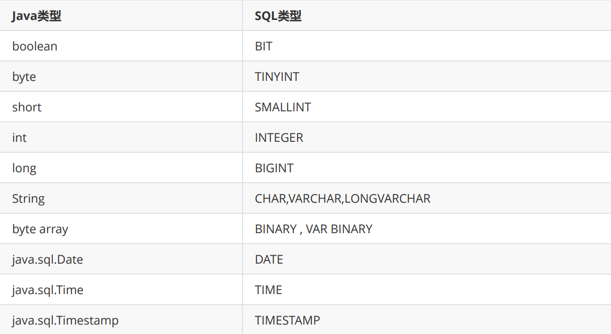

<h1 align="center" style="color: Navy">JDBC核心技术</h1>

- [1. 获取数据库连接](#1-获取数据库连接)
- [2. 使用PreparedStatement实现CRUD操作](#2-使用preparedstatement实现crud操作)
- [3. 批量插入数据操作](#3-批量插入数据操作)
- [4. DAO及其实现类](#4-dao及其实现类)
- [5. 数据库连接池](#5-数据库连接池)
- [6. Apache-DBUtils实现CRUD操作](#6-apache-dbutils实现crud操作)

# 1. 获取数据库连接
```java
/**
    * url=jdbc:mysql://localhost:3306/test?useUnicode=true&
          characterEncoding=utf-8&serverTimezone=GMT&rewriteBatchedStatements=TRUE
    * test为访问的数据库名称
    * driverClass = com.mysql.cj.jdbc.Driver
    * 建立数据库连接
    * 通过读取配置文件，实现了数据与代码的分离。
    * @return 建立好的连接
    * @author zhaolifeng
    * @date 2022/7/8 21:36
    */
public static Connection getConnection() throws Exception{
    InputStream is = ConnectTest.class.getClassLoader().getResourceAsStream("jdbc.properties");
    Properties properties = new Properties();
    properties.load(is);
    String user = properties.getProperty("user");
    String password = properties.getProperty("password");
    String url = properties.getProperty("url");
    String driverClass = properties.getProperty("driverClass");
    Class.forName(driverClass);
    return DriverManager.getConnection(url,user,password);
}

 /**
    * 关闭连接和statement以及结果集
    * @param connection-连接
    * @param ps-statement
    * @param resultSet-结果集
    * @author zhaolifeng
    * @date 2022/7/8 22:56
    */
public static void closeResource(Connection connection, Statement ps, ResultSet resultSet){
    try {
        //资源关闭
        if (ps!=null)
            ps.close();
    }catch (SQLException e){
        e.printStackTrace();
    }
    try {
        if (connection!=null)
            connection.close();
    }catch (SQLException e){
        e.printStackTrace();
    }
    try {
        if (resultSet!=null)
            resultSet.close();
    }
    catch (SQLException e){
        e.printStackTrace();
    }
}
```

# 2. 使用PreparedStatement实现CRUD操作

**<center>java与SQL数据类型对照表</center>**


ORM思想(object relational mapping)
- 一个数据表对应一个java类
- 表中的一条记录对应java类的一个对象
- 表中的一个字段对应java类的一个属性

`sql是需要结合列名和表的属性名来写。注意起别名。`

JDBC结果集的元数据：ResultSetMetaData
- 获取列数：getColumnCount()
- 获取列的别名：getColumnLabel()
通过反射，创建指定类的对象，获取指定的属性并赋值

```java
/**
    * 通用增删改操作
    * @param sql-增删改语句（带通配符`?`）
    * @param args-通配符对应可变参数
    * @author zhaolifeng
    * @date 2022/7/8 22:57
    */
public static void update(String sql,Object ...args){
    Connection connection = null;
    PreparedStatement ps = null;
    try {
        connection = JDBCUtils.getConnection();
        ps = connection.prepareStatement(sql);
        for (int i = 0; i < args.length; i++) {
            ps.setObject(i+1,args[i]);
        }
        ps.execute();
    } catch (Exception e) {
        e.printStackTrace();
    } finally {
        JDBCUtils.closeResource(connection,ps);
    }
}

/**
    * 通用查询操作
    * @param clazz-类的class对象
    * @param sql-查找的sql语句(带通配符)
    * @param args-通配符对应的参数
    * @return 查询结果列表
    * @author zhaolifeng
    * @date 2022/7/8 23:20
    */
public <T> List<T> getForList(Class<T> clazz, String sql, Object ...args){
    Connection connection = null;
    PreparedStatement ps = null;
    ResultSet resultSet = null;
    try {
        connection = JDBCUtils.getConnection();
        ps = connection.prepareStatement(sql);
        for (int i = 0; i < args.length; i++) {
            ps.setObject(i+1,args[i]);
        }
        resultSet = ps.executeQuery();
        ResultSetMetaData rsmd = resultSet.getMetaData(); //结果集元数据
        int columnCount = rsmd.getColumnCount();
        ArrayList<T> list = new ArrayList<>();
        while (resultSet.next()){
            T t = clazz.getDeclaredConstructor().newInstance();
            for (int i = 0; i < columnCount; i++) {
                //获取列值
                Object columnValue = resultSet.getObject(i+1);
                //获取列的别名，默认是原表名
                String columnLabel = rsmd.getColumnLabel(i + 1);
                Field field = clazz.getDeclaredField(columnLabel); //反射，以满足动态访问
                field.setAccessible(true);//使得原本无法访问的私有成员也可以访问。
                field.set(t,columnValue);
            }
            list.add(t);
        }
        return list;
    } catch (Exception e) {
        e.printStackTrace();
    } finally {
        JDBCUtils.closeResource(connection,ps,resultSet);
    }
    return null;
}
```

# 3. 批量插入数据操作
```java
//方式一
@Test
public void testInsert1() throws Exception{
    Connection connection = null;
    PreparedStatement ps = null;
    try {
        connection = JDBCUtils.getConnection();
        String sql = "insert into goods(name) values(?)";
        ps = connection.prepareStatement(sql);
        for (int i = 0; i < 20000; i++) {
            ps.setObject(1,"name_"+i);
            ps.execute();
        }
    } catch (Exception e) {
        e.printStackTrace();
    } finally {
        JDBCUtils.closeResource(connection,ps);
    }
}

//方式二
//addBatch()、executeBatch()、clearBatch()批次执行通配符参数。
@Test
public void testInsert2() throws Exception{
    Connection connection = null;
    PreparedStatement ps = null;
    try {
        connection = JDBCUtils.getConnection();
        String sql = "insert into goods(name) values(?)";
        ps = connection.prepareStatement(sql);
        for (int i = 0; i < 20000; i++) {
            ps.setObject(1,"name_"+i);
            ps.addBatch(); //将参数存到batch里，再批量插入
            if (i%500==0){
                ps.executeBatch();
                ps.clearBatch();
            }
        }
    } catch (Exception e) {
        e.printStackTrace();
    } finally {
        JDBCUtils.closeResource(connection,ps);
    }
}

//方式三（最快）
//设置autocommit为false，关闭隐式事务提交。
@Test
public void testInsert3() throws Exception{
    Connection connection = null;
    PreparedStatement ps = null;
    try {
        connection = JDBCUtils.getConnection();
        //设置不允许自动提交
        connection.setAutoCommit(false);
        String sql = "insert into goods(name) values(?)";
        ps = connection.prepareStatement(sql);
        for (int i = 0; i < 20000; i++) {
            ps.setObject(1,"name_"+i);
            ps.addBatch(); //将参数存到batch里，再批量插入
            if (i%500==0){
                ps.executeBatch();
                ps.clearBatch();
            }
        }
        connection.commit();
    } catch (Exception e) {
        e.printStackTrace();
    } finally {
        JDBCUtils.closeResource(connection,ps);
    }
}
```

# 4. DAO及其实现类

# 5. 数据库连接池
- 为解决传统开发中的数据库连接问题，可以采用数据库连接池技术。
- 数据库连接池的基本思想：就是为数据库连接建立一个“缓冲池”。预先在缓冲池中放入一定数量的连接，当需要建立数据库连接时，只需从“缓冲池”中取出一个，使用完毕之后再放回去。
- 数据库连接池负责分配、管理和释放数据库连接，它允许应用程序重复使用一个现有的数据库连接，而不是重新建立一个。
- 数据库连接池在初始化时将创建一定数量的数据库连接放到连接池中，这些数据库连接的数量是由最小数据库连接数来设定的。无论这些数据库连接是否被使用，连接池都将一直保证至少拥有这么多的连接数量。连接池的最大数据库连接数量限定了这个连接池能占有的最大连接数，当应用程序向连接池请求的连接数超过最大连接数量时，这些请求将被加入到等待队列中。
常用数据库连接池：dbcp、C3P0、**Druid**（最常用）


# 6. Apache-DBUtils实现CRUD操作
```java
@Test
public void testInsert()throws  Exception{
    QueryRunner queryRunner = new QueryRunner();
    Connection connection = JDBCUtils.getDRUIDConnection();
    String sql = "insert into customers(name,email,birth) values(?,?,?)";
    queryRunner.update(connection,sql,"蔡徐坤","caixukun@126.com","1999-12-12");
}

//ResultSetHandler:单条纪录查询
@Test
public void testQuery1() throws Exception{
    QueryRunner queryRunner = new QueryRunner();
    Connection connection = JDBCUtils.getDRUIDConnection();
    String sql = "select id,name,email,birth from customers where id = ?";
    BeanHandler<Customer> handler = new BeanHandler<>(Customer.class);
    Customer customer = queryRunner.query(connection, sql, handler,23);
    System.out.println(customer);
    JDBCUtils.closeResource(connection);
}

//多条纪录查询
@Test
public void testQuery2() throws Exception{
    QueryRunner queryRunner = new QueryRunner();
    Connection connection = JDBCUtils.getDRUIDConnection();
    String sql = "select id,name,email,birth from customers where id < ?";
    BeanListHandler<Customer> listHandler = new BeanListHandler<>(Customer.class);
    List<Customer> customers = queryRunner.query(connection, sql, listHandler,23);
    JDBCUtils.closeResource(connection);
    for (Customer c : customers) {
        System.out.println(c);
    }
}

//以map的形式查询
@Test
public void testQuery3() throws Exception{
    QueryRunner queryRunner = new QueryRunner();
    Connection connection = JDBCUtils.getDRUIDConnection();
    String sql = "select id,name,email,birth from customers where id < ?";
    MapHandler mapHandler = new MapHandler();
    Map<String,Object> customer = queryRunner.query(connection, sql, mapHandler,23);
    JDBCUtils.closeResource(connection);
    System.out.println(customer);
}

//查询特殊值
@Test
public void testQuery4() throws Exception{
    QueryRunner queryRunner = new QueryRunner();
    Connection connection = JDBCUtils.getDRUIDConnection();
    String sql = "select max(birth) from customers";
    ScalarHandler handler = new ScalarHandler();
    Date date = (Date) queryRunner.query(connection,sql,handler);
    System.out.println(date);
}

//自定义ResultSetHandler实现类
@Test
public void testQuery7() throws Exception{
    QueryRunner queryRunner = new QueryRunner();
    Connection connection = JDBCUtils.getDRUIDConnection();
    String sql = "select id,name,email,birth from customers where id = ?";
    ResultSetHandler<Customer> handler = new ResultSetHandler<Customer>() {
        @Override
        public Customer handle(ResultSet rs) throws SQLException {
            return null;
        }
    };
    Customer customer = queryRunner.query(connection, sql, handler,23);
    System.out.println(customer);
    JDBCUtils.closeResource(connection);
}

//关闭资源:使用DbUtils工具类
@Test
public void testClose() {
    Connection connection = null;
    try {
        connection = JDBCUtils.getConnection();
    } catch (Exception e) {
        e.printStackTrace();
    } finally {
        DbUtils.closeQuietly(connection);
    }
}
```