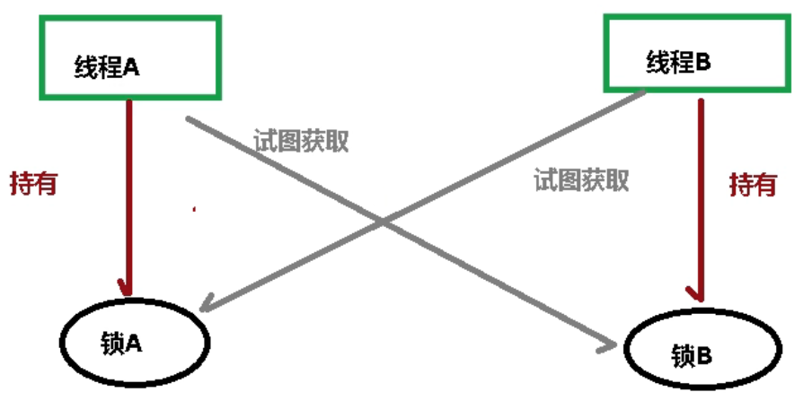
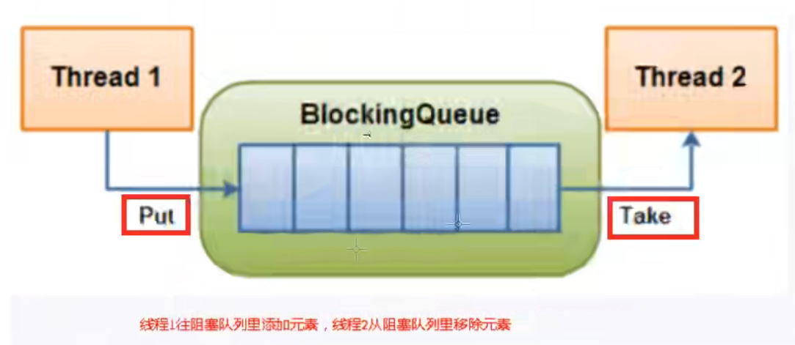
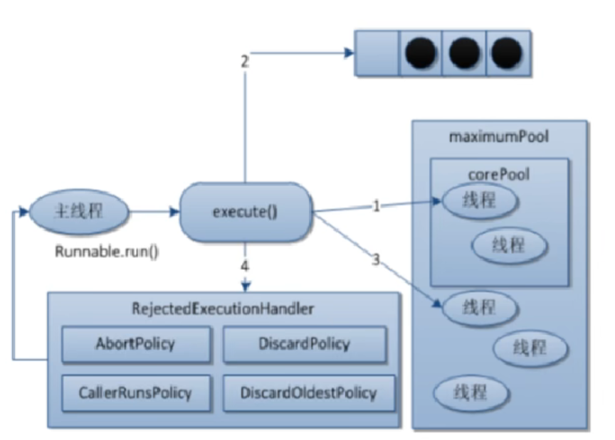
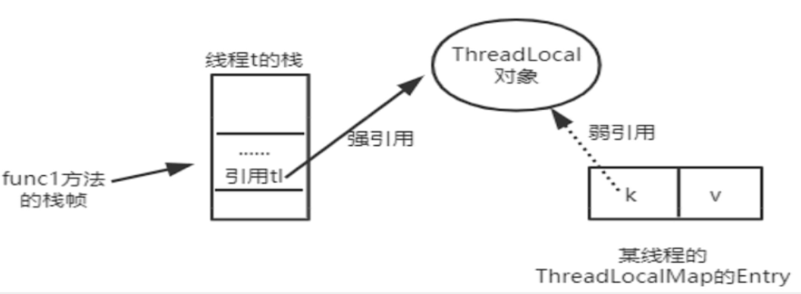
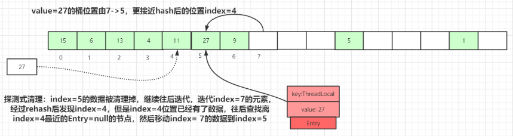
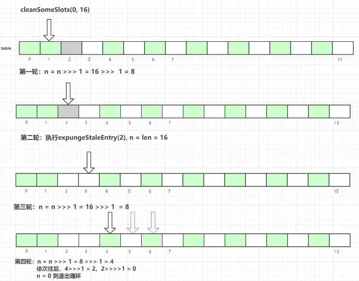
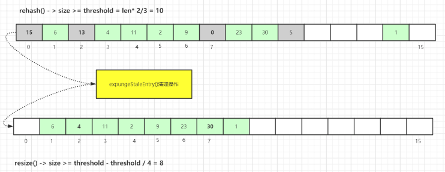
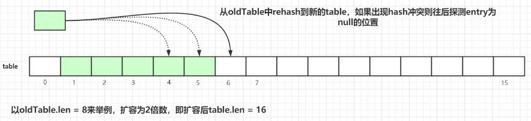

<h1 align="center">JUC并发编程</h1>

- [1. JUC概述](#1-juc概述)
  - [1.1. 进程与线程](#11-进程与线程)
  - [1.2. 用户线程和守护线程](#12-用户线程和守护线程)
  - [1.3. 线程的状态](#13-线程的状态)
  - [1.4. wait和sleep区别](#14-wait和sleep区别)
  - [1.5. 串行、并发、并行](#15-串行并发并行)
- [2. Lock接口](#2-lock接口)
  - [2.1. Synchronized](#21-synchronized)
  - [2.2. lock 与 synchronized](#22-lock-与-synchronized)
- [3. 线程间通信](#3-线程间通信)
- [4. 线程间定制化通信](#4-线程间定制化通信)
- [5. 集合的线程安全](#5-集合的线程安全)
  - [5.1. List](#51-list)
    - [5.1.1. 不安全演示](#511-不安全演示)
    - [5.1.2. 解决方案](#512-解决方案)
      - [5.1.2.1. Vector（不常用）](#5121-vector不常用)
      - [5.1.2.2. Collections（不常用）](#5122-collections不常用)
      - [5.1.2.3. CopyOnWriteArrayList](#5123-copyonwritearraylist)
  - [5.2. HashSet](#52-hashset)
  - [5.3. HashMap](#53-hashmap)
- [6. 多线程锁](#6-多线程锁)
  - [6.1. synchronized锁范围](#61-synchronized锁范围)
  - [6.2. 公平锁与非公平锁](#62-公平锁与非公平锁)
  - [6.3. 可重入锁(递归锁)](#63-可重入锁递归锁)
  - [6.4. 死锁](#64-死锁)
    - [6.4.1. 死锁的出现](#641-死锁的出现)
    - [6.4.2. 产生死锁的原因](#642-产生死锁的原因)
    - [6.4.3. 验证是否是死锁](#643-验证是否是死锁)
- [7. Callable接口](#7-callable接口)
- [8. 线程辅助类](#8-线程辅助类)
  - [8.1. CountDownLatch倒计数锁存器](#81-countdownlatch倒计数锁存器)
  - [8.2. CyclicBarrier循环珊栏](#82-cyclicbarrier循环珊栏)
  - [8.3. CountDownLatch和CyclicBarrier区别](#83-countdownlatch和cyclicbarrier区别)
  - [8.4. 信号灯Semaphore](#84-信号灯semaphore)
  - [8.5. 阻塞队列](#85-阻塞队列)
- [9. 读写锁](#9-读写锁)
  - [9.1. 悲观锁-不支持并发](#91-悲观锁-不支持并发)
  - [9.2. 乐观锁-支持并发](#92-乐观锁-支持并发)
  - [9.3. 表锁](#93-表锁)
  - [9.4. 行锁](#94-行锁)
  - [9.5. 锁降级](#95-锁降级)
    - [9.5.1. 写锁降级为读锁](#951-写锁降级为读锁)
- [10. 线程池](#10-线程池)
  - [10.1. 线程池使用方式](#101-线程池使用方式)
  - [10.2. 线程池的七个参数](#102-线程池的七个参数)
  - [10.3. 线程池拒绝策略](#103-线程池拒绝策略)
- [11. Fork/Join](#11-forkjoin)
- [12. CompletableFuture](#12-completablefuture)
  - [12.1. CompletableFuture](#121-completablefuture)
    - [12.1.1. Future接口](#1211-future接口)
      - [12.1.1.1. 基本知识](#12111-基本知识)
    - [12.1.2. 存在问题：](#1212-存在问题)
    - [12.1.3. CompletableFuture的改进](#1213-completablefuture的改进)
    - [12.1.4. 通用演示：减少阻塞和轮询](#1214-通用演示减少阻塞和轮询)
      - [12.1.4.1. 注意事项](#12141-注意事项)
    - [12.1.5. 常用方法](#1215-常用方法)
- [13. ThreadLocal](#13-threadlocal)
  - [13.1. 清除脏Entry](#131-清除脏entry)
  - [13.2. ThreadLocalMap过期key清理](#132-threadlocalmap过期key清理)
    - [13.2.1. 探测式清理-线性探测清理](#1321-探测式清理-线性探测清理)
    - [13.2.2. 启发式清理](#1322-启发式清理)
  - [13.3. ThreadLocalMap扩容机制](#133-threadlocalmap扩容机制)
  - [13.4. 使用小结](#134-使用小结)
  - [13.5. 总结](#135-总结)
# 1. JUC概述

## 1.1. 进程与线程
- 进程：系统中运行的一个运行程序。
- 线程：可以看做轻量级进程。是大多数操作系统进行时序调度的**基本单元**。
- 管程：Monitor监视器，比如锁。是一种**同步机制**，保证同一个时间，只有一个线程能去访问被保护的数据/代码。

## 1.2. 用户线程和守护线程
Java线程包括用户线程和守护线程。
- 用户线程(User Thread)：系统的工作线程
- 守护线程(Daemon Thread)：为其他线程服务的，在后台默默完成一些系统性的服务。比如垃圾回收线程。
```java
Thread.currentThread().isDaemon(); //查看当前线程是否是守护线程
Thread.currentThread().setDaemon(); //将当前线程设置为守护线程。需要在所有线程运行之前设置。
```


## 1.3. 线程的状态
1. NEW-新建
2. RUNNABLE-准备就绪
3. BLOCKED-阻塞
4. TIMED_WAITING-过时不候
5. TERMINATED-终结

## 1.4. wait和sleep区别
1. sleep是Thread的静态方法,wait是object方法。任何实例对象都可以调用
2. sleep不会释放锁，也不需要占用锁。wait会释放锁，但调用的前提是当前线程占有锁。（即代码要在`synchronized`中）
3. 都可以被`interrupted`方法中断

## 1.5. 串行、并发、并行
- 串行：多个任务排队执行。
- 并发：一台处理器“同时”处理多个任务。同一时刻只有一个事件发生，多个线程在访问同一个资源，多个线程对一个点（互相影响）。
- 并行：多台处理器“同时”处理多个任务。同一时刻大家各做各的。

# 2. Lock接口
## 2.1. Synchronized
同步代码块。可以加在方法上。常用方法：`this.wait();this.notifyAll();`。

**多线程编写步骤**：
1. 创建资源类，在资源类创建属性和操作方法
2. 在资源类操作方法中：先判断再做事情最后通知
3. 创建多个线程，调用资源类的操作方法
4. 防止虚假唤醒：将判断条件放入`while`循环中


## 2.2. lock 与 synchronized
1. lock可以提高多个线程进行读操作的效率
2. lock可以让等待锁的线程响应中断，Synchronized不行。
3. 在遇到异常时，Synchronized会自动释放锁，lock不会自动释放锁，需要手动`try finally`。


# 3. 线程间通信

# 4. 线程间定制化通信
主要通过condition的`await()`和`signal()`方法实现。
```java
public class ThreadDemo3 {
    public static void main(String[] args) {
        ShareResource shareResource = new ShareResource();
        new Thread(()->{
            for (int i = 0; i <= 10; i++) {
                try {
                    shareResource.print5(i);
                } catch (InterruptedException e) {
                    e.printStackTrace();
                }
            }
        },"Thread1").start();
        new Thread(()->{
            for (int i = 0; i <= 10; i++) {
                try {
                    shareResource.print10(i);
                } catch (InterruptedException e) {
                    e.printStackTrace();
                }
            }
        },"Thread2").start();
        new Thread(()->{
            for (int i = 0; i <= 10; i++) {
                try {
                    shareResource.print15(i);
                } catch (InterruptedException e) {
                    e.printStackTrace();
                }
            }
        },"Thread3").start();
    }
}

@Slf4j
class ShareResource{
    private int flag = 1;
    private Lock lock = new ReentrantLock();

    private Condition c1 = lock.newCondition();
    private Condition c2 = lock.newCondition();
    private Condition c3 = lock.newCondition();

    public void print5(int loop) throws InterruptedException {
        //上锁
        lock.lock();
        try {
            while (flag!=1){
                c1.await();
            }
            for (int i = 0; i < 5; i++) {
                log.info("{}::{}::轮数::{}",Thread.currentThread().getName(),i,loop);
            }
            flag=2;
            c2.signal();
        }finally {
            lock.unlock();
        }
    }

    public void print10(int loop) throws InterruptedException {
        //上锁
        lock.lock();
        try {
            while (flag!=2){
                c2.await();
            }
            for (int i = 0; i < 10; i++) {
                log.info("{}::{}::轮数::{}",Thread.currentThread().getName(),i,loop);
            }
            flag=3;
            c3.signal();
        }finally {
            lock.unlock();
        }
    }

    public void print15(int loop) throws InterruptedException {
        //上锁
        lock.lock();
        try {
            while (flag!=3){
                c3.await();
            }
            for (int i = 0; i < 15; i++) {
                log.info("{}::{}::轮数::{}",Thread.currentThread().getName(),i,loop);
            }
            flag=1;
            c1.signal();
        }finally {
            lock.unlock();
        }
    }
}
```


# 5. 集合的线程安全
## 5.1. List
### 5.1.1. 不安全演示
```java
public static void main(String[] args) {
    ArrayList<String> list = new ArrayList<>();
    for (int i = 0; i < 30; i++) {
        new Thread(()->{
            list.add(UUID.randomUUID().toString().substring(0,8));
            System.out.println(list);
        },String.valueOf(i)).start();
    }
}
```
出现报错信息：`Exception in thread "22" java.util.ConcurrentModificationException`。
### 5.1.2. 解决方案
#### 5.1.2.1. Vector（不常用）
通过实现vector线程安全list实例。
```java
List<String> list = new Vector<>();
```
#### 5.1.2.2. Collections（不常用）
通过调用工具类`Collections.synchronizedList`实现线程安全。
```java
List<String> list = Collections.synchronizedList(new ArrayList<>());
```

#### 5.1.2.3. CopyOnWriteArrayList
写时复制技术：当并发写的时候先复制一份，往里面写入新内容。之后再做合并。优点：**不影响读**，性能高。缺点：占内存。

```java
List<String> list = new CopyOnWriteArrayList<>();
```

## 5.2. HashSet
```java
Set<String> set = new CopyOnWriteArraySet<>();
```

## 5.3. HashMap
```java
Map<String, String> map = new ConcurrentHashMap<>();
```

# 6. 多线程锁

## 6.1. synchronized锁范围
- `synchronized 方法`：锁的是当前实例对象，作用域为实例对象。属于普通同步方法。
- `static synchronized 方法`：锁的是当前类的Class对象，作用域为全局类。属于静态同步方法。
- `synchronized 方法块`：即同步方法块，锁的是`synchronized`括号里配置的对象。

## 6.2. 公平锁与非公平锁
- 公平锁：`new ReentrantLock(true)`：阳光普照，**效率相对较低**。非公平锁在调用 lock 后，首先就会调用 CAS 进行一次抢锁，如果这个时候恰巧锁没有被占用，那么直接就获取到锁返回了。非公平锁在 CAS 失败后，和公平锁一样都会进入到 tryAcquire 方法，在 tryAcquire 方法中，如果发现锁这个时候被释放了（state == 0），非公平锁会直接 CAS 抢锁，但是公平锁会判断等待队列是否有线程处于等待状态，如果有则不去抢锁，乖乖排到后面。
- 非公平锁（默认）：`new ReentrantLock(false)`：线程锁死，**效率高**，但会出现线程饿死的情况。

## 6.3. 可重入锁(递归锁)
synchronized(隐式)和Lock(显式)都是可重入锁。
- `synchronized`演示：
    ```java
    //不会出现请求不到锁的情况。
    public synchronized void add(){
        add();
    }
    ```
- `Lock`演示：
    ```java
    //不会出现请求不到锁的情况。但是内部调用lock()后也要对应unlock()。否则会一直锁在这里。
    //内部每一次lock()，lock的state就会+1。判断lock有没有被释放，是判断state是否等于0。
    //因此需要每次用完就释放。只有外层释放不够。
    new Thread(()->{
        try{
            lock.lock();
            try{
                lock.lock();
            }final{
                lock.unlock();
            }
        }final{
            lock.unlock();
        }
    },"T1");
    ```
## 6.4. 死锁

### 6.4.1. 死锁的出现
死锁：两个或者两个以上进程在执行过程中，因为**争夺资源**而造成的一种**互相等待**的现象。如果没有外力干涉，他们无法再执行下去。

### 6.4.2. 产生死锁的原因
1. 系统资源不足
2. 进程运行推进顺序不合适
3. 资源分配不当
### 6.4.3. 验证是否是死锁
1. jps-类似linux ps -ef
2. jstack-JVM自带堆栈跟踪工具

# 7. Callable接口
创建线程的多种方式
1. 继承`Thread`类
2. 实现`Runnable`接口
    没有返回值，不会抛出异常，调用方法名称为`run()`。
3. `Callable`接口-实现中间类`FutureTask`
    有返回值，会抛出异常，调用方法名称为`call()`。
    ```java
    FutureTask<Integer> futureTask = new FutureTask<>(() -> {
        System.out.println(Thread.currentThread().getName() + " come in callabe");
        Thread.sleep(1000);
        return 200;
    });
    new Thread(futureTask,"luck").start();
    while (!futureTask.isDone()){
        System.out.println("正在等待");
    }
    System.out.println(futureTask.get());
    ```
4. 线程池


# 8. 线程辅助类
## 8.1. CountDownLatch倒计数锁存器
通过countDown方法以 CAS 的操作来减少 state,直至 state 为 0 再做操作。否则一直await方法等待。
```java
//6个同学陆续离开教室后，班长锁门。
CountDownLatch countDownLatch = new CountDownLatch(6);
for (int i = 1; i <= 6; i++) {
    new Thread(()->{
        System.out.println(Thread.currentThread().getName()+"号同学离开了教室");
        countDownLatch.countDown();
    },String.valueOf(i)).start();
}
countDownLatch.await();
System.out.println(Thread.currentThread().getName()+" 班长锁门走了");
```
**用法：**
1. 某一线程在开始运行前等待 **n 个线程执行完毕**。
   一个典型应用场景就是启动一个服务时，主线程需要等待**多个组件加载完毕，之后再继续执行。**
2. 实现多个线程开始执行任务的**最大并行性**。
   注意是并行性，不是并发，强调的是多个线程在某一时刻同时开始执行。类似于赛跑，将多个线程放到起点，等待发令枪响，然后同时开跑。做法是初始化一个共享的 CountDownLatch 对象，将其计数器初始化为 1 （new CountDownLatch(1)），多个线程在开始执行任务前首先 coundownlatch.await()，当主线程调用 countDown() 时，计数器变为 0，多个线程同时被唤醒。

## 8.2. CyclicBarrier循环珊栏
**应用场景:** 可以用于**多线程计算数据，最后合并计算结果**的应用场景。比如我们用一个 Excel 保存了用户所有银行流水，每个 Sheet 保存一个帐户近一年的每笔银行流水，现在需要统计用户的日均银行流水，先用多线程处理每个 sheet 里的银行流水，都执行完之后，得到每个 sheet 的日均银行流水，最后，再用 barrierAction 用这些线程的计算结果，计算出整个 Excel 的日均银行流水。
```java
int NUMBER = 7;
CyclicBarrier cyclicBarrier = new CyclicBarrier(NUMBER,()->{
    System.out.println("集齐7颗龙珠就可以召唤神龙");
});
//集齐7颗龙珠过程。
for (int i = 1; i <= 6; i++) {
    new Thread(()->{
        System.out.println(Thread.currentThread().getName()+" 星龙珠被收集到了");
        try {
            //等待
            cyclicBarrier.await();
        } catch (InterruptedException | BrokenBarrierException e) {
            e.printStackTrace();
        }
    },String.valueOf(i)).start();
}
```
当调用 CyclicBarrier 对象调用 await() 方法时，实际上调用的是 dowait(false, 0L)方法。 await() 方法就像树立起一个栅栏的行为一样，将线程挡住了，**当拦住的线程数量达到 NUMBER 的值时，栅栏才会打开，线程才得以通过执行**。

## 8.3. CountDownLatch和CyclicBarrier区别
1. CountDownLatch 是计数器，只能使用一次，而 CyclicBarrier 的计数器提供 reset 功能，可以多次使用。
2. 对于 CountDownLatch 来说，重点是“一个线程（多个线程）等待”，而其他的 N 个线程在完成“某件事情”之后，可以终止，也可以等待。而对于 CyclicBarrier，重点是多个线程，在任意一个线程没有完成，所有的线程都必须等待。
3. CountDownLatch 是计数器，线程完成一个记录一个，只不过计数不是递增而是递减，而 CyclicBarrier 更像是一个阀门，需要所有线程都到达，阀门才能打开，然后继续执行。

## 8.4. 信号灯Semaphore
Semaphore 经常用于限制获取某种资源的线程数量。
```java
//6辆汽车，停3个车位
Semaphore semaphore = new Semaphore(3);
for (int i = 1; i <=6; i++) {
    new Thread(()->{
        try {
            //抢车位
            semaphore.acquire();
            System.out.println(Thread.currentThread().getName() + " 抢到了车位");
            //停车时间
            TimeUnit.SECONDS.sleep(new Random().nextInt(5));
            System.out.println(Thread.currentThread().getName() + " -----离开了车位");
        } catch (InterruptedException e) {
            e.printStackTrace();
        }finally {
            //释放
            semaphore.release();
        }
    },String.valueOf(i)).start();
}
```

## 8.5. 阻塞队列
存在意义：程序员不用担心队列满，队列空的问题。阻塞队列是**定长**的。


# 9. 读写锁
## 9.1. 悲观锁-不支持并发

## 9.2. 乐观锁-支持并发

## 9.3. 表锁

## 9.4. 行锁

## 9.5. 锁降级
### 9.5.1. 写锁降级为读锁
步骤：

读锁不能升级为写锁


# 10. 线程池
## 10.1. 线程池使用方式
1. 一池N线程
   ```java
    Executors.newFixedThreadPool(N);
   ```
2. 一池一线程
   ```java
    Executors.newSingleThreadExcecutor();
   ```
3. 一池自扩容线程
   ```java
    Executors.newCachedThreadPool();
   ```

## 10.2. 线程池的七个参数
```java
public ThreadPoolExecutor(int corePoolSize,
                            int maximumPoolSize,
                            long keepAliveTime,
                            TimeUnit unit,
                            BlockingQueue<Runnable> workQueue,
                            ThreadFactory threadFactory,
                            RejectedExecutionHandler handler) {}
```
1. `corePoolSize` - 保留在池中的线​​程数，即使它们是空闲的，除非设置allowCoreThreadTimeOut
2. `maximumPoolSize` – 池中允许的最大线程数
3. `keepAliveTime` – 当线程数大于核心时，这是多余的空闲线程在终止前等待新任务的最长时间。
4. `unit` – keepAliveTime参数的时间单位
5. `workQueue` – 用于在执行任务之前保存任务的阻塞队列。此队列将仅保存由execute方法提交的Runnable任务。
6. `threadFactory` – 执行器创建新线程时使用的工厂
7. `handler` – 由于达到**线程边界**和**队列容量**而阻塞执行时使用的处理程序

当常驻线程处理不了当前请求，会先将请求加入到阻塞队列中。当阻塞队列满了才会创建新的线程。



## 10.3. 线程池拒绝策略
- `AbortPolicy`(**默认**) -- 当任务添加到线程池中被拒绝时，它将抛出 `RejectedExecutionException` **异常**。
- `CallerRunsPolicy` -- 当任务添加到线程池中被拒绝时，会在线程池当前正在运行的Thread线程池中处理被拒绝的任务（**抢占式**）。
- `DiscardOldestPolicy` -- 当任务添加到线程池中被拒绝时，线程池会**放弃等待队列中最久**的未处理任务，然后将被拒绝的任务添加到等待队列的尾部。
- `DiscardPolicy` -- 当任务添加到线程池中被拒绝时，线程池将**丢弃**被拒绝的任务。

# 11. Fork/Join
任务的拆分和合并。
```java
public class ForkJoinDemo {
    public static void main(String[] args) throws ExecutionException, InterruptedException {
        MyTask task = new MyTask(0, 100);
        ForkJoinPool forkJoinPool = new ForkJoinPool();
        ForkJoinTask<Integer> forkJoinTask = forkJoinPool.submit(task);
        Integer result = forkJoinTask.get();
        System.out.println(result);
        forkJoinPool.shutdown();
    }
}
class MyTask extends RecursiveTask<Integer> {
    //拆分差值不能超过10
    private static final Integer VALUE = 10;
    private int begin;
    private int end;
    private int result;

    public MyTask(int begin, int end) {
        this.begin = begin;
        this.end = end;
    }
    @Override
    protected Integer compute() {
        if (end-begin<=VALUE){
            for (int i = begin; i <= end; i++) {
                result+=i;
            }
        }else {
            int middle = (begin+end)/2;
            MyTask task01 = new MyTask(begin,middle);
            MyTask task02 = new MyTask(middle+1,end);
            task01.fork();
            task02.fork();
            result = task01.join() + task02.join();
        }
        return result;
    }
}
```

# 12. CompletableFuture


## 12.1. CompletableFuture
### 12.1.1. Future接口
#### 12.1.1.1. 基本知识
1. 定义了操作**异步任务执行**的一些方法：比如获取异步任务的执行结果、取消任务的执行、判断任务是否执行完毕等。
2. 实现类为FutureTask
3. Future可以为主线程开一个子线程，处理耗时耗力的工作。
4. 完成异步任务执行需要具备三个特点：多线程/有返回(`Callable`接口)/异步任务。因此一般通过新建`FutureTask`对象，通过入参为`Callable`的构造方法满足上述特点。

### 12.1.2. 存在问题：
1. `FutureTask.get()`。会阻塞其他线程。一直等到结果才离开。因此一般建议放在程序后面。`FutureTask.get(timeout,seconds)`。若在指定时间内等不到结果，则直接**抛异常**。
2. `FutureTask.isDone()`轮询。
3. **结论**：`Future`对**结果**的**获取**不是很友好。

### 12.1.3. CompletableFuture的改进
`CompletableFuture`提供了一种类似观察者模式的机制，可以让任务执行完成后通知监听的一方。
```java
public class CompletableFuture<T> implements Future<T>, CompletionStage<T> {}
```
- `CompletionStage`:代表异步计算过程中的某一阶段，一个阶段完成后可能会触发另外一个阶段。
- 核心的四个**静态方法**:
    1. `public static CompletableFuture<Void> runAsync(Runnable runnable) {}`-无返回值：单线程
    2. `public static CompletableFuture<Void> runAsync(Runnable runnable,Executor executor){} `-无返回值：线程池
    3. `public static <U> CompletableFuture<U> supplyAsync(Supplier<U> supplier) {}`-有返回值：单线程
    4. `public static <U> CompletableFuture<U> supplyAsync(Supplier<U> supplier,Executor executor) {}`-有返回值：线程池
- `join()`和`get()`：`join`不抛异常编译器不会报错，`get`会报错。

### 12.1.4. 通用演示：减少阻塞和轮询
#### 12.1.4.1. 注意事项
1. 主线程结束的同时,`CompletableFuture`**默认使用**的线程池会立即关闭。因此一般要自定义线程池：`ExecutorService threadPool = Executors.newFixedThreadPool(3);`。


### 12.1.5. 常用方法
1. 获得结果和触发计算
   - `T getNow(T valueIfAbsent)`。如果完成则正常返回，否则返回入参值
   - `boolean complete(T value)`。如果尚未完成，则将get()和相关方法返回的值设置为给定值。
2. 对计算结果进行处理


# 13. ThreadLocal



## 13.1. 清除脏Entry


## 13.2. ThreadLocalMap过期key清理
### 13.2.1. 探测式清理-线性探测清理


经过一轮探测式清理后，key过期的数据会被清理掉，没过期的数据经过rehash重定位后所处的桶位置理论上更接近`i= key.hashCode & (tab.len - 1)`的位置。这种优化会**提高整个散列表查询性能**。

### 13.2.2. 启发式清理

启动式清理会从传入的下标 i 处，向后遍历。如果发现过期的Entry则再次触发探测式清理，并重置 n。这个n是用来控制 do while 循环的跳出条件。如果遍历过程中，连续 m 次没有发现过期的Entry，就可以认为数组中已经没有过期Entry了。这个 m 的计算是 `n >>>= 1` ，也可以理解成是数组长度的2的几次幂。
例如：数组长度是16，那么2^4^=16，也就是连续4次没有过期Entry，即 `m = logn/log2`(n为数组长度)

## 13.3. ThreadLocalMap扩容机制
如果执行完启发式清理工作后，未清理到任何数据，且当前散列数组中Entry的数量已经达到了列表的扩容阈值(`threshold = len*2/3`)，就开始执行rehash()逻辑：
首先是会进行探测式清理工作，从table的起始位置往后清理\。清理完成之后，table中可能有一些key为null的Entry数据被清理掉，所以此时通过判断`size >= threshold - threshold / 4` 也就是`size >= threshold * 3/4`(即实际元素长度大于等于数组长度的一半) 来决定是否扩容。满足条件则执行扩容，大小为原来长度的两倍。然后遍历老的散列表，重新计算hash位置，然后放到新的tab数组中，如果出现hash冲突则往后寻找最近的entry为null的槽位，遍历完成之后，oldTab中所有的entry数据都已经放入到新的tab中了。重新计算tab下次扩容的阈值，



## 13.4. 使用小结
1. `ThreadLocal.withInitial(()->初始化值)`，防止空指针异常。
2. 建议把`ThreadLocal`修饰为`static`
3. 用完要手动`remove`，防止内存泄露和线程池内存复用

## 13.5. 总结
1. ThreadLocal并不解决线程间共享数据的问题
2. ThreadLocal适用于变量在线程间隔离且在方法间共享的场景
3. ThreadLocal通过隐式的在不同线程内创建独立实例副本避免了实例线程安全的问题
4. 每个线程持有一个只属于自己的专属Map并维护了ThreadLocal对象与具体实例的映射，该Map由于只被持有它的线程访问，故不存在线程安全以及锁的问题
5. ThreadLocalMap的Entry对ThreadLocal的引用为弱引用，避免了ThreadLocal对象无法被回收的问题
6. 都会通过expungeStaleEntry, cleanSomeSlots, replaceStaleEntry这三个方法回收键为null的Entry对象的值（即为具体实例）以及Entry对象本身从而防止内存泄露，属于安全加固的方法
