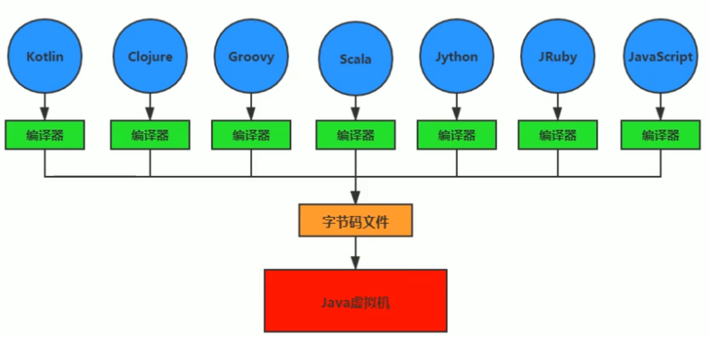
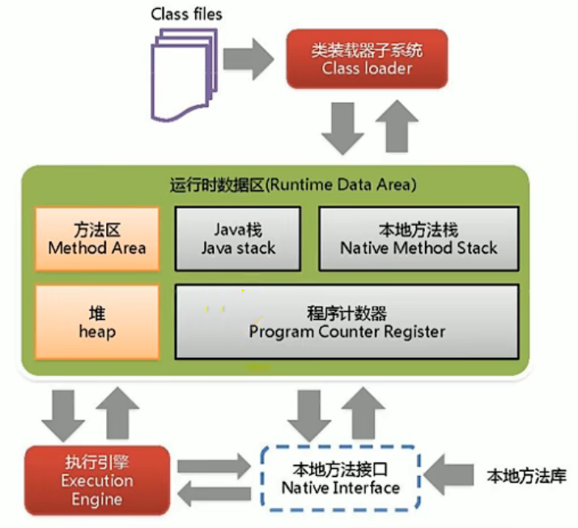
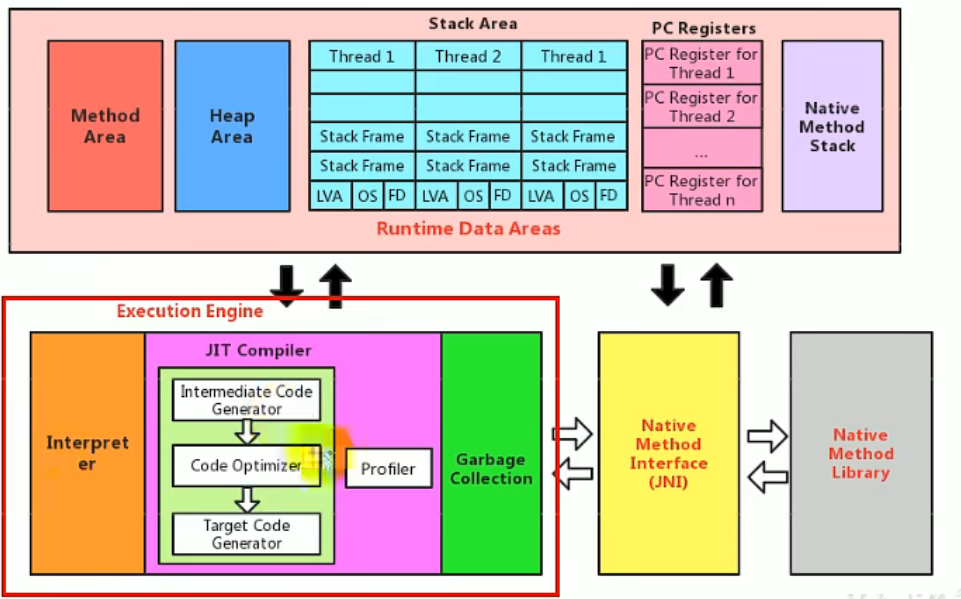
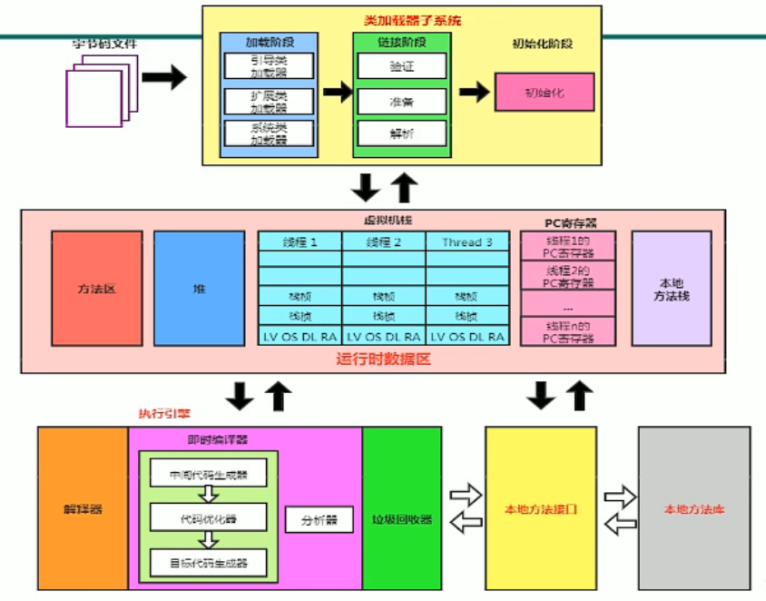
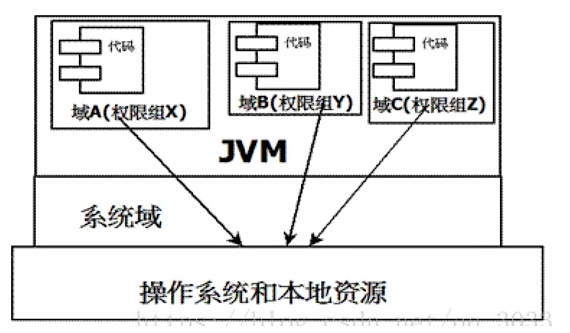
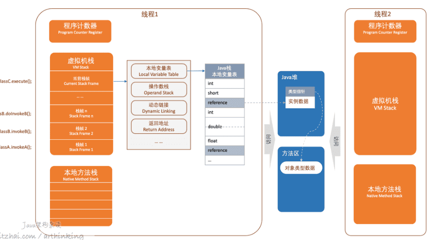

<h1 align="center">JVM</h1>

# JVM与Java体系结构

## JVM:跨语言的平台

## JAVA虚拟机
### 作用
JVM实际是二进制字节码的运行环境，负责装在字节码到其内部
### 特点
- 一次编译，到处运行
- 自动内存管理
- 自动垃圾回收功能

## JVM整体结构
**两次编译**：JAVA源码（.java）经过JAVA编译器生成字节码文件（.class），然后经过执行引擎生成汇编语言。

详细结构-执行引擎，让操作系统能够执行，即翻译成汇编语言。

## JVM架构模型
JVM-基于**栈**的指令集结构。另一种是基于**寄存器**的指令集架构。

## JVM生命周期
1. 虚拟机的启动
   通过引导类加载器创建一个初始类来完成的。
2. 虚拟机的执行
   - 一个运行中的Java虚拟机有一个清晰的任务：执行Java程序
   - 随着程序的执行而执行，随着程序的结束而结束
   - 执行一个Java程序可以看做是在执行一个Java虚拟机的进程
3. 虚拟机的退出

# 类加载子系统

## 双亲委派机制
为了确保安全。采用向上委派，向下加载的顺序。如果bootstrap里有类，则执行bootstrap类，忽略application和extention类。
application -> extention -> bootstrap（最终执行）。

**类加载步骤**：
1. 类加载器收到类加载的请求
2. 将这个请求向上委托给父类加载器去宛城，一直向上委托，直到引导类加载器
3. 引导类加载器检查是否能够加载当前类，能加载就结束，使用当前加载器，否则，抛出异常，通过子加载器进行加载。
4. 重复步骤3

## 沙箱安全机制

组成沙箱的基本组件：
- 字节码校验器：确保Java类文件遵循java规范（即语法）。
- 类加载器
    - 防止恶意代码干涉善意代码（双亲委派机制）
    - 守护了被信任的类库边界
    - 将代码归入保护域

凡是加了`native`关键字的，java都访问不到，属于本地方法(JNI)，用c语言写的。调用`native`方法会进入本地方法栈。java可以通过使用本地方法接口，调用本地方法。

## PC寄存器
程序计数器：Program Counter Register
每个线程都有一个程序计数器，是线程私有的，用来指向方法区中的方法字节码（用来存储指向下一条指令的地址，也就是即将要执行的指令代码），在执行引擎读取下一条指令，是一个非常小的内存空间。

## 方法区
Method Area 方法区
方法区是被所有线程共享，所有字段和方法字节码，以及一些特殊方法，如构造方法，接口代码也在此定义。简单说，所有**定义**的方法的信息都保存在该区域。此区域属于**共享区间**。
**静态变量、常量、类信息（构造方法，接口定义）、运行时的常量池存放在方法区，但是实例变量存放在堆内存中，和方法区无关。**

## 栈
栈：栈内存，主管程序的运行，生命周期和线程同步。一个线程对应一个栈
线程结束，栈内存也就是释放，对于栈来说，不存在垃圾回收问题。一旦线程结束，栈就Over。

栈运行原理：栈帧

## 堆
堆（Heap）：一个JVM只有一个堆内存，堆内存的大小是可以调节的。所有线程公用一个栈。
类加载器读取了类文件后，一般会把类，方法，常量，变量等所有引用类型的真实对象放入堆中。
堆内存会细分为三个区域：
1. 新生代(young)（伊甸园）区
   - 伊甸园
        内存区满了会触发`Minor GC`。
   - 幸存区0区
   - 幸存区1区
   >当一个对象在经过15次(可调)Minor GC后仍然存活，则转移至老生代区。

2. 老生代区(old)
   
3. 永久代区(Permanent)->JDK8元空间

## JProfiler
VM-options设置:
- Xms: 设置初始化内存分配大小
- Xmx: 设置最大分配内存 默认1/4

## GC：垃圾回收
GC垃圾回收触发机制
1. `Minor GC`:只对新生代进行垃圾收集；
2. `Major GC`:只对老年代进行垃圾收集。需要注意的是 Major GC 在有的语境中也用于指代整堆收集；
3. `Mix GC`:对整个新生代和部分老年代进行垃圾收集。
4. `Full GC`:收集整个 Java 堆和方法区。

GC垃圾回收，主要在伊甸园区和老年代区
### GC算法
1. 引用计数法（使用较少，性能不足）
    对象每用一次，计数+1。到达一定次数则清除
2. 复制法（使用场景：对象存活度较低的区：如新生代区）
    1. 每次GC都会将Eden活的对象移到幸存区中。一旦Eden区被GC后，就会是空的。
    2. 幸存的对象会被复制到另一个Eden区中。
    - 优点：减少内存碎片，保证有一片连续的内存空间。
    - 缺点：浪费了内存空间，多了一半空间永远是空的。而且需要复制。
3. 标记清除法（使用场景：）
    1. 扫描：扫描对象，对活着的对象进行标记
    2. 清除：再次扫描，对没有标记的对象进行清除
    - 优点：不需要额外的空间。
    - 缺点：两次扫描，严重浪费时间，会产生内存碎片。
4. 标记压缩：
    在标记清除的基础上多了一次扫描，向一端移动存活的对象。
    - 优点：防止内存碎片产生
    - 缺点：多了移动成本
5. 标记清除压缩：
    1. 先标记清除几次
    2. 再实施标记压缩

### 算法总结：
- 内存效率：复制算法>标记清除算法>标记压缩算法（时间复杂度）
- 内存整齐度：复制算法=标记压缩算法>标记清除算法
- 内存利用率：标记压缩算法=标记清除算法>复制算法

**算法应用**
- **新生代**：存活率低。因此用**复制**算法
- **老生代**：区域大，存活率高，因此**标记清除+标记压缩**混合实现。

# JMM
JMM（Java Memory Model）定义了线程工作内存和主内存之间的抽象关系：线程之间的共享变量存储在主内存(Main Memory)中，每个线程都有一个私有的本地内存(Local Memory)。