<h1 align="center">JVM</h1>

- [1. JVM与Java体系结构](#1-jvm与java体系结构)
  - [1.1. JVM:跨语言的平台](#11-jvm跨语言的平台)
  - [1.2. JAVA虚拟机](#12-java虚拟机)
    - [1.2.1. 作用](#121-作用)
    - [1.2.2. 特点](#122-特点)
  - [1.3. JVM整体结构](#13-jvm整体结构)
  - [1.4. JVM架构模型](#14-jvm架构模型)
  - [1.5. JVM生命周期](#15-jvm生命周期)
- [2. 类加载子系统](#2-类加载子系统)
  - [2.1. 类加载器](#21-类加载器)
    - [2.1.1. 双亲委派机制](#211-双亲委派机制)
  - [2.2. 类加载过程](#22-类加载过程)
    - [2.2.1. 加载](#221-加载)
    - [2.2.2. 链接](#222-链接)
    - [2.2.3. 初始化](#223-初始化)
    - [2.2.4. 卸载](#224-卸载)
  - [2.3. 沙箱安全机制](#23-沙箱安全机制)
- [3. JVM内存区域](#3-jvm内存区域)
  - [3.1. PC寄存器](#31-pc寄存器)
  - [3.2. 方法区](#32-方法区)
  - [3.3. 栈](#33-栈)
    - [3.3.1. 虚拟机栈](#331-虚拟机栈)
      - [3.3.1.1. 栈帧](#3311-栈帧)
    - [3.3.2. 本地方法栈](#332-本地方法栈)
  - [3.4. 堆](#34-堆)
- [4. GC：垃圾回收](#4-gc垃圾回收)
  - [4.1. GC算法](#41-gc算法)
    - [4.1.1. 算法总结：](#411-算法总结)
  - [引用类型](#引用类型)
  - [4.2. 垃圾收集器](#42-垃圾收集器)
    - [4.2.1. Serial 收集器](#421-serial-收集器)
    - [4.2.2. CMS收集器](#422-cms收集器)
    - [4.2.3. G1 收集器](#423-g1-收集器)
      - [4.2.3.1. 分区Region:化整为零](#4231-分区region化整为零)
      - [4.2.3.2. G1垃圾回收过程](#4232-g1垃圾回收过程)
        - [4.2.3.2.1. 年轻代GC](#42321-年轻代gc)
      - [4.2.3.3. 并发标记过程](#4233-并发标记过程)
      - [4.2.3.4. 混合回收](#4234-混合回收)
      - [4.2.3.5. G1 Remembered Set](#4235-g1-remembered-set)
      - [4.2.3.6. G1调优步骤](#4236-g1调优步骤)
    - [4.2.4. 收集器小结](#424-收集器小结)
- [5. StringTable](#5-stringtable)
  - [5.1. String基本特性](#51-string基本特性)
  - [5.2. 字符串拼接操作](#52-字符串拼接操作)
- [6. 对象的实例化](#6-对象的实例化)
  - [6.1. 创建对象的步骤](#61-创建对象的步骤)
  - [6.2. 对象的内存布局](#62-对象的内存布局)
  - [6.3. 对象的访问定位](#63-对象的访问定位)
- [7. JVM调优](#7-jvm调优)
  - [7.1. JProfiler](#71-jprofiler)
- [8. JMM](#8-jmm)
# 1. JVM与Java体系结构

## 1.1. JVM:跨语言的平台
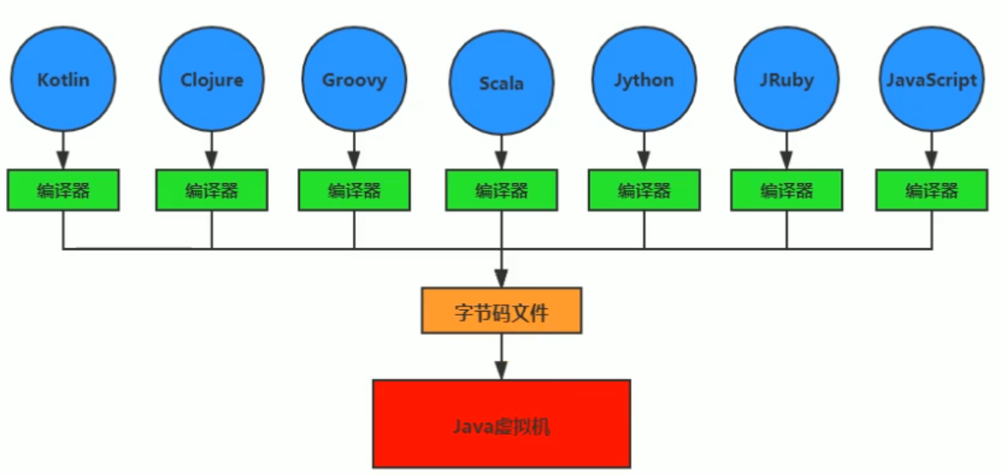

## 1.2. JAVA虚拟机
### 1.2.1. 作用
JVM实际是二进制字节码的运行环境，负责装在字节码到其内部
### 1.2.2. 特点
- 一次编译，到处运行
- 自动内存管理
- 自动垃圾回收功能

## 1.3. JVM整体结构
**两次编译**：JAVA源码（.java）经过JAVA编译器生成字节码文件（.class），然后经过执行引擎生成汇编语言。
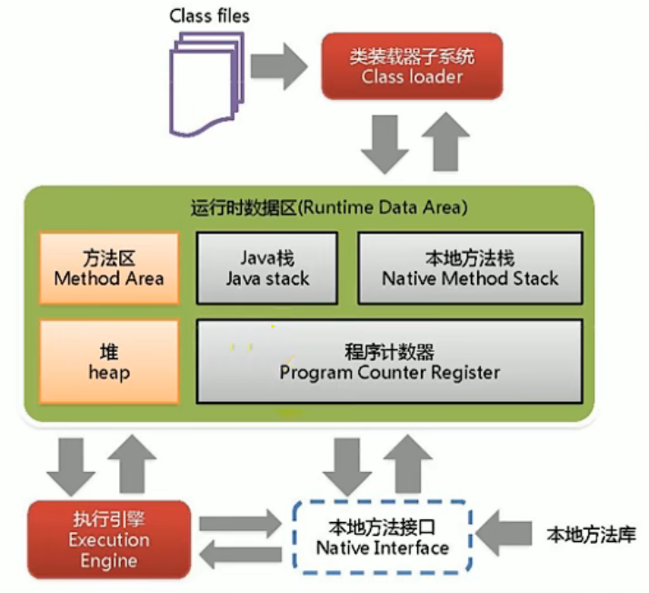
详细结构-执行引擎，让操作系统能够执行，即翻译成汇编语言。
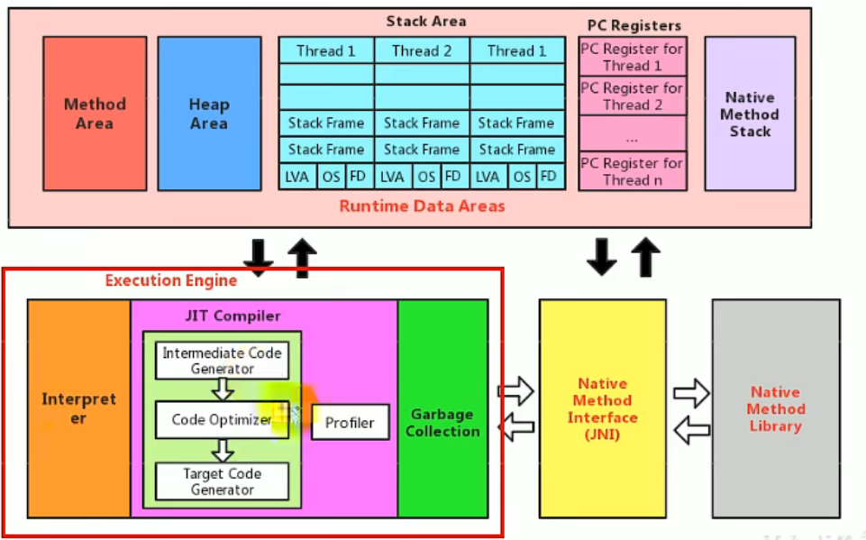
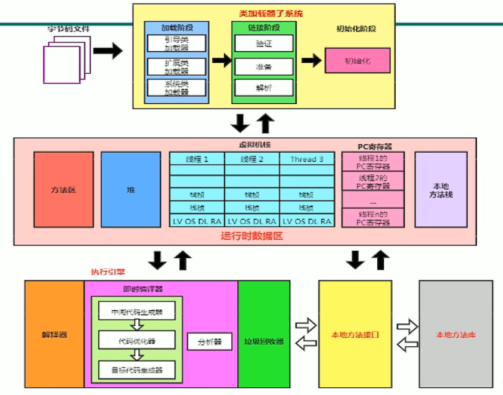

## 1.4. JVM架构模型
JVM-基于**栈**的指令集结构。另一种是基于**寄存器**的指令集架构。

## 1.5. JVM生命周期
1. 虚拟机的启动
   通过引导类加载器创建一个初始类来完成的。
2. 虚拟机的执行
   - 一个运行中的Java虚拟机有一个清晰的任务：执行Java程序
   - 随着程序的执行而执行，随着程序的结束而结束
   - 执行一个Java程序可以看做是在执行一个Java虚拟机的进程
3. 虚拟机的退出

# 2. 类加载子系统

## 2.1. 类加载器
- `BootstrapClassLoader`(启动类加载器) ：最顶层的加载类，由 C++实现，负责加载 %JAVA_HOME%/lib目录下的 jar 包和类或者被 -Xbootclasspath参数指定的路径中的所有类。
- `ExtensionClassLoader`(扩展类加载器) ：主要负责加载 %JRE_HOME%/lib/ext 目录下的 jar 包和类，或被 java.ext.dirs 系统变量所指定的路径下的 jar 包。
- `AppClassLoader`(应用程序类加载器/系统类加载器) ：面向我们用户的加载器，负责加载当前应用 classpath 下的所有 jar 包和类。

### 2.1.1. 双亲委派机制
为了确保安全。采用向上委派，向下加载的顺序。如果bootstrap里有类，则执行bootstrap类，忽略application和extention类。
> application -> extention -> bootstrap（最终执行）。

双亲委派模型保证了 Java 程序的稳定运行，可以避免类的重复加载（JVM 区分不同类的方式不仅仅根据类名，相同的类文件被不同的类加载器加载产生的是两个不同的类），也保证了 Java 的核心 API 不被篡改。

**类加载步骤**：
1. 类加载器收到类加载的请求
2. 将这个请求向上委托给父类加载器去完成，一直向上委托，直到引导类加载器
3. 引导类加载器检查是否能够加载当前类，能加载就结束，使用当前加载器，否则，抛出异常，通过子加载器进行加载。
4. 重复步骤3

## 2.2. 类加载过程
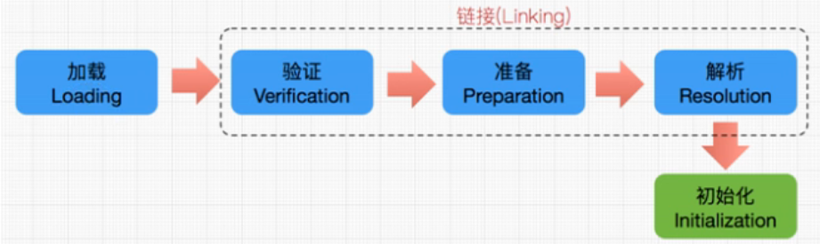
### 2.2.1. 加载
1. 通过一个类的全限定名获取定义此类的二进制字节流
2. 将这个字节流所代表的静态存储结构转化为方法区的运行时数据结构
3. **在内存中生成一个代表着各类的java.lang.Class对象**，作为方法区这个类的各种数据的访问入口。

### 2.2.2. 链接
1. 验证：包括文件格式验证，元数据验证，字节码验证，符号引用验证。
2. 准备：为所有类变量（即用`static`修饰的成员变量）赋初始值。**不包括实例变量**。
3. 解析：将常量池内的符号引用转换为直接引用。

### 2.2.3. 初始化
- 初始化阶段就是执行`<clinit>`初始化的过程。会将显式初始化和静态代码块初始化都调用。
- 不需要用户自己定义`<clinit>`，子类的调用需要在父类之后。
- `<clinit>`不同于类构造器。
- 虚拟机必须保证一个类的`<clinit>()`方法在多线程下被同步加锁。

**只有以下六种情况会执行类的初始化**
1. 当遇到 `new` 、 `getstatic`、`putstatic` 或 `invokestatic` 这 4 条直接码指令时，比如 new 一个类，读取一个静态字段(未被 final 修饰)、或调用一个类的静态方法时。
    - 当 jvm 执行 `new` 指令时会初始化类。即当程序**创建一个类的实例对象**。
    - 当 jvm 执行 `getstatic` 指令时会初始化类。即程序**访问类的静态变量**(不是静态常量(用`final`修饰的)，常量会被加载到运行时常量池)。
    - 当 jvm 执行 `putstatic` 指令时会初始化类。即程序给类的**静态变量赋值**。
    - 当 jvm 执行 `invokestatic` 指令时会初始化类。即程序调用类的**静态方法**。
2. 使用 java.lang.reflect 包的方法对类进行**反射调用**时如 Class.forname("..."), newInstance() 等等。如果类没初始化，需要触发其初始化。
3. 初始化一个类，如果其父类还未初始化，则先触发该**父类的初始化**。
4. 当虚拟机启动时，用户需要定义一个要执行的**主类** (包含 main 方法的那个类)，虚拟机会先初始化这个类。
5. MethodHandle 和 VarHandle 可以看作是轻量级的**反射调用**机制，而要想使用这 2 个调用， 就必须先使用 findStaticVarHandle 来初始化要调用的类。
6. 当一个接口中定义了 JDK8 新加入的默认方法（被 **default 关键字修饰的接口**方法）时，如果有这个接口的实现类发生了初始化，那该接口要在其之前被初始化。

### 2.2.4. 卸载
卸载类即该类的 Class 对象被 GC。卸载类需要满足 3 个要求:
1. 该类的所有的实例对象都已被 GC，也就是说堆不存在该类的实例对象。
2. 该类没有在其他任何地方被引用
3. 该类的类加载器的实例已被 GC
> jdk 自带的 `BootstrapClassLoader`, `ExtClassLoader`, `AppClassLoader` 负责加载 jdk 提供的类，所以它们(类加载器的实例)肯定不会被回收。使用我们**自定义加载器加载的类是可以被卸载掉**的。

## 2.3. 沙箱安全机制
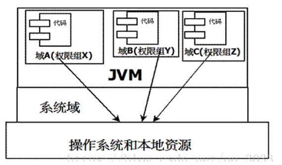
组成沙箱的基本组件：
- 字节码校验器：确保Java类文件遵循java规范（即语法）。
- 类加载器
    - 防止恶意代码干涉善意代码（双亲委派机制）
    - 守护了被信任的类库边界
    - 将代码归入保护域

凡是加了`native`关键字的，java都访问不到，属于本地方法(JNI)，用c语言写的。调用`native`方法会进入本地方法栈。java可以通过使用本地方法接口，调用本地方法。

# 3. JVM内存区域
## 3.1. PC寄存器
程序计数器：Program Counter Register
每个线程都有一个程序计数器，是线程私有的，用来指向方法区中的方法字节码（用来存储指向下一条指令的地址，也就是即将要执行的指令代码），在执行引擎读取下一条指令，是一个非常小的内存空间。

## 3.2. 方法区
Method Area 方法区-JDK1.8之后转移到**元空间**了。
方法区是被所有线程共享，所有字段和方法字节码，以及一些特殊方法，如构造方法，接口代码也在此定义。简单说，所有**定义**的方法的信息都保存在该区域。此区域属于**共享区间**。
**静态变量、常量、类信息（构造方法，接口定义）、运行时的常量池存放在方法区，但是实例变量存放在堆内存中，和方法区无关。**

## 3.3. 栈
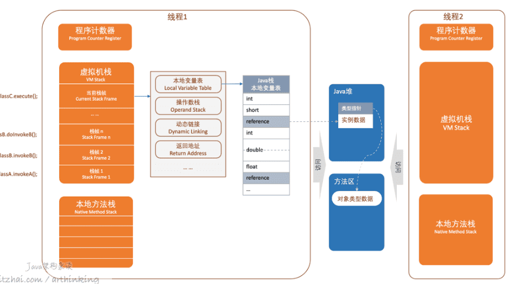
### 3.3.1. 虚拟机栈
栈：栈内存，主管程序的运行，生命周期和线程同步。一个线程对应一个栈
线程结束，栈内存也就是释放，对于栈来说，不存在垃圾回收问题。一旦线程结束，栈就Over。
栈运行原理：**栈帧**。一个栈帧对应着一次Java方法调用。
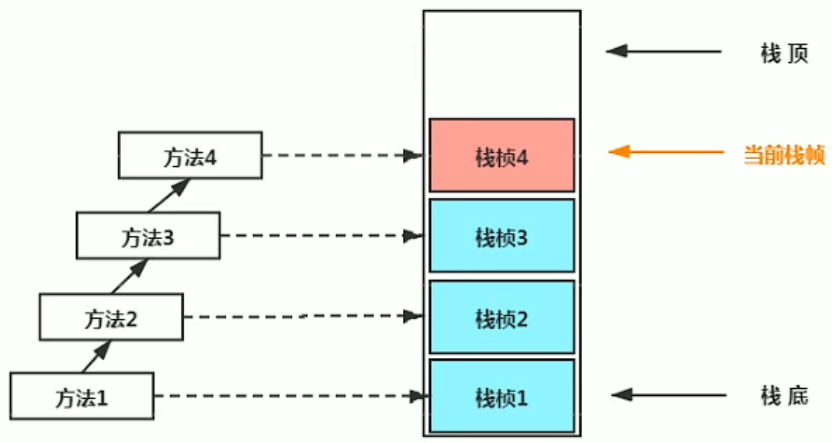

#### 3.3.1.1. 栈帧
每个栈帧存储着：
- 局部变量表：比如对象引用和基本类型数据
  - 局部变量表是建立在线程私有区域中的，因此不存在数据不安全问题
  - 局部变量表所需的容量大小是在编译期确定下来的
- 操作数栈：存储方法的返回值
- 动态链接：调用方法的地址。会将符号引用转换为直接引用
- 返回地址：方法正常退出`return`或异常退出`throw`的定义

### 3.3.2. 本地方法栈

## 3.4. 堆
堆（Heap）：一个JVM只有一个堆内存，堆内存的大小是可以调节的。所有线程公用一个栈。
类加载器读取了类文件后，一般会把类，方法，常量，变量等所有引用类型的真实对象放入堆中。
堆内存会细分为三个区域：
1. 新生代(young)（伊甸园）区
   - 伊甸园
        内存区满了会触发`Minor GC`。
   - 幸存区0区
   - 幸存区1区
   >当一个对象在经过15次(可调)Minor GC后仍然存活，则转移至老生代区。

2. 老生代区(old)
   
3. 永久代区(Permanent)->JDK8元空间

# 4. GC：垃圾回收
GC垃圾回收触发机制
1. `Minor GC`:只对新生代进行垃圾收集；
2. `Major GC`:只对老年代进行垃圾收集。需要注意的是 Major GC 在有的语境中也用于指代整堆收集；
3. `Mix GC`:对整个新生代和部分老年代进行垃圾收集。
4. `Full GC`:收集整个 Java 堆和方法区。

GC垃圾回收，主要在伊甸园区和老年代区
## 4.1. GC算法
**标记算法：**
1. 引用计数法（使用较少，性能不足，无法处理**循环引用**）
    对每个对象保存一个整型的**引用计数器属性，用于纪录对象被引用情况**。只要有一个对象引用A，则引用计数+1；当引用失效时，引用计数-1。只要对象A的引用计数器的值为0，即表示对象A不可能再被使用，可进行回收。
2. 可达性分析
   这个算法的基本思想就是通过一系列的称为 “GC Roots” 的对象作为起点，从这些节点开始向下搜索，节点所走过的路径称为引用链，当一个对象到 GC Roots 没有任何引用链相连的话，则证明此对象是不可用的，需要被回收。
    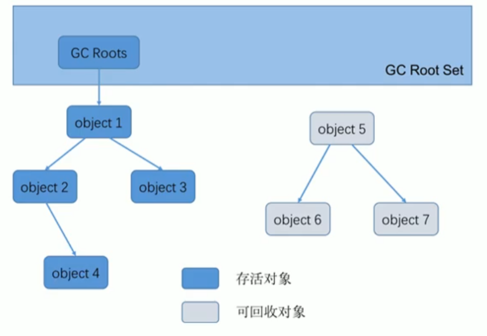
   **GC Roots**
    - 虚拟机栈(栈帧中的本地变量表)中**引用**的对象
        比如各个线程被调用的方法中使用到的参数、局部变量等。
    - 本地方法栈JNI(Native 方法)中**引用**的对象
    - 方法区中类静态属性**引用**的对象
        比如Java类的引用类型静态变量
    - 方法区中常量**引用**的对象
        比如字符串常量池中的引用
    - 所有被**同步锁**持有的对象
    - Java虚拟机内部的**引用**
    > 由于Root采用栈方式存放变量和指针，所以如果一个**指针**，它保存了堆内存里面的对象，但是自己又不存放在堆内存中，那么它就是一个Root。
    

**清除算法**
1. **复制法**（使用场景：对象存活度较低的区：如新生代区）
    1. 每次GC都会将Eden活的对象移到幸存区中。一旦Eden区被GC后，就会是空的。
    2. 幸存的对象会被复制到另一个Eden区中。
    - 优点：减少内存碎片，保证有一片连续的内存空间。
    - 缺点：浪费了内存空间，多了一半空间永远是空的。而且需要复制。
2. **标记清除法**（使用场景：）
    1. 扫描：扫描对象，对活着的对象进行标记
    2. 清除：再次扫描，对没有标记的对象进行清除
    - 优点：不需要额外的空间。
    - 缺点：两次扫描，严重浪费时间，会产生内存碎片。
3. **标记整理**：
    在标记清除的基础上多了一次扫描，向一端移动存活的对象。标记过程仍然与“标记-清除”算法一样，但后续步骤不是直接对可回收对象回收，而是让所有存活的对象向一端移动，然后直接清理掉端边界以外的内存。
    - 优点：防止内存碎片产生
    - 缺点：多了移动成本

### 4.1.1. 算法总结：
- 内存效率：复制算法>标记清除算法>标记压缩算法（时间复杂度）
- 内存整齐度：复制算法=标记压缩算法>标记清除算法
- 内存利用率：标记压缩算法=标记清除算法>复制算法

**算法应用**
- **新生代**：存活率低。因此用**标记复制**算法
- **老生代**：区域大，存活率高，因此**标记清除+标记整理**混合实现。

## 引用类型
1. 强引用
    默认引用类型，对应的类为`Reference`。当`new`一个对象的使用，会指向强引用。**垃圾回收器绝不会回收它**。当内存空间不足，Java 虚拟机宁愿抛出 `OutOfMemoryError` 错误，使程序异常终止，也不会靠随意回收具有强引用的对象来解决内存不足问题。只有对象指向`null`时，才会被垃圾回收。
2. 软引用
    对应的类为`SoftReference`。如果内存空间足够，垃圾回收器就不会回收它，**如果内存空间不足了，就会回收这些对象的内存**。只要垃圾回收器没有回收它，该对象就可以被程序使用。软引用可用来实现内存敏感的高速缓存。
    软引用可以和一个引用队列（ReferenceQueue）联合使用，如果软引用所引用的对象被垃圾回收，JAVA 虚拟机就会把这个软引用加入到与之关联的引用队列中。
3. 弱引用
    对应的类为`WeakReferenct`。弱引用与软引用的区别在于：只具有弱引用的对象拥有更短暂的生命周期。在垃圾回收器线程扫描它所管辖的内存区域的过程中，一旦发现了只具有弱引用的对象，不管当前内存空间足够与否，都会回收它的内存。不过，由于垃圾回收器是一个优先级很低的线程， 因此不一定会很快发现那些只具有弱引用的对象。
    弱引用可以和一个引用队列（ReferenceQueue）联合使用，如果弱引用所引用的对象被垃圾回收，Java 虚拟机就会把这个弱引用加入到与之关联的引用队列中。
4. 虚引用
    对应的类为`PhantomReference`。 **虚引用必须和引用队列（ReferenceQueue）联合使用。虚引用主要用来跟踪对象被垃圾回收的活动**。当垃圾回收器准备回收一个对象时，如果发现它还有虚引用，就会在回收对象的内存之前，把这个虚引用加入到与之关联的引用队列中。程序可以通过判断引用队列中是否已经加入了虚引用，来了解被引用的对象是否将要被垃圾回收。程序如果发现某个虚引用已经被加入到引用队列，那么就可以在所引用的对象的内存被回收之前采取必要的行动。
    在程序设计中一般很少使用弱引用与虚引用，使用软引用的情况较多，这是因为**软引用可以加速 JVM 对垃圾内存的回收速度，可以维护系统的运行安全，防止内存溢出（OutOfMemory）等问题的产生。**

## 4.2. 垃圾收集器
**所有的垃圾收集器的目的都是朝着减少STW的目的而前进**
并行和并发概念补充：
- **并行**（Parallel） ：指多条垃圾收集线程并行工作，但此时用户线程仍然处于等待状态。
- **并发**（Concurrent）：指用户线程与垃圾收集线程同时执行（但不一定是并行，可能会交替执行），用户程序在继续运行，而垃圾收集器运行在另一个 CPU 上。

### 4.2.1. Serial 收集器
- Serial 收集器：它只会使用一条垃圾收集线程去完成垃圾收集工作，更重要的是它在进行垃圾收集工作的时候必须暂停其他所有的工作线程.对于运行在 **Client** 模式下的虚拟机来说是个不错的选择。下图为Serial 收集器示意:
    
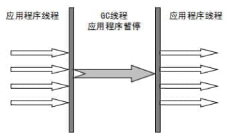

- ParNew收集器：Serial 收集器的**多线程**版本。是许多运行在 **Server** 模式下的虚拟机的首要选择，除了 Serial 收集器外，只有它能与 CMS 收集器配合工作。
- Parallel Scavenge 收集器：关注点是**吞吐量**（高效率的利用 CPU）。CMS 等垃圾收集器的关注点更多的是用户线程的**停顿时间**（提高用户体验）。所谓**吞吐量就是 CPU 中用于运行用户代码的时间与 CPU 总消耗时间的比值**。

### 4.2.2. CMS收集器
CMS（Concurrent Mark Sweep）收集器是一种以获取**最短回收停顿时间**为目标的收集器。它非常符合在注重**用户体验**的应用上使用。它第一次实现了让垃圾收集线程与用户线程（基本上）**同时工作**。CMS 收集器是一种 “**标记-清除**”算法实现的，整个过程分为四个步骤：
1. **初始标记** (Initial-Mark)：暂停所有的其他线程，并记录下**直接与 root 相连**的对象，速度很快；
2. **并发标记** (Concurrent-Mark)：同时开启 GC 和用户线程，用一个闭包结构去**记录可达对象**。但在这个阶段结束，这个闭包结构并不能保证包含当前所有的可达对象。因为用户线程可能会不断的更新引用域，所以 GC 线程无法保证可达性分析的实时性。所以这个算法里会跟踪记录这些发生引用更新的地方。
3. **重新标记** (Remark)：重新标记阶段就是为了**修正**并发标记期间因为用户程序继续运行而导致标记产生**变动**的那一部分对象的标记记录。也就是**通过GC roots 查找新标记的对象，防止被清除掉**。这个阶段的停顿时间一般会比初始标记阶段的时间稍长，远远比并发标记阶段时间短。
4. **并发清除** (Concurrent-Sweep)：开启用户线程，同时 GC 线程开始对未标记的区域做**清扫**。宁可浪费不可错杀。

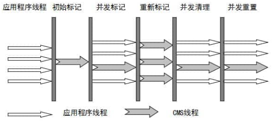

CMS收集器流程

- **优点：**
    1. **并发收集**
    2. **低延迟**
- **缺点：**
    1. **会产生内存碎片**。
    2. **CMS收集器对CPU资源非常敏感**。在并发阶段，它虽然不会对用户线程产生影响，但是会因为占用了一部分线程而导致应用程序变慢，**总吞吐量变低**。
    3. **无法处理浮动垃圾**。如果在**并发标记阶段产生了新的垃圾对象**，CMS将无法对这些垃圾对象进行标记，最终会导致这些新产生的垃圾对象没有被及时回收。**宁可放过，不可错杀**。
    4. JDK9已被标记为弃用。

### 4.2.3. G1 收集器
G1 (Garbage-First) 是一款面向**服务器**的垃圾收集器,主要针对配备**多核**及大容量内存的机器. 以极高概率**满足 GC 停顿时间要求的同时,还具备高吞吐量性能特征.**
- **并行与并发**：
  - 并行性：G1在回收期间，可以有多个GC线程同时工作，能充分利用CPU多核环境下的硬件优势，此时用户线程`Stop the World`。
  - 并发性：G1拥有和应用程序交替执行的能力，部分工作可以合应用程序同时执行，因此，一般来说，不会在整个回收阶段发生完全阻塞应用程序的情况。
- **分代收集**：虽然 G1 可以不需要其他收集器配合就能独立管理整个 GC 堆，但是还是保留了分代的概念。G1能够同时兼顾新生代和老生代，而且不要求整个Eden区、新生代、老生代是连续的。
- **空间整合**：与 CMS 的“标记-清理”算法不同，G1 从整体来看是基于“**标记-整理**”算法实现的收集器；从局部上来看是基于“标记-复制”算法实现的。
- **可预测的停顿**：这是 G1 相对于 CMS 的另一个大优势，降低停顿时间是 G1 和 CMS 共同的关注点，但 G1 除了追求低停顿外，还能建立可预测的停顿时间模型，能让使用者**明确指定G1在一个长度为 M 毫秒的时间片段内进行收集**。相比CMS GC，G1未必能做到CMS在最好情况下的延时停顿，但是最差情况要好很多。

G1 收集器在后台维护了一个**优先列表**，每次根据允许的收集时间，优先选择**回收价值最大**的`Region`(这也就是它的名字 Garbage-First 的由来) 。这种使用 Region 划分内存空间以及有优先级的区域回收方式，保证了 G1 收集器在有限时间内可以尽可能高的收集效率（把内存化整为零）。

#### 4.2.3.1. 分区Region:化整为零
G1收集器会将整个Java堆划分为约2048个大小相同的独立Region块。每个块的大小在1MB-32MB之间，且为2的N次幂。可以通过`-XX:G1HeapRegionSize`设定。所有的Region大小相同，且在JVM生命周期内不会被改变。
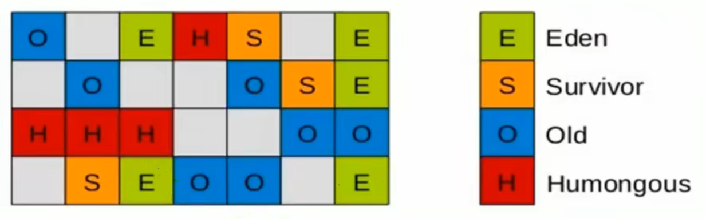
- 一个region有可能属于Eden,survivor或者old/Tenured内存区域。
- Humongous用来存储大对象。如果对象超过0.5个region大小，则存入H区(可看做老年代)。

#### 4.2.3.2. G1垃圾回收过程
- **年轻代GC**(young GC)。**当年轻代的Eden区用尽时开始young GC**。G1的young GC是一个并行的独占式的收集器，会暂停所有应用程序线程，启动多线程执行年轻代回收。然后从年轻代区间移动存活对象到survivor区间或者老年区间，也有可能两个区间都涉及。
- **老年代并发标记过程**(Concurrent Marking)。当**堆内存达到一定值**（默认**45%**）时，开启老年代并发标记过程。**标记完成立马开始混合回收过程**。
- **混合回收**(Mixed GC)。G1 GC从老年区间移动存活对象到空闲区间，这些空闲区间也就成为了老年代的一部分。与其他GC不同，**G1的老年代回收器不需要整个老年代被回收，一次只需扫描/回收一小部分老年代的region即可**。同时，这个老年代Region是和年轻代一起被回收的。
- **Full GC**。G1的失败保护机制，只在对GC的评估失败时发生。其为单线程，独占式，高强度的强力回收。要对JVM调优尽量避免触发Full GC。

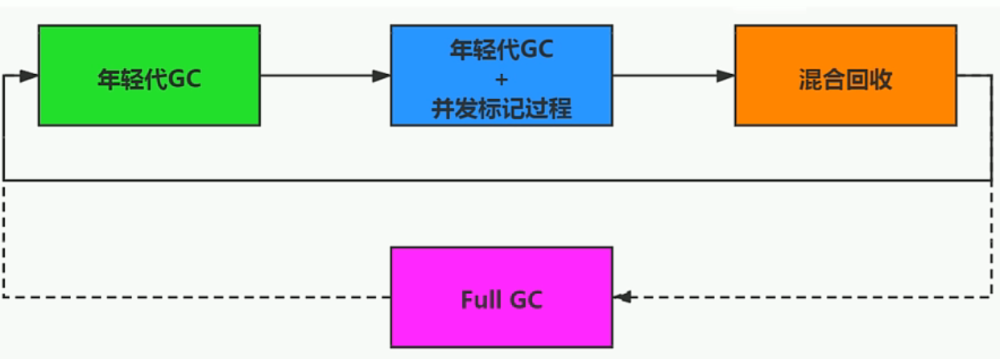

##### 4.2.3.2.1. 年轻代GC
1. 扫描根
   根是指static变量指向的对象，正在执行的方法调用链条上的局部变量等。根引用连同RSet纪录的外部引用作为扫描存活对象的入口
2. 更新RSet
   RSet可以准确的反应老年代对所在的内存分段中对象的引用
3. 处理RSet
   识别被老年代对象指向的Eden中的对象，这些被指向的Eden中的对象被认为是存活的对象
4. 复制对象
   Eden区中存活的对象会被复制到survivor区中空的内存分段。如果survivor区内存不够，则Eden区中的部分数据会直接晋升为老年代空间。
5. 处理引用
   处理强软弱虚引用。最终Eden空间的数据为空，GC停止工作。

#### 4.2.3.3. 并发标记过程
1. 初始标记阶段
   标记从根结点直接可达的对象。这个阶段的STW的，并且会触发一次young GC
2. 根区域扫描
   G1 GC扫描survivor区直接可达的老年代区域对象，并标记被引用对象。这一过程必须在young GC之前完成
3. 并发标记
   在整个堆中进行并发标记。若发现区域对象中所有对象都是垃圾，则这个区域会被立即回收。同时，并发标记过程中，会计算每个区域的对象活性（区域中存活对象的比例）
4. 再次标记
   是STW的。G1使用snapshot-at-the-beginning(SATB)
5. 独占清理
6. 并发清理阶段

#### 4.2.3.4. 混合回收
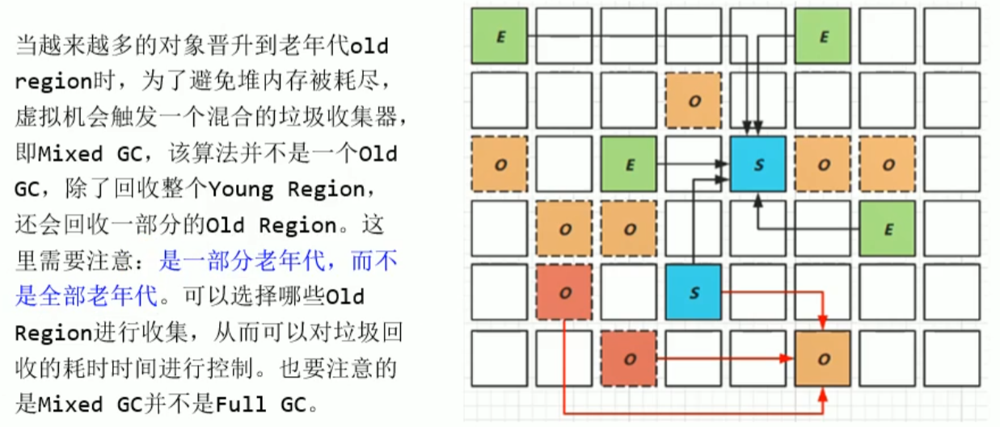

#### 4.2.3.5. G1 Remembered Set
G1回收器存在一个对象被不同区域引用的问题，如果回收新生代也扫描老年代则效率低下。
**解决方法：**
- 无论是G1还是其他分带收集器，JVM都是用Remembered Set避免全局扫描
- 每个region对应一个Remembered Set
- 当进行垃圾收集时，在GC根结点的枚举范围加入Remembered Set；就可以保证不进行全局扫描，也不会有遗漏。

#### 4.2.3.6. G1调优步骤
1. 开启G1垃圾收集器：`-XX: +UseG1GC`
2. 设置堆的最大内存：`-Xmx`
3. 设置最大的停顿时间：`-XX: MaxGCPauseMillis`

### 4.2.4. 收集器小结
- 想要最小化使用内存和并行开销，选择`Serial GC`
- 想要最大化应用程序的吞吐量，选择`Paraller GC`
- 想要最小化GC的中断或停顿时间，选择`CMS GC`
- 在小内存情况下，`CMS GC`要好于`G1 GC`。在大内存情况下，`G1 GC`要优于`CMS GC`。平衡点在`6-8GB`。

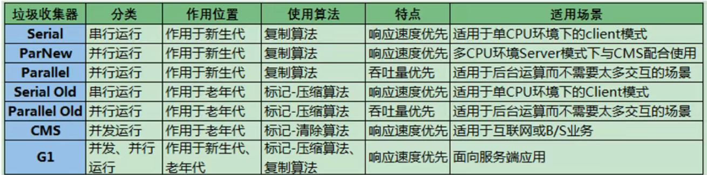

# 5. StringTable
## 5.1. String基本特性
1. 被`final`修饰，不可修改
2. 实现了`Serializable`和`Comparable`，可以被序列化和比较
3. JDK9之前是`char[]`数组，之后是`byte[]`数组
4. String的String Pool是一个固定大小的HashTable。长度可以用VM-options设置:`-XX:StringTablesize`。参数越大，哈希冲突概率越低，性能越高。

## 5.2. 字符串拼接操作
1. 常量与常量的拼接结果在常量池中，原理是编译器优化
2. 常量池不会存在相同内容的常量
3. 只要其中有一个是变量，结果就在堆中。变量拼接的原理是`StringBuilder`
4. 如果拼接的结果调用`intern()`方法，则主动将常量池中还没有的字符串对象放入池中，并返回此对象地址。

# 6. 对象的实例化
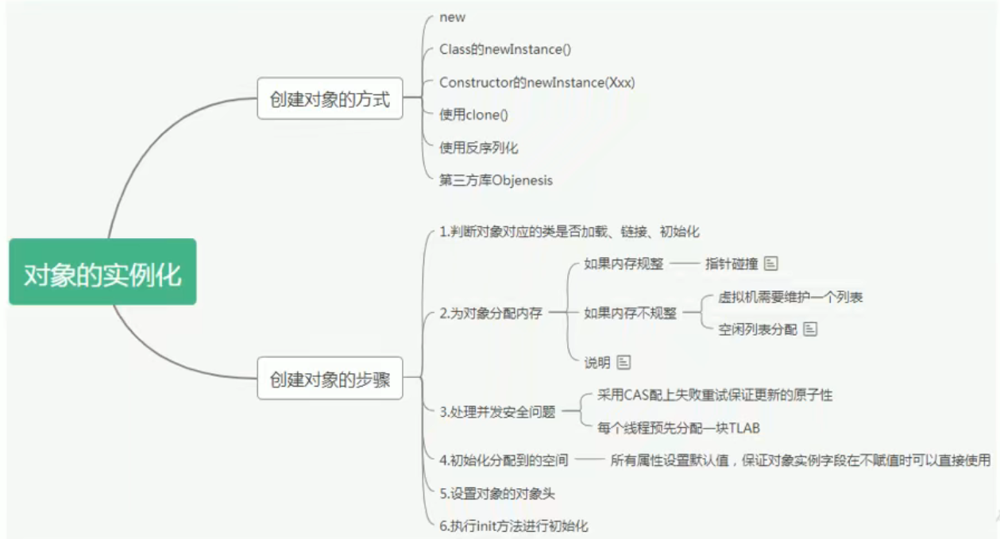
## 6.1. 创建对象的步骤
1. 判断对象对应的类是否加载、链接、初始化
   虚拟机遇到一条new指令，首先去检查这个指令的参数能否在metaspace的**运行时常量池**中定位到一个类的**符号引用**，并且检查这个符号引用代表的类是否已经被加载、解析和初始化。如果没有，则在**双亲委派**模式下，使用当前类加载器以`ClassLoader+包名+类名`为key进行查找对应的.class文件。如果没有找到文件，则抛出`ClassNotFoundException`异常，如果找到，则进行类加载，并生成对应的class类对象。
2. 为对象分配内存
    首先计算对象占用空间大小，接着在堆中划分一块内存给新对象。如果实例成员变量是引用变量，仅分配引用变量空间即可，即**4个字节**大小。
3. 处理并发问题
4. 属性的默认初始化（零值初始化）
5. 设置对象头信息
6. 属性的显式初始化、代码块中初始化、构造器中初始化。

## 6.2. 对象的内存布局
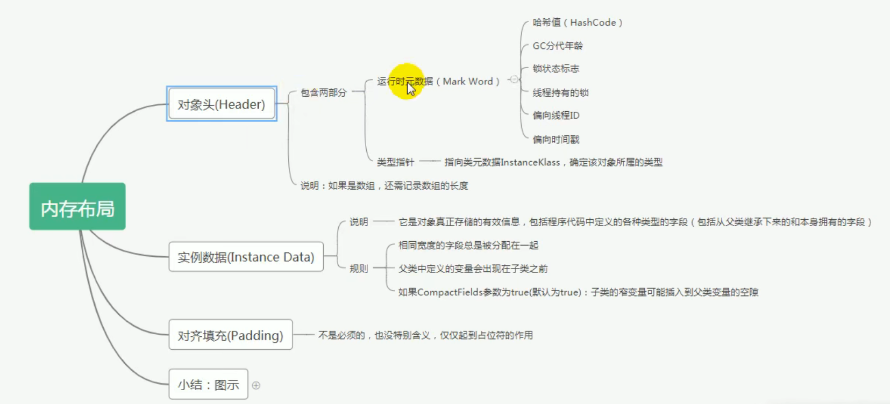
`new Customer`图示：
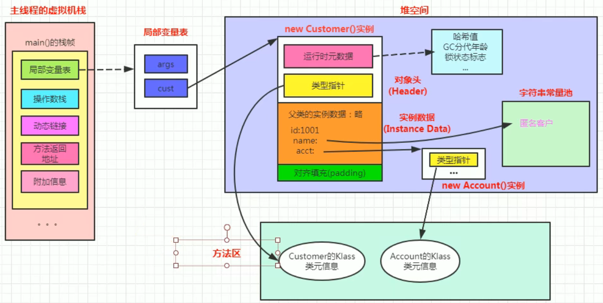

## 6.3. 对象的访问定位
`new Customer`图示就是用的**直接指针**方式
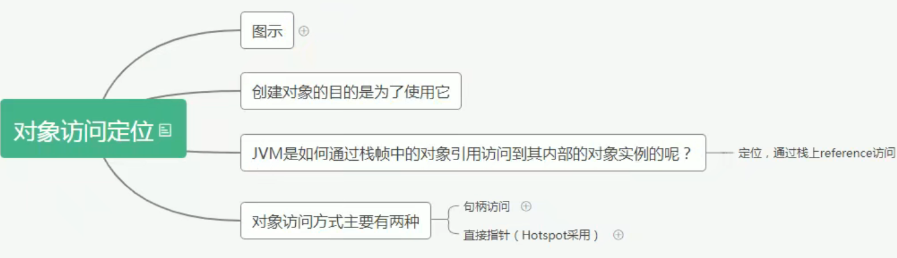
- **句柄访问**
   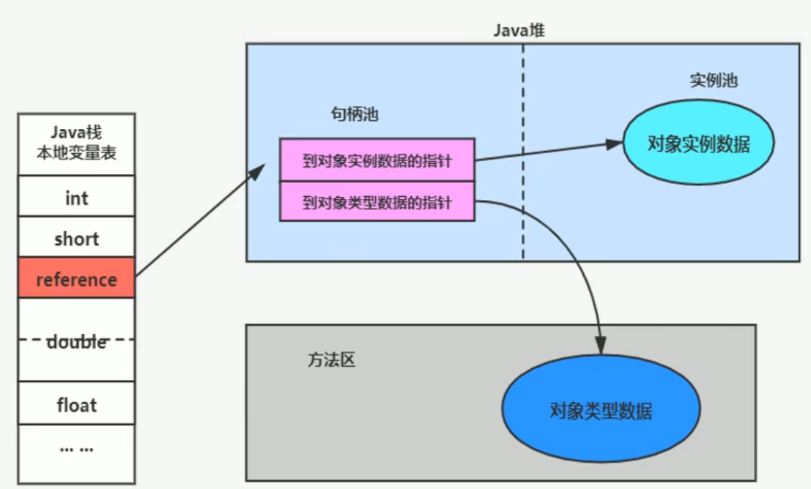
- **直接指针**
   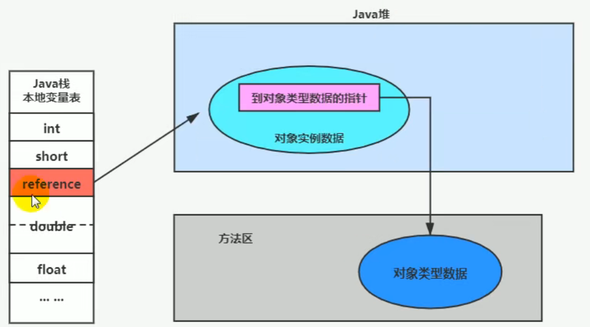
# 7. JVM调优
## 7.1. JProfiler
VM-options常用设置:
- `XX:+PrintGCDetails` 打印GC详细信息
- `Xms` 设置JVM初始化堆内存分配大小
- `Xmx` 设置JVM最大堆大小，默认物理内存的1/4
- `Xmn` 设置年轻代大小。sun公司推荐配置为整个堆的3/8
- `Xss` 设置每个线程的栈大小
- `XX:NewRatio` 设置新生代和老生代的比值。默认为2。即1:2
- `XX:SurvivorRatio` 设置新生代中Eden区和Survivor的比值。设置为4则两个Survivor区和一个Eden区的比值为2:4

# 8. JMM
JMM（Java Memory Model）定义了线程工作内存和主内存之间的抽象关系：线程之间的共享变量存储在主内存(Main Memory)中，每个线程都有一个私有的本地内存(Local Memory)。