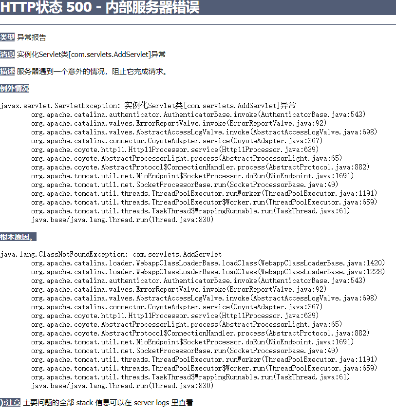
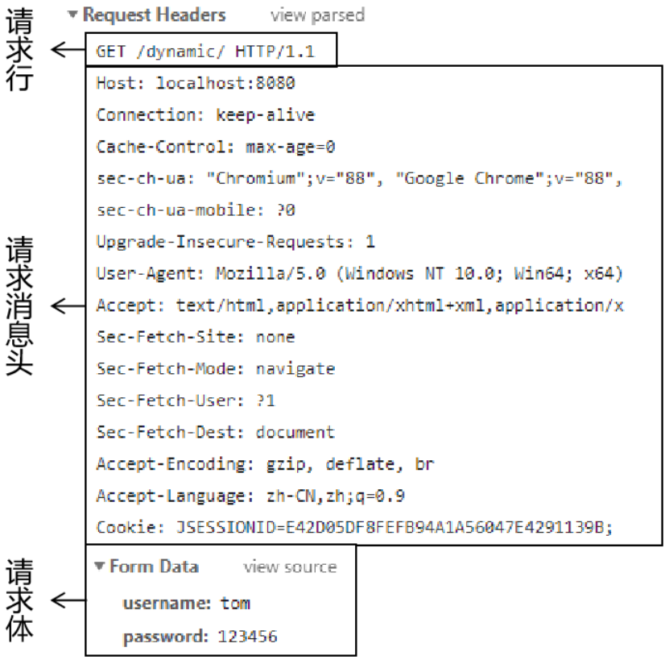
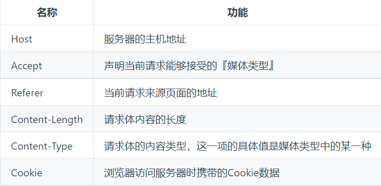
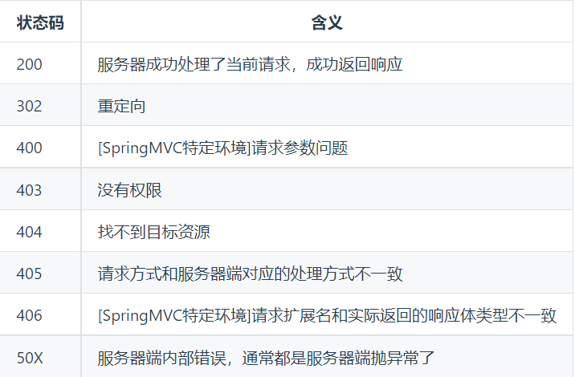
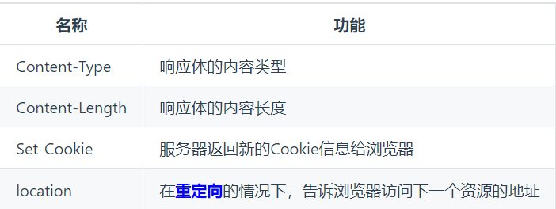
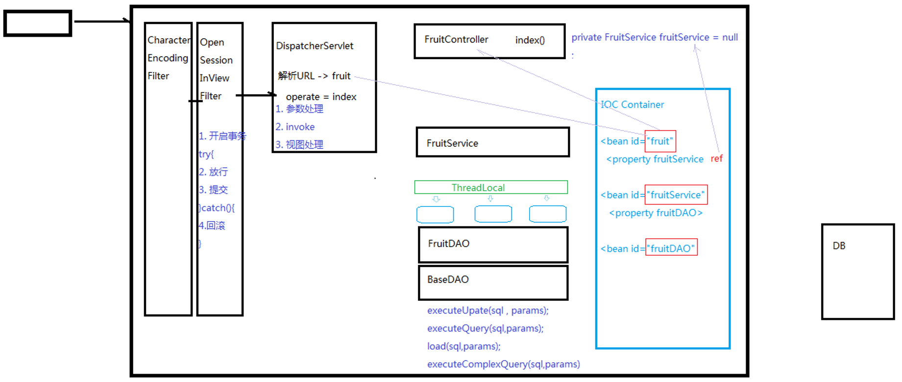

<h1 align="center" style="color: Navy">JavaWeb</h1>


- [1. css-js-html](#1-css-js-html)
  - [1.1. CSS](#11-css)
  - [1.2. JS](#12-js)
- [2. Web-Servlet](#2-web-servlet)
  - [2.1. 遇到的BUG](#21-遇到的bug)
  - [2.2. 设置编码](#22-设置编码)
  - [2.3. Servlet的继承关系](#23-servlet的继承关系)
  - [2.4. Servlet的生命周期](#24-servlet的生命周期)
  - [2.5. Servlet初始化](#25-servlet初始化)
  - [2.6. ServletContext与<context-param>](#26-servletcontext与context-param)
  - [2.7. Http协议](#27-http协议)
    - [2.7.1. 介绍](#271-介绍)
    - [2.7.2. 请求报文](#272-请求报文)
    - [2.7.3. 响应报文](#273-响应报文)
  - [2.8. 会话](#28-会话)
  - [2.9. 服务器内部转发以及客户端重定向](#29-服务器内部转发以及客户端重定向)
  - [2.10. Thymeleaf - 视图模板技术](#210-thymeleaf---视图模板技术)
  - [2.11. 保存作用域](#211-保存作用域)
  - [2.12. 路径问题](#212-路径问题)
- [3. MVC-Servlet](#3-mvc-servlet)
  - [3.1. XML](#31-xml)
    - [3.1.1. 概念](#311-概念)
  - [3.2. 业务层](#32-业务层)
  - [3.3. IOC](#33-ioc)
    - [3.3.1. 基本概念](#331-基本概念)
    - [3.3.2. 控制反转/依赖注入](#332-控制反转依赖注入)
  - [3.4. 过滤器Filter](#34-过滤器filter)
  - [3.5. 事务管理](#35-事务管理)
  - [3.6. 监听器Listener](#36-监听器listener)
- [4. Cookies](#4-cookies)
- [5. Kaptcha验证码](#5-kaptcha验证码)
- [6. 正则表达式](#6-正则表达式)
- [7. 原生Ajax](#7-原生ajax)
- [8. vue](#8-vue)
- [9. Axiox](#9-axiox)
- [10. 水果库存设计图示](#10-水果库存设计图示)
- [11. QQZone](#11-qqzone)
  - [11.1. 业务需求](#111-业务需求)
  - [11.2. 数据库设计](#112-数据库设计)
  - [11.3. 设计过程问题解决](#113-设计过程问题解决)
- [12. 书城](#12-书城)
  - [12.1. 数据库设计](#121-数据库设计)
# 1. css-js-html
## 1.1. CSS
1. CSS的角色：页面显示的美观风格
2. 基础语法：标签样式；类样式；ID样式；组合样式；嵌入式样式表；内部样式表；外部样式表
3. 盒子模型：border、margin、padding
4. 定位和浮动：position、float、DIV+CSS布局s

## 1.2. JS
1. JS是客户端（浏览器端）运行的脚本语言，语法风格和java比较类似
2. JS是弱类型的语言 var str = 99;
3. JS的函数 function hello(var num){}
4. DOM技术：
   1. 鼠标悬浮：onmouseover,event.srcElement,事件传递,parentElement,style.backgroundColor
   2. 鼠标离开：onmouseout
   3. 鼠标点击：hand/pointer,onclick,td.innerText,td.innerHTML="`<input type='text'/>`",td.firstChild.value = oldprice

# 2. Web-Servlet
## 2.1. 遇到的BUG
1. 
   问题解决：tomcat设置中deployment设置成了web-app文件夹，因此在web-app里找不到class。将deployment设置为最上层module文件即可。


## 2.2. 设置编码
1. get请求在tomcat8之后不需要设置
2. post请求编码设置（防止中文乱码）:
   ```java
   request.setCharacterEncoding("UTF-8"); //需要在接收参数之前
   ```
## 2.3. Servlet的继承关系
1. **继承关系**
- javax.servlet.Servlet接口
   - javax.servlet.GenericServlet抽象类
      - javax.servlet.servlet.HttpServlet抽象子类
2. **相关方法**
- javax.servlet.Servlet接口
  - `void init(config)`-初始化方法
  - `void service(request,response)`-服务方法
  - `void destory()`-销毁方法
- javax.servlet.GenericServlet抽象类
  - `void service(request,response)`-仍然是抽象的
- javax.servlet.servlet.HttpServlet抽象子类
  - `void service(request,response)`-不是抽象的
      1. `String method = req.getMethod()`获取请求方式(get/post)
      2. 各种`if`判断，根据请求方式不同，调用不同的do方法
3. **小结**
   1. 继承关系：HttpServlet ->GenericServlet -> Servlet
   2. Servlet核心方法：`init()`、`service()`、`destory()`

## 2.4. Servlet的生命周期
   1. 生命周期：从出生到死亡的过程，对应Servlet中的三个方法 `init()`、`service()`、`destory()`。
   2. 默认情况下：
      - 第一次接收请求时，这个Servlet会进行实例化、初始化、然后服务
      - 从第二次请求开始，每一次都是服务
      - 当容器关闭时，其中所有的servlet实例都会被销毁，调用销毁方法
   3. Servlet实例tomcat只会创建一个，所有的请求都是这个实例去相应。默认情况下，第一次请求时，tomcat才回去实例化，初始化然后再服务。**缺点：第一次请求时，耗时较长**。因此如果需要提高系统响应速度，应该设置Servlet初始化时机。
   4. Servlet的初始化时机：通过`<load-on-startup>`设置启动时机，数字越小启动优先级越高。
   5. Servlet在容器中时：单例的、线程不安全的
      - 单例：所有的请求都是同一个实例响应
      - 线程不安全：一个线程需要根据这个实例中的某个成员变量值去做逻辑判断。但是在中间某个时机，另一个线程改变了这个成员变量的值，从而导致第一个线程的执行路径发生了变化
      - 尽量不要在Servlet中定义成员变量。如果不得不定义成员变量。那需遵守：(1)**不要去修改成员变量的值**。(2)**根据成员变量值做逻辑判断**

## 2.5. Servlet初始化
如果想要在Servlet初始化时做一些准备工作，可以重写`init()`方法，可以通过如下步骤去获取初始化设置的数据
1. 获取config对象：`ServletConfig config = getServletConfig()`
2. 获取初始化参数值：`config.getInitParameter(key)`

初始化的值设置方式有：
1. 在web.xml文件中配置Servlet
   ```xml
   <servlet>
      <servlet-name>Demo01Servlet</servlet-name>
      <servlet-class>com.servlet.Demo01Servlet</servlet-class>
      <init-param>
         <param-name>hello</param-name>
         <param-value>world</param-value>
      </init-param>
   </servlet>
       <servlet-mapping>
        <servlet-name>Demo01Servlet</servlet-name>
        <url-pattern>/demo01</url-pattern>
    </servlet-mapping>
   ```
2. 通过注解的方式
   ```java
   @WebServlet(urlPatterns = {"/demo01"},initParams = {
        @WebInitParam(name ="hello",value = "world")
   })
   ```

## 2.6. ServletContext与<context-param>
1. 获取ServletContext方法
   - 在初始化方法中：`ServletContext servletContext = getServletContext()`
   - 在服务方法中：可以通过request对象获取，也可以通过session获取：`request.getServletContext()`，`session.getServletContext()`
2. 获取初始化值:
   `servletContext.getInitParameter()`

## 2.7. Http协议
### 2.7.1. 介绍
HTTP：Hyper Text Transfer Protocol超文本传输协议。HTTP最大的作用就是确定了请求和响应数据的格式。浏览器发送给服务器的数据：请求报文；服务器返回给浏览器的数据：响应报文。
### 2.7.2. 请求报文

1. 请求行
   - 请求方式
   - 访问地址
   - HTTP协议的版本
2. 请求消息头-键值对格式
   
3. 请求体
   作用：作为请求的主体，发送数据给服务器。具体来说其实就是POST请求方式下的请求参数。
   - get方式：没有请求体,但有一个`queryString`
   - post方式：有请求体,`form data`
   - json格式：有请求体,`requsest payload`

### 2.7.3. 响应报文

1. 响应状态行
   - 包含三个信息
     - HTTP协议版本
     - **响应状态码**(比如404,500)
      
     - 响应状态的说明文字(OK)
2. 响应消息头
   - 响应体的说明书。
   - 服务器端对浏览器端设置数据，例如：服务器端返回Cookie信息。
   
3. 响应体
   - HTML页面 
   - 图片
   - 视频
   - 以下载形式返回的文件
   - CSS文件
   - JavaScript文件

## 2.8. 会话
1. Http是无状态的
   - Http无状态：服务器无法判断这两次请求时同一个客户端发来的，还是不同客户端发来的。
   - 通过会话跟踪技术解决无状态问题。分配`Session ID`
2. 会话跟踪技术
   - 客户端第一次发请求给服务器时，服务器获取session，若获取不到则创建新的
   - 下次客户端给服务器发请求时，会把sessionID带给服务器，那么服务器就能获取到了。
3. session保存作用域
   - session保存作用域是和具体的某一个session对应的
   - 常用API
     - `void session.setAttribute(k,v)`
     - `void session.getAttribute(k)`
     - `void removeAttribute(k)`

## 2.9. 服务器内部转发以及客户端重定向
   1. 服务器内部转发：`request.getRequestDispatcher("...").forward(request,response)`
      - 一次请求响应的过程。对于客户端来讲，内部经过了多少次转发，客户端是不知道的
      - 地址栏无变化
   2. 客户端重定向：`response.sendRedirect("...")`
      - 两次请求响应的过程，客户端肯定知道url的变化
      - 地址栏有变化

## 2.10. Thymeleaf - 视图模板技术
1. 添加thymeleaf的jar包
2. 新建一个Servlet类viewBaseServlet
3. 在web.xml中添加配置
   - 配置前缀prefix
   - 配置后缀suffix
4. 使Servlet继承ViewBaseServlet
5. 根据逻辑视图名称得到物理视图名称
      - 此处视图名称是Index
      - 那么thymeleaf会将这个逻辑视图名称对应到物理视图名称上去
      - 逻辑视图名称： index
      - 物理视图名称： view-prefix + 逻辑视图名称 + view-suffix
6. 使用thymeleaf标签
   - th:if
   - th:unless
   - th:each
   - th:text

## 2.11. 保存作用域
原始情况下，保存作用域可以认为有四个：
- `page`（页面级别，几乎不用）
- `request`（一次请求响应范围）
- `session`（一次会话响应范围）
- `application`（一次应用程序范围）

## 2.12. 路径问题
1. 相对路径
   ```xml
   "../css/index.css" ../表示上一级目录，../../表示上上级目录
   ```
2. 绝对路径
   ```xml
   <base href="http://localhost:8080/pro10">
   <link href="css/index.css">
   ```

# 3. MVC-Servlet
## 3.1. XML
### 3.1.1. 概念
- HTML:超文本标记语言
- XML:可扩展的标记语言
- HTML是XML的一个子集

## 3.2. 业务层
1. MVC:Model(模型)、View(视图)、Controller(控制器)
   - 视图层：用于做数据展示以及和用户交互的界面
   - 控制器：能够接受客户端的请求，具体的业务功能还是需要借助模型组件来完成
   - 模型层：模型分为很多种：
     - 值对象：pojo/vo
     - 数据访问对象：DAO
     - 业务对象:BO

2. 区分**业务对象**和**数据访问对象**：
   1. DAO中的等方法都是**单精度方法**（也称细粒度方法）。即一个方法只考虑一个操作，比如添加，查询。
   2. BO中的方法属于**业务方法**，实际业务是比较复杂的，因此业务方法的粒度较粗

3. 添加业务层组件

## 3.3. IOC
### 3.3.1. 基本概念
**IOC-控制反转**（Inversion of Control）/**DI-依赖注入**（dependency injection）
1. 耦合/依赖
   依赖指一者离不开另一者。在软件系统中，**层与层**之间是存在依赖的。也称之为耦合。系统架构或设计的**原则**是：**高内聚低耦合。**
   层与层内部的组成应该是高度聚合的，而层与层之间的关系应该是低耦合的，最理想的情况0耦合。

### 3.3.2. 控制反转/依赖注入
**控制反转**
1. 之前在Servlet中，我们创建service对象， `FruitService fruitService = new FruitServiceImpl()`;
   - 这句话如果出现在servlet中的某个方法内部，那么这个fruitService的作用域（**生命周期**）应该就是这个方法级别；
   - 如果这句话出现在servlet的类中，也就是说fruitService是一个成员变量，那么这个fruitService的作用域（**生命周期**）应该就是这个servlet实例级别
2. 之后我们在applicationContext.xml中定义了这个fruitService。然后通过解析XML，产生fruitService实例，存放在beanMap中，这个beanMap在一个BeanFactory中。
   因此，我们转移（改变）了之前的service实例、dao实例等等他们的**生命周期**。控制权从程序员转移到BeanFactory。这个现象我们称之为控制反转。

**依赖注入**
1. 之前我们在控制层出现代码：`FruitService fruitService = new FruitServiceImpl()`；
   那么，控制层和service层存在**耦合**。
2. 之后，我们将代码修改成`FruitService fruitService = null`。然后，在配置文件中配置:
   ```xml
   <bean id="fruit" class="FruitController">
      <property name="fruitService" ref="fruitService"/>
   </bean>
   ```

## 3.4. 过滤器Filter
1. Filter也属于Servlet规范
2. Filter开发步骤：新建类实现Filter接口，然后实现其中的三个方法：`init()`，`doFilter`，`destory`。
   配置Filter可以用注解`@WebFilter`，或者xml文件`<filter> <filter-mapping>`
3. Filter在配置时，和servlet一样，可以使用通配符，例如：`@WebFilter("*.do")`
4. 过滤器链
   - 如果采取注解的方式进行配置，那么过滤器链拦截顺序是按照全类名的先后顺序排序的
   - 若果采取的是xml方式进行配置，那么按照配置的先后顺序进行排序

## 3.5. 事务管理
1. 涉及到的组件：
   - OpenSessionInViewFilter
   - TransactionManager
   - ThreadLocal
   - ConnUtil
   - BaseDAO
2. ThreadLocal
   - get(),set(obj)
   - ThreadLocal称之为本地线程 。 我们可以通过set方法在当前线程上存储数据、通过get方法在当前线程上获取数据

## 3.6. 监听器Listener
1. `ServletContextListener` - 监听ServletContext对象的创建和销毁的过程
2. `HttpSessionListener` - 监听HttpSession对象的创建和销毁的过程
3. `ServletRequestListener` - 监听ServletRequest对象的创建和销毁的过程
4. `ServletContextAttributeListener` - 监听ServletContext的保存作用域的改动(add,remove,replace)
5. `HttpSessionAttributeListener` - 监听HttpSession的保存作用域的改动(add,remove,replace)
6. `ServletRequestAttributeListener`- 监听ServletRequest的保存作用域的改动(add,remove,replace)
7. `HttpSessionBindingListener` - 监听某个对象在Session域中的创建与移除
8. `HttpSessionActivationListener` - 监听某个对象在Session域中的序列化和反序列化

# 4. Cookies
1. 创建Cookie对象
2. 在客户端保存Cookie
3. 设置Cookie的有效时长
   `cookie.setMaxAge(60)`，设置cookie的有效时长是60秒
   `cookie.setDomain(pattern)`
   `cookie.setPath(uri)`
4. Cookie的应用：
     - 记住用户名和密码十天 `setMaxAge(60 * 60 * 24 * 10)`
     - 十天免登录

# 5. Kaptcha验证码
导入Maven依赖
```xml
<dependency>
   <groupId>com.google.code</groupId>
   <artifactId>kaptcha</artifactId>
   <version>2.3.2</version>
</dependency>
```

1. 为什么需要验证码
2. kaptcha如何使用:
   - 添加jar
   - 在web.xml文件中注册KaptchaServlet，并设置验证码图片的相关属性
   ```xml
   <servlet>
      <servlet-name>KaptchaServlet</servlet-name>
      <servlet-class>com.google.code.kaptcha.servlet.KaptchaServlet</servlet-class>
      <init-param>
         <param-name>kapacha.img.width</param-name>
         <param-value>100</param-value>
      </init-param>
      <init-param>
         <param-name>kapacha.img.height</param-name>
         <param-value>30</param-value>
      </init-param>
      <init-param>
         <param-name>kapacha.textproducer.font.size</param-name>
         <param-value>18</param-value>
      </init-param>
   </servlet>
   <servlet-mapping>
      <servlet-name>KaptchaServlet</servlet-name>
      <url-pattern>/kaptcha.jpg</url-pattern>
   </servlet-mapping>
   ```
   - 在html页面上编写一个img标签，然后设置src等于KaptchaServlet对应的url-pattern
3. kaptcha验证码图片的各个属性在常量接口：Constants中
4. KaptchaServlet在生成验证码图片时，会同时将验证码信息保存到session中。因此，我们在注册请求时，首先将用户文本框中输入的验证码值和session中保存的值进行比较，相等，则进行注册。

# 6. 正则表达式
1. 正则表达式的使用三步骤：
   1. 定义正则表达式对象
      正则表达式定义有两个方式：
      1. 对象形式
         `var reg = new RegExp("abc")`
      2. 直接量形式
         `var reg = /abc/`
      3. 匹配模式：
      - g 全局匹配
      - i 忽略大小写匹配
      - m 多行匹配
      - gim这三个可以组合使用，不区分先后顺序
         例如： `var reg = /abc/gim` , `var reg = new RegExp("abc","gim")`;
   2. 定义待校验的字符串
   3. 校验
2. 元字符
   . , \w , \W , \s , \S , \d , \D , \b , ^ , $

3. []表示集合
   - [abc] 表示 a或者b或者c
   - [^abc] 表示取反，只要不是a不是b不是c就匹配
   - [a-c] 表示a到c这个范围匹配

4. 出现的次数
   - \* 表示多次 （0 ~ n ）
   - \+ 至少一次 ( >=1 )
   - ? 最多一次 (0 ~ 1)
   - {n} 出现n次
   - {n,} 出现n次或者多次
   - {n,m} 出现n到m次

# 7. 原生Ajax
      Ajax : 异步的JavaScript and XML
      目的： 用来发送异步的请求，然后当服务器给我响应的时候再进行回调操作
      好处： 提高用户体验；局部刷新：降低服务器负担、减轻浏览器压力、减轻网络带宽压力
第一步： 客户端发送异步请求；并绑定对结果处理的回调函数
1) `<input type="text" name="uname" onblur="ckUname()"/>`
2) 定义ckUname方法：
   - 创建XMLHttpRequest对象
   - XMLHttpRequest对象操作步骤：
   - `open(url,"GET",true)`
   - onreadyStateChange 设置回调
   - send() 发送请求
   - 在回调函数中需要判断XMLHttpRequest对象的状态:
   `readyState(0-4)` , `status(200)`

第二步：服务器端做校验，然后将校验结果响应给客户端

# 8. vue
1. `{{}}` - 相当于`innerText`
2. `v-bind:attr` 绑定属性值。例如，`v-bind:value` - 绑定value值。简写:`:value`
3. `v-model` 双向绑定。`v-model:value`, 简写：`v-model`
4. `v-if` , `v-else` , `v-show`
  `v-if`和`v-else`之间不能有其他的节点
  `v-show`是通过样式表`display`来控制节点是否显示
5. `v-for` 迭代。`v-for={fruit in fruitList}`
6. `v-on` 绑定事件
7. 其他：
     - `trim`:去除首尾空格, `split()`, `join()`
     - `watch`表示侦听属性
     - 生命周期

# 9. Axiox
> Axios是Ajax的一个框架,简化Ajax操作

Axios执行Ajax操作的步骤：
1. 添加并引入axios的js文件

2. 1. 客户端向服务器端异步发送普通参数值
   - 基本格式： axios().then().catch()
   - 示例：
   ```js
   axios({
      method:"POST",
      url:"....",
      params:{
         uname:"lina",
         pwd:"ok"
      }
   })
   .then(function(value){}) //成功响应时执行的回调        value.data可以获取到服务器响应内容
   .catch(function(reason){}); //有异常时执行的回调 reason.response.data可以获取到响应的内容
   reason.message / reason.stack 可以查看错误的信息
   ```

2. 2. 客户端向服务器发送JSON格式的数据
   - 什么是JSON：JSON是一种数据格式，XML也是一种数据格式
   XML格式表示两个学员信息的代码如下：
      ```xml
      <students>
         <student sid="s001">
            <sname>jim</sname>
            <age>18</age>
         </student>
         <student sid="s002">
            <sname>tom</sname>
            <age>19</age>
         </student>
      </students>
      ```
      JSON格式表示两个学员信息的代码如下：
      `[{sid:"s001",age:18},{sid:"s002",age:19}]`
      - JSON表达数据更简洁，更能够节约网络带宽
      - 客户端发送JSON格式的数据给服务器端
      1. 客户端中params需要修改成：data:
      2. 服务器获取参数值不再是 `request.getParameter()`...而是：
            ```java
            StringBuffer stringBuffer = new StringBuffer("");
            BufferedReader bufferedReader = request.getReader();
            String str = null ;
            while((str=bufferedReader.readLine())!=null){
               stringBuffer.append(str);
            }
            str = stringBuffer.toString() ;
            ```
      3. 我们会发现 str的内容如下：
         `{"uname":"lina","pwd":"ok"}`

   -  服务器端给客户端响应JSON格式的字符串，然后客户端需要将字符串转化成js Object


# 10. 水果库存设计图示


# 11. QQZone

## 11.1. 业务需求
1. 用户登录
2. 登录成功，显示主界面。左侧显示好友列表；上端显示欢迎词。如果不是自己的空间，显示超链接：返回自己的空间；下端显示日志列表
3. 查看日志详情：
   - 日志本身的信息（作者头像、昵称、日志标题、日志内容、日志的日期）
   - 回复列表（回复者的头像、昵称、回复内容、回复日期）
   - 主人回复信息
4. 删除日志
5. 删除特定回复
6. 删除特定主人回复
7. 添加日志、添加回复、添加主人回复
8. 点击左侧好友链接，进入好友的空间

## 11.2. 数据库设计
1. 抽取实体 : 用户登录信息、用户详情信息 、 日志 、 回贴  、 主人回复
2. 分析其中的属性：
   - 用户登录信息：账号、密码、头像、昵称
   - 用户详情信息：真实姓名、星座、血型、邮箱、手机号.....
   - 日志：标题、内容、日期、作者
   - 回复：内容、日期、作者、日志
   - 主人回复：内容、日期、作者、回复
3. 分析实体之间的关系
   - 用户登录信息 ： 用户详情信息      1：1 PK
   - 用户 ： 日志                   1：N
   - 日志 ： 回复                   1：N
   - 回复 ： 主人回复                1：1 UK
   - 用户 ： 好友                   M ： N


## 11.3. 设计过程问题解决
1. top.html页面显示登录者昵称、判断是否是自己的空间
   1. 显示登录者昵称： `${session.userBasic.nickName}`
   2. 判断是否是自己的空间: `${session.userBasic.id!=session.friend.id}`
     如果不是期望的效果，首先考虑将两者的id都显示出来

2. 点击左侧的好友链接，进入好友空间
   1. 根据id获取指定userBasic信息，查询这个userBasic的topicList，然后覆盖friend对应的value
   2. main页面应该展示friend中的topicList，而不是userBasic中的topicList
   3. 跳转后，在左侧（left）中显示整个index页面
      - 问题：在left页面显示整个index布局
      - 解决：给超链接添加target属性：`target="_top"` 保证在顶层窗口显示整个index页面

   4. top.html页面需要修改： "欢迎进入`${session.friend}`"
      top.html页面的返回自己空间的超链接需要修改：
      ```xml
      <a th:href="@{|/user.do?operate=friend&id=${session.userBasic.id}|}" target="_top">
      ```

3. 日志详情页面实现
   1. 已知topic的id，需要根据topic的id获取特定topic
   2. 获取这个topic关联的所有的回复
   3. 如果某个回复有主人回复，需要查询出来
   - 在TopicController中获取指定的topic
   - 具体这个topic中关联多少个Reply，由ReplyService内部实现
   4. 获取到的topic中的author只有id，那么需要在topicService的getTopic方法中封装，在查询topic本身信息时，同时调用userBasicService中的获取userBasic方法，给author属性赋值
   5. 同理，在reply类中也有author，而且这个author也是只有id，那么我们也需要根据id查询得到author，最后设置关联

4. 删除回复
   1. 如果回复有关联的主人回复，需要先删除主人回复
   2. 删除回复
   Cannot delete or update a parent row: a foreign key constraint fails
   (`qqzonedb`.`t_host_reply`, CONSTRAINT `FK_host_reply` FOREIGN KEY (`reply`) REFERENCES `t_reply` (`id`))
    我们在删除回复表记录时，发现删除失败，原因是：在主人回复表中仍然有记录引用待删除的回复这条记录
    如果需要删除主表数据，需要首先删除子表数据

5. 删除日志
   1. 删除日志，首先需要考虑是否有关联的回复
   2. 删除回复，首先需要考虑是否有关联的主人回复
   3. 另外，如果不是自己的空间，则不能删除日志

# 12. 书城

## 12.1. 数据库设计
 1. 实体分析
    - 图书                Book
    - 用户                User
    - 订单                OrderBean
    - 订单详情             OrderItem
    - 购物车项             CartItem
 2. 实体属性分析
    - 图书 : 书名、作者、价格、销量、库存、封面、状态
    - 用户 : 用户名、密码、邮箱
    - 订单 : 订单编号、订单日期、订单金额、订单数量、订单状态、用户
    - 订单详情 : 图书、数量、所属订单
    - 购物车项 : 图书、数量、所属用户


