<h1 align="center" style="color: Navy">RabbitMQ</h1>

- [1. RabbitMQ使用](#1-rabbitmq使用)
- [2. 消息队列](#2-消息队列)
  - [2.1. 四大核心概念](#21-四大核心概念)
  - [2.2. RabbitMQ 核心部分](#22-rabbitmq-核心部分)
- [3. Work Queues](#3-work-queues)
  - [3.1. 消息应答](#31-消息应答)
  - [3.2. RabbitMQ持久化](#32-rabbitmq持久化)
    - [3.2.1. 队列持久化](#321-队列持久化)
    - [3.2.2. 消息持久化](#322-消息持久化)
    - [3.2.3. 不公平分发](#323-不公平分发)
    - [3.2.4. 预取值](#324-预取值)
- [4. 发布确认](#4-发布确认)
  - [4.1. 发布确认原理](#41-发布确认原理)
  - [4.2. 发布确认的策略](#42-发布确认的策略)
    - [4.2.1. 单个确认发布](#421-单个确认发布)
    - [4.2.2. 批量确认发布](#422-批量确认发布)
    - [4.2.3. 异步确认发布](#423-异步确认发布)
- [5. 交换机](#5-交换机)
  - [5.1. 基础知识](#51-基础知识)
  - [5.2. 绑定](#52-绑定)
  - [5.3. Fanout(扇出)](#53-fanout扇出)
  - [5.4. Direct exchange(直连)](#54-direct-exchange直连)
  - [5.5. Topics(主题)](#55-topics主题)
  - [5.6. Header(头)](#56-header头)
- [6. 死信队列](#6-死信队列)
  - [6.1. 定义](#61-定义)
  - [6.2. 来源](#62-来源)
  - [6.3. 死信应用](#63-死信应用)
- [7. 延迟队列](#7-延迟队列)
  - [7.1. 使用场景](#71-使用场景)
  - [7.2. 队列TTL](#72-队列ttl)
  - [7.3. 延迟队列优化](#73-延迟队列优化)
  - [7.4. RabbitMQ 插件实现延迟队列](#74-rabbitmq-插件实现延迟队列)
    - [7.4.1. 插件安装](#741-插件安装)
    - [7.4.2. 使用插件完成延迟队列](#742-使用插件完成延迟队列)
  - [7.5. 总结](#75-总结)
- [8. 发布确认高级](#8-发布确认高级)
  - [8.1. 发布确认SpringBoot版本](#81-发布确认springboot版本)
    - [8.1.1. 确认机制方案](#811-确认机制方案)
    - [8.1.2. 代码架构图](#812-代码架构图)
    - [8.1.3. 配置文件](#813-配置文件)
    - [8.1.4. 编写配置类](#814-编写配置类)
  - [8.2. 回退消息](#82-回退消息)
    - [8.2.1. Mandatory 参数](#821-mandatory-参数)
  - [8.3. 备份交换机](#83-备份交换机)
    - [8.3.1. 代码架构图](#831-代码架构图)
    - [8.3.2. 代码实现](#832-代码实现)
- [9. RabbitMQ其他知识点](#9-rabbitmq其他知识点)
  - [9.1. 幂等性](#91-幂等性)
  - [9.2. 优先级队列](#92-优先级队列)
    - [9.2.1. 使用场景](#921-使用场景)
    - [9.2.2. 添加方法](#922-添加方法)
  - [9.3. 惰性队列](#93-惰性队列)
    - [9.3.1. 惰性队列声明：](#931-惰性队列声明)
- [10. RabbitMQ集群](#10-rabbitmq集群)
  - [10.1. 搭建集群](#101-搭建集群)
  - [10.2. 镜像队列](#102-镜像队列)
  - [10.3. Haproxy+Keepalive 实现高可用负载均衡](#103-haproxykeepalive-实现高可用负载均衡)
    - [10.3.1. 整体架构图](#1031-整体架构图)
    - [10.3.2. Haproxy 实现负载均衡](#1032-haproxy-实现负载均衡)
    - [10.3.3. Keepalived 实现双机(主备)热备](#1033-keepalived-实现双机主备热备)
  - [10.4. Federation Exchange](#104-federation-exchange)
  - [10.5. Federation Queue](#105-federation-queue)
  - [10.6. Shovel](#106-shovel)

# 1. RabbitMQ使用
1. 启动
    ```shell
    /sbin/service rabbitmq-server start 
    ```
2. 查看服务状态
    ```shell
    /sbin/service rabbitmq-server status
    ```
3. 开启web管理插件
    ```shell
    rabbitmq-plugins enable rabbitmq_management
    ```
4. 关闭服务
   ```shell
   /sbin/service rabbitmq-server stop 
   ```
5. 网页登录
   用户名：admin 密码123

# 2. 消息队列
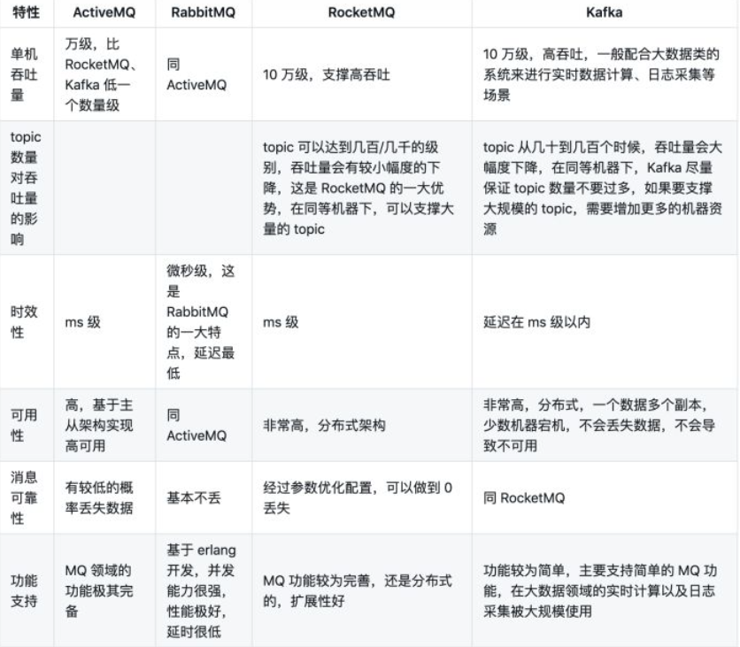
## 2.1. 四大核心概念
- 生产者
    产生数据发送消息的程序是生产者
- 交换机
    交换机是 RabbitMQ 非常重要的一个部件，一方面它接收来自生产者的消息，另一方面它将消息推送到队列中。交换机必须确切知道如何处理它接收到的消息，是将这些消息推送到特定队列还是推送到多个队列，亦或者是把消息丢弃，这个得有交换机类型决定
- 队列
    队列是 RabbitMQ 内部使用的一种数据结构，尽管消息流经 RabbitMQ 和应用程序，但它们只能存储在队列中。队列仅受主机的内存和磁盘限制的约束，本质上是一个大的消息缓冲区。许多生产者可以将消息发送到一个队列，许多消费者可以尝试从一个队列接收数据。这就是我们使用队列的方式
- 消费者
    消费与接收具有相似的含义。消费者大多时候是一个等待接收消息的程序。请注意生产者，消费者和消息中间件很多时候并不在同一机器上。同一个应用程序既可以是生产者又是可以是消费者。
## 2.2. RabbitMQ 核心部分
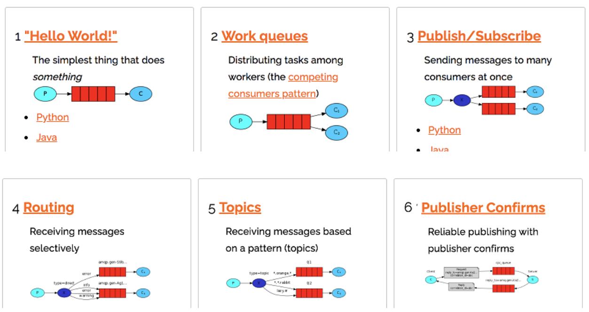


# 3. Work Queues
## 3.1. 消息应答
**消息自动重新入队**
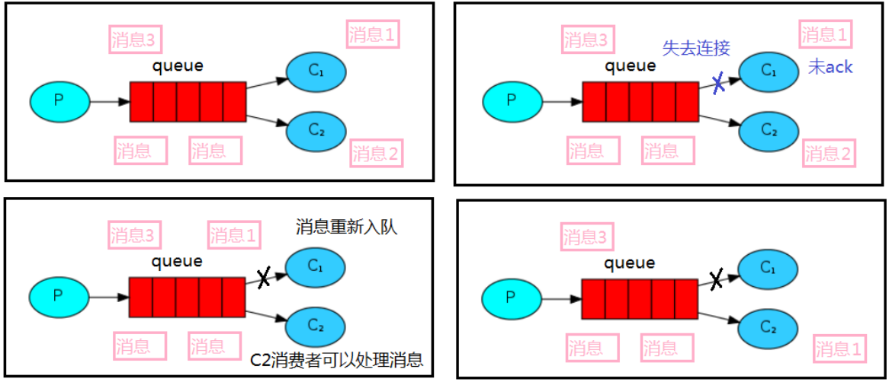
如果消费者由于某些原因失去连接(其通道已关闭，连接已关闭或 TCP 连接丢失)，导致消息未发送 ACK 确认，RabbitMQ 将了解到消息未完全处理，并将对其重新排队。如果此时其他消费者可以处理，它将很快将其重新分发给另一个消费者。这样，即使某个消费者偶尔死亡，也可以确保不会丢失任何消息
## 3.2. RabbitMQ持久化
### 3.2.1. 队列持久化
之前我们创建的队列都是非持久化的，rabbitmq 如果重启的化，该队列就会被删除掉，如果要队列实现持久化需要在声明队列的时候把 durable 参数设置为持久化
### 3.2.2. 消息持久化
要想让消息实现持久化需要在消息生产者修改代码`MessageProperties.PERSISTENT_TEXT_PLAIN` 添加这个属性。
将消息标记为持久化并不能完全保证不会丢失消息。尽管它告诉RabbitMQ 将消息保存到磁盘，但是这里依然存在当消息刚准备存储在磁盘的时候 但是还没有存储完，消息还在缓存的一个间隔点。此时并没有真正写入磁盘。持久性保证并不强，但是对于我们的简单任务队列而言，这已经绰绰有余了。如果需要更强有力的持久化策略，参考后边课件发布确认章节。

### 3.2.3. 不公平分发
在最开始的时候我们学习到 RabbitMQ 分发消息采用的轮训分发，但是在某种场景下这种策略并不是很好，比方说有两个消费者在处理任务，其中有个消费者 1 处理任务的速度非常快，而另外一个消费者 2处理速度却很慢，这个时候我们还是采用轮训分发的化就会到这处理速度快的这个消费者很大一部分时间处于空闲状态，而处理慢的那个消费者一直在干活，这种分配方式在这种情况下其实就不太好，但是RabbitMQ 并不知道这种情况它依然很公平的进行分发。
为了避免这种情况，我们可以设置参数 channel.basicQos(1);
意思就是如果这个任务我还没有处理完或者我还没有应答你，你先别分配给我，我目前只能处理一个任务，然后 rabbitmq 就会把该任务分配给没有那么忙的那个空闲消费者，当然如果所有的消费者都没有完成手上任务，队列还在不停的添加新任务，队列有可能就会遇到队列被撑满的情况，这个时候就只能添加新的 worker 或者改变其他存储任务的策略。

### 3.2.4. 预取值
通过使用 basic.qos 方法设置“预取计数”值来完成的。该值定义通道上允许的未确认消息的**最大数量**。

# 4. 发布确认
## 4.1. 发布确认原理
生产者将信道设置成 confirm 模式，一旦信道进入 confirm 模式，所有在该信道上面发布的消息都将会被指派一个唯一的 ID(从 1 开始)，一旦消息被投递到所有匹配的队列之后，broker就会发送一个确认给生产者(包含消息的唯一 ID)，这就使得生产者知道消息已经正确到达目的队列了，如果消息和队列是可持久化的，那么确认消息会在将消息写入磁盘之后发出，broker 回传给生产者的确认消息中 delivery-tag 域包含了确认消息的序列号，此外 broker 也可以设置basic.ack 的 multiple 域，表示到这个序列号之前的所有消息都已经得到了处理。
confirm 模式最大的好处在于他是异步的，一旦发布一条消息，生产者应用程序就可以在等信道返回确认的同时继续发送下一条消息，当消息最终得到确认之后，生产者应用便可以通过回调方法来处理该确认消息，如果 RabbitMQ 因为自身内部错误导致消息丢失，就会发送一条 nack 消息，生产者应用程序同样可以在回调方法中处理该 nack 消息。

## 4.2. 发布确认的策略
### 4.2.1. 单个确认发布
这是一种简单的确认方式，它是一种同步确认发布的方式，也就是发布一个消息之后只有它被确认发布，后续的消息才能继续发布,`waitForConfirmsOrDie(long)`这个方法只有在消息被确认的时候才返回，如果在指定时间范围内这个消息没有被确认那么它将抛出异常。这种确认方式有一个最大的缺点就是:发布速度特别的慢，因为如果没有确认发布的消息就会阻塞所有后续消息的发布，这种方式最多提供每秒不超过数百条发布消息的吞吐量。当然对于某些应用程序来说这可能已经足够了。

### 4.2.2. 批量确认发布
与单个等待确认消息相比，先发布一批消息然后一起确认可以极大地
提高吞吐量，当然这种方式的缺点就是:当发生故障导致发布出现问题时，不知道是哪个消息出现问题了，我们必须将整个批处理保存在内存中，以记录重要的信息而后重新发布消息。当然这种方案仍然是同步的，也一样阻塞消息的发布。

### 4.2.3. 异步确认发布
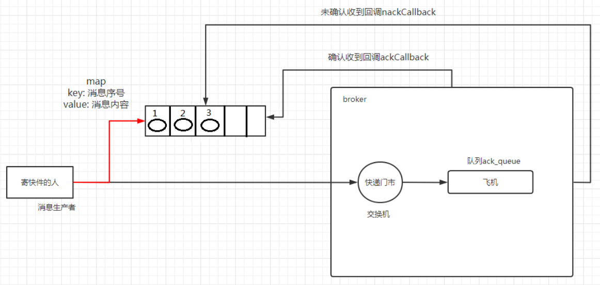
**异步确认发布**
调用信道上的监听器函数`channel.addConfirmListener(ackCallback,nackCallback);`
**处理异步未确认消息**
最好的解决的解决方案就是把未确认的消息放到一个基于内存的能被发布线程访问的队列，比如说用 ConcurrentLinkedQueue 这个队列在 confirm callbacks 与发布线程之间进行消息的传递。

# 5. 交换机
## 5.1. 基础知识
RabbitMQ 消息传递模型的核心思想是: 生产者生产的消息从不会直接发送到队列。实际上，通常生产者甚至都不知道这些消息传递传递到了哪些队列中。相反，生产者只能将消息发送到交换机(exchange)，交换机工作的内容非常简单，一方面它接收来自生产者的消息，另一方面将它们推入队列。交换机必须确切知道如何处理收到的消息。是应该把这些消息放到特定队列还是说把他们到许多队列中还是说应该丢弃它们。这就的由交换机的类型来决定。

**临时队列**
每当我们连接到 Rabbit 时，我们都需要一个全新的空队列，为此我们可以创建一个具有随机名称的队列，或者能让服务器为我们选择一个随机队列名称那就更好了。其次一旦我们断开了消费者的连接，队列将被自动删除。
```java
String queueName = channel.queueDeclare().getQueue();
```

## 5.2. 绑定
binding 其实是 exchange 和 queue 之间的桥梁，它告诉我们 exchange 和那个队列进行了绑定关系。比如说下面这张图告诉我们的就是 X 与 Q1 和 Q2 进行了绑定

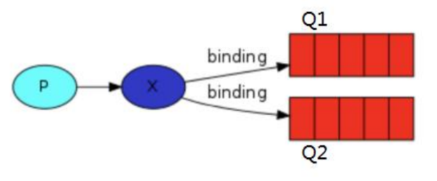

## 5.3. Fanout(扇出)
**无路由交换机**
Fanout是将接收到的所有消息**广播**到它知道的所有队列中。
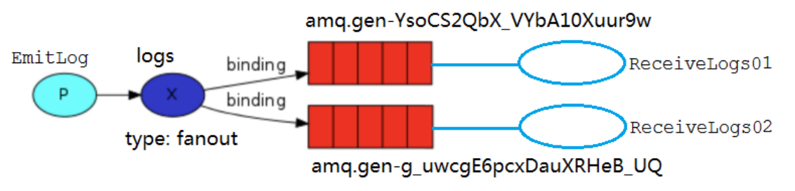

## 5.4. Direct exchange(直连)
**直接连接交换机**
队列只对它绑定的交换机的消息感兴趣。绑定用参数：routingKey 来表示也可称该参数为 `binding key`，创建绑定我们用代码:`channel.queueBind(queueName, EXCHANGE_NAME,"routingKey")`;绑定之后的意义由其交换类型决定。

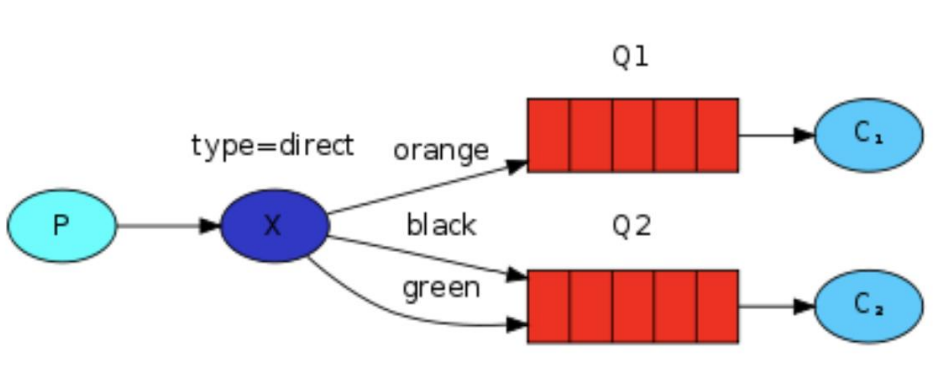

## 5.5. Topics(主题)
**主题路由匹配交换机**
发送到类型是 topic 交换机的消息的 routing_key 不能随意写，必须满足一定的要求，它必须是一个单词列表，以点号分隔开。这些单词可以是任意单词，比如说："stock.usd.nyse", "nyse.vmw", "quick.orange.rabbit".这种类型的。当然这个单词列表最多不能超过 255 个字节。
在这个规则列表中，其中有两个替换符是大家需要注意的
- *(星号)可以代替一个单词
- #(井号)可以替代零个或多个单词

## 5.6. Header(头)
header exchange(**头交换机**)和主题交换机有点相似，但是不同于主题交换机的路由是基于路由键，头交换机的路由值基于消息的header数据。主题交换机路由键只有是字符串,而头交换机可以是**整型和哈希值**。

1. 标头交换旨在用于在多个属性上路由，这些属性比路由键更容易表示为消息标头。标头交换忽略路由键属性。相反，用于路由的属性取自headers属性。如果标头的值等于绑定时指定的值，则认为消息匹配。
2. 可以使用多个标题进行匹配，将队列绑定到标题交换。在这种情况下，代理需要从应用程序开发者那里获得另一条信息，即，它是否应考虑具有任何匹配的标头的消息，或全部匹配的标头？这就是“ x-match”绑定参数的作用。当“ x-match”参数设置为“any”时，仅**一个匹配的标头值**就足够了。或者，将“ x-match”设置为“ all”要求**所有值必须匹配**。

3. 标头交换可以看作是“类固醇的直接交换”。由于它们基于标头值进行路由，因此可以将它们用作直接交换，而路由密钥不必是字符串。例如，它可以是整数或哈希（字典）。

> 请注意，以字符串x-开头的标头 将不用于评估匹配项。


# 6. 死信队列
## 6.1. 定义
一般来说，producer 将消息投递到 broker 或者直接到 queue 里了，consumer 从 queue 取出消息进行消费，但某些时候由于特定的原因导致 queue 中的某些消息无法被消费，这样的消息如果没有后续的处理，就变成了死信，有死信自然就有了死信队列。
**应用场景**：为了保证订单业务的消息数据不丢失，需要使用到 RabbitMQ 的死信队列机制，当消息消费发生异常时，将消息投入死信队列中.还有比如说: 用户在商城下单成功并点击去支付后在指定时间未支付时自动失效
## 6.2. 来源
- 消息 TTL 过期
- 队列达到最大长度(队列满了，无法再添加数据到 mq 中)
- 消息被拒绝(basic.reject 或 basic.nack)并且 requeue=false.

## 6.3. 死信应用
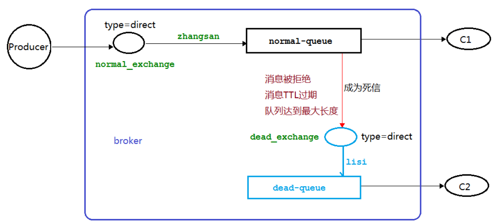

# 7. 延迟队列
延时队列,队列内部是有序的，最重要的特性就体现在它的延时属性上，延时队列中的元素是希望在指定时间到了以后或之前取出和处理，简单来说，延时队列就是用来存放需要在指定时间被处理的元素的队列。

## 7.1. 使用场景
1. 订单在十分钟之内未支付则自动取消
2. 新创建的店铺，如果在十天内都没有上传过商品，则自动发送消息提醒。
3. 用户注册成功后，如果三天内没有登陆则进行短信提醒。
4. 用户发起退款，如果三天内没有得到处理则通知相关运营人员。
5. 预定会议后，需要在预定的时间点前十分钟通知各个与会人员参加会议

## 7.2. 队列TTL
创建两个队列 QA 和 QB，两者队列 TTL 分别设置为 10S 和 40S，然后在创建一个交换机 X 和死信交换机 Y，它们的类型都是 direct，创建一个死信队列 QD，它们的绑定关系如下：
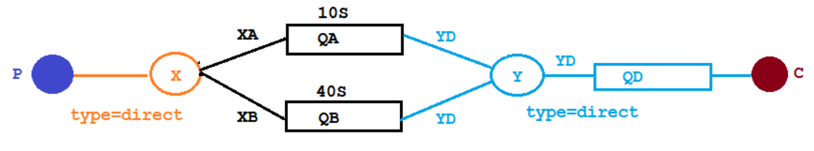
第一条消息在 10S 后变成了死信消息，然后被消费者消费掉，第二条消息在 40S 之后变成了死信消息，然后被消费掉，这样一个延时队列就打造完成了。

## 7.3. 延迟队列优化
按照上述方案，每增加一个新的时间需求，就要新增一个队列。为了避免创建大量队列，新增了一个队列 QC,绑定关系如下,该队列不设置 TTL 时间。
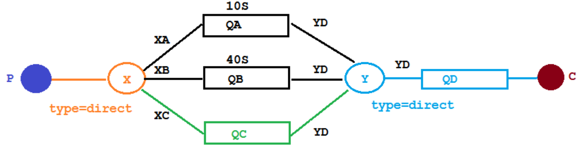
因为消息是串行被消费的，RabbitMQ 只会检查第一个消息是否过期，如果过期则丢到死信队列，如果第一个消息的延时时长很长，而第二个消息的延时时长很短，**第二个消息并不会优先得到执行**。

## 7.4. RabbitMQ 插件实现延迟队列
### 7.4.1. 插件安装
1. 在[官网](https://www.rabbitmq.com/community-plugins.html)上下载`rabbitmq_delayed_message_exchange` 插件，然后解压放置到 RabbitMQ 的插件目录。
2. 执行`rabbitmq-plugins enable rabbitmq_delayed_message_exchange`
3. 重启rabbitmq服务器：`systemctl restart rabbitmq-server`

### 7.4.2. 使用插件完成延迟队列
在这里新增了一个队列 delayed.queue,一个自定义交换机 delayed.exchange，绑定关系如下:
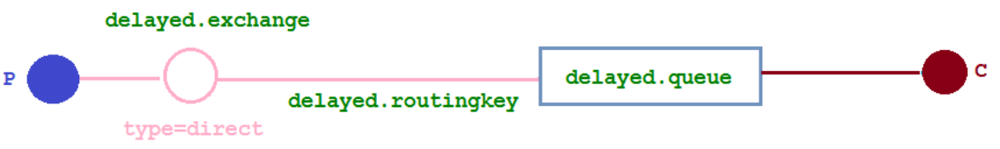
延迟控制的主体从**队列**转变为了=>**交换机**。由交换机控制延迟。
在我们自定义的交换机中，这是一种新的交换类型，该类型消息支持延迟投递机制 消息传递后并不会立即投递到目标队列中，而是存储在 **mnesia**(一个分布式数据系统)表中，当达到投递时间时，才投递到目标队列中。


## 7.5. 总结
延时队列在需要延时处理的场景下非常有用，使用 RabbitMQ 来实现延时队列可以很好的利用 RabbitMQ 的特性，如：消息可靠发送、消息可靠投递、死信队列来保障消息至少被消费一次以及未被正确处理的消息不会被丢弃。另外，通过 RabbitMQ 集群的特性，可以很好的解决单点故障问题，不会因为单个节点挂掉导致延时队列不可用或者消息丢失。
当然，延时队列还有很多其它选择，比如利用 Java 的 DelayQueue，利用 Redis 的 zset，利用 Quartz 或者利用 kafka 的时间轮，这些方式各有特点,看需要适用的场景。

# 8. 发布确认高级
在生产环境中由于一些不明原因，导致 rabbitmq 重启，在 RabbitMQ 重启期间生产者消息投递失败，导致消息丢失，需要手动处理和恢复。于是，我们开始思考，如何才能进行 RabbitMQ 的消息可靠投递呢？特别是在这样比较极端的情况，RabbitMQ 集群不可用的时候，无法投递的消息该如何处理呢
## 8.1. 发布确认SpringBoot版本
**解决交换机回调问题**
### 8.1.1. 确认机制方案
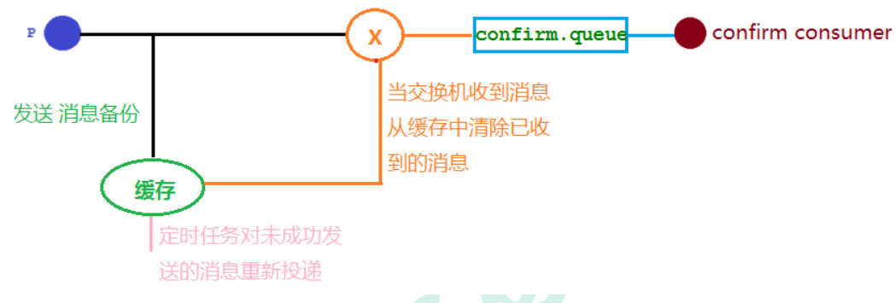
### 8.1.2. 代码架构图
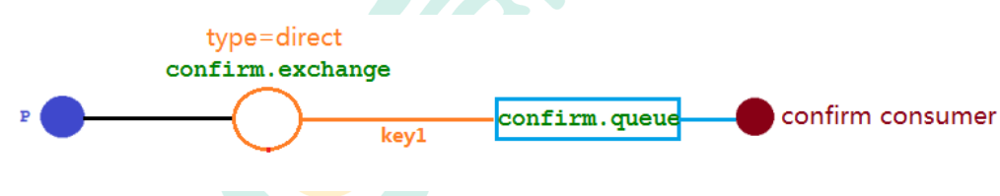
### 8.1.3. 配置文件
在配置文件当中需要添加
`spring.rabbitmq.publisher-confirm-type=correlated`
### 8.1.4. 编写配置类
```java
@Slf4j
@Component
public class MyCallBack implements RabbitTemplate.ConfirmCallback {

    @Autowired
    private RabbitTemplate rabbitTemplate;

    @PostConstruct
    public void init(){
        rabbitTemplate.setConfirmCallback(this);
    }

    //交换机确认回调方法
    @Override
    public void confirm(CorrelationData correlationData, boolean ack, String cause) {

        String id = correlationData!=null?correlationData.getId():"";
        if (ack){
            log.info("交换机已经收到了ID为：{}的消息",id);
        }else {
            log.info("交换机未收到了ID为：{}的消息，原因为：{}",id,cause);
        }
    }
}
```

## 8.2. 回退消息
### 8.2.1. Mandatory 参数
在仅开启了**生产者确认机制**的情况下，交换机接收到消息后，会直接给消息生产者发送确认消息，如果发现该消息不可路由，那么消息会被直接丢弃，此时**生产者是不知道消息被丢弃这个事件的**。通过设置 mandatory 参数可以在当消息传递过程中**不可达目的地时将消息返回给生产者**。
1. 配置文件编写
    ```properties
    spring.rabbitmq.publisher-returns=true
    ```
2. 配置类编写
    ```java
    @Slf4j
    @Component
    public class MyCallBack implements RabbitTemplate.ConfirmCallback,RabbitTemplate.ReturnCallback {

        @Autowired
        private RabbitTemplate rabbitTemplate;

        //内部类注入
        @PostConstruct
        public void init(){
            rabbitTemplate.setConfirmCallback(this);
            rabbitTemplate.setReturnCallback(this);
        }

        //交换机确认回调方法
        @Override
        public void confirm(CorrelationData correlationData, boolean ack, String cause) {

            String id = correlationData!=null?correlationData.getId():"";
            if (ack){
                log.info("交换机已经收到了ID为：{}的消息",id);
            }else {
                log.info("交换机未收到了ID为：{}的消息，原因为：{}",id,cause);
            }
        }

        //当消息传递过程中不可达目的地时，将消息返回给生产者
        @Override
        public void returnedMessage(Message message, int replyCode, String replyText, String exchange, String routingKey) {
            log.error("消息{},被交换机{}退回。退回代码:{},退回原因：{}，路由key:{}",new String(message.getBody()),exchange,replyCode,replyText,routingKey);
        }
        
    }
    ```

## 8.3. 备份交换机
备份交换机可以理解为 RabbitMQ 中交换机的“备胎”，当我们为某一个交换机声明一个对应的备份交换机时，就是为它创建一个备胎，当交换机接收到一条不可路由消息时，将会把这条消息转发到备份交换机中，由备份交换机来进行转发和处理，通常备份交换机的类型为 Fanout ，这样就能把所有消息都投递到与其绑定的队列中，然后我们在备份交换机下绑定一个队列，这样所有那些原交换机无法被路由的消息，就会都进入这个队列了。当然，我们还可以建立一个报警队列，用独立的消费者来进行监测和报警。
### 8.3.1. 代码架构图
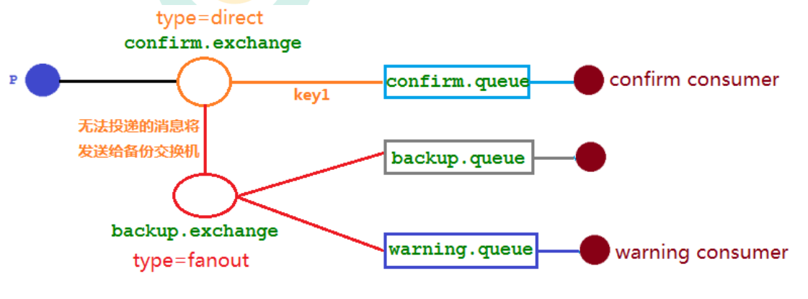
mandatory 参数与备份交换机可以一起使用的时候，如果两者同时开启，消息究竟何去何从？谁优先级高，经过上面结果显示答案是**备份交换机优先级高**。

### 8.3.2. 代码实现
在声明普通交换机时，需注意添加配置参数:`"alternate-exchange"= BACKUP_EXCHANGE_NAME`，其余备份交换机声明与正常交换机一致。另外，备份交换机的消息类型为`fanout`
```java
//声明备份交换机(代码需在前，否则报错找不到备份交换机定义)
@Bean("backupExchange")
public FanoutExchange backupExchange() {
    return new FanoutExchange(BACKUP_EXCHANGE_NAME);
}
//声明普通交换机
@Bean("confirmExchange")
public DirectExchange confirmExchange() {
    return ExchangeBuilder.directExchange(CONFIRM_EXCHANGE_NAME)
            .durable(true)
            .withArgument("alternate-exchange", BACKUP_EXCHANGE_NAME)
            .build();
}
```

# 9. RabbitMQ其他知识点
## 9.1. 幂等性
**问题出现:消息重复消费**
消费者在消费 MQ 中的消息时，MQ 已把消息发送给消费者，消费者在给 MQ 返回 ack 时网络中断，故 MQ 未收到确认信息，该条消息会重新发给其他的消费者，或者在网络重连后再次发送给该消费者，但实际上该消费者已成功消费了该条消息，造成消费者消费了重复的消息。
**解决思路**
1. MQ 消费者的幂等性的解决一般使用全局 ID 或者写个唯一标识比如时间戳 或者 UUID 或者订单消费者消费 MQ 中的消息也可利用 MQ 的该 id 来判断，或者可按自己的规则生成一个全局唯一 id，每次消费消息时用该 id 先判断该消息是否已消费过。
2. 在海量订单生成的业务高峰期，生产端有可能就会重复发生了消息，这时候消费端就要实现幂等性，这就意味着我们的消息永远不会被消费多次，即使我们收到了一样的消息。业界主流的幂等性有两种操作:a.唯一 ID+指纹码机制,利用数据库主键去重, b.利用 redis 的原子性去实现

## 9.2. 优先级队列
### 9.2.1. 使用场景
redis 只能用 List 做一个简简单单的消息队列，并不能实现一个优先级的场景。所以订单量大了后采用 RabbitMQ 进行改造和优化,如果发现是大客户的订单给一个相对比较高的优先级，否则就是默认优先级。
### 9.2.2. 添加方法
1. 队列中代码添加优先级
    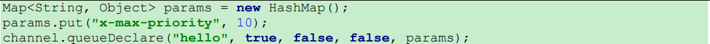
2. 消息中代码添加优先级
    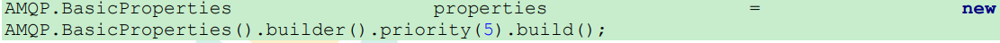

> **注意事项**：
> 1. 要让队列实现优先级需要做的事情有如下事情:队列需要设置为优先级队列，消息需要设置消息的优先级，消费者需要等待消息已经发送到队列中才去消费因为，这样才有机会对消息进行排序。
> 2. 超过队列支持的最大优先级的消息按队列支持的最大优先级处理。比如优先级队列最大优先级为10，那么优先级为11,12,100的消息处理优先级同等，均为10。

## 9.3. 惰性队列
默认情况下，当生产者将消息发送到 RabbitMQ 的时候，队列中的消息会尽可能的存储在内存之中，这样可以更加快速的将消息发送给消费者。即使是持久化的消息，在被写入磁盘的同时也会在内存中驻留一份备份。当 RabbitMQ 需要释放内存的时候，会将内存中的消息换页至磁盘中，这个操作会耗费较长的时间，也会阻塞队列的操作，进而无法接收新的消息。虽然 RabbitMQ 的开发者们一直在升级相关的算法，但是效果始终不太理想，尤其是在消息量特别大的时候。当消费者由于各种各样的原因(比如**消费者下线**、**宕机**亦或者是**由于维护而关闭**等)而致使长时间内不能消费消息造成**堆积**时，惰性队列就很有必要了。

- 正常队列：消息保存在**内存**中
- 惰性队列：消息保存在**磁盘**中

### 9.3.1. 惰性队列声明：
```java
Map<String, Object> args = new HashMap<String, Object>();
args.put("x-queue-mode", "lazy");
channel.queueDeclare("myqueue", false, false, false, args);
```

# 10. RabbitMQ集群
## 10.1. 搭建集群
## 10.2. 镜像队列
如果 RabbitMQ 集群中只有一个 Broker 节点，那么该节点的失效将导致整体服务的临时性不可用，并且也可能会导致消息的丢失。可以将所有消息都设置为持久化，并且对应队列的durable属性也设置为true，但是这样仍然无法避免由于缓存导致的问题：因为消息在发送之后和被写入磁盘井执行刷盘动作之间存在一个短暂却会产生问题的时间窗。通过 publisherconfirm 机制能够确保客户端知道哪些消息己经存入磁盘，尽管如此，一般不希望遇到因单点故障导致的服务不可用。
引入**镜像队列**(Mirror Queue)的机制，可以将**队列镜像**到集群中的其他 Broker 节点之上，如果集群中的一个节点失效了，队列能**自动地切换**到镜像中的另一个节点上以保证服务的可用性。

## 10.3. Haproxy+Keepalive 实现高可用负载均衡
### 10.3.1. 整体架构图
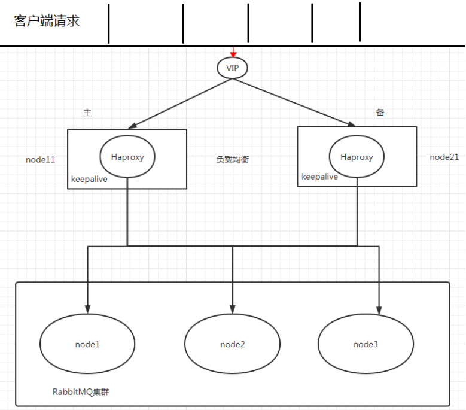

### 10.3.2. Haproxy 实现负载均衡
HAProxy 提供高可用性、负载均衡及基于 TCPHTTP 应用的代理，支持虚拟主机，它是免费、快速并且可靠的一种解决方案，包括 Twitter,Reddit,StackOverflow,GitHub 在内的多家知名互联网公司在使用。
HAProxy 实现了一种事件驱动、单一进程模型，此模型支持非常大的井发连接数。

扩展 nginx,lvs,haproxy 之间的[区别](http://www.ha97.com/5646.html) 

### 10.3.3. Keepalived 实现双机(主备)热备
试想如果前面配置的 HAProxy 主机突然宕机或者网卡失效，那么虽然 RbbitMQ 集群没有任何故障但是对于外界的客户端来说所有的连接都会被断开结果将是灾难性的为了确保负载均衡服务的可靠性同样显得十分重要，这里就要引入 Keepalived 它能够通过自身健康检查、资源接管功能做高可用(双机热备)，实现故障转移.

## 10.4. Federation Exchange

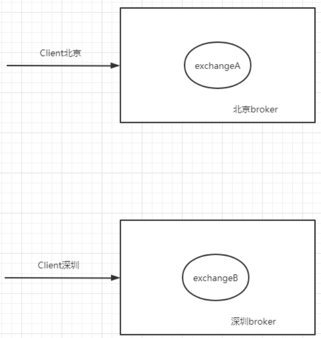

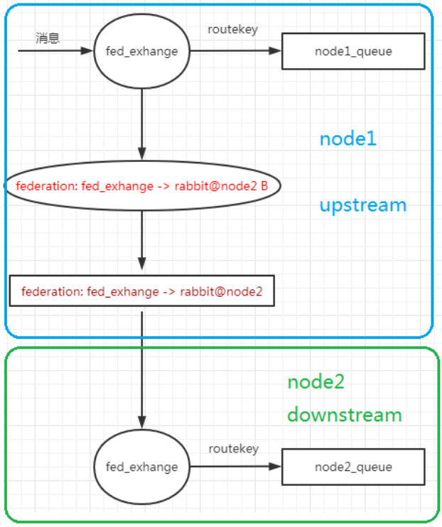
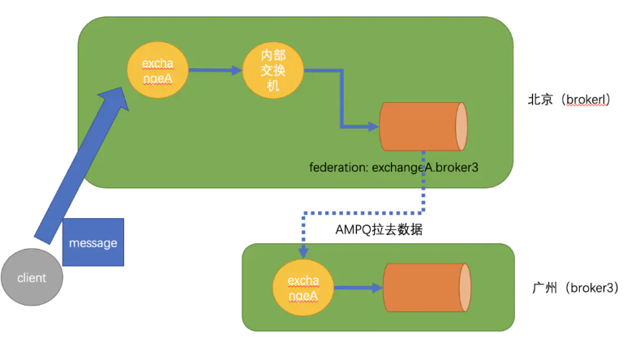
## 10.5. Federation Queue
联邦队列可以在多个 Broker 节点(或者集群)之间为单个队列提供**均衡负载**的功能。一个联邦队列可以连接一个或者多个**上游队列**(upstream queue)，并从这些上游队列中获取消息以满足本地消费者消费消息的需求。

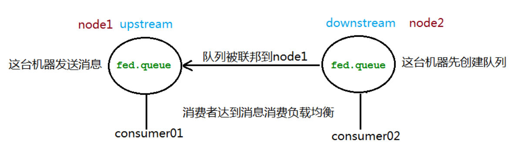
有些时候，我们的rabbitmq为了容灾，会部署到不同的城市。例如北京部署一台rabbitmq，广州部署一台rabbitmq。其中广州rabbitmq有exchangeA。当北京的应用要发消息到exchangeA的时候，会因为网络原因，导致发送时间延时。federation提供了一个能力，让**北京的rabbitmq接受exchanegA的消息。然后再把exchangeA的消息转发到广州的exchangeA**。
**原理**：插件会在北京（broker1）上会建立一个同名的交换器exchangeA。同时建立一个内部的交换器exchangeA broker3，并通过路由键rkA将这两个交换器绑定起来。与此同时 Federation 插件还会在 brokerl 上建立一个队列federation: exchangeA.broker3 井与交换器exchangeA.broker3进行绑定。Federation插件会在队列federation: exchangeA.broker3与 broker3中的交换器 exchangeA 之间建立一条 AMQP 连接来实时地消费队列federation: exchangeA.broker3中的数据。这些操作都是内部的，对外部业务客户端来说这条 Federation link 建立在brokerl exchangeA broker3 exchangeA之间

## 10.6. Shovel
Federation 具备的**数据转发**功能类似，Shovel 够可靠、持续地从一个 Broker 中的队列(作为源端，即source)拉取数据并转发至另一个 Broker 中的交换器(作为目的端，即 destination)。作为源端的队列和作为目的端的交换器可以同时位于同一个 Broker，也可以位于不同的 Broker 上。Shovel 可以翻译为"铲子"，是一种比较形象的比喻，这个"铲子"可以将消息从一方"铲子"另一方。Shovel 行为就像优秀的客户端应用程序能够负责连接源和目的地、负责消息的读写及负责连接失败问题的处理。
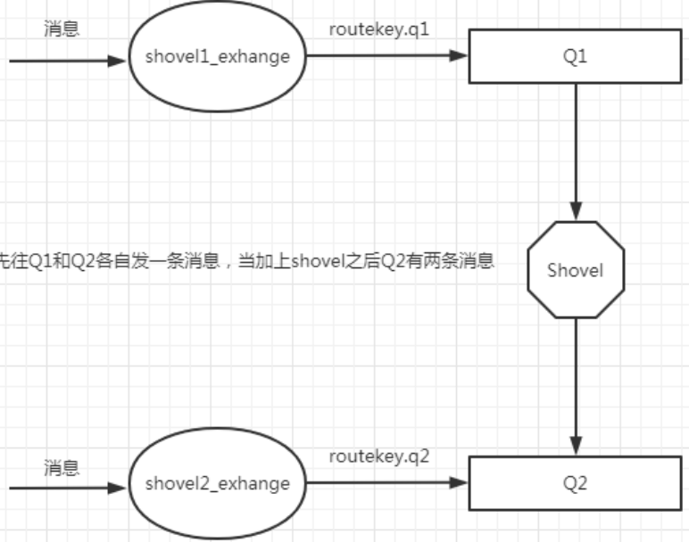
