<h1 align="center" style="color: Navy">Redis</h1>


- [1. NoSQL数据库](#1-nosql数据库)
  - [1.1. NoSQL数据库概述](#11-nosql数据库概述)
  - [1.2. NoSQL使用场景](#12-nosql使用场景)
- [2. Linux环境下配置redis](#2-linux环境下配置redis)
  - [2.1. 编辑环境配置](#21-编辑环境配置)
  - [2.2. redis安装](#22-redis安装)
  - [2.3. redis启动](#23-redis启动)
  - [2.4. Redis相关知识](#24-redis相关知识)
- [3. 常用五大数据类型](#3-常用五大数据类型)
  - [3.1. Redis键(key)](#31-redis键key)
  - [3.2. Redis字符串(String)](#32-redis字符串string)
    - [3.2.1. 简介](#321-简介)
    - [3.2.2. 常用命令](#322-常用命令)
    - [3.2.3. 数据结构](#323-数据结构)
  - [3.3. Redis列表(List)](#33-redis列表list)
    - [3.3.1. 简介](#331-简介)
    - [3.3.2. 常用命令](#332-常用命令)
  - [3.4. Redis集合(Set)](#34-redis集合set)
    - [3.4.1. 简介](#341-简介)
    - [3.4.2. 常用命令](#342-常用命令)
  - [3.5. Redis哈希(Hash)](#35-redis哈希hash)
    - [3.5.1. 简介](#351-简介)
    - [3.5.2. 常用命令](#352-常用命令)
  - [3.6. Redis有序集合Zset(sorted set)](#36-redis有序集合zsetsorted-set)
    - [3.6.1. 简介](#361-简介)
    - [3.6.2. 常用命令](#362-常用命令)
    - [3.6.3. 数据结构](#363-数据结构)
- [4. Redis6新数据类型](#4-redis6新数据类型)
  - [4.1. Bitmaps](#41-bitmaps)
  - [4.2. HyperLogLog](#42-hyperloglog)
  - [4.3. Geospatial](#43-geospatial)
- [5. Redis与Spring Boot整合](#5-redis与spring-boot整合)
- [6. 事务、锁机制](#6-事务锁机制)
  - [6.1. 事务定义](#61-事务定义)
  - [6.2. 事务的错误处理](#62-事务的错误处理)
  - [6.3. 锁机制](#63-锁机制)
    - [6.3.1. 悲观锁](#631-悲观锁)
    - [6.3.2. 乐观锁](#632-乐观锁)
    - [6.3.3. 锁命令](#633-锁命令)
  - [6.4. Redis事务三特性](#64-redis事务三特性)
- [7. Redis持久化](#7-redis持久化)
  - [7.1. RDB](#71-rdb)
    - [7.1.1. 定义](#711-定义)
    - [7.1.2. 执行方法](#712-执行方法)
    - [7.1.3. Fork](#713-fork)
    - [7.1.4. 持久化流程](#714-持久化流程)
  - [7.2. AOF](#72-aof)
    - [7.2.1. 定义](#721-定义)
    - [7.2.2. AOF持久化流程](#722-aof持久化流程)
    - [7.2.3. 同步频率设置](#723-同步频率设置)
- [8. 主从复制](#8-主从复制)
  - [8.1. 主从配置](#81-主从配置)
  - [8.2. 主从策略](#82-主从策略)
    - [8.2.1. 一主二从](#821-一主二从)
    - [8.2.2. 薪火相传](#822-薪火相传)
    - [8.2.3. 反客为主](#823-反客为主)
  - [8.3. 复制原理](#83-复制原理)
  - [8.4. 哨兵模式(sentinel)](#84-哨兵模式sentinel)
    - [8.4.1. 哨兵配置](#841-哨兵配置)
    - [8.4.2. 选举规则](#842-选举规则)
- [9. Redis集群](#9-redis集群)
  - [9.1. Redis集群定义](#91-redis集群定义)
  - [9.2. 集群常用命令](#92-集群常用命令)
  - [9.3. Slot](#93-slot)
  - [9.4. 故障恢复](#94-故障恢复)
  - [9.5. 集群的优缺点](#95-集群的优缺点)
- [10. Redis应用问题](#10-redis应用问题)
  - [10.1. 缓存穿透](#101-缓存穿透)
    - [10.1.1. 问题描述](#1011-问题描述)
    - [10.1.2. 解决方案](#1012-解决方案)
  - [10.2. 缓存击穿](#102-缓存击穿)
    - [10.2.1. 问题描述](#1021-问题描述)
    - [10.2.2. 解决方案](#1022-解决方案)
  - [10.3. 缓存雪崩](#103-缓存雪崩)
    - [10.3.1. 问题描述](#1031-问题描述)
    - [10.3.2. 解决方案](#1032-解决方案)
  - [10.4. 分布式锁](#104-分布式锁)
    - [10.4.1. 问题描述](#1041-问题描述)
    - [10.4.2. 解决方案](#1042-解决方案)
- [11. Redis6新特性](#11-redis6新特性)
  - [11.1. ACL](#111-acl)
  - [11.2. IO多线程](#112-io多线程)

# 1. NoSQL数据库
## 1.1. NoSQL数据库概述
NoSQL(NoSQL = Not Only SQL )，意即“不仅仅是SQL”，泛指非关系型的数据库。 
NoSQL 不依赖业务逻辑方式存储，而以简单的**key-value**模式存储。因此大大的增加了数据库的扩展能力。
- 不遵循SQL标准。
- 不支持ACID。
- 远超于SQL的性能。

## 1.2. NoSQL使用场景
**适用场景** 
- 对数据高并发的读写
- 海量数据的读写
- 对数据高可扩展性的
**不适用场景**
- 需要事务支持
- 基于sql的结构化查询存储，处理复杂的关系,需要即席查询。
- 用不着sql的和用了sql也不行的情况，考虑用NoSql。


# 2. Linux环境下配置redis
## 2.1. 编辑环境配置
在linux下逐次运行以下命令，以安装C语言编译环境:
```shell
yum install centos-release-scl scl-utils-build
yum install -y devtoolset-8-toolchain
scl enable devtoolset-8 bash
# 测试gcc -version
gcc --version
```
正常情况下显示：


## 2.2. redis安装
1. 下载redis-6.2.1.tar.gz放/opt目录
2. 解压命令：`tar -zxvf redis-6.2.1.tar.gz`
3. 解压完成后进入目录：`cd redis-6.2.1`
4. 在redis-6.2.1目录下执行`make`命令（只是编译好）
5. 执行`make install`

## 2.3. redis启动
redis默认安装目录：`/usr/local/bin`
`ls`命令查看默认安装目录：
- `redis-benchmark`:性能测试工具，可以在自己本子运行，看看自己本子性能如何
- `redis-check-aof`：修复有问题的AOF文件，rdb和aof后面讲
- `redis-check-dump`：修复有问题的dump.rdb文件
- `redis-sentinel`：Redis集群使用
- `redis-server`：Redis服务器启动命令
- `redis-cli`：客户端，操作入口

**后台启动方式**
1. 备份`redis.conf`
    拷贝一份redis.conf到其他目录:`cp redis.conf  /etc/redis.conf`
2. 编辑备份的`/etc/redis.conf`。将后台启动设置`daemonize no`改成`daemonize yes`
    - 文件编辑命令：`vim redis.conf`
    - 关键字查找：`/keyword` 按n键查找关键字下一个位置
    - 文件编辑(插入)：`i`
    - 文件保存并退出：先按`Esc`，然后输入`:wq`。
3. redis密码设置
    去备份的`redis.conf`的配置文件中找到`requirepass`这个参数，如下配置：
    ```conf
    # requirepass foobared
    requirepass 123   指定密码123
    ```
4. redis启动
    1. redis启动:`redis-server /etc/redis.conf`
    2. 用客户端访问redis-cli: `redis-cli`(多个端口可以：`redis-cli -p6379`)
    3. 测试验证：`ping`
    4. 密码登录：`127.0.0.1:6379> auth xvdf7cuFb0gp2ZqL  //指定的密码为xvdf7cuFb0gp2ZqL`
5. redis关闭
    `redis-cli shutdown`
    
## 2.4. Redis相关知识
Redis是**单线程+多路IO复用**技术
多路复用是指使用一个线程来检查多个文件描述符（Socket）的就绪状态，比如调用select和poll函数，传入多个文件描述符，如果有一个文件描述符就绪，则返回，否则阻塞直到超时。得到就绪状态后进行真正的操作可以在同一个线程里执行，也可以启动线程执行（比如使用线程池）。
串行  vs  多线程+锁（memcached） vs  单线程+多路IO复用(Redis)
（与Memcache三点不同: 支持多数据类型，支持持久化，单线程+多路IO复用）  

# 3. 常用五大数据类型
## 3.1. Redis键(key)
- keys *查看当前库所有key    (匹配：keys *1)
- exists key判断某个key是否存在
- type key 查看你的key是什么类型
- del key       删除指定的key数据
- unlink key   根据value选择非阻塞删除。仅将keys从keyspace元数据中删除，真正的删除会在后续异步操作。
- expire key 10   10秒钟：为给定的key设置过期时间
- ttl key 查看还有多少秒过期，-1表示永不过期，-2表示已过期
- select 命令切换数据库
- dbsize 查看当前数据库的key的数量
- flushdb 清空当前库
- flushall 通杀全部库

## 3.2. Redis字符串(String)
### 3.2.1. 简介
- String是Redis最基本的类型。可以理解成与Memcached一模一样的类型，一个key对应一个value。
- String类型是二进制安全的。意味着Redis的string可以包含任何数据。比如jpg图片或者序列化的对象。
- String类型是Redis最基本的数据类型，一个Redis中字符串value最多可以是512M

### 3.2.2. 常用命令
- `set <key> <value>`添加键值对
    - *NX：当数据库中key不存在时，可以将key-value添加数据库
    - *XX：当数据库中key存在时，可以将key-value添加数据库，与NX参数互斥
    - *EX：key的超时秒数
    - *PX：key的超时毫秒数，与EX互斥
- `get <key>`查询对应键值
- `append <key> <value>`将给定的`<value>` 追加到原值的末尾
- `strlen <key>`获得值的长度
- `setnx <key> <value>`只有在 key 不存在时，设置 key 的值
- `incr <key>` 将 key 中储存的数字值增1。只能对数字值操作，如果为空，新增值为1
- `decr <key>` 将 key 中储存的数字值减1。只能对数字值操作，如果为空，新增值为-1
- `incrby / decrby <key> <步长>` 将 key 中储存的数字值增减自定义步长。
- `mset  <key1><value1><key2><value2>`  ..... 同时设置一个或多个 key-value对  
- `mget  <key1><key2><key3>` .....同时获取一个或多个 value  
- `msetnx <key1><value1><key2><value2>`  ..... 同时设置一个或多个 key-value 对，当且仅当所有给定 key 都不存在。
- `getrange  <key><起始位置><结束位置>` 获得值的范围，类似java中的substring，前包，后包
- `setrange  <key><起始位置><value>` 用 `<value>`  覆写`<key>`所储存的字符串值，从<起始位置>开始(索引从0开始)。
- `setex  <key><过期时间><value>` 设置键值的同时，设置过期时间，单位秒。
- `getset <key><value>` 以新换旧，设置了新值同时获得旧值。

上述命令都满足**原子性**操作，即有一个失败则都失败。

### 3.2.3. 数据结构
String的数据结构为简单动态字符串(Simple Dynamic String,缩写SDS)。是可以修改的字符串，内部结构实现上类似于Java的ArrayList，采用预分配冗余空间的方式来减少内存的频繁分配.

如图中所示，内部为当前字符串实际分配的空间capacity一般要高于实际字符串长度len。当字符串长度小于1M时，扩容都是加倍现有的空间，如果超过1M，扩容时一次只会多扩1M的空间。需要注意的是字符串最大长度为512M。

## 3.3. Redis列表(List)
### 3.3.1. 简介
单键多值
Redis 列表是简单的字符串列表，按照插入顺序排序。可以添加一个元素到列表的头部（左边）或者尾部（右边）。
它的底层实际是个双向链表，对两端的操作性能很高，通过索引下标的操作中间的节点性能会较差。


### 3.3.2. 常用命令
- `lpush/rpush  <key><value1><value2><value3> ....` 从左边/右边插入一个或多个值。
- `lpop/rpop  <key>`从左边/右边吐出一个值。值在键在，值光键亡。
- `rpoplpush  <key1> <key2>`从`<key1>`列表右边吐出一个值，插到`<key2>`列表左边。
- `lrange <key><start><stop>` 按照索引下标获得元素(从左到右)
- `lrange mylist 0 -1`   0左边第一个，-1右边第一个，（0-1表示获取所有）
- `lindex <key><index>`按照索引下标获得元素(从左到右)
- `llen <key>`获得列表长度 
- `linsert <key>  before <value> <newvalue>`在`<value>`的后面插入`<newvalue>`插入值
- `lrem <key><n><value>`从左边删除n个value(从左到右)
- `lset<key><index><value>`将列表key下标为index的值替换成value

## 3.4. Redis集合(Set)
### 3.4.1. 简介
Redis set对外提供的功能与list类似是一个列表的功能，特殊之处在于set是可以**自动排重**的，当你需要存储一个列表数据，又不希望出现重复数据时，set是一个很好的选择，并且set提供了判断某个成员是否在一个set集合内的重要接口，这个也是list所不能提供的。
Redis的Set是string类型的无序集合。它底层其实是一个value为null的hash表，所以添加，删除，查找的复杂度都是O(1)。一个算法，随着数据的增加，执行时间的长短，如果是O(1)，数据增加，查找数据的时间不变。
**应用**：基于 Set 轻易实现交集、并集、差集的操作，比如你可以将一个用户所有的关注人存在一个集合中，将其所有粉丝存在一个集合。这样的话，Set 可以非常方便的实现如共同关注、共同粉丝、共同喜好等功能。这个过程也就是求交集的过程。

### 3.4.2. 常用命令
- `sadd <key><value1><value2> ..... ` 将一个或多个 member 元素加入到集合 key 中，已经存在的 member 元素将被忽略
- `smembers <key>`取出该集合的所有值。
- `sismember <key><value>`判断集合`<key>`是否为含有该`<value>`值，有1，没有0
- `scard<key>`返回该集合的元素个数。
- `srem <key><value1><value2> ....` 删除集合中的某个元素。
- `spop <key>`随机从该集合中吐出一个值。
- `srandmember <key><n>`随机从该集合中取出n个值。不会从集合中删除 。
- `smove <source><destination><value>`把集合中一个值从一个集合移动到另一个集合
- `sinter <key1><key2>`返回两个集合的交集元素。
- `sunion <key1><key2>`返回两个集合的并集元素。
- `sdiff <key1><key2>`返回两个集合的差集元素(key1中有的，key2中没有的)

## 3.5. Redis哈希(Hash)
### 3.5.1. 简介
Redis hash 是一个键值对集合。
Redis hash是一个string类型的field和value的映射表，hash特别适合用于存储对象。类似Java里面的`Map<String,Object>`
用户ID为查找的key，存储的value用户对象包含姓名，年龄，生日等信息，如果用普通的key/value结构来存储
主要有以下2种存储方式：
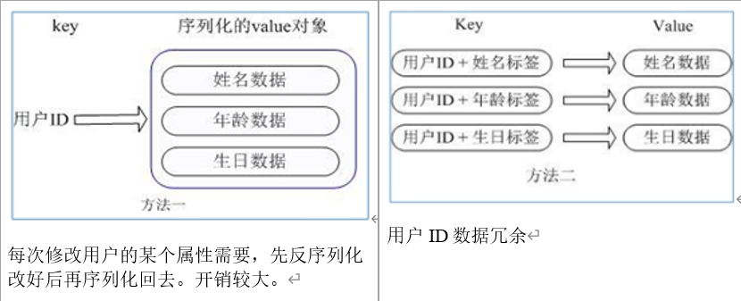
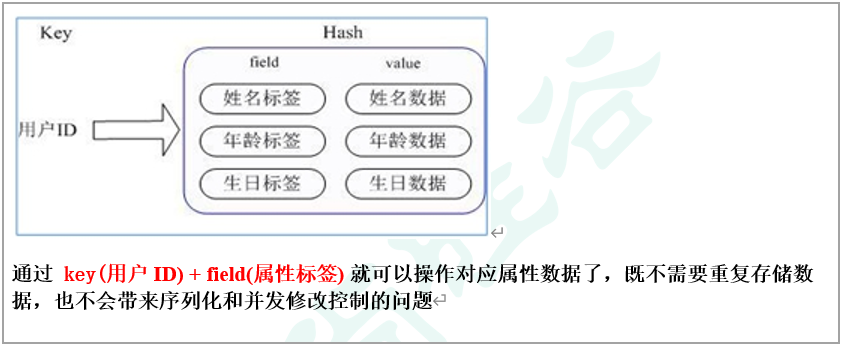

### 3.5.2. 常用命令
- `hset <key><field><value>` 给`<key>`集合中的`<field>`键赋值`<value>`
- `hget <key1><field>` 从`<key1>`集合`<field>`取出 value 
- `hmset <key1><field1><value1><field2><value2>...` 批量设置hash的值
- `hexists<key1><field>` 查看哈希表 key 中，给定域 field 是否存在。 
- `hkeys <key>` 列出该hash集合的所有field
- `hvals <key>` 列出该hash集合的所有value
- `hincrby <key><field><increment>` 为哈希表 key 中的域 field 的值加上增量1 -1
- `hsetnx <key><field><value>` 将哈希表 key 中的域 field 的值设置为 value ，当且仅当域 field 不存在.

## 3.6. Redis有序集合Zset(sorted set)
### 3.6.1. 简介
- Redis有序集合zset与普通集合set非常相似，是一个没有重复元素的字符串集合。
- 不同之处是有序集合的每个成员都关联了一个评分（score）,这个评分（score）被用来按照从最低分到最高分的方式排序集合中的成员。集合的成员是唯一的，但是评分可以是重复了 。
- 因为元素是有序的, 所以可以很快的根据评分（score）或者次序（position）来获取一个范围的元素。
- 访问有序集合的中间元素也是非常快的,因此能够使用有序集合作为一个没有重复成员的智能列表。
- **应用**:需要随机获取数据源中的元素根据某个权重进行排序的场景。各种排行榜比如直播间送礼物的排行榜、朋友圈的微信步数排行榜、王者荣耀中的段位排行榜、话题热度排行榜等等。需要存储的数据有优先级或者重要程度的场景比如**优先级任务队列**。

### 3.6.2. 常用命令
- `zadd  <key><score1><value1><score2><value2>…` 将一个或多个 member 元素及其 score 值加入到有序集 key 当中。
- `zrange <key><start><stop> [WITHSCORES]` 返回有序集 key 中，下标在<start><stop>之间的元素
带WITHSCORES，可以让分数一起和值返回到结果集。
- `zrangebyscore key minmax [withscores] [limit offset count]` 返回有序集 key 中，所有 score 值介于 min 和 max 之间(包括等于 min 或 max )的成员。有序集成员按 score 值递增(从小到大)次序排列。 
- `zrevrangebyscore key maxmin [withscores] [limit offset count]` 同上，改为从大到小排列。 
- `zincrby <key><increment><value>` 为元素的score加上增量
- `zrem  <key><value>` 删除该集合下，指定值的元素 
- `zcard <key>` 获取有序集合的成员数
- `zcount <key><min><max>` 统计该集合，分数区间内的元素个数 
- `zrank <key><value>` 返回该值在集合中的排名，从0开始。
- `zremrangebyscore <key><min><max>` 移除有序集中，指定分数（score）区间内的所有成员。


### 3.6.3. 数据结构
SortedSet(zset)是Redis提供的一个非常特别的数据结构，一方面它等价于Java的数据结构`Map<String, Double>`，可以给每一个元素value赋予一个权重score，另一方面它又类似于TreeSet，内部的元素会按照权重score进行排序，可以得到每个元素的名次，还可以通过score的范围来获取元素的列表。
zset底层使用了两个数据结构
1. hash，hash的作用就是关联元素value和权重score，保障元素value的唯一性，可以通过元素value找到相应的score值。
2. 跳跃表，跳跃表的目的在于给元素value排序，根据score的范围获取元素列表。
    
    从第2层开始，1节点比51节点小，向后比较。
    21节点比51节点小，继续向后比较，后面就是NULL了，所以从21节点向下到第1层
    在第1层，41节点比51节点小，继续向后，61节点比51节点大，所以从41向下
    在第0层，51节点为要查找的节点，节点被找到，共查找4次。

# 4. Redis6新数据类型
## 4.1. Bitmaps
Redis提供了Bitmaps这个“数据类型”可以实现对位的操作：
（1）	Bitmaps本身不是一种数据类型， 实际上它就是字符串（key-value） ， 但是它可以对字符串的位进行操作。
（2）	Bitmaps单独提供了一套命令， 所以在Redis中使用Bitmaps和使用字符串的方法不太相同。 可以把Bitmaps想象成一个以位为单位的数组， 数组的每个单元只能存储0和1， 数组的下标在Bitmaps中叫做偏移量。
需要保存状态信息（0/1 即可表示）的场景。举例 ：用户签到情况、活跃用户情况、用户行为统计（比如是否点赞过某个视频）。

**常用命令**
- `setbit<key><offset><value>` 设置Bitmaps中某个偏移量的值（0或1）
- `getbit<key><offset>` 获取Bitmaps中某个偏移量的值
- `bitcount<key>[start end]` 统计字符串从start字节到end字节比特值为1的数量
- `bitop  and(or/not/xor) <destkey> [key…]` bitop是一个复合操作， 它可以做多个Bitmaps的and（交集） 、 or（并集） 、 not（非） 、 xor（异或） 操作并将结果保存在destkey中。

## 4.2. HyperLogLog
**简介**
Redis HyperLogLog 是用来做基数统计的算法，HyperLogLog 的优点是，在输入元素的数量或者体积非常非常大时，计算基数所需的空间总是固定的、并且是很小的。
什么是基数?
比如数据集 {1, 3, 5, 7, 5, 7, 8}， 那么这个数据集的基数集为 {1, 3, 5 ,7, 8}, 基数(不重复元素)为5。 基数估计就是在误差可接受的范围内，快速计算基数。基数计数概率算法为了节省内存并不会直接存储元数据，而是通过一定的**概率统计方法**预估基数值（集合中包含元素的个数）。因此， HyperLogLog 的计数结果并不是一个精确值，存在一定的误差（标准误差为 **0.81%** ）。
**应用**：数量巨大（百万、千万级别以上）的计数场景，比如热门网站每日/每周/每月访问 ip 数统计、热门帖子 uv 统计、

**常用命令**
- `pfadd <key>< element> [element ...]` 添加指定元素到 HyperLogLog 中
- `pfcount<key> [key ...]` 计算HLL的近似基数，可以计算多个HLL，比如用HLL存储每天的UV，计算一周的UV可以使用7天的UV合并计算即可
- `pfmerge<destkey><sourcekey> [sourcekey ...]` 将一个或多个HLL合并后的结果存储在另一个HLL中，比如每月活跃用户可以使用每天的活跃用户来合并计算可得

## 4.3. Geospatial
**简介**
Redis 3.2 中增加了对GEO类型的支持。GEO，Geographic，地理信息的缩写。该类型，就是元素的2维坐标，在地图上就是经纬度。redis基于该类型，提供了经纬度设置，查询，范围查询，距离查询，经纬度Hash等常见操作。
**应用**：需要管理使用地理空间数据的场景，比如：附近的人。
**常用命令**
- `geoadd <key><longitude><latitude><member>` [longitude latitude member...]   添加地理位置（经度，纬度，名称）
- `geopos  <key><member> [member...]`  获得指定地区的坐标值
- `geodist<key><member1><member2>  [m|km|ft|mi ]`  获取两个位置之间的直线距离
- `georadius<key>< longitude><latitude>radius  m|km|ft|mi`   以给定的经纬度为中心，找出某一半径内的元素

# 5. Redis与Spring Boot整合
1. 导入依赖
    ```xml
    <!-- redis -->
    <dependency>
        <groupId>org.springframework.boot</groupId>
        <artifactId>spring-boot-starter-data-redis</artifactId>
    </dependency>
    ```
2. application.properties配置redis配置
    ```properties
    #Redis服务器地址
    spring.redis.host=192.168.140.136
    #Redis服务器连接端口
    spring.redis.port=6379
    #Redis数据库索引（默认为0）
    spring.redis.database= 0
    #连接超时时间（毫秒）
    spring.redis.timeout=1800000
    #连接池最大连接数（使用负值表示没有限制）
    spring.redis.lettuce.pool.max-active=20
    #最大阻塞等待时间(负数表示没限制)
    spring.redis.lettuce.pool.max-wait=-1
    #连接池中的最大空闲连接
    spring.redis.lettuce.pool.max-idle=5
    #连接池中的最小空闲连接
    spring.redis.lettuce.pool.min-idle=0
    ```
3. 添加redis配置类
    ```java
    @EnableCaching
    @Configuration
    public class RedisConfig {
        @Bean
        public RedisTemplate<String, Object> redisTemplate(RedisConnectionFactory factory) {
            RedisTemplate<String, Object> template = new RedisTemplate<>();
            RedisSerializer<String> redisSerializer = new StringRedisSerializer();
            Jackson2JsonRedisSerializer jackson2JsonRedisSerializer = new Jackson2JsonRedisSerializer(Object.class);
            ObjectMapper om = new ObjectMapper();
            om.setVisibility(PropertyAccessor.ALL, JsonAutoDetect.Visibility.ANY);
            om.enableDefaultTyping(ObjectMapper.DefaultTyping.NON_FINAL);
            jackson2JsonRedisSerializer.setObjectMapper(om);
            template.setConnectionFactory(factory);
            //key序列化方式
            template.setKeySerializer(redisSerializer);
            //value序列化
            template.setValueSerializer(jackson2JsonRedisSerializer);
            //value hashmap序列化
            template.setHashValueSerializer(jackson2JsonRedisSerializer);
            return template;
        }

        @Bean
        public CacheManager cacheManager(RedisConnectionFactory factory) {
            RedisSerializer<String> redisSerializer = new StringRedisSerializer();
            Jackson2JsonRedisSerializer jackson2JsonRedisSerializer = new Jackson2JsonRedisSerializer(Object.class);
            //解决查询缓存转换异常的问题
            ObjectMapper om = new ObjectMapper();
            om.setVisibility(PropertyAccessor.ALL, JsonAutoDetect.Visibility.ANY);
            om.enableDefaultTyping(ObjectMapper.DefaultTyping.NON_FINAL);
            jackson2JsonRedisSerializer.setObjectMapper(om);
            // 配置序列化（解决乱码的问题）,过期时间600秒
            RedisCacheConfiguration config = RedisCacheConfiguration.defaultCacheConfig()
                    .entryTtl(Duration.ofSeconds(600))
                    .serializeKeysWith(RedisSerializationContext.SerializationPair.fromSerializer(redisSerializer))
                    .serializeValuesWith(RedisSerializationContext.SerializationPair.fromSerializer(jackson2JsonRedisSerializer))
                    .disableCachingNullValues();
            RedisCacheManager cacheManager = RedisCacheManager.builder(factory)
                    .cacheDefaults(config)
                    .build();
            return cacheManager;
        }
    }
    ```

# 6. 事务、锁机制
## 6.1. 事务定义
Redis事务是一个单独的隔离操作：事务中的所有命令都会序列化、按顺序地执行。事务在执行的过程中，不会被其他客户端发送来的命令请求所打断。
Redis事务的主要作用就是**串联多个命令**防止别的命令插队。
**主要操作**
从输入**Multi**命令开始，输入的命令都会依次进入命令队列中，但不会执行，直到输入**Exec**后，Redis会将之前的命令队列中的命令依次执行。
组队的过程中可以通过**discard**来放弃组队。  
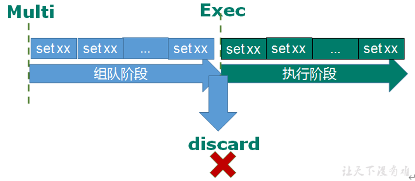

## 6.2. 事务的错误处理
- 组队中某个命令出现了报告错误，执行时整个的所有队列都会被取消。
- 如果执行阶段某个命令报出了错误，则只有报错的命令不会被执行，而其他的命令都会执行，不会回滚。


## 6.3. 锁机制
### 6.3.1. 悲观锁

悲观锁(Pessimistic Lock), 顾名思义，就是很悲观，每次去拿数据的时候都认为别人会修改，所以每次在拿数据的时候都会上锁，这样别人想拿这个数据就会block直到它拿到锁。传统的关系型数据库里边就用到了很多这种锁机制，比如行锁，表锁等，读锁，写锁等，都是在做操作之前先上锁。

### 6.3.2. 乐观锁

乐观锁(Optimistic Lock), 顾名思义，就是很乐观，每次去拿数据的时候都认为别人不会修改，所以不会上锁，但是在更新的时候会判断一下在此期间别人有没有去更新这个数据，可以使用**版本号**等机制。乐观锁适用于**多读**的应用类型，这样可以提高吞吐量。Redis就是利用这种**check-and-set**机制实现事务的。

### 6.3.3. 锁命令
- `WATCH key [key ...]` 在执行multi之前，先执行`watch key1 [key2]`,可以监视一个(或多个) key ，如果在事务执行之前这个(或这些) key 被其他命令所改动，那么事务将被打断。
- `unwatch` 取消 WATCH 命令对所有 key 的监视。如果在执行 WATCH 命令之后，EXEC 命令或DISCARD 命令先被执行了的话，那么就不需要再执行UNWATCH 了。

## 6.4. Redis事务三特性
1. 单独的隔离操作 
    事务中的所有命令都会序列化、按顺序地执行。事务在执行的过程中，不会被其他客户端发送来的命令请求所打断。 
2. 没有隔离级别的概念 
    队列中的命令没有提交之前都不会实际被执行，因为事务提交前任何指令都不会被实际执行
3. 不保证原子性 
    事务中如果有一条命令执行失败，其后的命令仍然会被执行，没有回滚 

# 7. Redis持久化
## 7.1. RDB
### 7.1.1. 定义
在指定的时间间隔内将内存中的数据集快照写入磁盘， 也就是行话讲的Snapshot快照，它恢复时是将快照文件直接读到内存里
### 7.1.2. 执行方法
Redis会单独创建（fork）一个子进程来进行持久化，会先将数据写入到 一个临时文件中，待持久化过程都结束了，再用这个临时文件替换上次持久化好的文件。 整个过程中，主进程是不进行任何IO操作的，这就确保了极高的性能 如果需要进行大规模数据的恢复，且对于数据恢复的完整性不是非常敏感，那RDB方式要比AOF方式更加的高效。RDB的缺点是**最后一次持久化后的数据可能丢失**。
### 7.1.3. Fork
- Fork的作用是复制一个与当前进程一样的进程。新进程的所有数据（变量、环境变量、程序计数器等） 数值都和原进程一致，但是是一个全新的进程，并作为原进程的子进程
- 在Linux程序中，fork()会产生一个和父进程完全相同的子进程，但子进程在此后多会exec系统调用，出于效率考虑，Linux中引入了“写时复制技术”
- 一般情况父进程和子进程会共用同一段物理内存，只有进程空间的各段的内容要发生变化时，才会将父进程的内容复制一份给子进程。
### 7.1.4. 持久化流程
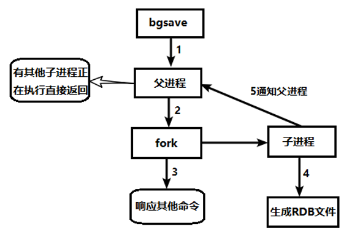

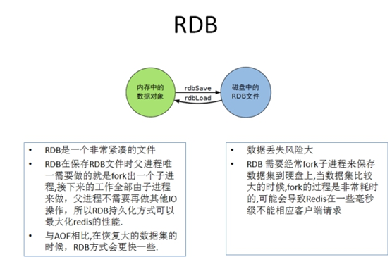

## 7.2. AOF
### 7.2.1. 定义
以日志的形式来记录每个写操作（增量保存），将Redis执行过的所有写指令记录下来(读操作不记录)， 只许追加文件但不可以改写文件，redis启动之初会读取该文件重新构建数据，换言之，redis 重启的话就根据日志文件的内容将写指令从前到后执行一次以完成数据的恢复工作

### 7.2.2. AOF持久化流程
1. 客户端的请求写命令会被append追加到AOF缓冲区内；
2. AOF缓冲区根据AOF持久化策略[always,everysec,no]将操作sync同步到磁盘的AOF文件中；
3. AOF文件大小超过重写策略或手动重写时，会对AOF文件rewrite重写，压缩AOF文件容量；
4. Redis服务重启时，会重新load加载AOF文件中的写操作达到数据恢复的目的；
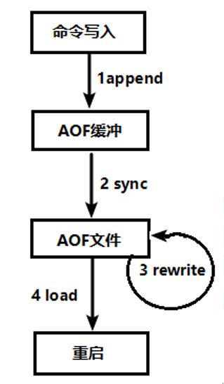

### 7.2.3. 同步频率设置
- appendfsync always
    始终同步，每次Redis的写入都会立刻记入日志；性能较差但数据完整性比较好
- appendfsync everysec
    每秒同步，每秒记入日志一次，如果宕机，本秒的数据可能丢失。
- appendfsync no
    redis不主动进行同步，把同步时机交给操作系统。

# 8. 主从复制
主机数据更新后根据配置和策略， 自动同步到备机的master/slaver机制，Master以写为主，Slave以读为主
- 读写分离，性能扩展
- 容灾快速恢复

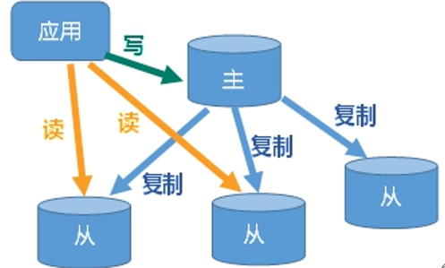

## 8.1. 主从配置
1. 设置通用配置文件 `/myredis/redis.conf`
2. 三个服务器引用配置文件
    ```conf
    include /myredis/redis.conf
    pidfile /var/run/redis_6379.pid
    port 6379
    dbfilename dump6379.rdb
    ```
    ```conf
    include /myredis/redis.conf
    pidfile /var/run/redis_6380.pid
    port 6380
    dbfilename dump6380.rdb
    ```
    ```conf
    include /myredis/redis.conf
    pidfile /var/run/redis_6381.pid
    port 6381
    dbfilename dump6381.rdb
    ```
3. 从机设置
    ```
    slaveof <host> <port> # 如：slaveof 127.0.0.1 6379
    ```
4. 主从状态查看
    ```
    info replication
    ```

**Note**：从机重启后会移除与主机的依赖；主机重启后仍为主机，与从机的依赖维持不变。

## 8.2. 主从策略
### 8.2.1. 一主二从

### 8.2.2. 薪火相传

上一个Slave可以是下一个slave的Master，Slave同样可以接收其他 slaves的连接和同步请求，那么该slave作为了链条中下一个的master, 可以有效减轻master的写压力,去中心化降低风险。
用 `slaveof  <ip><port>` 
中途变更转向:会清除之前的数据，重新建立拷贝最新的
风险是一旦某个slave宕机，后面的slave都没法备份
主机挂了，从机还是从机，无法写数据了

### 8.2.3. 反客为主
当一个master宕机后，后面的slave可以立刻升为master，其后面的slave不用做任何修改。
用 `slaveof no one` 将从机变为主机。

## 8.3. 复制原理
- Slave启动成功连接到master后会发送一个sync命令
- Master接到命令启动后台的存盘进程，同时收集所有接收到的用于修改数据集命令， 在后台进程执行完毕之后，master将传送整个数据文件到slave,以完成一次完全同步
- 全量复制：而slave服务在接收到数据库文件数据后，将其存盘并加载到内存中。
- 增量复制：Master继续将新的所有收集到的修改命令依次传给slave,完成同步
- 但是只要是重新连接master,一次完全同步（全量复制)将被自动执行


## 8.4. 哨兵模式(sentinel)
反客为主的自动版，能够后台监控主机是否故障，如果故障了根据投票数自动将从库转换为主库
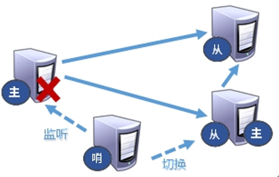

### 8.4.1. 哨兵配置
1. 先配置一主二从
2. 自定义的/myredis目录下新建sentinel.conf文件
3. 向sentinel.conf中写入以下内容:
    sentinel monitor mymaster 127.0.0.1 6379 1
    其中mymaster为监控对象起的服务器名称， 1 为至少有多少个哨兵同意迁移的数量。 
4. 执行redis-sentinel  /myredis/sentinel.conf 

### 8.4.2. 选举规则
哪个从机会被选举为主机呢？根据优先级别：slave-priority 
原主机重启后会变为从机。
**优先级**在redis.conf中默认：slave-priority 100，值越小优先级越高
**偏移量**是指获得原主机数据最全的
每个redis实例启动后都会随机生成一个40位的**runid**
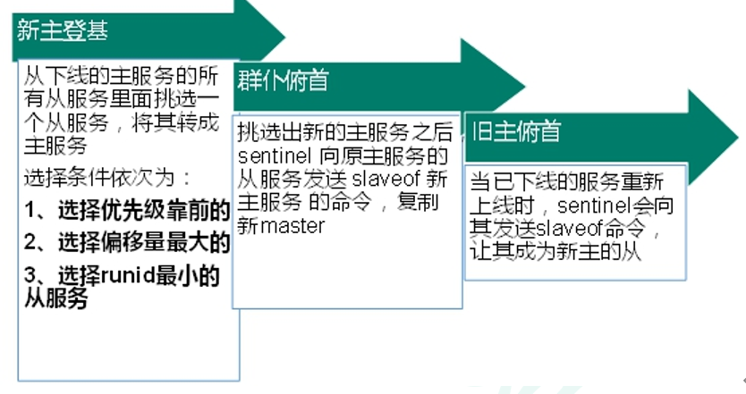

# 9. Redis集群
## 9.1. Redis集群定义
Redis 集群实现了对Redis的水平扩容，即启动N个redis节点，将整个数据库分布存储在这N个节点中，每个节点存储总数据的1/N。
Redis 集群通过分区（partition）来提供一定程度的可用性（availability）： 即使集群中有一部分节点失效或者无法进行通讯， 集群也可以继续处理命令请求。
## 9.2. 集群常用命令
- `redis-cli -c -p 6379`: `-c` 采用集群策略连接，设置数据会自动切换到相应的写主机
- `cluster nodes` 查看集群信息
- `CLUSTER GETKEYSINSLOT <slot><count>` 返回 count 个 slot 槽中的键。
## 9.3. Slot
一个 Redis 集群包含 16384 个插槽（hash slot）， 数据库中的每个键都属于这 16384 个插槽的其中一个， 
集群使用公式 CRC16(key) % 16384 来计算键 key 属于哪个槽， 其中 CRC16(key) 语句用于计算键 key 的 CRC16 校验和。
集群中的每个节点负责处理一部分插槽。
## 9.4. 故障恢复
如果主节点下线，从节点在15秒超时后自动升为主节点。
主节点恢复后，回来会变成从机。
redis.conf中的参数  cluster-require-full-coverage
- 如果某一段插槽的主从都挂掉，而cluster-require-full-coverage 为yes ，那么 ，整个集群都挂掉。
- 如果某一段插槽的主从都挂掉，而cluster-require-full-coverage 为no ，那么，该插槽数据全都不能使用，也无法存储。

## 9.5. 集群的优缺点
1. 优点
    - 实现扩容
    - 分摊压力
    - 无中心配置相对简单
2. 不足
    - 多键操作是不被支持的 
    - 多键的Redis事务是不被支持的。lua脚本不被支持
    - 由于集群方案出现较晚，很多公司已经采用了其他的集群方案，而代理或者客户端分片的方案想要迁移至redis cluster，需要整体迁移而不是逐步过渡，复杂度较大。

# 10. Redis应用问题
## 10.1. 缓存穿透
### 10.1.1. 问题描述
key对应的**数据在数据源并不存在**，每次针对此key的请求从缓存获取不到，请求都会压到数据源，从而可能压垮数据源。比如用一个不存在的用户id获取用户信息，不论缓存还是数据库都没有，若黑客利用此漏洞进行攻击可能压垮数据库。
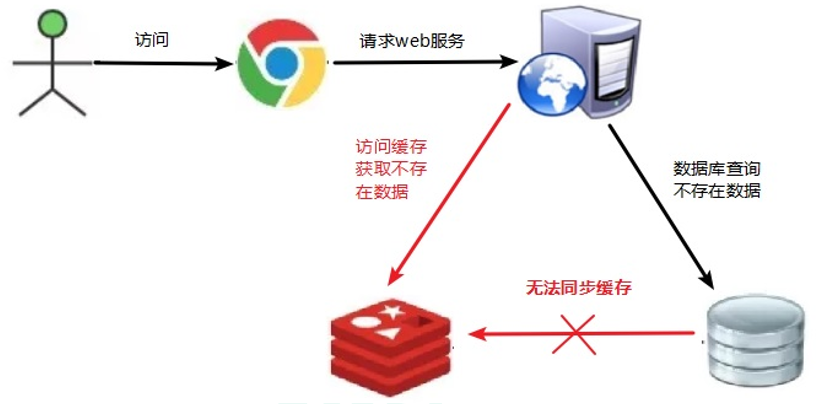

### 10.1.2. 解决方案
1. **对空值缓存**
   如果一个查询返回的数据为空（不管是数据是否不存在），我们仍然把这个空结果（null）进行缓存，设置空结果的过期时间会很短，最长不超过五分钟
2. **设置可访问的名单（白名单）**
    使用bitmaps类型定义一个可以访问的名单，名单id作为bitmaps的偏移量，每次访问和bitmap里面的id进行比较，如果访问id不在bitmaps里面，进行拦截，不允许访问。
3. **采用布隆过滤器**
    (布隆过滤器（Bloom Filter）是1970年由布隆提出的。它实际上是一个很长的二进制向量(位图)和一系列随机映射函数（哈希函数）。
    布隆过滤器可以用于检索一个元素是否在一个集合中。它的优点是空间效率和查询时间都远远超过一般的算法，缺点是有一定的误识别率和删除困难。)
    将所有可能存在的数据哈希到一个足够大的bitmaps中，一个一定不存在的数据会被这个bitmaps拦截掉，从而避免了对底层存储系统的查询压力。
    Redis的bitmap只支持2^32大小，对应到内存也就是512MB，误判率万分之一，可以放下2亿左右的数据，性能高，空间占用率及小，省去了大量无效的数据库连接。
4. **进行实时监控**
    当发现Redis的命中率开始急速降低，需要排查访问对象和访问的数据，和运维人员配合，可以设置黑名单限制服务

## 10.2. 缓存击穿
### 10.2.1. 问题描述
key对应的数据存在，但在redis中过期，此时若有大量并发请求过来，这些请求发现缓存过期一般都会从后端DB加载数据并回设到缓存，这个时候大并发的请求可能会瞬间把后端DB压垮。
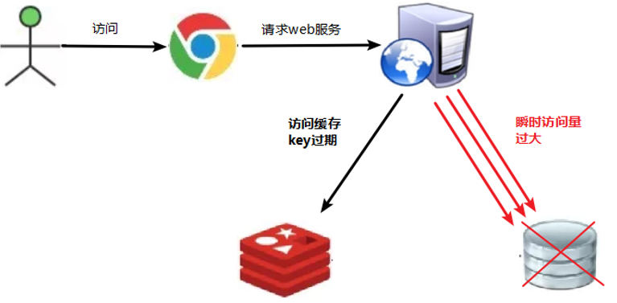
### 10.2.2. 解决方案
key可能会在某些时间点被超高并发地访问，是一种非常“热点”的数据。这个时候，需要考虑一个问题：缓存被“击穿”的问题。
解决问题：
1. 预先设置热门数据：在redis高峰访问之前，把一些热门数据提前存入到redis里面，加大这些热门数据key的时长
2. 实时调整：现场监控哪些数据热门，实时调整key的过期时长
3. 使用锁：
    1. 就是在缓存失效的时候（判断拿出来的值为空），不是立即去load db。
    2. 先使用缓存工具的某些带成功操作返回值的操作（比如Redis的SETNX）去set一个mutex key
    3. 当操作返回成功时，再进行load db的操作，并回设缓存,最后删除mutex key；
    4. 当操作返回失败，证明有线程在load db，当前线程睡眠一段时间再重试整个get缓存的方法。

## 10.3. 缓存雪崩
### 10.3.1. 问题描述
key对应的数据存在，但在redis中过期，此时若有大量并发请求过来，这些请求发现缓存过期一般都会从后端DB加载数据并回设到缓存，这个时候大并发的请求可能会瞬间把后端DB压垮。
缓存雪崩与缓存击穿的区别在于这里针对**很多key缓存**，前者则是**某一个key**
**正常访问**
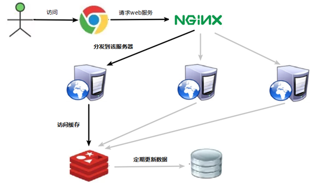
**缓存失效瞬间**
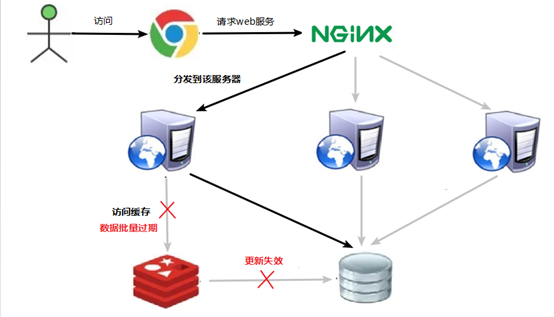

### 10.3.2. 解决方案
1. 构建多级缓存架构：
   nginx缓存 + redis缓存 +其他缓存（ehcache等）
2. 使用锁或队列：
    用加锁或者队列的方式保证来保证不会有大量的线程对数据库一次性进行读写，从而避免失效时大量的并发请求落到底层存储系统上。不适用高并发情况
3. 设置过期标志更新缓存：
    记录缓存数据是否过期（设置提前量），如果过期会触发通知另外的线程在后台去更新实际key的缓存。
4. 将缓存失效时间分散开：
    比如我们可以在原有的失效时间基础上增加一个随机值，比如1-5分钟随机，这样每一个缓存的过期时间的重复率就会降低，就很难引发集体失效的事件。

## 10.4. 分布式锁
### 10.4.1. 问题描述
随着业务发展的需要，原单体单机部署的系统被演化成分布式集群系统后，由于分布式系统多线程、多进程并且分布在不同机器上，这将使原单机部署情况下的并发控制锁策略失效，单纯的Java API并不能提供分布式锁的能力。为了解决这个问题就需要一种跨JVM的互斥机制来控制共享资源的访问，这就是分布式锁要解决的问题！
分布式锁**主流的实现方案**：
1. 基于数据库实现分布式锁
2. 基于缓存（Redis等）
3. 基于Zookeeper

每一种分布式锁解决方案都有各自的**优缺点**：
1. 性能：redis最高
2. 可靠性：zookeeper最高
这里，我们就基于redis实现分布式锁。

### 10.4.2. 解决方案
- `EX second` ：设置键的过期时间为 second 秒。 `SET key value EX second` 效果等同于 `SETEX key second value` 。
- `PX millisecond` ：设置键的过期时间为 millisecond 毫秒。 `SET key value PX millisecond` 效果等同于 `PSETEX key millisecond value`。
- `NX` ：只在键不存在时，才对键进行设置操作。 `SET key value NX` 效果等同于 `SETNX key value`。
- `XX` ：只在键已经存在时，才对键进行设置操作。

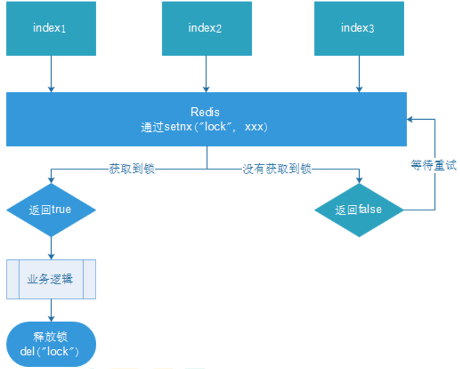
1. 多个客户端同时获取锁（setnx）
2. 获取成功，执行业务逻辑{从db获取数据，放入缓存}，执行完成释放锁（del）
3. 其他客户端等待重试

为了确保**分布式锁**可用，我们至少要确保锁的实现同时满足以下**四个条件**：
- 互斥性。在任意时刻，只有一个客户端能持有锁。
- 不会发生死锁。即使有一个客户端在持有锁的期间崩溃而没有主动解锁，也能保证后续其他客户端能加锁。（设置过期时间）
- 解铃还须系铃人。加锁和解锁必须是同一个客户端，客户端自己不能把别人加的锁给解了。（设置锁的UUID，解锁时比较UUID）
- 加锁和解锁必须具有**原子性**。（利用Lua脚本）

# 11. Redis6新特性
## 11.1. ACL
Redis ACL是Access Control List（访问控制列表）的缩写，该功能允许根据可以执行的命令和可以访问的键来限制某些连接。Redis 6 则提供ACL的功能对用户进行更细粒度的权限控制 ：
1. 接入权限:用户名和密码 
2. 可以执行的命令 
3. 可以操作的 KEY

**常用命令**
- `acl list` 展现用户权限列表
- `acl cat` 查看添加权限指令类别
- `acl whoami` 查看当前用户
- `acl setuser` 创建和编辑用户ACL

## 11.2. IO多线程
IO多线程指客户端交互部分的**网络IO交互处理模块多线程**，而非执行命令多线程。Redis6执行命令依然是单线程。
Redis 的多线程部分只是用来处理网络数据的读写和协议解析，执行命令仍然是单线程。之所以这么设计是不想因为多线程而变得复杂，需要去控制 key、lua、事务，LPUSH/LPOP 等等的并发问题。整体的设计大体如下:
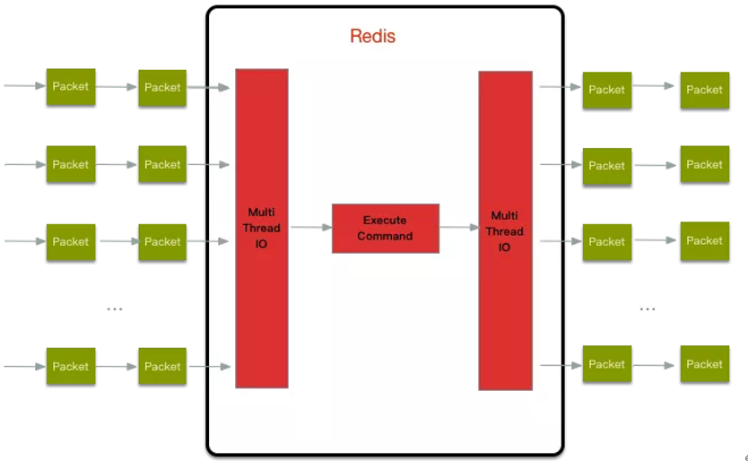


