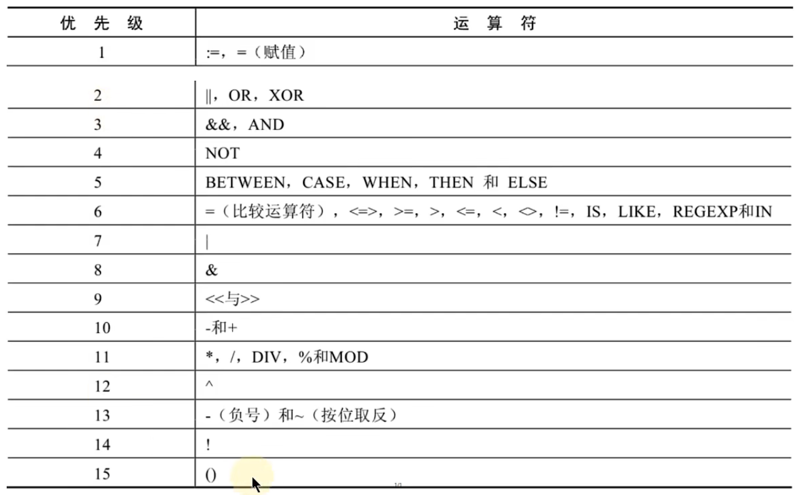
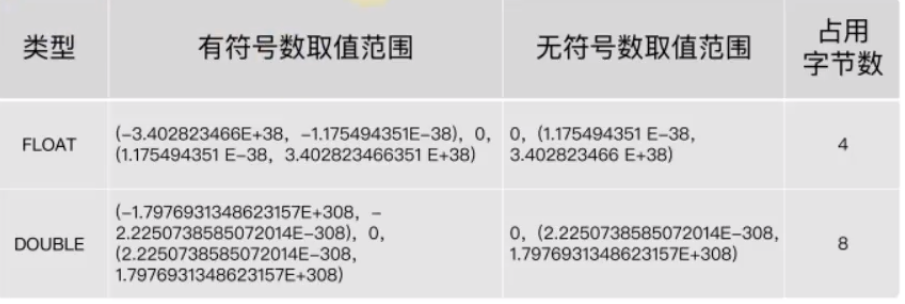
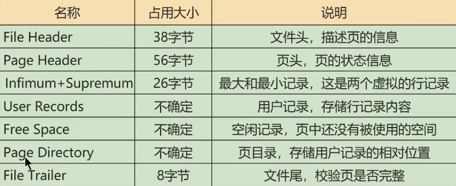

<h1 align="center" style="color: Navy">Mysql</h1>

- [1. MySQL大纲](#1-mysql大纲)
  - [1.1. 基础篇](#11-基础篇)
    - [1.1.1. RDBMS与非RDBMS](#111-rdbms与非rdbms)
    - [1.1.2. 关系型数据库设计规则](#112-关系型数据库设计规则)
      - [1.1.2.1. 表、纪录、字段](#1121-表纪录字段)
      - [1.1.2.2. 表的关联关系](#1122-表的关联关系)
  - [1.2. 高级篇](#12-高级篇)
- [2. SQL命令行](#2-sql命令行)
- [3. 基本的SELECT语句](#3-基本的select语句)
  - [3.1. 课后练习](#31-课后练习)
- [4. 运算符](#4-运算符)
  - [4.1. 算数运算符](#41-算数运算符)
  - [4.2. 比较运算符](#42-比较运算符)
  - [4.3. 关键字运算符](#43-关键字运算符)
  - [4.4. 逻辑运算符](#44-逻辑运算符)
  - [4.5. 位运算符及优先级](#45-位运算符及优先级)
  - [4.6. 课后练习](#46-课后练习)
- [5. 排序与分页](#5-排序与分页)
  - [5.1. 排序](#51-排序)
  - [5.2. 分页](#52-分页)
  - [5.3. 课后练习](#53-课后练习)
- [6. 多表查询](#6-多表查询)
  - [6.1. 注意事项](#61-注意事项)
  - [6.2. 内连接](#62-内连接)
  - [6.3. 外连接](#63-外连接)
  - [6.4. UNION的使用](#64-union的使用)
  - [6.5. NATURAL JOIN 与 USING的使用](#65-natural-join-与-using的使用)
  - [6.6. 课后练习](#66-课后练习)
- [7. 单行函数](#7-单行函数)
  - [7.1. 数值函数](#71-数值函数)
    - [7.1.1. 基本函数](#711-基本函数)
  - [7.2. 字符串函数](#72-字符串函数)
  - [7.3. 日期和时间函数](#73-日期和时间函数)
    - [7.3.1. 获取日期、时间](#731-获取日期时间)
    - [7.3.2. 日期与时间戳转换](#732-日期与时间戳转换)
    - [7.3.3. 获取月份、星期、星期数、天数等函数](#733-获取月份星期星期数天数等函数)
    - [7.3.4. 日期的操作函数](#734-日期的操作函数)
    - [7.3.5. 时间和秒钟转换函数](#735-时间和秒钟转换函数)
    - [7.3.6. 计算日期和时间的函数](#736-计算日期和时间的函数)
    - [7.3.7. 日期的格式化与解析](#737-日期的格式化与解析)
    - [7.3.8. 流程控制函数](#738-流程控制函数)
    - [7.3.9. 加密与解密函数](#739-加密与解密函数)
    - [7.3.10. MySQL信息函数](#7310-mysql信息函数)
  - [7.4. 课后练习](#74-课后练习)
- [8. 聚合函数](#8-聚合函数)
  - [8.1. 常见的几个聚合函数](#81-常见的几个聚合函数)
    - [8.1.1. AVG/SUM](#811-avgsum)
    - [8.1.2. MAX/MIN](#812-maxmin)
    - [8.1.3. COUNT](#813-count)
  - [8.2. GROUP BY的使用](#82-group-by的使用)
  - [8.3. HAVING的使用](#83-having的使用)
  - [8.4. SQL底层执行原理](#84-sql底层执行原理)
    - [8.4.1. SELECT语句的完整结构](#841-select语句的完整结构)
    - [8.4.2. SQL语句执行过程：](#842-sql语句执行过程)
  - [8.5. 课后练习](#85-课后练习)
- [9. 子查询](#9-子查询)
  - [9.1. 引言](#91-引言)
    - [9.1.1. 子查询的使用](#911-子查询的使用)
    - [9.1.2. 子查询的分类](#912-子查询的分类)
    - [9.1.3. 子查询编写步骤](#913-子查询编写步骤)
  - [9.2. 单行子查询](#92-单行子查询)
  - [9.3. 多行子查询](#93-多行子查询)
  - [9.4. 相关子查询](#94-相关子查询)
    - [9.4.1. EXISTS 与 NOT EXISTS关键字](#941-exists-与-not-exists关键字)
- [10. 创建和管理表](#10-创建和管理表)
  - [10.1. 基础知识](#101-基础知识)
  - [10.2. 创建和管理数据库](#102-创建和管理数据库)
    - [10.2.1. 创建数据库](#1021-创建数据库)
    - [10.2.2. 管理数据库](#1022-管理数据库)
    - [10.2.3. 修改数据库](#1023-修改数据库)
    - [10.2.4. 删除数据库](#1024-删除数据库)
  - [10.3. 创建表](#103-创建表)
  - [10.4. 修改表](#104-修改表)
    - [10.4.1. 添加字段](#1041-添加字段)
    - [10.4.2. 修改字段](#1042-修改字段)
    - [10.4.3. 重命名字段](#1043-重命名字段)
    - [10.4.4. 删除字段](#1044-删除字段)
  - [10.5. 重命名表](#105-重命名表)
  - [10.6. 删除表](#106-删除表)
  - [10.7. 清空表](#107-清空表)
  - [10.8. DCL中COMMIT和ROLLBACK](#108-dcl中commit和rollback)
  - [10.9. TRUNCATE TABLE和 DELETE FROM](#109-truncate-table和-delete-from)
  - [10.10. DDL 和 DML 的说明](#1010-ddl-和-dml-的说明)
  - [10.11. 课后练习](#1011-课后练习)
- [11. 数据处理之增删改](#11-数据处理之增删改)
  - [11.1. 添加数据](#111-添加数据)
  - [11.2. 更新数据](#112-更新数据)
  - [11.3. 删除数据](#113-删除数据)
  - [11.4. MySQL8新特性：计算列](#114-mysql8新特性计算列)
  - [11.5. 课后练习](#115-课后练习)
- [12. MySQL数据类型](#12-mysql数据类型)
  - [12.1. MySQL数据类型总结](#121-mysql数据类型总结)
  - [12.2. 整数类型](#122-整数类型)
  - [12.3. 浮点类型](#123-浮点类型)
  - [12.4. 定点数类型](#124-定点数类型)
  - [12.5. 位类型](#125-位类型)
  - [12.6. 日期与时间类型](#126-日期与时间类型)
  - [12.7. 文本字符串类型](#127-文本字符串类型)
  - [12.8. 二进制字符串类型](#128-二进制字符串类型)
  - [12.9. JSON类型](#129-json类型)
  - [12.10. 空间类型](#1210-空间类型)
- [13. 约束](#13-约束)
  - [13.1. 约束概述](#131-约束概述)
  - [13.2. 非空约束](#132-非空约束)
  - [13.3. 唯一性约束](#133-唯一性约束)
    - [13.3.1. 添加唯一性约束](#1331-添加唯一性约束)
    - [13.3.2. 复合的唯一性约束](#1332-复合的唯一性约束)
    - [13.3.3. 删除唯一性约束](#1333-删除唯一性约束)
  - [13.4. PRIMARY KEY 约束](#134-primary-key-约束)
  - [13.5. 自增列：AUTO_INCREMENT](#135-自增列auto_increment)
  - [13.6. FOREIGN KEY 约束](#136-foreign-key-约束)
    - [13.6.1. 添加外键约束](#1361-添加外键约束)
    - [13.6.2. 约束等级](#1362-约束等级)
- [14. CHECK 约束](#14-check-约束)
- [15. DEFAULT 约束](#15-default-约束)
  - [15.1. 课后练习](#151-课后练习)
- [16. 视图](#16-视图)
  - [16.1. 常见的数据库对象](#161-常见的数据库对象)
  - [16.2. 创建视图](#162-创建视图)
  - [16.3. 查看视图](#163-查看视图)
  - [16.4. 视图更新](#164-视图更新)
  - [16.5. 修改和删除视图](#165-修改和删除视图)
  - [16.6. 课后练习](#166-课后练习)
- [17. 存储过程与函数](#17-存储过程与函数)
  - [17.1. 创建存储过程](#171-创建存储过程)
  - [17.2. 存储函数的使用](#172-存储函数的使用)
    - [17.2.1. 存储过程和存储函数的对比](#1721-存储过程和存储函数的对比)
  - [17.3. 存储过程和函数的查看、修改、删除](#173-存储过程和函数的查看修改删除)
    - [17.3.1. 查看](#1731-查看)
  - [17.4. 修改](#174-修改)
  - [17.5. 删除](#175-删除)
  - [17.6. 课后练习](#176-课后练习)
- [18. 变量、流程控制与游标](#18-变量流程控制与游标)
  - [18.1. 变量](#181-变量)
    - [18.1.1. 系统变量](#1811-系统变量)
    - [18.1.2. 用户变量](#1812-用户变量)
      - [18.1.2.1. 用户变量分类](#18121-用户变量分类)
      - [18.1.2.2. 会话用户变量](#18122-会话用户变量)
      - [18.1.2.3. 局部变量](#18123-局部变量)
      - [18.1.2.4. 会话用户变量与局部变量对比](#18124-会话用户变量与局部变量对比)
  - [18.2. 定义条件与处理程序](#182-定义条件与处理程序)
    - [18.2.1. 定义条件](#1821-定义条件)
    - [18.2.2. 定义处理程序](#1822-定义处理程序)
  - [18.3. 流程控制](#183-流程控制)
    - [18.3.1. 分支结构之IF](#1831-分支结构之if)
    - [18.3.2. 分支结构之CASE](#1832-分支结构之case)
    - [18.3.3. LOOP、WHILE、REPEAT](#1833-loopwhilerepeat)
    - [18.3.4. 跳转语句LEAVE](#1834-跳转语句leave)
    - [18.3.5. 跳转语句ITERATE](#1835-跳转语句iterate)
  - [18.4. 游标](#184-游标)
  - [18.5. 课后练习](#185-课后练习)
- [19. 触发器](#19-触发器)
  - [19.1. 触发器创建](#191-触发器创建)
  - [19.2. 查看、删除触发器](#192-查看删除触发器)
  - [19.3. 触发器优缺点](#193-触发器优缺点)
  - [19.4. 课后练习](#194-课后练习)
- [20. MySQL 8.0新特性](#20-mysql-80新特性)
  - [20.1. 窗口函数](#201-窗口函数)
  - [20.2. 公用表表达式](#202-公用表表达式)
  - [20.3. 课后练习](#203-课后练习)
- [21. 用户与权限管理](#21-用户与权限管理)
  - [21.1. 用户管理](#211-用户管理)
    - [21.1.1. 登录Mysql服务器](#2111-登录mysql服务器)
    - [21.1.2. 创建用户](#2112-创建用户)
    - [21.1.3. 修改用户](#2113-修改用户)
    - [21.1.4. 删除用户](#2114-删除用户)
    - [21.1.5. 设置当前用户密码](#2115-设置当前用户密码)
    - [21.1.6. 修改其他用户密码](#2116-修改其他用户密码)
  - [21.2. 权限管理](#212-权限管理)
    - [21.2.1. 授予权限](#2121-授予权限)
    - [21.2.2. 查看权限](#2122-查看权限)
    - [21.2.3. 收回权限](#2123-收回权限)
  - [21.3. 权限表](#213-权限表)
  - [21.4. 角色管理](#214-角色管理)
    - [21.4.1. 角色的定义](#2141-角色的定义)
    - [21.4.2. 创建角色](#2142-创建角色)
    - [21.4.3. 给角色赋予权限](#2143-给角色赋予权限)
    - [21.4.4. 查看角色权限](#2144-查看角色权限)
    - [21.4.5. 回收角色权限](#2145-回收角色权限)
    - [21.4.6. 删除角色](#2146-删除角色)
    - [21.4.7. 给用户赋予角色](#2147-给用户赋予角色)
    - [21.4.8. 激活角色](#2148-激活角色)
    - [21.4.9. 撤销角色](#2149-撤销角色)
- [22. 逻辑架构](#22-逻辑架构)
  - [22.1. 服务器处理客户端请求](#221-服务器处理客户端请求)
  - [22.2. Connectors](#222-connectors)
    - [22.2.1. 连接层](#2221-连接层)
    - [22.2.2. 服务层](#2222-服务层)
    - [22.2.3. 引擎层](#2223-引擎层)
    - [22.2.4. 存储层](#2224-存储层)
  - [22.3. SQL执行流程](#223-sql执行流程)
    - [22.3.1. Mysql中的SQL执行流程](#2231-mysql中的sql执行流程)
    - [22.3.2. 数据库缓冲池（buffer pool）](#2232-数据库缓冲池buffer-pool)
- [23. 存储引擎](#23-存储引擎)
  - [23.1. 引擎介绍](#231-引擎介绍)
    - [23.1.1. InnoDB引擎](#2311-innodb引擎)
    - [23.1.2. MyISAM引擎：](#2312-myisam引擎)
    - [23.1.3. 引擎对比](#2313-引擎对比)
- [24. 索引的数据结构](#24-索引的数据结构)
  - [24.1. 索引及其优缺点](#241-索引及其优缺点)
  - [24.2. 索引的设计](#242-索引的设计)
  - [24.3. 常见索引概念](#243-常见索引概念)
    - [24.3.1. 聚簇索引](#2431-聚簇索引)
    - [24.3.2. 二级索引（辅助索引、非聚簇索引）](#2432-二级索引辅助索引非聚簇索引)
    - [24.3.3. InnoDB的B+树索引的注意事项](#2433-innodb的b树索引的注意事项)
  - [24.4. MyISAM中的索引方案](#244-myisam中的索引方案)
    - [24.4.1. MyISAM与InnoDB对比](#2441-myisam与innodb对比)
  - [24.5. 索引的代价](#245-索引的代价)
- [25. InnoDB数据存储结构](#25-innodb数据存储结构)
- [26. 数据库的存储结构：页](#26-数据库的存储结构页)
  - [26.1. 磁盘与内存交互基本单位：页](#261-磁盘与内存交互基本单位页)
  - [26.2. 页的内部结构](#262-页的内部结构)
  - [26.3. 区、段、碎片区](#263-区段碎片区)
  - [26.4. 表空间](#264-表空间)
    - [26.4.1. 独立表空间](#2641-独立表空间)
    - [26.4.2. 系统表空间](#2642-系统表空间)
- [27. 索引的创建与设计原则](#27-索引的创建与设计原则)
  - [27.1. 索引的声明与使用](#271-索引的声明与使用)
    - [27.1.1. 创建索引](#2711-创建索引)
    - [27.1.2. 查看索引](#2712-查看索引)
    - [27.1.3. 修改索引](#2713-修改索引)
    - [27.1.4. 删除索引](#2714-删除索引)
    - [27.1.5. 隐藏索引](#2715-隐藏索引)
  - [27.2. 索引的设计原则](#272-索引的设计原则)
    - [27.2.1. 哪些情况适合创建索引](#2721-哪些情况适合创建索引)
    - [27.2.2. 不适合创建索引的情况](#2722-不适合创建索引的情况)
- [28. 性能分析工具使用](#28-性能分析工具使用)
  - [28.1. 查看系统性能参数](#281-查看系统性能参数)
  - [28.2. 统计SQL的查询成本](#282-统计sql的查询成本)
  - [28.3. 定位执行慢的SQL：慢查询日志](#283-定位执行慢的sql慢查询日志)
    - [28.3.1. 开启慢查询日志](#2831-开启慢查询日志)
    - [28.3.2. 查看慢查询数目](#2832-查看慢查询数目)
    - [28.3.3. 慢查询日志分析工具](#2833-慢查询日志分析工具)
    - [28.3.4. 关闭慢查询日志](#2834-关闭慢查询日志)
  - [28.4. 查看SQL执行成本](#284-查看sql执行成本)
  - [28.5. 分析查询语句：EXPLAIN](#285-分析查询语句explain)
    - [28.5.1. 基本语法](#2851-基本语法)
    - [28.5.2. EXPLAIN各列作用](#2852-explain各列作用)
      - [28.5.2.1. table](#28521-table)
      - [28.5.2.2. id](#28522-id)
      - [28.5.2.3. select_type](#28523-select_type)
      - [28.5.2.4. type](#28524-type)
      - [28.5.2.5. key_len](#28525-key_len)
      - [28.5.2.6. Extra](#28526-extra)
  - [28.6. EXPLAIN的进一步使用](#286-explain的进一步使用)
    - [28.6.1. EXPLAIN的四种格式](#2861-explain的四种格式)
    - [28.6.2. SHOW WARNING](#2862-show-warning)
  - [28.7. MySQL监控分析视图-sys schema](#287-mysql监控分析视图-sys-schema)
  - [28.8. Sys schema视图摘要](#288-sys-schema视图摘要)
  - [28.9. Sys schema视图使用场景](#289-sys-schema视图使用场景)
- [29. 索引优化与查询优化](#29-索引优化与查询优化)
  - [29.1. 索引失效案例](#291-索引失效案例)
    - [29.1.1. 计算、函数、类型转换(自动或手动)导致索引失效](#2911-计算函数类型转换自动或手动导致索引失效)
    - [29.1.2. 类型转换导致索引失效](#2912-类型转换导致索引失效)
    - [29.1.3. 范围条件右边的列索引失效](#2913-范围条件右边的列索引失效)
    - [29.1.4. 不等于(!= 或者<>)索引失效](#2914-不等于-或者索引失效)
    - [29.1.5. is null可以使用索引，is not null无法使用索引](#2915-is-null可以使用索引is-not-null无法使用索引)
    - [29.1.6. like以通配符%开头索引失效](#2916-like以通配符开头索引失效)
    - [29.1.7. OR前后存在非索引的列，索引失效](#2917-or前后存在非索引的列索引失效)
  - [29.2. 关联查询优化](#292-关联查询优化)
    - [29.2.1. JOIN语句原理](#2921-join语句原理)
  - [29.3. 子查询优化](#293-子查询优化)
  - [29.4. 排序优化](#294-排序优化)
    - [29.4.1. 排序优化](#2941-排序优化)
    - [29.4.2. filesort算法](#2942-filesort算法)
  - [29.5. GROUP BY优化](#295-group-by优化)
  - [29.6. 优化分页查询](#296-优化分页查询)
  - [29.7. 优先考虑覆盖索引](#297-优先考虑覆盖索引)
    - [29.7.1. 覆盖索引的利弊](#2971-覆盖索引的利弊)
  - [29.8. 索引下推](#298-索引下推)
  - [29.9. 普通索引 vs 唯一索引](#299-普通索引-vs-唯一索引)
  - [29.10. 其他查询优化策略](#2910-其他查询优化策略)
    - [29.10.1. EXISTS和IN](#29101-exists和in)
    - [29.10.2. COUNT(*)与COUNT(具体字段)效率](#29102-count与count具体字段效率)
    - [29.10.3. SELECT(*)](#29103-select)
    - [29.10.4. 多使用COMMIT](#29104-多使用commit)
- [30. 数据库的设计规范](#30-数据库的设计规范)
  - [30.1. 范式](#301-范式)
    - [30.1.1. 第一范式](#3011-第一范式)
    - [30.1.2. 第二范式](#3012-第二范式)
    - [30.1.3. 第三范式](#3013-第三范式)
  - [30.2. 反范式化](#302-反范式化)
    - [30.2.1. 概述](#3021-概述)
    - [30.2.2. 反范式化的新问题](#3022-反范式化的新问题)
    - [30.2.3. 反范式化的适应场景](#3023-反范式化的适应场景)
  - [30.3. BCNF巴斯范式](#303-bcnf巴斯范式)
  - [30.4. 第四范式](#304-第四范式)
  - [30.5. ER模型](#305-er模型)
    - [30.5.1. ER模型组成](#3051-er模型组成)
    - [30.5.2. 关系的类型](#3052-关系的类型)
    - [30.5.3. 数据表的设计原则](#3053-数据表的设计原则)
  - [30.6. 数据库对象编写建议](#306-数据库对象编写建议)
    - [30.6.1. 库](#3061-库)
    - [30.6.2. 表、列](#3062-表列)
    - [30.6.3. 索引](#3063-索引)
    - [30.6.4. SQL编写](#3064-sql编写)
- [31. 数据库其他调优策略](#31-数据库其他调优策略)
  - [31.1. 数据库调优的措施](#311-数据库调优的措施)
    - [31.1.1. 调优的维度和步骤](#3111-调优的维度和步骤)
  - [31.2. 优化数据库结构](#312-优化数据库结构)
    - [31.2.1. 拆分表：冷热数据分离](#3121-拆分表冷热数据分离)
    - [31.2.2. 增加中间表](#3122-增加中间表)
    - [31.2.3. 增加冗余字段](#3123-增加冗余字段)
    - [31.2.4. 优化数据类型](#3124-优化数据类型)
    - [31.2.5. 优化插入记录的速度](#3125-优化插入记录的速度)
    - [31.2.6. 使用非空约束](#3126-使用非空约束)
  - [31.3. 大表优化](#313-大表优化)
- [32. 事务基础知识](#32-事务基础知识)
  - [32.1. 事务概述](#321-事务概述)
  - [32.2. 事务的ACID特性](#322-事务的acid特性)
  - [32.3. 事务的状态](#323-事务的状态)
  - [32.4. 使用事务](#324-使用事务)
    - [32.4.1. 显式事务](#3241-显式事务)
    - [32.4.2. 隐式事务](#3242-隐式事务)
    - [32.4.3. 隐式提交数据的情况](#3243-隐式提交数据的情况)
  - [32.5. 事务的隔离级别](#325-事务的隔离级别)
    - [32.5.1. 数据并发问题](#3251-数据并发问题)
    - [32.5.2. SQL中的四种隔离级别](#3252-sql中的四种隔离级别)
    - [32.5.3. 设置隔离级别](#3253-设置隔离级别)
  - [32.6. 事务的常见分类](#326-事务的常见分类)
- [33. MySQL事务日志](#33-mysql事务日志)
  - [33.1. redo日志](#331-redo日志)
  - [33.2. undo日志](#332-undo日志)
    - [33.2.1. undo存储结构](#3321-undo存储结构)
- [34. 锁](#34-锁)
  - [34.1. MySQL并发事务访问相同记录](#341-mysql并发事务访问相同记录)
    - [34.1.1. 读-读情况](#3411-读-读情况)
    - [34.1.2. 写-写情况](#3412-写-写情况)
    - [34.1.3. 读-写/写-读情况](#3413-读-写写-读情况)
    - [34.1.4. 并发问题解决方案](#3414-并发问题解决方案)
  - [34.2. 锁的不同角度分类](#342-锁的不同角度分类)
    - [34.2.1. 读锁、写锁](#3421-读锁写锁)
    - [34.2.2. 表级锁、页级锁、行锁](#3422-表级锁页级锁行锁)
      - [34.2.2.1. 表锁](#34221-表锁)
      - [34.2.2.2. 行锁](#34222-行锁)
      - [34.2.2.3. 页锁](#34223-页锁)
    - [34.2.3. 乐观锁、悲观锁](#3423-乐观锁悲观锁)
    - [34.2.4. 显式锁、隐式锁](#3424-显式锁隐式锁)
    - [34.2.5. 全局锁](#3425-全局锁)
    - [34.2.6. 死锁](#3426-死锁)
  - [34.3. 锁结构](#343-锁结构)
- [35. 多版本并发控制](#35-多版本并发控制)
  - [35.1. MVCC概念](#351-mvcc概念)
  - [35.2. 快照读与当前读](#352-快照读与当前读)
  - [35.3. MVCC实现原理之ReadView](#353-mvcc实现原理之readview)
    - [35.3.1. 隐藏字段、Undo Log版本链](#3531-隐藏字段undo-log版本链)
    - [35.3.2. 设计思路](#3532-设计思路)
    - [35.3.3. Reviewd的规则](#3533-reviewd的规则)
    - [35.3.4. MVCC整体操作流程](#3534-mvcc整体操作流程)
- [36. 其他数据库日志](#36-其他数据库日志)
  - [36.1. MySQL支持的日志](#361-mysql支持的日志)
  - [36.2. 通用查询日志(general query log)](#362-通用查询日志general-query-log)
  - [36.3. 错误日志(error log)](#363-错误日志error-log)
  - [36.4. 二进制日志(bin log)](#364-二进制日志bin-log)
    - [36.4.1. 日志查看](#3641-日志查看)
    - [36.4.2. 数据恢复](#3642-数据恢复)
    - [36.4.3. 删除二进制日志](#3643-删除二进制日志)
    - [36.4.4. 写入机制](#3644-写入机制)
    - [36.4.5. binlog与redolog对比](#3645-binlog与redolog对比)
- [37. 主从复制](#37-主从复制)
  - [37.1. 主从复制原理](#371-主从复制原理)
  - [37.2. 同步数据一致性问题](#372-同步数据一致性问题)
- [38. 数据库备份与恢复](#38-数据库备份与恢复)
  - [38.1. 物理备份与逻辑备份](#381-物理备份与逻辑备份)
  - [38.2. mysqldump实现逻辑备份](#382-mysqldump实现逻辑备份)
  - [38.3. mysql命令恢复数据](#383-mysql命令恢复数据)
  - [38.4. 物理备份：直接复制整个数据库](#384-物理备份直接复制整个数据库)
  - [38.5. 表的导出与导入](#385-表的导出与导入)
    - [38.5.1. 导出表](#3851-导出表)

# 1. MySQL大纲
## 1.1. 基础篇
<center>
    
    <br>
    <div style="color:orange; border-bottom: 1px solid #d9d9d9;
    display: inline-block;
    color: #999;
    padding: 2px;">基础篇学习路线</div>
</center>

**数据库概念**
1. DB-数据库（Database）
2. DBMS-数据库管理系统
3. SQL-结构化查询语言

### 1.1.1. RDBMS与非RDBMS
**关系型数据库（RDBMS**
<center>
    
    <br>
    <div style="color:orange; border-bottom: 1px solid #d9d9d9;
    display: inline-block;
    color: #999;
    padding: 2px;">关系型数据库</div>
</center>

- 实质：以**行**和**列**形式存储数据。
- 优势：复杂查询+事务支持

**非关系型数据库(非RDBMS)**

分类：
- 键值型数据库 key-value
- 文档型数据库 MongoDB
- 搜索引擎数据库
- 列式数据库：相对于行式存储而言，优势在于大量降低系统I/O，适合分布式文件系统
- 图形数据库
<center>
    
    <br>
    <div style="color:orange; border-bottom: 1px solid #d9d9d9;
    display: inline-block;
    color: #999;
    padding: 2px;">键值型数据库</div>
</center>

<center>
    
    <br>
    <div style="color:orange; border-bottom: 1px solid #d9d9d9;
    display: inline-block;
    color: #999;
    padding: 2px;">行式数据库与列式数据库</div>
</center>

### 1.1.2. 关系型数据库设计规则
#### 1.1.2.1. 表、纪录、字段
E-R模型（entity-relationship）主要包含三个概念：实体集、属性、联系集。一个实体集对应一个表，一个实体对应表中的一行，一个属性为一列，也叫做字段/属性。
<center>
    
    <br>
    <div style="color:orange; border-bottom: 1px solid #d9d9d9;
    display: inline-block;
    color: #999;
    padding: 2px;">表、纪录、字段的关系</div>
</center>

#### 1.1.2.2. 表的关联关系
- **一对一关联**(one-to-one)：即两个表的纪录是一一对应关系。两种建表原则：
  - 外键唯一：主表的主键和从表的外键（唯一），形成主外键关系，外键唯一。
  - 外键是主键：主表的主键和从表的主键，形成主外键关系。
- **一对多关系**(one-to-many)：举例：部门表和员工表。建表原则：在从表创建一个字段，字段作为外键指向主表（一方）的主键。
- **多对多**(many-to-many)：必须创建第三个表，此表为链接表。

## 1.2. 高级篇
<center>
    
    <br>
    <div style="color:orange; border-bottom: 1px solid #d9d9d9;
    display: inline-block;
    color: #999;
    padding: 2px;">高级篇学习路线</div>
</center>

# 2. SQL命令行

# 3. 基本的SELECT语句
**SQL的分类**
- DDL数据定义语言。CREATE\ALTER\DROP\RENAME\TRUNCATE
- DML数据操作语言。INSERT\DELETE\UPDATE\SELECT
- DCL数据控制语言。COMMIT\ROLLBACK\SAVEPOINT\GRANT\REVOKE

**SQL大小写规范**
- MySQL在windows下是大小写不敏感的
- MySQL在Linux下是大小写敏感的
- 推荐的统一书写规范：
    - 数据库名、表名、表段名、字段名、字段别名都小写
	- SQL关键字、函数名，绑定变量都大写

**基本的SELECT语句**
- SELECT 字段1，字段2，… FROM 表名
- 列的别名：
    - SELECT 字段1 AS 别名1 FROM 表名
	- SELECT 字段1(空格)别名1 FROM 表名
列名可以使用一对“”引起来
- 去除重复行：SELECT DISTINCT  每个DISTINCT只能去重一个属性
- 空值参与运算
    - 空值：NULL。不等同于0，'','null'
- 着重号：SELECT * FROM `order` 当表与关键字重名时，需要用着重号
- 显示表结构：DESCRIBE 表名 或 DESC 表名

**过滤数据**
SELECT * FROM employees  WHERE department_id = 90;

## 3.1. 课后练习
```sql
# 第三章SELECT课后练习
# 1.查询员工12个月的工资总和，并起别名为ANNUAL SALARY
SELECT employee_id, 12*salary*(1+IFNULL(commission_pct,0)) AS "ANNUAL SALARY" 
FROM employees;

# 2.查询employees表中去出重复的job_id以后的数据
SELECT DISTINCT job_id 
FROM employees;

# 3.查询工资大于12000的员工姓名和工资
SELECT first_name,last_name,salary 
FROM employees 
WHERE salary > 12000;

# 4.查询员工号为176的员工的姓名和部门号
SELECT first_name,last_name,department_id 
FROM employees 
WHERE employee_id = 176;

# 5.显示表 departments 的结构，并查询其中的全部数据
DESC departments;
SELECT * 
FROM departments;
```

# 4. 运算符
## 4.1. 算数运算符
包含 ```+ - * /(div) %(mod)```

## 4.2. 比较运算符
- 安全等于和等于区别：安全等于可以对```NULL```值进行判断。而普通等于中，任何值与NULL进行对比，结果都为```NULL```。
- 模糊查询**LIKE**：```%```表示不确定字符，```_```代表一个不确定的字符。中间可能用到转义字符```'\'```。
- 正则表达式**REGEXP**和**RLIKE**。
    - ```'^'```匹配以该字符后面的字符开头的字符串。
	- ```'$'```匹配以该字符前面的字符结尾的字符串。
	- ```'.'```匹配任何一个单字符。
	- ```[…]```匹配在方括号内的任何字符。使用'-'可以匹配范围字符。
    - ```'*'```匹配零个或多个在它前面的字符。

<center>
    
    <br>
    <div style="color:orange; border-bottom: 1px solid #d9d9d9;
    display: inline-block;
    color: #999;
    padding: 2px;">比较运算符</div>
</center>

## 4.3. 关键字运算符
<center>
    
    <br>
    <div style="color:orange; border-bottom: 1px solid #d9d9d9;
    display: inline-block;
    color: #999;
    padding: 2px;">关键字运算符</div>
</center>

## 4.4. 逻辑运算符

<center>
    
    <br>
    <div style="color:orange; border-bottom: 1px solid #d9d9d9;
    display: inline-block;
    color: #999;
    padding: 2px;">逻辑运算符</div>
</center>

## 4.5. 位运算符及优先级

<center>
    
    <br>
    <div style="color:orange; border-bottom: 1px solid #d9d9d9;
    display: inline-block;
    color: #999;
    padding: 2px;">位运算符</div>
</center>

<center>
    
    <br>
    <div style="color:orange; border-bottom: 1px solid #d9d9d9;
    display: inline-block;
    color: #999;
    padding: 2px;">运算符的优先级</div>
</center>

## 4.6. 课后练习

```sql
# 1.选择工资不在5000到12000的员工的姓名和工资
SELECT first_name,last_name,salary 
FROM employees 
WHERE salary NOT BETWEEN 5000 AND 12000;

# 2.选择在20或50号部门工作的员工姓名和部门号
SELECT first_name,last_name,department_id 
FROM employees 
WHERE department_id IN (20,50);

# 3.选择公司中没有管理者的员工姓名及job_id
SELECT first_name,last_name,job_id 
FROM employees 
WHERE manager_id is NULL;

# 4.选择公司中有奖金的员工姓名，工资和奖金级别
SELECT first_name,last_name,salary,commission_pct 
FROM employees 
WHERE commission_pct is NOT NULL;

# 5.选择员工姓名的第三个字母是a的员工姓名
SELECT first_name,last_name 
FROM employees 
WHERE last_name_name LIKE '__a%';

# 6.选择姓名中有字母a和k的员工姓名
SELECT first_name,last_name 
FROM employees 
WHERE last_name_name LIKE '%a%k%' or first_name LIKE '%k%a%';

# 7.显示出表 employees 表中 first_name 以 'e'结尾的员工信息
SELECT * 
FROM employees 
WHERE first_name REGEXP 'e$';

# 8.显示出表 employees 部门编号在 80-100 之间的姓名、工种
SELECT first_name, last_name,job_id 
FROM employees 
WHERE department_id BETWEEN 80 and 100;

# 9.显示出表 employees 的 manager_id 是 100,101,110 的员工姓名、工资、管理者id
SELECT first_name,last_name,salary,manager_id 
FROM employees 
WHERE manager_id IN (100,101,110);
```

# 5. 排序与分页
## 5.1. 排序
**ORDER BY**-对查询的数据进行排序操作
- ORDER BY 默认升序，降序需加关键字**DESC**。升序也可以加**ASC**。
- 列的别名只能在```ORDER BY```中使用，不能在```WHERE```中使用。
- ```WHERE```需要定声明在`FROM`后，```ORDER BY```之前。

## 5.2. 分页
**LIMIT**-实现对数据的分页显示
- **LIMIT** 位置偏移量，条目数。例：
```sql
    LIMIT 40,20; # 表示显示第3页的数据，其中每页20行。
```
- **LIMIT** 条目数 **OFFSET** 偏移量。例：
```sql
    LIMIT 2 OFFSET 31; # 显示第32、33条数据。
```

## 5.3. 课后练习
```sql
#1. 查询员工的姓名和部门号和年薪，按年薪降序,按姓名升序显示 
SELECT last_name,department_id,12*salary*(1+IFNULL(commission_pct,0)) AS year_salary
FROM employees
ORDER BY year_salary DESC,last_name;

#2. 选择工资不在 8000 到 17000 的员工的姓名和工资，按工资降序，显示第21到40位置的数据 
SELECT last_name,salary
FROM employees
WHERE salary NOT BETWEEN 8000 and 17000
ORDER BY salary DESC
LIMIT 20,20;

#3. 查询邮箱中包含 e 的员工信息，并先按邮箱的字节数降序，再按部门号升序
SELECT last_name
FROM employees
WHERE email REGEXP '[e]'
ORDER BY LENGTH(email) DESC, department_id;
```

# 6. 多表查询
## 6.1. 注意事项
1. 从sql优化的角度，建议多表查询时，每个字段前都指明表。
2. 可以给表起别名。一旦起别名，在`SELECT`和`WHERE`中都需要使用表的别名。
3. 如果有`n`个表实现多表的查询，则需要至少`n-1`个连接条件。

## 6.2. 内连接
内连接：合并具有同一列的两个以上的表的行，结果集中不包含一个表与另一个表不匹配的行。关键字：`INNER JOIN`。

## 6.3. 外连接
外连接：合并具有同一列的两个以上的表的行，结果集中除了包含一个表与另一个表匹配的行之外，还查询到了左表或右表中不匹配的行。关键字：`OUTER JOIN`。
外连接分类：
- **左外连接**：两个表在连接过程中除了返回满足链接条件的行以外，还返回左表中不满足条件的行。关键字：`LEFT JOIN`。
- **右外连接**：两个表在连接过程中除了返回满足链接条件的行以外，还返回右表中不满足条件的行。关键字：`RIGHT JOIN`。
- **满外连接**：关键字：`FULL JOIN`。不支持MySQL。

<center>
    
    <br>
    <div style="color:orange; border-bottom: 1px solid #d9d9d9;
    display: inline-block;
    color: #999;
    padding: 2px;">七种JOIN的实现</div>
</center>

## 6.4. UNION的使用
- `UNION`操作符：返回两个查询的结果集的并集，去除重复记录。
- `UNION ALL`操作符：返回两个查询的结果集的并集。对于两个结果集的重复部分，不去重。
> 执行`UNION ALL`语句所需资源比`UNION`少，若知道两个表没有重复的纪录，从SQL优化的角度考虑，尽量用`UNION ALL`。

<table>
    <tr>
        <td ><center>UNION操作符 </center></td>
        <td ><center>UNION ALL操作符</center></td>
</tr>
</table>

## 6.5. NATURAL JOIN 与 USING的使用
**NATURAL JOIN**：自动查询两张连接表中的`所有相同字段`，然后进行`等值连接`。
**USING**：指定数据表中的`同名字段`进行等值连接。例：
```sql
SELECT employee_id,last_name
FROM employees e JOIN departments d
USING (department_id);
```

## 6.6. 课后练习
```sql
# 1.显示所有员工的姓名，部门号和部门名称。
SELECT e.last_name,e.department_id,d.department_name
FROM employees e LEFT JOIN departments d
ON e.department_id = d.department_id;

# 2.查询90号部门员工的job_id和90号部门的location_id
SELECT e.job_id,d.location_id
FROM employees e INNER JOIN departments d
ON e.department_id = d.department_id
WHERE e.department_id = 90;

# 3.选择所有有奖金的员工的 last_name , department_name , location_id , city
SELECT e.last_name,d.department_name,d.location_id,l.city
FROM employees e LEFT JOIN departments d ON e.department_id = d.department_id 
LEFT JOIN locations l ON d.location_id = l.location_id
WHERE e.commission_pct IS NOT NULL

# 4.选择city在Toronto工作的员工的 last_name , job_id , department_id , department_name 
SELECT e.last_name,e.job_id,d.department_id,d.department_name
FROM employees e JOIN departments d ON e.department_id = d.department_id 
JOIN locations l ON d.location_id = l.location_id
WHERE l.city = 'Toronto';

#5.查询员工所在的部门名称、部门地址、姓名、工作、工资，其中员工所在部门的部门名称为’Executive’
SELECT d.department_name, l.city,l.street_address,e.last_name,j.job_title,e.salary
FROM departments d LEFT JOIN employees e ON e.department_id = d.department_id 
LEFT JOIN jobs j ON e.job_id = j.job_id 
LEFT JOIN locations l ON d.location_id = l.location_id 
WHERE d.department_name = 'Executive';

#6.选择指定员工的姓名，员工号，以及他的管理者的姓名和员工号，结果类似于下面的格式
# employees	Emp	manager	Mgr
# kochhar		101	king	100
SELECT e.last_name AS employees,e.employee_id AS Emp,emp.last_name AS manager,emp.employee_id AS Mgr
FROM employees e LEFT JOIN employees emp ON e.manager_id = emp.employee_id
WHERE e.last_name = 'kochhar';

# 7.查询哪些部门没有员工
SELECT d.department_name
FROM departments d LEFT JOIN employees e ON d.department_id = e.department_id
WHERE e.department_id is NULL;

# 8. 查询哪个城市没有部门 
SELECT l.location_id,l.city
FROM locations l LEFT JOIN departments d ON l.location_id = d.location_id
WHERE d.location_id is NULL;

# 9. 查询部门名为 Sales 或 IT 的员工信息
SELECT e.* 
FROM departments d JOIN employees e ON d.department_id = e.department_id
WHERE d.department_name IN ('Sales','IT');
```

# 7. 单行函数
> 特点: 只对一行进行变换，每行返回一个结果。
## 7.1. 数值函数
### 7.1.1. 基本函数
<center>
    
    <br>
    <div style="color:orange; border-bottom: 1px solid #d9d9d9;
    display: inline-block;
    color: #999;
    padding: 2px;">基本函数</div>
</center>
<center>
    
    <br>
    <div style="color:orange; border-bottom: 1px solid #d9d9d9;
    display: inline-block;
    color: #999;
    padding: 2px;">角度值与弧度制换算</div>
</center>
<center>
    
    <br>
    <div style="color:orange; border-bottom: 1px solid #d9d9d9;
    display: inline-block;
    color: #999;
    padding: 2px;">三角函数</div>
</center>

<center>
    
    <br>
    <div style="color:orange; border-bottom: 1px solid #d9d9d9;
    display: inline-block;
    color: #999;
    padding: 2px;">指数与对数</div>
</center>
<center>
    
    <br>
    <div style="color:orange; border-bottom: 1px solid #d9d9d9;
    display: inline-block;
    color: #999;
    padding: 2px;">进制间转换</div>
</center>

## 7.2. 字符串函数

<center>
    
    <br>
    <div style="color:orange; border-bottom: 1px solid #d9d9d9;
    display: inline-block;
    color: #999;
    padding: 2px;">字符串函数1</div>
</center>
<center>
    
    <br>
    <div style="color:orange; border-bottom: 1px solid #d9d9d9;
    display: inline-block;
    color: #999;
    padding: 2px;">字符串函数2</div>
</center>

## 7.3. 日期和时间函数
### 7.3.1. 获取日期、时间

### 7.3.2. 日期与时间戳转换

### 7.3.3. 获取月份、星期、星期数、天数等函数

### 7.3.4. 日期的操作函数


### 7.3.5. 时间和秒钟转换函数

### 7.3.6. 计算日期和时间的函数


### 7.3.7. 日期的格式化与解析
> 格式化：日期 ---> 字符串
> 解析：  字符串 --> 日期


### 7.3.8. 流程控制函数


### 7.3.9. 加密与解密函数


### 7.3.10. MySQL信息函数


## 7.4. 课后练习
```sql
# 1.显示系统时间(注：日期+时间)
SELECT NOW()
FROM DUAL;

#2.查询员工号，姓名，工资，以及工资提高百分之20%后的结果（new salary）
SELECT employees.employee_id, employees.first_name, employees.last_name, employees.salary, employees.salary*1.2 "new salary"
FROM employees;

#3.将员工的姓名按首字母排序，并写出姓名的长度（length）
SELECT last_name, LENGTH(last_name) "length"
FROM employees
ORDER BY last_name;

#4.查询员工id,last_name,salary，并作为一个列输出，别名为OUT_PUT
SELECT CONCAT(e.employee_id, e.last_name, e.salary) "OUT_PUT"
FROM employees e;

#5.查询公司各员工工作的年数、工作的天数，并按工作年数的降序排序
SELECT YEAR(CURDATE())-YEAR(e.hire_date) "Work_Years" ,
      DATEDIFF(CURDATE(),e.hire_date) "Work_Days"
FROM employees e
ORDER BY Work_Years DESC;

# 6.查询员工姓名，hire_date , department_id，满足以下条件：
#雇用时间在1997年之后，department_id 为80 或 90 或110, commission_pct不为空
SELECT e.last_name, e.hire_date, e.department_id
FROM employees e
WHERE DATE_FORMAT(e.hire_date,"%Y")>='1997' AND e.department_id IN (80,90,110) AND e.commission_pct IS NOT NULL;

# 7.查询公司中入职超过10000天的员工姓名、入职时间
SELECT e.last_name, e.hire_date
FROM employees e
WHERE DATEDIFF(CURRENT_DATE,STR_TO_DATE(e.hire_date,"%Y-%m-%d")) >= 10000;

# 8.做一个查询，产生下面的结果
#<last_name> earns <salary> monthly but wants <salary*3> 
SELECT CONCAT(last_name," earns ",TRUNCATE(salary,0) ," monthly but wants ", TRUNCATE(salary*3,0)) "Result"
FROM employees;

# 9.使用case-when，按照下面的条件：
/*job                  grade
AD_PRES              	A
ST_MAN               	B
IT_PROG              	C
SA_REP               	D
ST_CLERK             	E
产生下面的结果:
*/
SELECT last_name, job_id, CASE job_id
	WHEN 'AD_PRES' THEN 'A'
	WHEN 'ST_MAN'  THEN 'B'
	WHEN 'IT_PROG' THEN 'C'
	WHEN 'SA_REP'  THEN 'D'
	WHEN 'ST_CLERK'  THEN 'E'
	ELSE 'UNDEFINED'
  END "Grades"
FROM employees;
```

# 8. 聚合函数
## 8.1. 常见的几个聚合函数
### 8.1.1. AVG/SUM
`适用于数值类型的字段（或变量）`
### 8.1.2. MAX/MIN
`适用于数值、字符串、日期时间类型的字段（或变量）`
### 8.1.3. COUNT
1. 作用：计算指定字段在查询结构中出现的个数。
2. 计算指定字段出现的个数时，是不包括`NULL`的
3. 公式：*AVG = SUM/COUNT*，自带的AVG函数已经做了`NULL`值过滤。
4. COUNT(*),COUNT(1),COUNT(具体字段)效率比较：
   - 如果使用的是MyISAM存储引擎，则三者效率相同，都是O(1)。
    - 如果使用InnoDB处处引擎，则效率：COUNT(*) = COUNT(1) > COUNT(具体字段)。
## 8.2. GROUP BY的使用
1. SELECT中出现的非组函数的字段必须声明在GROUP BY中。反之，GROUP BY中声明的字段可以不出现在SELECT中。
2. GROUP BY声明在FROM后面、WHERE后面，ORDER BY前面，LIMIT前面。
3. MySQL中GROUP BY中使用WITH ROLLUP，不能使用ORDER BY。
## 8.3. HAVING的使用
HAVING主要用来过滤数据
**HAVING使用要求**
1. 如果过滤条件中使用了聚合函数，则必须使用HAVING来替换WHERE。
2. HAVING必须声明在GROUP BY的后面。
3. HAVING不能单独使用，必须跟GROUP BY配合使用。
4. 当过滤条件中有聚合函数时，则此过滤条件必须声明在HAVING中；否则需要声明在WHERE中，效率高。

**WHERE与HAVING的对比**
1. 从适用范围上来讲，HAVING的适用范围更广。
2. WHERE是先筛选后连接，而HAVING是先连接后筛选。因此在关联查询中，WHERE效率更高。

## 8.4. SQL底层执行原理
### 8.4.1. SELECT语句的完整结构

```sql
# sq92语法：
SELECT ...,...,...(存在聚合函数)
FROM ...,...,...
WHERE 多表的连接条件 AND 不包含聚合函数的过滤条件
GROUP BY ...,...
HAVING 包含聚合函数的过滤条件
ORDER BY ... (ASC/DESC)
LIMIT ...,...

# sql99语法：
SELECT ...,...,...(存在聚合函数)
FROM ... (LEFT/RIGHT) JOIN ... ON 多表的连接条件 ... (LEFT/RIGHT) JOIN ... ON 多表的连接条件
WHERE 不包含聚合函数的过滤条件
GROUP BY ...,...
HAVING 包含聚合函数的过滤条件
ORDER BY ... (ASC/DESC)
LIMIT ...,...
```

### 8.4.2. SQL语句执行过程：
```sql
FROM ...,...-> ON -> -> (LEFT/RIGHT JOIN) ->WHERE -> GROUP BY -> HAVING -> SELECT -> DISTINCT -> ORDER BY -> LIMIT (中间存在很多虚拟表)
```

## 8.5. 课后练习
```sql
#1.where子句可否使用组函数进行过滤?  No!

#2.查询公司员工工资的最大值，最小值，平均值，总和
SELECT MAX(salary) "max_salary", MIN(salary) "min_salary", AVG(salary) "avg_salary", SUM(salary) "sum_salary"
FROM employees;

#3.查询各job_id的员工工资的最大值，最小值，平均值，总和
SELECT job_id, MAX(salary) "MAX", MIN(salary) "MIN", AVG(salary) "AVG", SUM(salary) "SUM"
FROM employees
GROUP BY job_id;

#4.选择具有各个job_id的员工人数
SELECT job_id, COUNT(*) "NP"
FROM employees
GROUP BY job_id
ORDER BY NP ASC;

#5.查询员工最高工资和最低工资的差距（DIFFERENCE）
SELECT MAX(salary) - MIN(salary) "DIFFERENCE"
FROM employees;

#6.查询各个管理者手下员工的最低工资，其中最低工资不能低于6000，没有管理者的员工不计算在内
SELECT manager_id, MIN(salary) "min_salary"
FROM employees
WHERE manager_id IS NOT NULL
GROUP BY manager_id
HAVING MIN(salary)>=6000;

#7.查询所有部门的名字，location_id，员工数量和平均工资，并按平均工资降序 
SELECT d.department_name, d.location_id, COUNT(*) "员工数量", AVG(IFNULL(e.salary,0)) "平均工资"
FROM employees e RIGHT JOIN departments d ON e.department_id = d.department_id
GROUP BY d.department_id, d.location_id
ORDER BY AVG(e.salary) DESC;

#8.查询每个工种、每个部门的部门名、工种名和最低工资 
SELECT d.department_name, e.job_id, MIN(IFNULL(e.salary,0)) "min_sal"
FROM employees e RIGHT JOIN departments d ON e.department_id = d.department_id
GROUP BY d.department_name, e.job_id;
```

# 9. 子查询
## 9.1. 引言
### 9.1.1. 子查询的使用
子查询（内查询）在主查询之前一次执行完成。
子查询的结果被主查询（外查询）使用 。
**注意事项**
1. 子查询要包含在括号内
2. 将子查询放在比较条件的右侧
3. 单行操作符对应单行子查询，多行操作符对应多行子查询

### 9.1.2. 子查询的分类
- 内查询返回的结果条目数：单行子查询 vs. 多行子查询
- 内查询是否被执行多次：相关子查询 vs. 不相关子查询

### 9.1.3. 子查询编写步骤
子查询的编写技巧（或步骤）：① 从里往外写  ② 从外往里写。如何选择？
-  如果子查询相对较简单，建议从外往里写。一旦子查询结构较复杂，则建议从里往外写
- 如果是相关子查询的话，通常都是从外往里写。

## 9.2. 单行子查询
**<center>单行子查询操作符</center>**


## 9.3. 多行子查询
**<center>多行子查询操作符</center>**


## 9.4. 相关子查询
在SELECT中，除了GROUP BY 和LIMIT之外，都可以声明子查询。

### 9.4.1. EXISTS 与 NOT EXISTS关键字
- 关联子查询通常也会和 EXISTS操作符一起来使用，用来检查在子查询中是否存在满足条件的行。
- 如果在子查询中不存在满足条件的行：
   - 条件返回 FALSE
   - 继续在子查询中查找
- 如果在子查询中存在满足条件的行：
  - 不在子查询中继续查找
  - 条件返回 TRUE
- NOT EXISTS关键字表示如果不存在某种条件，则返回TRUE，否则返回FALSE。

# 10. 创建和管理表
## 10.1. 基础知识
必须保证字段没有和保留字、数据库系统或常用方法冲突，否则需要在字段上加`号。

**<center>MySQL数据类型</center>**

**<center>常见数据类型介绍</center>**

## 10.2. 创建和管理数据库
### 10.2.1. 创建数据库
- 方式1：`CREATE DATABASE 库名` 使用的是默认字符集。
- 方式2：`CREATE DATABASE 库名 CHARACTER SET 'utf8'` 使用utf8字符集。
- 方式3：`CREATE DATABASE IF NOT EXISTS 库名 CHARACTER SET 'uft8'` 如果要创建的数据库已经存在，则不创建；否则创建成功。

### 10.2.2. 管理数据库
- 查看当前连接中的数据库都有哪些：`SHOW DATABASES`.
- 切换数据库：`USE 库名`.
- 查看当前数据库中保存的数据表: `SHOW TABLES`.
- 查看当前使用的数据库: `SELECT DATABASE() FROM DUAL`.
- 查看指定数据库下保存的数据表: `SHOW TABLES FROM 库名`

### 10.2.3. 修改数据库
- 查看创建数据库的字符集: `SHOW CREATE DATABASE 库名`.
- 更改数据库字符集：`ALTER DATABASE 库名 CHARACTER SET 'utf8'`.
- **数据库名不能更改**

### 10.2.4. 删除数据库
- 方式1：`DROP DATABASE 库名`
- 方式2: `DROP DATABASE IF EXISTS 库名`

## 10.3. 创建表
- 方式1: **需要用户具备创建表的权限**。
  ```sql
  CREATE TABLE IF NOT EXISTS myempl(
    id INT,
    emp_name VARCHAR(15), # 需要用户指明varchar最大长度。
    hire_date DATE
  );
  SHOW CREATE TABLE myempl # 查看表结构
  ```
- 方式2: **基于现有的表，同时导入数据**。
  ```sql
  CREATE TABLE myemp2
  AS
  SELECT employee_id, last_name, salary
  FROM employees;
  ```

## 10.4. 修改表
获取数据表结构：`DESC 表名`
### 10.4.1. 添加字段
```sql
ALTER TABLE myemp1
ADD salary DOUBLE(10,2) FIRST; # 添加到第一列
ADD money DOUBLE(10,2) AFTER emp_name; # 添加到emp_name后
```

### 10.4.2. 修改字段
修改一个字段：数据类型、长度、默认值（略）
```sql
ALTER TABLE myemp1
MODIFY emp_name VARCHAR(25) DEFAULT 'aaa';
```
### 10.4.3. 重命名字段
```sql
ALTER TABLE myemp1
CHANGE salary monthly_salary DOUBLE(10,2); # 可以同时改数据类型的长度
```

### 10.4.4. 删除字段
```sql
ALTER TABLE myemp1
DROP COLUMN my_email;
```
## 10.5. 重命名表
- 方式1: 使用`RENAME`:
  ```sql
  RENAME TABLE myemp1
  TO myemp11;
  ```
- 方式2: 
  ```sql
  ALTER TABLE myemp2
  RENAME TO myemp12;
  ```

## 10.6. 删除表
```sql
DROP TABLE [IF EXISTS] myemp2;
```

## 10.7. 清空表
清空表，表示清空表中的所有数据，但是表结构保留。
```sql
TRUNCATE TABLE employees;
```

## 10.8. DCL中COMMIT和ROLLBACK
- **COMMIT**: 提交数据。一旦执行`COMMIT`，则数据就被永久保存在了数据库中，意味着数据不可以回滚。
- **ROLLBACK**: 回滚数据。一旦执行`ROLLBACK`，则可以实现数据的回滚。回滚到最近的一次`COMMIT`之后。

## 10.9. TRUNCATE TABLE和 DELETE FROM
相同点：都可以实现对表中所有数据的删除，同时保留表结构。
不同点：
  - TRUNCATE TABLE：一旦执行此操作，表数据全部清除。**不能回滚**。
  - DELETE FROM：一旦执行此操作，表数据可以全部清除（不带WHERE）。同时数据是**可以实现回滚**。

## 10.10. DDL 和 DML 的说明
1. DML数据操作语言：主要指增删改查相关语句。DDL数据定义语言：主要指定义或改变表/库结构，比如建库、建表、建立约束等。
2. DDL的操作一旦执行，就不可回滚。（因为在执行完DDL操作之后，一定会执行一次COMMIT。而此COMMIT操作不受`SET autocommit = FALSE`影响）
3. DML操作默认情况，一旦执行，也是不可回滚的。但是在执行DML之前，执行了`SET autocommit = FALSE`,则执行的DML操作就可以实现回滚。

## 10.11. 课后练习
```sql
# 练习1
#1. 创建数据库test01_office,指明字符集为utf8。并在此数据库下执行下述操作
CREATE DATABASE IF NOT EXISTS test01_office CHARACTER SET 'utf8';

USE test01_office;

#2.	创建表dept01
/*
字段      类型
id	 INT(7)
NAME	 VARCHAR(25)
*/
CREATE TABLE IF NOT EXISTS dept01(
	id INT(7),
	`name` VARCHAR(25)
);
SHOW TABLES 

#3.将表departments中的数据插入新表dept02中
CREATE TABLE IF NOT EXISTS dept02
AS
	SELECT * 
	FROM atguigudb.departments;

#4.	创建表emp01
/*
字段            类型
id		INT(7)
first_name	VARCHAR (25)
last_name	VARCHAR(25)
dept_id		INT(7)
*/
CREATE TABLE IF NOT EXISTS emp01(
	id		INT(7),
	first_name	VARCHAR (25),
	last_name	VARCHAR(25),
	dept_id		INT(7)
);

#5.将列last_name的长度增加到50
ALTER TABLE emp01
MODIFY last_name VARCHAR(50);

#6.根据表employees创建emp02
CREATE TABLE IF NOT EXISTS emp02(
	SELECT * 
	FROM atguigudb.employees
);

#7.删除表emp01
DROP TABLE IF EXISTS emp01;

#8.将表emp02重命名为emp01
RENAME TABLE emp02
TO emp01;

#9.在表dept02和emp01中添加新列test_column，并检查所作的操作
ALTER TABLE dept02
ADD COLUMN test_column INT;
ALTER TABLE emp01
ADD COLUMN test_column INT;

DESC dept02;
DESC emp01;

#10.直接删除表emp01中的列 department_id
ALTER TABLE emp01
DROP COLUMN department_id;

#练习2：
# 1、创建数据库 test02_market
CREATE DATABASE IF NOT EXISTS test02_market CHARACTER SET 'utf8';
USE test02_market;
SHOW CREATE DATABASE test02_market;

# 2、创建数据表 customers
CREATE TABLE IF NOT EXISTS customers(
c_num INT,
c_name VARCHAR(50),
c_contact VARCHAR(50),
c_city VARCHAR(50),
c_birth DATE
);

# 3、将 c_contact 字段移动到 c_birth 字段后面
ALTER TABLE customers
MODIFY c_contact VARCHAR(50) AFTER c_birth;

# 4、将 c_name 字段数据类型改为 varchar(70)
ALTER TABLE customers
MODIFY c_name VARCHAR(70);

# 5、将c_contact字段改名为c_phone
ALTER TABLE customers
CHANGE c_contact c_phone VARCHAR(50);

# 6、增加c_gender字段到c_name后面，数据类型为char(1)
ALTER TABLE customers
ADD c_gender char(1) AFTER c_name;

# 7、将表名改为customers_info
RENAME TABLE customers
TO customers_info;

# 8、删除字段c_city
ALTER TABLE customers_info
DROP COLUMN c_city;

#练习3：
# 1、创建数据库test03_company
CREATE DATABASE IF NOT EXISTS test03_company CHARACTER SET 'utf8';
USE test03_company;
SHOW CREATE DATABASE test03_company;

# 2、创建表offices
CREATE TABLE IF NOT EXISTS offices(
officeCode INT,
city VARCHAR(30),
address VARCHAR(50),
country VARCHAR(50),
postalCode VARCHAR(25)
);

DESC offices;

# 3、创建表employees
CREATE TABLE IF NOT EXISTS employees(
empNum INT,
lastName VARCHAR(50),
firstName VARCHAR(50),
mobile VARCHAR(25),
`code` INT,
jobTitle VARCHAR(50),
birth DATE,
note VARCHAR(255),
sex VARCHAR(5)

);

DESC employees;

# 4、将表employees的mobile字段修改到code字段后面
ALTER TABLE employees
MODIFY mobile VARCHAR(25) AFTER `code`;

# 5、将表employees的birth字段改名为birthday
ALTER TABLE employees
CHANGE birth birthday DATE;

# 6、修改sex字段，数据类型为char(1)
ALTER TABLE employees
MODIFY sex char(1);

# 7、删除字段note
ALTER TABLE employees
DROP COLUMN note;

# 8、增加字段名favoriate_activity，数据类型为varchar(100)
ALTER TABLE employees
ADD favoriate_activity VARCHAR(100);

# 9、将表employees的名称修改为 employees_info
RENAME TABLE employees
TO employees_info;
```

# 11. 数据处理之增删改
## 11.1. 添加数据
- 方式1：一条一条添加
  - 没有指明添加的字段: `INSERT INTO 表名 VALUES (字段值)`
  - 指明添加的字段(推荐): `INSERT INTO 表名(字段) VALUES(字段值)`
  - 同时插入多条记录: `INSERT INTO 表名(字段) VALUES(字段值),(字段值),(字段值)`
- 方式2：将查询结果插入到表中 `INSERT INTO 表名(字段) SELECT ...`
  


## 11.2. 更新数据
```sql
UPDATE 表名 SET 字段 = 更新后的字段值 WHERE ...;
```
在修改时，有可能因约束的影响而修改失败。（主键约束/外键约束）

## 11.3. 删除数据
```sql
DELETE FROM 表名 WHERE ...;
```
在删除时，有可能因约束的影响而删除失败。（主键约束/外键约束）

## 11.4. MySQL8新特性：计算列
```sql
CREATE TABLE test1(
  a INT,
  b INT,
  c INT GENERATED ALWAYS AS (a + b) VIRTUAL # 字段c即为计算列
);
```

## 11.5. 课后练习
```sql
#1. 创建数据库dbtest11
CREATE DATABASE IF NOT EXISTS dbtest11;

#2. 运行以下脚本创建表my_employees
USE dbtest11;

CREATE TABLE my_employees(
	id INT(10),
	first_name VARCHAR(10),
	last_name VARCHAR(10),
	userid VARCHAR(10),
	salary DOUBLE(10,2)
);

CREATE TABLE users(
	id INT,
	userid VARCHAR(10),
	department_id INT
);

#3.显示表my_employees的结构
DESC my_employees;

#4.向my_employees表中插入下列数据
#ID	FIRST_NAME	LAST_NAME	USERID		SALARY
#1	patel		Ralph		Rpatel		895
#2	Dancs		Betty		Bdancs		860
#3	Biri		Ben		Bbiri		1100
#4	Newman		Chad		Cnewman		750
#5	Ropeburn	Audrey		Aropebur	1550
INSERT INTO my_employees(id, first_name,last_name, userid, salary)
VALUES (1,'patel','Ralph','Rpatel',895),
(2,'Dancs','Betty','Bdancs',860),
(3,'Biri','Ben','Bbiri',1100),
(4,'Newman','Chad','Cnewman',750),
(5,'Ropeburn','Audrey','Aropebur',1550);

#5.向users表中插入数据
#1	Rpatel		10
#2	Bdancs		10
#3	Bbiri		20
#4	Cnewman		30
#5	Aropebur	40
INSERT INTO users VALUES
(1,'Rpatel',10),
(2,'Bdancs',10),
(3,'Bbiri',20),
(4,'Cnewman',30),
(5,'Aropebur',40);

#6. 将3号员工的last_name修改为“drelxer”
UPDATE my_employees
SET last_name = 'Drelxer'
WHERE id = 3;

#7. 将所有工资少于900的员工的工资修改为1000
UPDATE my_employees
SET salary = 1000
WHERE salary < 900;

#8. 将userid为Bbiri的users表和my_employees表的记录全部删除
DELETE FROM users
WHERE userid = 'Bbiri';
DELETE FROM my_employees
WHERE userid = 'Bbiri';

#9. 删除my_employees、users表所有数据
DELETE FROM my_employees;
DELETE FROM users;

#10. 检查所作的修正
SELECT * FROM my_employees;
SELECT * FROM users;

#11. 清空表my_employees
TRUNCATE TABLE my_employees;

#练习2：
# 1. 使用现有数据库dbtest11
USE dbtest11;

# 2. 创建表格pet
CREATE TABLE pet(
NAME VARCHAR(20),
OWNER VARCHAR(20),
species VARCHAR(20),
sex CHAR(1),
birth YEAR,
death YEAR
);

DESC pet;

# 3. 添加记录
INSERT INTO pet VALUES
('Fluffy','harold','Cat','f','2003','2010'),
('Claws','gwen','Cat','m','2004',NULL),
('Buffy',NULL,'Dog','f','2009',NULL),
('Fang','benny','Dog','m','2000',NULL),
('bowser','diane','Dog','m','2003','2009'),
('Chirpy',NULL,'Bird','f','2008',NULL);

# 4. 添加字段:主人的生日owner_birth DATE类型。
ALTER TABLE pet
ADD COLUMN owner_birth DATE;

# 5. 将名称为Claws的猫的主人改为kevin
UPDATE pet
SET OWNER = 'kevin'
WHERE NAME = 'Claws';

# 6. 将没有死的狗的主人改为duck
UPDATE pet
SET OWNER = 'duck'
WHERE death IS NOT NULL;

# 7. 查询没有主人的宠物的名字；
SELECT NAME
FROM pet
WHERE OWNER IS NULL;

# 8. 查询已经死了的cat的姓名，主人，以及去世时间；
SELECT NAME, OWNER, death
FROM pet
WHERE death IS NOT NULL;

# 9. 删除已经死亡的狗
DELETE FROM pet
WHERE death IS NOT NULL;

# 10. 查询所有宠物信息
SELECT * FROM pet;

#练习3：
# 1. 使用已有的数据库dbtest11
USE dbtest11;

# 2. 创建表employee，并添加记录
CREATE TABLE employee(
id INT,
NAME VARCHAR(15),
sex CHAR(1),
tel VARCHAR(25),
addr VARCHAR(35),
salary DOUBLE(10,2)
);

INSERT INTO employee VALUES
(10001,'张一一','男','13456789000','山东青岛',1001.58),
(10002,'刘小红','女','13454319000','河北保定',1201.21),
(10003,'李四','男','0751-1234567','广东佛山',1004.11),
(10004,'刘小强','男','0755-5555555','广东深圳',1501.23),
(10005,'王艳','男','020-1232133','广东广州',1405.16);

SELECT * FROM employee;

# 3. 查询出薪资在1200~1300之间的员工信息。
SELECT * 
FROM employee
WHERE salary BETWEEN 1200 AND 1300;

# 4. 查询出姓“刘”的员工的工号，姓名，家庭住址。
SELECT id, NAME, addr
FROM employee
WHERE NAME LIKE "刘%";

# 5. 将“李四”的家庭住址改为“广东韶关”
UPDATE employee
SET addr = '广东韶关'
WHERE NAME = '李四';

# 6. 查询出名字中带“小”的员工
SELECT * 
FROM employee
WHERE NAME LIKE '%小%';
```

# 12. MySQL数据类型
## 12.1. MySQL数据类型总结

**<center>MySQL数据类型</center>**


**<center>常见数据类型属性</center>**


## 12.2. 整数类型

**<center>整数类型介绍</center>**


可选属性
- **M**：如`INT(5)`，需要与`UNSIGNED ZEROFILL`配合使用。表示显示的最小位数为5，当值不足5位时，用0填充。（不常用）
- **UNSIGNED**：无符号数
- **ZEROFILL**：0填充

## 12.3. 浮点类型

**<center>浮点类型介绍</center>**



- 数据精度说明：`FLOAT(M,D)`中，`M`为精度，`D`为小数位数。
- 精度误差说明：在浮点数计算时，会产生误差，因此要避免使用`=`判断。一般用`DECIMAL`就可以避免这个问题。


## 12.4. 定点数类型

|数据类型|字节数|含义|
|---|---|---|
|`DECIMAL(M,D)`,`DEC`,`NUMERIC`|M+2字节|有效范围由M和D决定。M表示整数+小数总长，D表示小数位数，不足补0|

## 12.5. 位类型
|二进制字符串类型|长度|长度范围|占用空间|
|:---:|---|---|---|
|`BIT(M)`|M|1<=M<=64|约占(M+7)/8个字节|

以二进制、十六进制查询显示数据：`BIN(),HEX()`。

## 12.6. 日期与时间类型


`YYYY`可以简化为`YY`，0-69会自动补齐为20xx，70-99会自动补齐为19xx。（一般不推荐简化）。

TIMESTAMP类型：存储数据的时候需要对当前时间所在时区进行转换，查询数据的时候再将时间转换回当前时区。

`TIMESTAMP`与`DATETIME`对比：
- TIMESTAMP存储空间比较小，表示的日期时间范围也比较小
- 底层存储方式不同，TIMESTAMP底层存储的是毫秒值，距离1970-1-1 0:0:0 0毫秒的毫秒值。
- 两个日期比较大小或日期计算时，TIMESTAMP更方便、更快。
- TIMESTAMP和时区有关。TIMESTAMP会根据用户的时区不同，显示不同的结果。而DATETIME则只能反映出插入时当地的时区，其他时区的人查看数据必然会有误差的。

## 12.7. 文本字符串类型


**`CHAR`和`VARCHAR`定义时，必须加`M`，`M`表示最大长度。VARCHAR底层会动态规划VARCHAR的长度，但不会超过`M`。**

TEST类型速度较慢，删除还会留下空洞，使得存储空间碎片化，建议单独存在一个表中。

**ENUM类型**：
- 忽略大小写
- 可以使用索引调用枚举元素
- 可以添加NULL值

## 12.8. 二进制字符串类型

**BINARY与VARBINARY类型**


**BLOB类型**
BLOB是一个二进制大对象，可以存储图片、音频、视频等。


## 12.9. JSON类型
JSON 可以将 JavaScript 对象中表示的一组数据转换为字符串，然后就可以在网络或者程序之间轻松地传递这个字符串，并在需要的时候将它还原为各编程语言所支持的数据格式。

## 12.10. 空间类型

# 13. 约束
## 13.1. 约束概述

**约束的分类**
- 角度1：约束的字段的个数：单列约束 vs 多列约束
- 角度2：约束的作用范围
  - 列级约束：将此约束声明在对应字段的后面
  - 表级约束：在表中所有字段都声明完，在所有字段的后面声明的约束
- 角度3：约束的作用（或功能）
  - not null (非空约束)
  - unique (唯一约束)
  - primary key (主键约束)
  - foreign key (外键约束)
  - check (检查约束)
  - default (默认值约束)
  
**查看表中的约束：**
```sql
SELECT * 
FROM information_schema.table_constraints
WHERE table_name = '表名';
```

## 13.2. 非空约束
关键字：`NOT NULL`
添加非空约束：
```sql
MODIFY '字段' '数据类型' NOT NULL；
```
删除非空约束：
```sql
MODIFY '字段' '数据类型' NULL；
```

## 13.3. 唯一性约束
关键字：`UNIQUE`

### 13.3.1. 添加唯一性约束
**表级约束定义：**
```sql
CREATE TABLE test(
  id INT,
  CONSTRAINT '约束名' UNIQUE(id)
);
```

`UNIQUE`约束不会作用于`NULL`值。

添加`UNIQUE`约束:
```sql
ALTER TABLE test
ADD CONSTRAINT '约束名' UNIQUE('字段');
ALTER TABLE test
MODIFY '字段' '数据类型' UNIQUE；
```
### 13.3.2. 复合的唯一性约束
```sql
CREATE TABLE test(
  id INT,
  `name` VARCHAR,
  CONSTRAINT '约束名' UNIQUE(id,`name`) # id和name的组合需满足唯一性约束。
);
```

### 13.3.3. 删除唯一性约束
- 添加唯一性约束的列上也会自动创建唯一索引。
- 删除唯一约束只能通过删除唯一索引的方式删除。
- 删除时需要指定唯一索引名，唯一索引名就和唯一约束名一样。
- 如果创建唯一约束时未指定名称，如果是单列，就默认和列名相同；如果是组合列，那么默认和()中排在第一个的列名相同。也可以自定义唯一性约束名。

```sql
ALTER TABLE '表名'
DROP INDEX '约束名';
```

## 13.4. PRIMARY KEY 约束
**关键字**：`PRIMARY KEY`
**特征**：
- 非空且唯一，用于唯一的标识表中的一条纪录。
- MySQL中，主键约束的名字固定为`PRIMARY`，起名没用。

**特点**：
- 主键约束相当于唯一约束+非空约束的组合，主键约束列不允许重复，也不允许出现空值。
- 一个表最多只能有一个主键约束，建立主键约束可以在列级别创建，也可以在表级别上创建。
- 主键约束对应着表中的一列或者多列（复合主键）
- 如果是多列组合的复合主键约束，那么这些列都不允许为空值，并且组合的值不允许重复。
- MySQL的主键名总是PRIMARY，就算自己命名了主键约束名也没用。
- 当创建主键约束时，系统默认会在所在的列或列组合上建立对应的主键索引（能够根据主键查询的，就根据主键查询，效率更高）。如果删除主键约束了，主键约束对应的索引就自动删除了。
- 需要注意的一点是，不要修改主键字段的值。因为主键是数据记录的唯一标识，如果修改了主键的值，就有可能会破坏数据的完整性。

添加主键约束：
```sql
CREATE TABLE test(
  id INT,
  `name` VARCHAR,
  CONSTRAINT '约束名' PRIMARY KEY (id,`name`) # id和name的组合满足主键约束。
);

ALTER TABLE test ADD PRIMARY KEY (字段列表);
```

## 13.5. 自增列：AUTO_INCREMENT
关键字：`AUTO_INCREMENT`

特点和要求：
1. 一个表最多只能有一个自增长列
2. 当需要产生唯一标识符或顺序值时，可设置自增长
3. 自增长列约束的列必须是键列（主键列，唯一键列）
4. 自增约束的列的数据类型必须是整数类型
5. 如果自增列指定了 0 和 null，会在当前最大值的基础上自增；如果自增列手动指定了具体值，直接赋值为具体值。

添加自增约束：
```sql
CREATE TABLE test(
  id INT PRIMARY KEY AUTO_INCREMENT,
  `name` VARCHAR,
);
```

**MySQL8.0新特性**
在MySQL 8.0之前，自增主键AUTO_INCREMENT的值如果大于max(primary key)+1，在MySQL重启后，会重置AUTO_INCREMENT=max(primary key)+1，这种现象在某些情况下会导致业务主键冲突或者其他难以发现的问题。
MySQL 8.0将自增主键的计数器持久化到 重做日志 中。每次计数器发生改变，都会将其写入重做日志中。如果数据库重启，InnoDB会根据重做日志中的信息来初始化计数器的内存值。

## 13.6. FOREIGN KEY 约束
关键字：`FOREIGN KEY`
作用：限定某个表的某个字段的引用完整性。

特点：
1. 从表的外键列，必须引用/参考主表的主键或唯一约束的列。
2. 在创建外键约束时，如果不给外键约束命名，默认名不是列名，而是自动产生一个外键名（例如 student_ibfk_1;），也可以指定外键约束名。
3. 创建(CREATE)表时就指定外键约束的话，先创建主表，再创建从表。
4. 删表时，先删从表（或先删除外键约束），再删除主表。
5. 当主表的记录被从表参照时，主表的记录将不允许删除，如果要删除数据，需要先删除从表中依赖该记录的数据，然后才可以删除主表的数据。
6. 在“从表”中指定外键约束，并且一个表可以建立多个外键约束。
7. 从表的外键列与主表被参照的列名字可以不相同，但是数据类型必须一样，逻辑意义一致。如果类型不一样，创建子表时，就会出现错误“ERROR 1005 (HY000): Can't create table'database.tablename'(errno: 150)”。

### 13.6.1. 添加外键约束
```sql
create table dept( #主表
did int primary key, #部门编号
dname varchar(50) #部门名称
);
create table emp(#从表
eid int primary key, #员工编号
ename varchar(5), #员工姓名
deptid int, #员工所在的部门
constraint my_cons foreign key (deptid) references dept(did) #在从表中指定外键约束
#emp表的deptid和和dept表的did的数据类型一致，意义都是表示部门的编号
);

#说明：
#（1）主表dept必须先创建成功，然后才能创建emp表，指定外键成功。
#（2）删除表时，先删除从表emp，再删除主表dept
```

### 13.6.2. 约束等级
- Cascade方式 ：在父表上update/delete记录时，同步update/delete掉子表的匹配记录
- Set null方式 ：在父表上update/delete记录时，将子表上匹配记录的列设为null，但是要注意子表的外键列不能为not null
- No action方式 ：如果子表中有匹配的记录，则不允许对父表对应候选键进行update/delete操作
- Restrict方式 ：同no action， 都是立即检查外键约束
- Set default方式 （在可视化工具SQLyog中可能显示空白）：父表有变更时，子表将外键列设置成一个默认的值，但Innodb不能识别

# 14. CHECK 约束
关键字：`CHECK`
作用：检查某个字段的值是否符号xx要求，一般指的是值的范围

# 15. DEFAULT 约束
关键字：`DEFAULT`
作用：给某个字段/某列指定默认值，一旦设置默认值，在插入数据时，如果此字段没有显式赋值，则赋值为默认值。

## 15.1. 课后练习
```sql
#练习1：
CREATE DATABASE test04_emp;

USE test04_emp;

CREATE TABLE emp2(
id INT,
emp_name VARCHAR(15)
);

CREATE TABLE dept2(
id INT,
dept_name VARCHAR(15)
);

#1.向表emp2的id列中添加PRIMARY KEY约束
ALTER TABLE emp2
MODIFY id INT PRIMARY KEY;

#2.向表dept2的id列中添加PRIMARY KEY约束
ALTER TABLE dept2
MODIFY id INT PRIMARY KEY;

#3.向表emp2中添加列dept_id，并在其中定义FOREIGN KEY约束，与之相关联的列是dept2表中的id列。
ALTER TABLE emp2
ADD dept_id INT;

ALTER TABLE emp2
ADD CONSTRAINT my1 FOREIGN KEY (dept_id) REFERENCES dept2(id);

#练习3：

#1. 创建数据库test04_company
CREATE DATABASE IF NOT EXISTS test04_company CHARACTER SET 'utf8';

USE test04_company;

#2. 按照下表给出的表结构在test04_company数据库中创建两个数据表offices和employees

CREATE TABLE IF NOT EXISTS offices(
officeCode INT(10) PRIMARY KEY ,
city VARCHAR(50) NOT NULL,
address VARCHAR(50) ,
country VARCHAR(50) NOT NULL,
postalCode VARCHAR(15),
CONSTRAINT uk_off_poscode UNIQUE(postalCode)

);

DESC offices;

CREATE TABLE employees(
employeeNumber INT PRIMARY KEY AUTO_INCREMENT,
lastName VARCHAR(50) NOT NULL,
firstName VARCHAR(50) NOT NULL,
mobile VARCHAR(25) UNIQUE,
officeCode INT(10) NOT NULL,
jobTitle VARCHAR(50) NOT NULL,
birth DATETIME NOT NULL,
note VARCHAR(255),
sex VARCHAR(5),
CONSTRAINT fk_emp_offcode FOREIGN KEY (officeCode) REFERENCES offices(officeCode)

);

DESC employees;

#3. 将表employees的mobile字段修改到officeCode字段后面
ALTER TABLE employees
MODIFY mobile VARCHAR(25) UNIQUE AFTER officeCode;

#4. 将表employees的birth字段改名为employee_birth
ALTER TABLE employees
CHANGE birth employee_birth DATETIME NOT NULL;

#5. 修改sex字段，数据类型为CHAR(1)，非空约束
ALTER TABLE employees
MODIFY sex CHAR(1) NOT NULL;

#6. 删除字段note
ALTER TABLE employees
DROP COLUMN note;

#7. 增加字段名favoriate_activity，数据类型为VARCHAR(100)
ALTER TABLE employees
ADD COLUMN favoriate_activity VARCHAR(100);

#8. 将表employees名称修改为employees_info
RENAME TABLE employees
TO employees_info;
```

# 16. 视图
## 16.1. 常见的数据库对象


**视图的特点**
- 视图可以看做一个虚拟表，本身不存储数据。视图的本质可以看做是存储起来的SELECT语句。
- 视图中`SELECT`语句中涉及的表，称为基表。
- 视图的创建和删除只影响视图本身，不影响对应的基表。但是**当对视图中的数据进行增加、删除和修改操作时，基表中的数据会相应地发生变化**，反之亦然。
- 视图本身的删除，不会导致基表中数据的删除。
- 视图的应用场景：针对于小型项目，不推荐使用视图。针对大型项目，可以考虑使用视图。
- 视图的优点：简化查询。

## 16.2. 创建视图
在`CREATE VIEW` 语句中嵌入子查询:
```sql
CREATE [OR REPLACE]
[ALGORITHM = {UNDEFINED | MERGE | TEMPTABLE}]
VIEW 视图名称 [(字段列表)]
AS 查询语句
[WITH [CASCADED|LOCAL] CHECK OPTION]
```

## 16.3. 查看视图
- 语法1：查看数据库的表对象、视图对象
  ```sql
  SHOW TABLES;
  ```
- 语法2：查看视图的结构
  ```sql
  DESC / DESCRIBE 视图名称;
  ```
- 语法3：查看视图的属性信息
  ```sql
  # 查看视图信息（显示数据表的存储引擎、版本、数据行数和数据大小等）
  SHOW TABLE STATUS LIKE '视图名称'\G
  ```
- 语法4：查看视图的详细定义信息
  ```sql
  SHOW CREATE VIEW 视图名称;
  ```

## 16.4. 视图更新

要使视图可更新，视图中的行和底层基本表中的行之间必须存在 一对一 的关系。另外当视图定义出现如下情况时，视图不支持更新操作：
- 在定义视图的时候指定了“ALGORITHM = TEMPTABLE”，视图将不支持INSERT和DELETE操作；
- 视图中不包含基表中所有被定义为非空又未指定默认值的列，视图将不支持INSERT操作；
- 在定义视图的SELECT语句中使用了 JOIN联合查询 ，视图将不支持INSERT和DELETE操作；
- 在定义视图的SELECT语句后的字段列表中使用了 数学表达式 或 子查询 ，视图将不支持INSERT，也不支持UPDATE使用了数学表达式、子查询的字段值；
- 在定义视图的SELECT语句后的字段列表中使用 DISTINCT 、 聚合函数 、 GROUP BY 、 HAVING 、UNION 等，视图将不支持INSERT、UPDATE、DELETE；
- 在定义视图的SELECT语句中包含了子查询，而子查询中引用了FROM后面的表，视图将不支持INSERT、UPDATE、DELETE；
- 视图定义基于一个 不可更新视图 ；
- 常量视图。

## 16.5. 修改和删除视图
**修改视图**
- 方式1：使用CREATE OR REPLACE VIEW 子句修改视图
  ```sql
  CREATE OR REPLACE VIEW empvu80
  (id_number, name, sal, department_id)
  AS
  SELECT employee_id, first_name || ' ' || last_name, salary, department_id
  FROM employees
  WHERE department_id = 80;
  ```

- 方式2：ALTER VIEW
  ```sql
  ALTER VIEW 视图名称
  AS
  查询语句
  ```

**删除视图：**
```sql
DROP VIEW IF EXISTS 视图名称;
```

## 16.6. 课后练习
```sql
CREATE DATABASE IF NOT EXISTS dbtest14 CHARACTER SET 'utf8';

USE dbtest14;
CREATE TABLE emps
AS
SELECT * FROM atguigudb.employees;
CREATE TABLE depts 
AS
SELECT * FROM atguigudb.departments;
#练习1：
#1. 使用表emps创建视图employee_vu，
#其中包括姓名（LAST_NAME），员工号（EMPLOYEE_ID），部门号(DEPARTMENT_ID)
CREATE VIEW employee_vu
AS
SELECT last_name, employee_id, department_id
FROM emps;

#2. 显示视图的结构
DESC employee_vu;

#3. 查询视图中的全部内容
SELECT * FROM employee_vu;

#4. 将视图中的数据限定在部门号是80的范围内
ALTER VIEW employee_vu
AS
SELECT last_name, employee_id, department_id
FROM emps
WHERE department_id = 80;


#练习2：
#1. 创建视图emp_v1,要求查询电话号码以‘011’开头的员工姓名和工资、邮箱
CREATE VIEW emp_v1
AS
SELECT last_name, salary, email
FROM emps
WHERE phone_number LIKE '011%';


#2. 要求将视图 emp_v1 修改为查询电话号码以‘011’开头的并且邮箱中包含 e 字符
#的员工姓名和邮箱、电话号码
CREATE OR REPLACE VIEW emp_v1
AS
SELECT last_name, salary, email
FROM emps
WHERE phone_number LIKE '011%' AND email LIKE '%e%';

#3. 向 emp_v1 插入一条记录，是否可以？
#不行

#4. 修改emp_v1中员工的工资，每人涨薪1000
UPDATE emp_v1
SET salary = salary + 1000;

#5. 删除emp_v1中姓名为Olsen的员工
DELETE FROM emp_v1
WHERE last_name = 'Olsen';

#6. 创建视图emp_v2，要求查询部门的最高工资高于 12000 的部门id和其最高工资
CREATE VIEW emp_v2
AS
SELECT department_id, MAX(salary)
FROM emps
GROUP BY department_id
HAVING MAX(salary) > 12000;

#7. 向 emp_v2 中插入一条记录，是否可以？
# 不行

#8. 删除刚才的emp_v2 和 emp_v1
DROP VIEW IF EXISTS emp_v2,emp_v1;
```

# 17. 存储过程与函数
## 17.1. 创建存储过程
语法：
```sql
DELIMITER $ # 需要设置新的结束标记，因为默认;结束。（NAVICAT会自动设置结束标记为其他符号，不需要设置）
CREATE PROCEDURE 存储过程名(IN|OUT|INOUT 参数名 参数类型,...)
[characteristics ...]
BEGIN
存储过程体
END $
DELIMITER ;
```
`characteristics` 表示创建存储过程时指定的对存储过程的约束条件，其取值信息如下：
- LANGUAGE SQL ：说明存储过程执行体是由SQL语句组成的，当前系统支持的语言为SQL。
- [NOT] DETERMINISTIC ：指明存储过程执行的结果是否确定。DETERMINISTIC表示结果是确定的。每次执行存储过程时，相同的输入会得到相同的输出。NOT DETERMINISTIC表示结果是不确定的，相同的输入可能得到不同的输出。如果没有指定任意一个值，默认为NOT DETERMINISTIC。
- { CONTAINS SQL | NO SQL | READS SQL DATA | MODIFIES SQL DATA } ：指明子程序使用SQL语句的限制。
  - CONTAINS SQL表示当前存储过程的子程序包含SQL语句，但是并不包含读写数据的SQL语句；
  - NO SQL表示当前存储过程的子程序中不包含任何SQL语句；
  - READS SQL DATA表示当前存储过程的子程序中包含读数据的SQL语句；
  - MODIFIES SQL DATA表示当前存储过程的子程序中包含写数据的SQL语句。
  - 默认情况下，系统会指定为CONTAINS SQL。
- SQL SECURITY { DEFINER | INVOKER } ：执行当前存储过程的权限，即指明哪些用户能够执行当前存储过程。
- DEFINER 表示只有当前存储过程的创建者或者定义者才能执行当前存储过程；
- INVOKER 表示拥有当前存储过程的访问权限的用户能够执行当前存储过程。

## 17.2. 存储函数的使用
学过的函数：LENGTH、SUBSTR、CONCAT等都是存储函数
语法：
```sql
CREATE FUNCTION 函数名(参数名 参数类型,...)
RETURNS 返回值类型
[characteristics ...]
BEGIN
函数体 #函数体中肯定有 RETURN 语句
END
```

### 17.2.1. 存储过程和存储函数的对比


此外，**存储函数可以放在查询语句中使用，存储过程不行**。反之，存储过程的功能更加强大，包括能够执行对表的操作（比如创建表，删除表等）和事务操作，这些功能是存储函数不具备的。

## 17.3. 存储过程和函数的查看、修改、删除
### 17.3.1. 查看
1. 使用SHOW CREATE语句查看存储过程和函数的创建信息
   ```sql
   SHOW CREATE {PROCEDURE | FUNCTION} 存储过程名或函数名
   ```
2. 使用SHOW STATUS语句查看存储过程和函数的状态信息
   ```sql
   SHOW {PROCEDURE | FUNCTION} STATUS [LIKE 'pattern']
   ```
3. 从information_schema.Routines表中查看存储过程和函数的信息
  ```sql
  SELECT * FROM information_schema.Routines
  WHERE ROUTINE_NAME='存储过程或函数的名' [AND ROUTINE_TYPE = {'PROCEDURE|FUNCTION'}];
  ```

## 17.4. 修改
修改存储过程或函数，不影响存储过程或函数功能，**只能修改相关特性**。使用ALTER语句实现。
```sql
ALTER {PROCEDURE | FUNCTION} 存储过程或函数的名 [characteristic ...]
```

其中，characteristic指定存储过程或函数的特性，其取值信息与创建存储过程、函数时的取值信息略有不同。
```sql
{ CONTAINS SQL | NO SQL | READS SQL DATA | MODIFIES SQL DATA }
| SQL SECURITY { DEFINER | INVOKER }
| COMMENT 'string'
```
- CONTAINS SQL ，表示子程序包含SQL语句，但不包含读或写数据的语句。
- NO SQL ，表示子程序中不包含SQL语句。
- READS SQL DATA ，表示子程序中包含读数据的语句。
- MODIFIES SQL DATA ，表示子程序中包含写数据的语句。
- SQL SECURITY { DEFINER | INVOKER } ，指明谁有权限来执行。
- DEFINER ，表示只有定义者自己才能够执行。
- INVOKER ，表示调用者可以执行。
- COMMENT 'string' ，表示注释信息

## 17.5. 删除
删除存储过程和函数，可以使用DROP语句，其语法结构如下：
```sql
DROP {PROCEDURE | FUNCTION} [IF EXISTS] 存储过程或函数的名
```

## 17.6. 课后练习
```sql
#0.准备工作
CREATE DATABASE test15_pro_func;
USE test15_pro_func;

#1. 创建存储过程insert_user(),实现传入用户名和密码，插入到admin表中
CREATE TABLE admin(
id INT PRIMARY KEY AUTO_INCREMENT,
user_name VARCHAR(15) NOT NULL,
pwd VARCHAR(25) NOT NULL
);

CREATE PROCEDURE insert_user(IN user_name VARCHAR(15), IN pwd VARCHAR(25))
BEGIN
	INSERT INTO admin(user_name,pwd)
	VALUES (user_name, pwd);
END

CALL insert_user('zhao','123456789');

#2. 创建存储过程get_phone(),实现传入女神编号，返回女神姓名和女神电话

CREATE TABLE beauty(
id INT PRIMARY KEY AUTO_INCREMENT,
NAME VARCHAR(15) NOT NULL,
phone VARCHAR(15) UNIQUE,
birth DATE
);

INSERT INTO beauty(NAME,phone,birth)
VALUES
('朱茵','13201233453','1982-02-12'),
('孙燕姿','13501233653','1980-12-09'),
('田馥甄','13651238755','1983-08-21'),
('邓紫棋','17843283452','1991-11-12'),
('刘若英','18635575464','1989-05-18'),
('杨超越','13761238755','1994-05-11');

SELECT * FROM beauty;

CREATE PROCEDURE get_phone(IN id INT, OUT NAME VARCHAR(15), OUT phone VARCHAR(15))
BEGIN
	SELECT b.NAME , b.phone INTO NAME, phone
	FROM beauty b
	WHERE b.id = id;
END

CALL get_phone(3, @name,@phone);
SELECT @name,@phone;

#3. 创建存储过程date_diff()，实现传入两个女神生日，返回日期间隔大小
CREATE PROCEDURE date_diff(IN birth1 DATE,IN birth2 DATE, OUT gap INT)
BEGIN
	SET gap = DATEDIFF(birth1,birth2);
END

CALL date_diff('1992-09-08','1992-10-30',@gap);
SELECT @gap;

#4. 创建存储过程format_date(),实现传入一个日期，格式化成xx年xx月xx日并返回
CREATE PROCEDURE format_date(IN in_date DATE, OUT str VARCHAR(25))
BEGIN
	SET str = DATE_FORMAT(in_date,'%Y年%m月%d日');
END

CALL format_date(CURDATE(),@str);
SELECT @str;

#5. 创建存储过程beauty_limit()，根据传入的起始索引和条目数，查询女神表的记录
CREATE PROCEDURE beauty_limit(IN begin_index INT, IN num INT)
BEGIN
	SELECT * FROM beauty LIMIT begin_index,num;
END

CALL beauty_limit(0,1);

#创建带inout模式参数的存储过程
#6. 传入a和b两个值，最终a和b都翻倍并返回
CREATE PROCEDURE double_value(INOUT a INT,INOUT b INT)
BEGIN
	SET a = a*2, b = b*2;
END

SET @a = 1,@b = 2;
CALL double_value(@a,@b);
SELECT @a,@b;

#7. 删除题目5的存储过程
DROP PROCEDURE beauty_limit;

#8. 查看题目6中存储过程的信息
SHOW PROCEDURE STATUS LIKE 'double_value';
SHOW CREATE PROCEDURE double_value;

#0. 准备工作
USE test15_pro_func;

CREATE TABLE employees
AS
SELECT * FROM atguigudb.`employees`;

CREATE TABLE departments
AS
SELECT * FROM atguigudb.`departments`;

SET GLOBAL log_bin_trust_function_creators = 1;

#无参有返回
#1. 创建函数get_count(),返回公司的员工个数
CREATE FUNCTION get_count() RETURNS INT
BEGIN
	RETURN (SELECT COUNT(*) FROM employees);
END

SELECT get_count();

#有参有返回
#2. 创建函数ename_salary(),根据员工姓名，返回它的工资
CREATE FUNCTION ename_salary(NAME VARCHAR(15)) RETURNS DOUBLE
BEGIN
	RETURN (SELECT salary FROM employees WHERE last_name = NAME);
END

SELECT ename_salary('Abel');

#3. 创建函数dept_sal() ,根据部门名，返回该部门的平均工资
CREATE FUNCTION dept_sal(dep_name VARCHAR(30)) RETURNS DOUBLE
BEGIN
	RETURN (SELECT AVG(e.salary) 
          FROM employees e 
              JOIN departments d ON e.department_id = d.department_id
					WHERE department_name = dep_name
					);
END

DROP FUNCTION dept_sal;

SELECT dept_sal('Marketing');

#4. 创建函数add_float()，实现传入两个float，返回二者之和
CREATE FUNCTION add_float(float1 FLOAT, float2 FLOAT) RETURNS FLOAT
BEGIN
	RETURN (float1+float2);
END

SELECT add_float(1.2,2.3);
```

# 18. 变量、流程控制与游标
## 18.1. 变量
### 18.1.1. 系统变量
系统变量分为全局系统变量（需要添加 global 关键字）以及会话系统变量（需要添加 session 关键字），有时也把全局系统变量简称为全局变量，有时也把会话系统变量称为local变量。如果不写，默认会话级别。静态变量（在 MySQL 服务实例运行期间它们的值不能使用 set 动态修改）属于特殊的全局系统变量。

**查看系统变量**
- 查看所有或部分系统变量
  ```sql
  #查看所有全局变量
  SHOW GLOBAL VARIABLES;
  #查看所有会话变量
  SHOW SESSION VARIABLES;
  # 查看系统变量，默认是会话系统变量
  SHOW VARIABLES;
  #查看满足条件的部分系统变量。
  SHOW GLOBAL VARIABLES LIKE '%标识符%';
  #查看满足条件的部分会话变量
  SHOW SESSION VARIABLES LIKE '%标识符%';
  ```
- 查看指定系统变量
  ```sql
  #查看指定的系统变量的值
  SELECT @@global.变量名;
  #查看指定的会话变量的值
  SELECT @@session.变量名;
  #或者
  SELECT @@变量名;
  ```
- 修改系统变量的值
  ```sql
  SET @@global.变量名=变量值;
  #方式2：
  SET GLOBAL 变量名=变量值;
  #为某个会话变量赋值
  #方式1：
  SET @@session.变量名=变量值;
  #方式2：
  SET SESSION 变量名=变量值;
  ```

### 18.1.2. 用户变量
#### 18.1.2.1. 用户变量分类
用户变量是用户自己定义的，作为 MySQL 编码规范，MySQL 中的用户变量以 一个“@” 开头。根据作用范围不同，又分为 会话用户变量 和 局部变量。
- 会话用户变量：作用域和会话变量一样，只对 当前连接 会话有效。
- 局部变量：只在 BEGIN 和 END 语句块中有效。局部变量只能在 存储过程和函数 中使用。

#### 18.1.2.2. 会话用户变量
- 变量定义
  ```sql
  #方式1：“=”或“:=”
  SET @用户变量 = 值;
  SET @用户变量 := 值;
  #方式2：“:=” 或 INTO关键字
  SELECT @用户变量 := 表达式 [FROM 等子句];
  SELECT 表达式 INTO @用户变量 [FROM 等子句];
  ```
- 查看用户变量的值 （查看、比较、运算等）
  ```sql
  SELECT @用户变量
  ```

#### 18.1.2.3. 局部变量
定义：可以使用 DECLARE 语句定义一个局部变量
作用域：仅仅在定义它的 BEGIN ... END 中有效
位置：只能放在 BEGIN ... END 中，而且只能放在第一句
```sql
BEGIN
#声明局部变量
DECLARE 变量名1 变量数据类型 [DEFAULT 变量默认值];
DECLARE 变量名2,变量名3,... 变量数据类型 [DEFAULT 变量默认值];
#为局部变量赋值
SET 变量名1 = 值;
SELECT 值 INTO 变量名2 [FROM 子句];
#查看局部变量的值
SELECT 变量1,变量2,变量3;
END
```
- 定义变量
  ```sql
  DECLARE 变量名 类型 [default 值]; # 如果没有DEFAULT子句，初始值为NULL
  ```
- 变量赋值
  ```sql
  SET 变量名=值;
  SET 变量名:=值;
  SELECT 字段名或表达式 INTO 变量名 FROM 表;
  ```
- 使用变量（查看、比较、运算等）
  ```sql
  SELECT 局部变量名;
  ```

#### 18.1.2.4. 会话用户变量与局部变量对比


## 18.2. 定义条件与处理程序
**定义条件**是事先定义程序执行过程中可能遇到的问题，**处理程序**定义了在遇到问题时应当采取的处理方式，并且保证存储过程或函数在遇到警告或错误时能继续执行。这样可以增强存储程序处理问题的能力，避免程序异常停止运行。
说明：定义条件和处理程序在存储过程、存储函数中都是支持的。

### 18.2.1. 定义条件
定义条件就是给MySQL中的错误码命名，这有助于存储的程序代码更清晰。它将一个 错误名字 和 指定的错误条件 关联起来。这个名字可以随后被用在定义处理程序的 DECLARE HANDLER 语句中。
```sql
DECLARE 错误名称 CONDITION FOR 错误码（或错误条件）
```

**错误码说明**

MySQL_error_code 和 sqlstate_value 都可以表示MySQL的错误。
MySQL_error_code是数值类型错误代码。sqlstate_value是长度为5的字符串类型错误代码。
例如，在ERROR 1418 (HY000)中，1418是MySQL_error_code，'HY000'是sqlstate_value。

### 18.2.2. 定义处理程序
语法：
```sql
DECLARE 处理方式 HANDLER FOR 错误类型 处理语句
```

- 处理方式：处理方式有3个取值：CONTINUE、EXIT、UNDO。
  - CONTINUE ：表示遇到错误不处理，继续执行。
  - EXIT ：表示遇到错误马上退出。
  - UNDO ：表示遇到错误后撤回之前的操作。MySQL中暂时不支持这样的操作。
- 错误类型（即条件）可以有如下取值：
  - SQLSTATE '字符串错误码' ：表示长度为5的sqlstate_value类型的错误代码；
  - MySQL_error_code ：匹配数值类型错误代码；
  - 错误名称 ：表示DECLARE ... CONDITION定义的错误条件名称。
  - SQLWARNING ：匹配所有以01开头的SQLSTATE错误代码；
  - NOT FOUND ：匹配所有以02开头的SQLSTATE错误代码；
  - SQLEXCEPTION ：匹配所有没有被SQLWARNING或NOT FOUND捕获的SQLSTATE错误代码；
- 处理语句：如果出现上述条件之一，则采用对应的处理方式，并执行指定的处理语句。语句可以是像“ SET 变量 = 值 ”这样的简单语句，也可以是使用 BEGIN ... END 编写的复合语句。

定义方式
```sql
#方法1：捕获sqlstate_value
DECLARE CONTINUE HANDLER FOR SQLSTATE '42S02' SET @info = 'NO_SUCH_TABLE';
#方法2：捕获mysql_error_value
DECLARE CONTINUE HANDLER FOR 1146 SET @info = 'NO_SUCH_TABLE';
#方法3：先定义条件，再调用
DECLARE no_such_table CONDITION FOR 1146;
DECLARE CONTINUE HANDLER FOR NO_SUCH_TABLE SET @info = 'NO_SUCH_TABLE';
#方法4：使用SQLWARNING
DECLARE EXIT HANDLER FOR SQLWARNING SET @info = 'ERROR';
#方法5：使用NOT FOUND
DECLARE EXIT HANDLER FOR NOT FOUND SET @info = 'NO_SUCH_TABLE';
#方法6：使用SQLEXCEPTION
DECLARE EXIT HANDLER FOR SQLEXCEPTION SET @info = 'ERROR';
```

## 18.3. 流程控制
**注意：只能用于存储程序。**
- 条件判断语句 ：IF 语句和 CASE 语句
- 循环语句 ：LOOP、WHILE 和 REPEAT 语句
- 跳转语句 ：ITERATE 和 LEAVE 语句

### 18.3.1. 分支结构之IF
语法结构：
```sql
IF 表达式1 THEN 操作1;
[ELSEIF 表达式2 THEN 操作2];……
[ELSE 操作N];
END IF
```

### 18.3.2. 分支结构之CASE
- 语法结构1
  ```sql
  #情况一：类似于switch
  CASE 表达式
  WHEN 值1 THEN 结果1或语句1(如果是语句，需要加分号)
  WHEN 值2 THEN 结果2或语句2(如果是语句，需要加分号)
  ...
  ELSE 结果n或语句n(如果是语句，需要加分号)
  END [case]（如果是放在begin end中需要加上case，如果放在select后面不需要）
  ```
- 语法结构2
  ```sql
  #情况二：类似于多重if
  CASE
  WHEN 条件1 THEN 结果1或语句1(如果是语句，需要加分号)
  WHEN 条件2 THEN 结果2或语句2(如果是语句，需要加分号)
  ...
  ELSE 结果n或语句n(如果是语句，需要加分号)
  END [case]（如果是放在begin end中需要加上case，如果放在select后面不需要）
  ```

### 18.3.3. LOOP、WHILE、REPEAT
- **LOOP语法结构**：
  ```sql
  [loop_label:] LOOP
  循环体
  LEAVE loop_label # 退出循环
  END LOOP [loop_label]
  # loop_label可省略
  ```
- **WHILE语法结构**：
  ```sql
  [while_label:] WHILE 循环条件 DO
  循环体
  END WHILE [while_label];
  ```
- **REPEAT语法结构**
  ```sql
  [repeat_label:] REPEAT
  循环体
  UNTIL 结束循环的条件表达式
  END REPEAT [repeat_label]
  ```

### 18.3.4. 跳转语句LEAVE
LEAVE语句：可以用在循环语句内，或者以 BEGIN 和 END 包裹起来的程序体内，表示跳出循环或者跳出程序体的操作,可以把 LEAVE 理解为 break。
语法格式：
```sql
LEAVE 标记名 # 一般和BEGIN ... END或循环一起被使用。
```

### 18.3.5. 跳转语句ITERATE
ITERATE语句：只能用在循环语句（LOOP、REPEAT和WHILE语句）内，表示重新开始循环，将执行顺序转到语句段开头处。可以把 ITERATE 理解为 continue，意思为“再次循环”。
语法格式
```sql
ITERATE label # abel参数表示循环的标志。ITERATE语句必须跟在循环标志前面。
```

## 18.4. 游标
游标使用步骤：
1. 声明游标
   ```sql
   #  MySQL，SQL Server，DB2 和 MariaDB语法：
   DECLARE cursor_name CURSOR FOR select_statement;
   # Oracle，PostgreSQL语法：
   DECLARE cursor_name CURSOR IS select_statement;
   ```
2. 打开游标
   ```sql
   OPEN cursor_name
   ```
3. 使用游标
   ```sql
   FETCH cursor_name INTO var_name [, var_name] ...
   ```
   - var_name必须在声明游标之前就定义好。
   - 游标的查询结果集中的字段数，必须跟 INTO 后面的变量数一致，否则，在存储过程执行的时候，MySQL 会提示错误。
4. 关闭游标
   ```sql
   CLOSE cursor_name
   ```

## 18.5. 课后练习
```sql
#第16章_变量、流程控制与游标的课后练习

#练习1：测试变量的使用  

#存储函数的练习
#0. 准备工作
CREATE DATABASE test16_var_cursor;

USE test16_var_cursor;

CREATE TABLE employees
AS
SELECT * FROM atguigudb.`employees`;

CREATE TABLE departments
AS
SELECT * FROM atguigudb.`departments`;

SET GLOBAL log_bin_trust_function_creators = 1;

#无参有返回
#1. 创建函数get_count(),返回公司的员工个数
CREATE FUNCTION get_count() RETURNS INT
BEGIN
	RETURN (SELECT COUNT(*) FROM employees);
END

#有参有返回
#2. 创建函数ename_salary(),根据员工姓名，返回它的工资
CREATE FUNCTION ename_salary(NAME VARCHAR(15)) RETURNS DOUBLE
BEGIN
	RETURN (SELECT salary FROM employees WHERE last_name = NAME);
END
SELECT ename_salary('Abel');

#3. 创建函数dept_sal() ,根据部门名，返回该部门的平均工资
CREATE FUNCTION dept_sal(dep_name VARCHAR(30)) RETURNS DOUBLE
BEGIN
	DECLARE avg_salary DOUBLE;
  SELECT AVG(salary) INTO avg_salary
	FROM employees e JOIN departments d 
  ON e.department_id = d.department_id
  WHERE d.department_name = dep_name;
	RETURN avg_salary;
END
SELECT dept_sal('Marketing');

#4. 创建函数add_float()，实现传入两个float，返回二者之和
CREATE FUNCTION add_float(float1 FLOAT, float2 FLOAT) RETURNS FLOAT
BEGIN
	DECLARE sum FLOAT;
	SET sum = float1 + float2;
	RETURN sum;  
END
SELECT add_float(1.1,2.3);

#2. 流程控制
#1. 创建函数test_if_case()，实现传入成绩，如果成绩>90,返回A，如果成绩>80,返回B，如果成绩>60,返回C，否则返回D
#要求：分别使用if结构和case结构实现
CREATE FUNCTION test_if_case(score DOUBLE) RETURNS CHAR(1)
BEGIN
  DECLARE grade CHAR(1);
	IF score > 90 THEN SET grade = 'A';
  ELSEIF score > 80 THEN SET grade = 'B';
	ELSEIF score > 60 THEN SET grade = 'C';
	ELSE SET grade = 'D';
	END IF;
	RETURN grade;
END

CREATE FUNCTION test_if_case2(score DOUBLE) RETURNS CHAR(1)
BEGIN 
	DECLARE grade CHAR(1);
	CASE
	WHEN score > 90 THEN SET grade = 'A';
	WHEN score > 80 THEN SET grade = 'B';
	WHEN score > 60 THEN SET grade = 'C';
	ELSE SET grade = 'D';
	END CASE;
	RETURN grade;
END

SELECT test_if_case(75);
SELECT test_if_case2(75);

#2. 创建存储过程test_if_pro()，传入工资值，如果工资值<3000,则删除工资为此值的员工，
# 如果3000 <= 工资值 <= 5000,则修改此工资值的员工薪资涨1000，否则涨工资500
CREATE PROCEDURE test_if_pro(IN salary DOUBLE)
BEGIN
	IF salary < 3000 THEN DELETE FROM employees e WHERE e.salary = salary;
	ELSEIF salary <=5000 THEN 
			   UPDATE employees e SET e.salary = e.salary + 1000 WHERE e.salary = salary; 
  ELSE UPDATE employees e SET e.salary = e.salary + 500 WHERE e.salary = salary; 
	END IF;
END
CALL test_if_pro(24000);

#3. 创建存储过程insert_data(),传入参数为 IN 的 INT 类型变量 insert_count,实现向admin表中
#批量插入insert_count条记录
CREATE TABLE admin(
id INT PRIMARY KEY AUTO_INCREMENT,
user_name VARCHAR(25) NOT NULL,
user_pwd VARCHAR(35) NOT NULL
);

CREATE PROCEDURE insert_data(IN insert_count INT)
BEGIN
	 WHILE insert_count>0 DO
	 INSERT INTO admin(user_name, user_pwd)
	 VALUE(CONCAT('atguigu-',insert_count),ROUND(RAND()*1000000));
	 SET insert_count = insert_count - 1;
	 END WHILE;
END
CALL insert_data(10);

#3. 游标的使用
#创建存储过程update_salary()，参数1为 IN 的INT型变量dept_id，表示部门id；
#参数2为 IN的INT型变量change_sal_count，表示要调整薪资的员工个数。查询指定id部门的员工信息，
#按照salary升序排列，根据hire_date的情况，调整前change_sal_count个员工的薪资，详情如下。
CREATE PROCEDURE update_salary(IN dept_id INT,IN change_sal_count INT)
BEGIN
	DECLARE emp_id INT;
  DECLARE	emp_sal DOUBLE;
	DECLARE emp_hire_date DATE;
	DECLARE add_sal_rate DOUBLE;
	DECLARE init_count INT DEFAULT 1;
	DECLARE cur CURSOR FOR SELECT employee_id, hire_date FROM employees 
  WHERE department_id = dept_id ORDER BY salary ASC;
	OPEN cur;
	WHILE init_count < change_sal_count DO
	  SET init_count = init_count + 1;
		FETCH cur INTO emp_id, emp_hire_date;
		IF (YEAR(emp_hire_date) < 1995) THEN SET add_sal_rate = 1.2;
		ELSEIF(YEAR(emp_hire_date) <= 1998) THEN SET add_sal_rate = 1.15;
		ELSEIF(YEAR(emp_hire_date) <= 2001) THEN SET add_sal_rate = 1.10;
		ELSE SET add_sal_rate = 1.05;
		END IF;
		UPDATE employees SET salary = salary * add_sal_rate WHERE employee_id = emp_id;
	END WHILE;
	CLOSE cur;
END

CALL update_salary(50,3);
SELECT employee_id,hire_date,salary
FROM employees
WHERE department_id = 50
ORDER BY salary ASC;
```

# 19. 触发器

## 19.1. 触发器创建
语法：
```sql
CREATE TRIGGER 触发器名称
{BEFORE|AFTER} {INSERT|UPDATE|DELETE} ON 表名
FOR EACH ROW
触发器执行的语句块;
```

说明：
- 表名 ：表示触发器监控的对象。
- BEFORE|AFTER ：表示触发的时间。BEFORE 表示在事件之前触发；AFTER 表示在事件之后触发。
- INSERT|UPDATE|DELETE ：表示触发的事件。
  - INSERT 表示插入记录时触发；
  - UPDATE 表示更新记录时触发；
  - DELETE 表示删除记录时触发。

## 19.2. 查看、删除触发器
**查看触发器**
- 方式1：查看当前数据库的所有触发器的定义
  ```sql
  SHOW TRIGGERS\G
  ```
- 方式2：查看当前数据库中某个触发器的定义
  ```sql
  SHOW CREATE TRIGGER 触发器名
  ```
- 方式3：从系统库information_schema的TRIGGERS表中查询“salary_check_trigger”触发器的信息。
  ```sql
  SELECT * FROM information_schema.TRIGGERS;
  ```

**删除触发器**
```sql
DROP TRIGGER 触发器名
```

## 19.3. 触发器优缺点
**优点**
- 触发器可以确保数据的完整性。
- 触发器可以帮助我们记录操作日志。
- 触发器还可以用在操作数据前，对数据进行合法性检查。

**缺点**
- 触发器最大的一个问题就是可读性差。
- 相关数据的变更，可能会导致触发器出错。

## 19.4. 课后练习
```sql
#练习1：
#0. 准备工作
CREATE DATABASE test17_trigger;
USE test17_trigger;
CREATE TABLE emps
AS
SELECT employee_id,last_name,salary
FROM atguigudb.`employees`;
SELECT * FROM emps;

#1. 复制一张emps表的空表emps_back，只有表结构，不包含任何数据
CREATE TABLE emps_back 
AS
SELECT * FROM emps WHERE 1 = 2;

#2. 查询emps_back表中的数据
SELECT * FROM emps_back;

#3. 创建触发器emps_insert_trigger，每当向emps表中添加一条记录时，同步将这条记录
#添加到emps_back表中
CREATE TRIGGER emps_insert_trigger AFTER INSERT ON emps
FOR EACH ROW
BEGIN
	INSERT INTO emps_back VALUES(NEW.employee_id,NEW.last_name,NEW.salary);
END;

#4. 验证触发器是否起作用
INSERT INTO emps VALUES(1,'myald',2000);
SELECT * FROM emps_back;

#练习2：
#1. 复制一张emps表的空表emps_back1，只有表结构，不包含任何数据
CREATE TABLE emps_back1
AS
SELECT * FROM emps WHERE 1 = 2;

#2. 查询emps_back1表中的数据
SELECT * FROM emps_back1;

#3. 创建触发器emps_del_trigger，每当向emps表中删除一条记录时，同步将删除的这条记录添加到emps_back1表中
CREATE TRIGGER emps_del_trigger AFTER DELETE ON emps
FOR EACH ROW
BEGIN
	INSERT INTO emps_back1 VALUES(OLD.employee_id,OLD.last_name,OLD.salary);
END;

#4. 验证触发器是否起作用
DELETE FROM emps WHERE employee_id = 1;
SELECT * FROM emps_back1;
```

# 20. MySQL 8.0新特性
## 20.1. 窗口函数
在这种需要用到分组统计的结果对每一条记录进行计算的场景下，使用窗口函数更好。
窗口函数可以分为 **静态窗口函数** 和 **动态窗口函数** 。
- 静态窗口函数的窗口大小是固定的，不会因为记录的不同而不同；
- 动态窗口函数的窗口大小会随着记录的不同而变化。

语法格式：
```sql
函数 OVER（[PARTITION BY 字段名 ORDER BY 字段名 ASC|DESC]）
# 或者
函数 OVER 窗口名 … WINDOW 窗口名 AS （[PARTITION BY 字段名 ORDER BY 字段名 ASC|DESC]）
```
- OVER 关键字指定函数窗口的范围。
  - 如果省略后面括号中的内容，则窗口会包含满足WHERE条件的所有记录，窗口函数会基于所有满足WHERE条件的记录进行计算。
  - 如果OVER关键字后面的括号不为空，则可以使用如下语法设置窗口。
- 窗口名：为窗口设置一个别名，用来标识窗口。
- PARTITION BY子句：指定窗口函数按照哪些字段进行分组。分组后，窗口函数可以在每个分组中分
别执行。
- ORDER BY子句：指定窗口函数按照哪些字段进行排序。执行排序操作使窗口函数按照排序后的数据
记录的顺序进行编号。
- FRAME子句：为分区中的某个子集定义规则，可以用来作为滑动窗口使用。


窗口函数的特点是可以分组，而且可以在分组内排序。另外，窗口函数不会因为分组而减少原表中的行数，这对我们在原表数据的基础上进行**统计**和**排序**非常有用。

## 20.2. 公用表表达式
公用表表达式（或通用表表达式）简称为CTE（Common Table Expressions）。CTE是一个命名的临时结果集，作用范围是当前语句。CTE可以理解成一个可以复用的子查询，当然跟子查询还是有点区别的，CTE可以引用其他CTE，但子查询不能引用其他子查询。所以，可以考虑代替子查询。
依据语法结构和执行方式的不同，公用表表达式分为 **普通公用表表达式** 和 **递归公用表表达式** 2 种。

- 普通公用表表达式
  ```sql
  WITH CTE名称
  AS （子查询）
  SELECT|DELETE|UPDATE 语句;
  ```
- 递归公用表表达式
  ```sql
  WITH RECURSIVE CTE名称 
  AS （子查询）
  SELECT|DELETE|UPDATE 语句;
  ```
  递归公用表表达式由 2 部分组成，分别是种子查询和递归查询，中间通过关键字 UNION [ALL]进行连接。这里的种子查询，意思就是获得递归的初始值。这个查询只会运行一次，以创建初始数据集，之后递归查询会一直执行，直到没有任何新的查询数据产生，递归返回。

## 20.3. 课后练习
```sql
#1. 创建students数据表，如下
CREATE DATABASE test18_mysql8;
USE test18_mysql8;
CREATE TABLE students(
id INT PRIMARY KEY AUTO_INCREMENT,
student VARCHAR(15),
points TINYINT
);

#2. 向表中添加数据如下
INSERT INTO students(student,points)
VALUES
('张三',89),
('李四',77),
('王五',88),
('赵六',90),
('孙七',90),
('周八',88);
SELECT * FROM students;

#3. 分别使用RANK()、DENSE_RANK() 和 ROW_NUMBER()函数对学生成绩降序排列情况进行显示
SELECT RANK() OVER w AS "排序1", DENSE_RANK() OVER w AS "排序2", ROW_NUMBER() OVER w AS "排序3", students.*
FROM students
WINDOW w AS (ORDER BY points DESC);
```

# 21. 用户与权限管理
## 21.1. 用户管理
### 21.1.1. 登录Mysql服务器
完整命令：
```shell
mysql –h hostname|hostIP –P port –u username –p DatabaseName –e "SQL语句"
```
下面详细介绍命令中的参数：
- `-h参数` 后面接主机名或者主机IP，hostname为主机，hostIP为主机IP。
- `-P参数` 后面接MySQL服务的端口，通过该参数连接到指定的端口。MySQL服务的默认端口是3306，不使用该参数时自动连接到3306端口，port为连接的端口号。
- `-u参数` 后面接用户名，username为用户名。
- `-p参数` 会提示输入密码。
- `DatabaseName参数` 指明登录到哪一个数据库中。如果没有该参数，就会直接登录到MySQL数据库中，然后可以使用USE命令来选择数据库。
- `-e参数` 后面可以直接加SQL语句。登录MySQL服务器以后即可执行这个SQL语句，然后退出MySQL服务器。

### 21.1.2. 创建用户
```sql
CREATE USER 用户名 [IDENTIFIED BY '密码'][,用户名 [IDENTIFIED BY '密码']];
```
- 用户名参数表示新建用户的账户，由 用户（User） 和 主机名（Host） 构成；
- “[ ]”表示可选，也就是说，可以指定用户登录时需要密码验证，也可以不指定密码验证，这样用户可以直接登录。不过，不指定密码的方式不安全，不推荐使用。如果指定密码值，这里需要使用 IDENTIFIED BY指定明文密码值。
- CREATE USER语句可以同时创建多个用户。

### 21.1.3. 修改用户
修改用户名：
```sql
UPDATE mysql.user SET USER='li4' WHERE USER='wang5';
FLUSH PRIVILEGES;
```

### 21.1.4. 删除用户
- 使用DROP删除
  ```sql
  DROP USER user[,user]…;
  ```
- 使用DELETE删除 (不推荐，会有残留信息)
  ```sql
  DELETE FROM mysql.user WHERE Host=’hostname’ AND User=’username’;
  FLUSH PRIVILEGES;
  ```

### 21.1.5. 设置当前用户密码
1. 使用ALTER USER命令来修改当前用户密码 用户可以使用ALTER命令来修改自身密码，如下语句代表修改当前登录用户的密码。基本语法如下：
    ```sql
    ALTER USER USER() IDENTIFIED BY 'new_password';
    ```
2. 使用SET语句来修改当前用户密码 使用root用户登录MySQL后，可以使用SET语句来修改密码，具体SQL语句如下：
    ```sql
    SET PASSWORD='new_password'；
    ```

### 21.1.6. 修改其他用户密码
1.  使用ALTER语句来修改普通用户的密码 可以使用ALTER USER语句来修改普通用户的密码。基本语法形式如下：
    ```sql
    ALTER USER user [IDENTIFIED BY '新密码'][,user[IDENTIFIED BY '新密码']]…;
    ```
2. 使用SET命令来修改普通用户的密码 使用root用户登录到MySQL服务器后，可以使用SET语句来修改普通用户的密码。SET语句的代码如下：
    ```sql
    SET PASSWORD FOR 'username'@'hostname'='new_password';
    ```

## 21.2. 权限管理
查看权限：
```sql
show privileges
```
权限列表:
- （1） CREATE和DROP权限 ，可以创建新的数据库和表，或删除（移掉）已有的数据库和表。如果将MySQL数据库中的DROP权限授予某用户，用户就可以删除MySQL访问权限保存的数据库。 
- （2）SELECT、INSERT、UPDATE和DELETE权限 允许在一个数据库现有的表上实施操作。 
- （3） SELECT权限只有在它们真正从一个表中检索行时才被用到。 
- （4） INDEX权限 允许创建或删除索引，INDEX适用于已有的表。如果具有某个表的CREATE权限，就可以在CREATE TABLE语句中包括索引定义。 
- （5） ALTER权限 可以使用ALTER TABLE来更改表的结构和重新命名表。 
- （6） CREATE ROUTINE权限 用来创建保存的程序（函数和程序），ALTER ROUTINE权限用来更改和删除保存的程序， EXECUTE权限 用来执行保存的程序。 
- （7） GRANT权限 允许授权给其他用户，可用于数据库、表和保存的程序。 
- （8） FILE权限 使用户可以使用LOAD DATA INFILE和SELECT ... INTO OUTFILE语句读或写服务器上的文件，任何被授予FILE权限的用户都能读或写MySQL服务器上的任何文件（说明用户可以读任何数据库目录下的文件，因为服务器可以访问这些文件）。

### 21.2.1. 授予权限
**授权命令**
```sql
GRANT 权限1,权限2,…权限n ON 数据库名称.表名称 TO 用户名@用户地址 [IDENTIFIED BY ‘密码口令’];
```
### 21.2.2. 查看权限
- 查看当前用户权限
  ```sql
  SHOW GRANTS;
  # 或
  SHOW GRANTS FOR CURRENT_USER;
  # 或
  SHOW GRANTS FOR CURRENT_USER();
  ```
- 查看某用户的全局权限
  ```sql
  SHOW GRANTS FOR 'user'@'主机地址' ;
  ```

### 21.2.3. 收回权限
**注意：在将用户账户从user表删除之前，应该收回相应用户的所有权限。**
收回权限命令：
```sql
REVOKE 权限1,权限2,…权限n ON 数据库名称.表名称 FROM 用户名@用户地址;
```

## 21.3. 权限表
放在user表中。

## 21.4. 角色管理
### 21.4.1. 角色的定义
角色是**权限**的集合。引入角色的目的是方便管理拥有相同权限的用户。恰当的权限设定，可以确保数据的安全性，这是至关重要的。
### 21.4.2. 创建角色
```sql
CREATE ROLE 'role_name'[@'host_name'] [,'role_name'[@'host_name']]...
```
### 21.4.3. 给角色赋予权限
```sql
GRANT privileges ON table_name TO 'role_name'[@'host_name'];
```

### 21.4.4. 查看角色权限
```sql
SHOW GRANTS FOR 'role_name'[@'host_name'];
```

### 21.4.5. 回收角色权限
```sql
REVOKE privileges ON tablename FROM 'rolename'
```

### 21.4.6. 删除角色
```sql
DROP ROLE role [,role2]...
```
如果删除了角色，那么用户也就失去了通过这个角色所获得的所有权限 。

### 21.4.7. 给用户赋予角色
```sql
GRANT role [,role2,...] TO user [,user2,...];
```
**角色创建并授权后，要赋给用户并处于激活状态才能发挥作用。**

### 21.4.8. 激活角色
- 使用set default role 命令激活角色
  ```sql
  SET DEFAULT ROLE ALL TO 'role_name'[@'host_name'];
  ```
- 将activate_all_roles_on_login设置为ON
  ```sql
  SET GLOBAL activate_all_roles_on_login=ON;
  ```
  这条 SQL 语句的意思是，对所有角色永久激活。

### 21.4.9. 撤销角色
```sql
REVOKE role FROM user;
```

# 22. 逻辑架构
Mysql是典型的C/S架构，即Client/Server架构，服务器端程序使用的mysqld。
## 22.1. 服务器处理客户端请求


## 22.2. Connectors


### 22.2.1. 连接层
系统（客户端）访问 MySQL 服务器前，做的第一件事就是建立 TCP 连接。经过三次握手建立连接成功后， MySQL 服务器对 TCP 传输过来的账号密码做身份认证、权限获取。
- 用户名或密码不对，会收到一个Access denied for user错误，客户端程序结束执行
- 用户名密码认证通过，会从权限表查出账号拥有的权限与连接关联，之后的权限判断逻辑，都将依赖于此时读到的权限
TCP 连接收到请求后，必须要分配给一个线程专门与这个客户端的交互。所以还会有个线程池，去走后面的流程。每一个连接从线程池中获取线程，省去了创建和销毁线程的开销。

### 22.2.2. 服务层
- SQL Interface: SQL接口  
  - 接收用户的SQL命令，并且返回用户需要查询的结果。比如SELECT ... FROM就是调用SQL Interface
  - MySQL支持DML（数据操作语言）、DDL（数据定义语言）、存储过程、视图、触发器、自定义函数等多种SQL语言接口
- Parser: 解析器
  - 在解析器中对 SQL 语句进行语法分析、语义分析。将SQL语句分解成数据结构，并将这个结构传递到后续步骤，以后SQL语句的传递和处理就是基于这个结构的。如果在分解构成中遇到错误，那么就说明这个SQL语句是不合理的。
  - 在SQL命令传递到解析器的时候会被解析器验证和解析，并为其创建语法树，并根据数据字典丰富查询语法树，会验证该客户端是否具有执行该查询的权限。创建好语法树后，MySQL还会对SQl查询进行语法上的优化，进行查询重写。
- Optimizer: 查询优化器
  - SQL语句在语法解析之后、查询之前会使用查询优化器确定 SQL 语句的执行路径，生成一个执行计划 。
  - 这个执行计划表明应该使用哪些索引进行查询（全表检索还是使用索引检索），表之间的连接顺序如何，最后会按照执行计划中的步骤调用存储引擎提供的方法来真正的执行查询，并将查询结果返回给用户。
  - 它使用“ 选取-投影-连接 ”策略进行查询。
- Caches & Buffers： 查询缓存组件
  - MySQL内部维持着一些Cache和Buffer，比如Query Cache用来缓存一条SELECT语句的执行结果，如果能够在其中找到对应的查询结果，那么就不必再进行查询解析、优化和执行的整个过程了，直接将结果反馈给客户端。
  - 这个缓存机制是由一系列小缓存组成的。比如表缓存，记录缓存，key缓存，权限缓存等 。
  - 这个查询缓存可以在不同客户端之间共享 。
  - 从MySQL 5.7.20开始，不推荐使用查询缓存，并在 MySQL 8.0中删除 。

### 22.2.3. 引擎层
插件式存储引擎层（ Storage Engines），真正的负责了MySQL中数据的存储和提取，对物理服务器级别维护的底层数据执行操作，服务器通过API与存储引擎进行通信。不同的存储引擎具有的功能不同，这样我们可以根据自己的实际需要进行选取。
MySQL 8.0.25默认支持的存储引擎如下：


### 22.2.4. 存储层
所有的数据，数据库、表的定义，表的每一行的内容，索引，都是存在 文件系统上，以文件的方式存在的，并完成与存储引擎的交互。当然有些存储引擎比如InnoDB，也支持不使用文件系统直接管理裸设备，但现代文件系统的实现使得这样做没有必要了。在文件系统之下，可以使用本地磁盘，可以使用DAS、NAS、SAN等各种存储系统。

## 22.3. SQL执行流程
### 22.3.1. Mysql中的SQL执行流程


1. **查询缓存**
   Server 如果在查询缓存中发现了这条 SQL 语句，就会直接将结果返回给客户端；如果没有，就进入到解析器阶段。需要说明的是，因为查询缓存往往效率不高，所以在 MySQL8.0 之后就抛弃了这个功能。归结起来就是**命中率太低**。

2. **解析器**:在解析器中对 SQL 语句进行语法分析、语义分析。分析器先做“ 词法分析 ”。再做“语法分析”。

3. **优化器**:在优化器中会确定 SQL 语句的执行路径，比如是根据全表检索，还是根据索引检索等。
  
4. **执行器**:根据执行计划和权限执行查询。


### 22.3.2. 数据库缓冲池（buffer pool）
为了能让数据表或者索引中的数据随时被我们所用，DBMS 会申请占用内存来作为数据缓冲池，在真正访问页面之前，需要把在磁盘上的页缓存到内存中的 Buffer Pool 之后才可以访问。


# 23. 存储引擎
## 23.1. 引擎介绍
### 23.1.1. InnoDB引擎
InnoDB引擎：具备外键支持功能的事务存储引擎。
- InnoDB是MySQL的 默认事务型引擎 ，它被设计用来处理大量的短期(short-lived)事务。可以确保事务的完整提交(Commit)和回滚(Rollback)。
- 除了增加和查询外，还需要更新、删除操作，那么，应优先选择InnoDB存储引擎。
- 除非有非常特别的原因需要使用其他的存储引擎，否则应该优先考虑InnoDB引擎。
- InnoDB是为处理巨大数据量的最大性能设计 。
- 对比MyISAM的存储引擎， InnoDB写的处理效率差一些 ，并且会占用更多的磁盘空间以保存数据和索引。
- MyISAM只缓存索引，不缓存真实数据；InnoDB不仅缓存索引还要缓存真实数据，对内存要求较高，而且内存大小对性能有决定性的影响。

### 23.1.2. MyISAM引擎：
- MyISAM提供了大量的特性，包括全文索引、压缩、空间函数(GIS)等，但MyISAM 不支持事务、行级锁、外键 ，有一个毫无疑问的缺陷就是 崩溃后无法安全恢复。
- 5.5之前默认的存储引擎
- 优势是访问的速度快 ，对事务完整性没有要求或者以SELECT、INSERT为主的应用
- 针对数据统计有额外的常数存储。故而 count(*) 的查询效率很高

### 23.1.3. 引擎对比
|特点|MyISAM|InnoDB|MEMORY|MERGE|NDB|
|---|---|---|---|---|---|
|存储限制|有|64TB|有|没有|有|
|事务安全||支持||||
|锁机制|表锁，即使操作一条纪录<br>也会锁住整个表，不适合高并发的操作|行锁，操作时只锁某一行，不会对其他行有影响，适合高并发操作|表锁|表锁|行锁|
|B树索引|支持|支持|支持|支持|支持|
|哈希索引|||支持||支持|
|全文索引|支持|||||
|集群索引||支持||||
|数据缓存||支持|支持||支持|
|索引缓存|只缓存索引，不缓存真实数据|不仅缓存索引<br>还要缓存真实数据，对内存要求较高，而且内存大小对性能<br>有决定性影响|支持|支持|支持|
|数据可压缩|支持|||||
|空间使用|低|高|N/A|低|低|
|内存使用|低|高|中等|低|高|
|批量插入的速度|高|低|高|高|高|
|支持外键||支持||||

# 24. 索引的数据结构
## 24.1. 索引及其优缺点
**索引（Index）是帮助MySQL高效获取数据的数据结构。**
**索引的本质**：索引是数据结构。可以简单理解为“排好序的快速查找数据结构”，满足特定查找算法。这些数据结构以某种方式指向数据， 这样就可以在这些数据结构的基础上实现高级查找算法 。

**优点**
- （1）类似大学图书馆建书目索引，提高数据检索的效率，降低 数据库的IO成本，这也是创建索引最主要的原因。 
- （2）通过创建唯一索引，可以保证数据库表中每一行数据的唯一性 。 
- （3）在实现数据的参考完整性方面，可以加速表和表之间的连接。换句话说，对于有依赖关系的子表和父表联合查询时，可以提高查询速度。 
- （4）在使用分组和排序子句进行数据查询时，可以显著 减少查询中分组和排序的时间 ，降低了CPU的消耗。

**缺点**
- （1）创建索引和维护索引要耗费时间，并且随着数据量的增加，所耗费的时间也会增加。 
- （2）索引需要占磁盘空间 ，除了数据表占数据空间之外，每一个索引还要占一定的物理空间，存储在磁盘上，如果有大量的索引，索引文件就可能比数据文件更快达到最大文件尺寸。 
- （3）虽然索引大大提高了查询速度，同时却会降低更新表的速度。当对表中的数据进行增加、删除和修改的时候，索引也要动态地维护，这样就降低了数据的维护速度。

## 24.2. 索引的设计

**<center>三层B+数</center>**

可以存放亿级的数据。

## 24.3. 常见索引概念
### 24.3.1. 聚簇索引
1. 使用记录**主键值**的大小进行记录和页的排序，这包括三个方面的含义：
- 页内的记录是按照主键的大小顺序排成一个 单向链表 。
- 各个存放 用户记录的页 也是根据页中用户记录的主键大小顺序排成一个双向链表 。
- 存放 目录项记录的页 分为不同的层次，在同一层次中的页也是根据页中目录项记录的主键大小顺序排成一个双向链表 。
2. B+树的 叶子节点 存储的是完整的用户记录。
所谓完整的用户记录，就是指这个记录中存储了所有列的值（包括隐藏列）。

**优点**
- 数据访问更快，因为聚簇索引将索引和数据保存在同一个B+树中，因此从聚簇索引中获取数据比非聚簇索引更快
- 聚簇索引对于主键的排序查找和范围查找速度非常快
- 按照聚簇索引排列顺序，查询显示一定范围数据的时候，由于数据都是紧密相连，数据库不用从多个数据块中提取数据，所以 节省了大量的io操作 。

**缺点**
- 插入速度严重依赖于插入顺序，按照主键的顺序插入是最快的方式，否则将会出现页分裂，严重影响性能。因此，对于InnoDB表，我们一般都会定义一个自增的ID列为主键
- 更新主键的代价很高 ，因为将会导致被更新的行移动。因此，对于InnoDB表，我们一般定义**主键为不可更新**
- 二级索引访问需要两次索引查找 ，第一次找到主键值，第二次根据主键值找到行数据

### 24.3.2. 二级索引（辅助索引、非聚簇索引）
除了主键索引外的其他所有索引。如唯一索引、普通索引、前缀索引。
1. 唯一索引(Unique Key) ：唯一索引也是一种约束。唯一索引的属性列不能出现重复的数据，但是允许数据为 NULL，一张表允许创建多个唯一索引。 建立唯一索引的目的大部分时候都是为**了该属性列的数据的唯一性，而不是为了查询效率。**
2. 普通索引(Index) ：普通索引的唯一作用就是为了**快速查询数据**，一张表允许创建多个普通索引，并允许数据重复和 NULL。
4. 前缀索引(Prefix) ：前缀索引只适用于字符串类型的数据。前缀索引是对文本的前几个字符创建索引，相比普通索引建立的数据更小， 因为只取前几个字符。
3. 全文索引(Full Text) ：全文索引主要是为了检索大文本数据中的关键字的信息，是目前搜索引擎数据库使用的一种技术。Mysql5.6 之前只有 MYISAM 引擎支持全文索引，5.6 之后 InnoDB 也支持了全文索引。


### 24.3.3. InnoDB的B+树索引的注意事项
1. 根页面位置万年不动
2. 内节点中目录项记录的唯一性
3. 一个页面最少存储2条记录

## 24.4. MyISAM中的索引方案
MyISAM InnoDB Memory都支持B-树索引。但Innodb和MyISAM默认的索引是Btree索引；而Memory默认的索引是Hash索引。

### 24.4.1. MyISAM与InnoDB对比
MyISAM的索引方式都是“非聚簇”的，与InnoDB包含1个聚簇索引是不同的。小结两种引擎中索引的区别：
1. 在InnoDB存储引擎中，我们只需要根据主键值对 聚簇索引 进行一次查找就能找到对应的记录，而在MyISAM 中却需要进行一次 回表 操作，意味着MyISAM中建立的索引相当于全部都是 二级索引 。
2. InnoDB的数据文件本身就是索引文件，而MyISAM索引文件和数据文件是 分离的 ，索引文件仅保存数据记录的地址。
3. InnoDB的非聚簇索引data域存储相应记录 主键的值 ，而MyISAM索引记录的是 地址 。换句话说，InnoDB的所有非聚簇索引都引用主键作为data域。
4. MyISAM的回表操作是十分 快速 的，因为是拿着地址偏移量直接到文件中取数据的，反观InnoDB是通过获取主键之后再去聚簇索引里找记录，虽然说也不慢，但还是比不上直接用地址去访问。
5. InnoDB要求表 必须有主键 （ MyISAM可以没有 ）。如果没有显式指定，则MySQL系统会自动选择一个可以非空且唯一标识数据记录的列作为主键。如果不存在这种列，则MySQL自动为InnoDB表生成一个**隐含字段**作为**主键**，这个字段长度为6个字节，类型为长整型。


## 24.5. 索引的代价
- **空间上的代价**
  每建立一个索引都要为它建立一棵B+树，每一棵B+树的每一个节点都是一个数据页，一个页默认会占用 16KB 的存储空间，一棵很大的B+树由许多数据页组成，那就是很大的一片存储空间。
- **时间上的代价**
  每次对表中的数据进行 增、删、改 操作时，都需要去修改各个B+树索引。而且我们讲过，B+树每层节点都是按照索引列的值 从小到大的顺序排序 而组成了 双向链表 。不论是叶子节点中的记录，还是内节点中的记录（也就是不论是用户记录还是目录项记录）都是按照索引列的值从小到大的顺序而形成了一个单向链表。而增、删、改操作可能会对节点和记录的排序造成破坏，所以存储引擎需要额外的时间进行一些 记录移位 ， 页面分裂 、 页面回收 等操作来维护好节点和记录的排序。如果我们建了许多索引，每个索引对应的B+树都要进行相关的维护操作，会给性能拖后腿。

# 25. InnoDB数据存储结构
# 26. 数据库的存储结构：页
## 26.1. 磁盘与内存交互基本单位：页
在数据库中，不论读一行还是读多行，都是将这些行所在页进行加载。也就是说数据库管理存储空间的基本单位是页，数据库I/O操作的最小单位是页。一个页中可以存储多个行纪录。

## 26.2. 页的内部结构



## 26.3. 区、段、碎片区
区：一个区就是在物理位置上连续的64个页，大小为1MB。
段：存放叶子节点的区的集合就算是一个段，存放非叶子节点的区也称一个段。因此一个索引会生成2个段，一个叶子节点段，一个非叶子节点段。
段是一个逻辑概念，由若干个零散的页面和一些完整的区组成。
碎片区：针对以完整的区为单位分配给某个段对于数据量较小的表太浪费存储空间的情况而提出。碎片区直属于表空间，不属于任何一个段。

## 26.4. 表空间
### 26.4.1. 独立表空间
独立表空间（即单表）可以在不同数据库之间进行迁移。

### 26.4.2. 系统表空间

# 27. 索引的创建与设计原则
## 27.1. 索引的声明与使用
MySQL的索引包括普通索引、唯一性索引、全文索引、单列索引、多列索引和空间索引等。

### 27.1.1. 创建索引
在创建表中添加的主键约束、外键约束和唯一性约束会隐式创建索引。
显示创建索引语法格式：
```sql
CREATE TABLE table_name [col_name data_type]
[UNIQUE | FULLTEXT | SPATIAL] [INDEX | KEY] [index_name] (col_name [length]) [ASC |
DESC]
```
- UNIQUE 、 FULLTEXT 和 SPATIAL 为可选参数，分别表示唯一索引、全文索引和空间索引；不设置则默认为普通索引
- INDEX 与 KEY 为同义词，两者的作用相同，用来指定创建索引；
- index_name 指定索引的名称，为可选参数，如果不指定，那么MySQL默认col_name为索引名；
- col_name 为需要创建索引的字段列，该列必须从数据表中定义的多个列中选择；
- length 为可选参数，表示索引的长度，只有字符串类型的字段才能指定索引长度；
- ASC 或 DESC 指定升序或者降序的索引值存储。

### 27.1.2. 查看索引
```sql
# 方式1
SHOW CREATE TABLE 表名;
# 方式2
SHOW INDEX FROM 表名
```

### 27.1.3. 修改索引
- ALTER
  ```sql
  ALTER TABLE table_name ADD [UNIQUE | FULLTEXT | SPATIAL] [INDEX | KEY]
  [index_name] (col_name[length],...) [ASC | DESC]
  ```
- CREATE INDEX
  ```sql
  CREATE [UNIQUE | FULLTEXT | SPATIAL] INDEX index_name
  ON table_name (col_name[length],...) [ASC | DESC]
  ```

### 27.1.4. 删除索引
- ALTER
  ```sql
  ALTER TABLE table_name DROP INDEX index_name;
  ```
- DROP INDEX
  ```sql
  DROP INDEX index_name ON table_name;
  ```

### 27.1.5. 隐藏索引
索引创建默认可见，通过设置隐藏索引的可见性可以查看索引对调优的帮助。
**修改索引可见性**
```sql
ALTER TABLE tablename ALTER INDEX index_name INVISIBLE; #切换成隐藏索引
ALTER TABLE tablename ALTER INDEX index_name VISIBLE; #切换成非隐藏索引
```
**使隐藏索引对查询优化器可见**
1. 在MySQL命令行执行如下命令查看查询优化器的开关设置。
    ```sql
    select @@optimizer_switch \G
    ```
2. 使隐藏索引对查询优化器可见，需要在MySQL命令行执行如下命令：
   ```sql
    set session optimizer_switch="use_invisible_indexes=on";
   ```

## 27.2. 索引的设计原则
### 27.2.1. 哪些情况适合创建索引
1. 字段的数值有唯一性的限制
2. 频繁作为 WHERE 查询条件的字段
3. 经常 GROUP BY 和 ORDER BY 的列
4. UPDATE、DELETE 的 WHERE 条件列
   如果进行更新的时候，更新的字段是非索引字段，提升的效率会更明显，这是因为非索引字段更新不需要对索引进行维护。
5. DISTINCT 字段需要创建索引
6. 多表 JOIN 连接操作时，创建索引注意事项
   1. 连接表的数量尽量不要超过 3 张 ，因为每增加一张表就相当于增加了一次嵌套的循环，数量级增长会非常快，严重影响查询的效率。
   2. 对 WHERE 条件创建索引 ，因为 WHERE 才是对数据条件的过滤。如果在数据量非常大的情况下，没有 WHERE 条件过滤是非常可怕的。
   3. 对用于连接的字段创建索引，并且该字段在多张表中的类型必须一致。
7. 使用列的类型小的创建索引。
8. 使用字符串前缀创建索引。
   应用于字段比较长的情况。比如地址字段一般比较长，可以在地址字段上建立前缀索引，即截取字符串前面的一段作为索引。长度选择公式：
   ```sql
   count(distinct left(列名, 索引长度))/count(*) # 结果越接近1越好。
   ```
9. 区分度高（散列性高）的列适合作为索引
10. 使用最频繁的列放在联合索引的左侧。
11. 在多个字段都要创建索引的情况下，联合索引优于单值索引

### 27.2.2. 不适合创建索引的情况
1. 在WHERE中使用不到的字段
2. 数据量小的表（一般低于1000行的表就没必要了）
3. 有大量重复数据的列
4. 避免对更新过多的表创建过多的索引

# 28. 性能分析工具使用
## 28.1. 查看系统性能参数
```sql
SHOW [GLOBAL|SESSION] STATUS LIKE '参数';
```
一些常用的性能参数如下： 
- Connections：连接MySQL服务器的次数。
- Uptime：MySQL服务器的上线时间。 
- Slow_queries：慢查询的次数。
- Innodb_rows_read：Select查询返回的行数 
- Innodb_rows_inserted：执行INSERT操作插入的行数 
- Innodb_rows_updated：执行UPDATE操作更新的行
- Innodb_rows_deleted：执行DELETE操作删除的行数 
- Com_select：查询操作的次数。 
- Com_insert：插入操作的次数。对于批量插入的 INSERT 操作，只累加一次。
- Com_update：更新操作的次数。
- Com_delete：删除操作的次数。

## 28.2. 统计SQL的查询成本
```sql
SHOW STATUS LIKE 'last_query_cost'; # 与页交互的次数
```

## 28.3. 定位执行慢的SQL：慢查询日志
### 28.3.1. 开启慢查询日志
```sql
set global slow_query_log='ON';
show variables like '%long_query_time%';
set global long_query_time = 1; # 全局，但只在下次会话起作用，因此要配合会话同时设置。
set long_query_time=1; # 会话设置
```

### 28.3.2. 查看慢查询数目
```sql
SHOW GLOBAL STATUS LIKE '%Slow_queries%';
```

### 28.3.3. 慢查询日志分析工具
查看mysqldumpslow帮助
```sql
mysqldumpslow --help
```

### 28.3.4. 关闭慢查询日志
```sql
# 永久性关闭
[mysqld]
slow_query_log=OFF
# 临时性关闭
SET GLOBAL slow_query_log=off;
```

## 28.4. 查看SQL执行成本
```sql
show variables like 'profiling';
set profiling = 'ON'; # 开启show profile
show profiles; # 查看当前会话都有哪些 profiles
show profile;  # 查看最近一次查询的开销
```

## 28.5. 分析查询语句：EXPLAIN
EXPLAIN语句可以帮助我们查看某个语句的具体执行计划。不会真正执行语句，比如插入、删除等。
### 28.5.1. 基本语法
```sql
EXPLAIN SELECT select_options 
#或者
DESCRIBE SELECT select_options
```
**<center>EXPLAIN各个列作用</center>**


### 28.5.2. EXPLAIN各列作用
#### 28.5.2.1. table
MySQL规定EXPLAIN语句输出的每条记录都对应着某个单表的访问方法，该条记录的table列代表着该表的表名（有时不是真实的表名字，可能是简称）。

#### 28.5.2.2. id
1. id如果相同，可以认为是一组，从上往下顺序执行
2. 在所有组中，id值越大，优先级越高，越先执行
3. 关注点：id号每个号码，表示一趟独立的查询, 一个sql的查询趟数越少越好

#### 28.5.2.3. select_type


#### 28.5.2.4. type
完整的访问方法如下: **`system`**，**`const`**，**`eq_ref`**，**`ref`**，`fulltext`，`ref_or_null`，`index_merge`，`unique_subquery`，`index_subquery` ，**`range`**，**`index`**，**`ALL`**。越往后效果越差。

SQL 性能优化的目标：至少要达到 range 级别，要求是 ref 级别，最好是 consts级别。（阿里巴巴开发手册要求）

#### 28.5.2.5. key_len
key_len表示实际使用到的索引长度（即：字节数），主要针对与联合索引，有一定参考意义。
key_len的长度计算公式：
```
varchar(10)变长字段且允许NULL = 10 * ( character set：
utf8=3,gbk=2,latin1=1)+1(NULL)+2(变长字段)

varchar(10)变长字段且不允许NULL = 10 * ( character set：utf8=3,gbk=2,latin1=1)+2(变长字段)

char(10)固定字段且允许NULL = 10 * ( character set：utf8=3,gbk=2,latin1=1)+1(NULL)

char(10)固定字段且不允许NULL = 10 * ( character set：utf8=3,gbk=2,latin1=1)
```

#### 28.5.2.6. Extra

## 28.6. EXPLAIN的进一步使用
### 28.6.1. EXPLAIN的四种格式
EXPLAIN可以输出四种格式： 传统格式 ， JSON格式 ， TREE格式 以及 可视化输出 。用户可以根据需要选择适用于自己的格式。语法：
```sql
EXPLAIN format = JSON SELECT...
```
### 28.6.2. SHOW WARNING
```sql
 SHOW WARNINGS\G # 显示对SQL解析优化后重写以后的语句
```

## 28.7. MySQL监控分析视图-sys schema
## 28.8. Sys schema视图摘要
1. 主机相关：以host_summary开头，主要汇总了IO延迟的信息。
2. Innodb相关：以innodb开头，汇总了innodb buffer信息和事务等待innodb锁的信息。
3. I/o相关：以io开头，汇总了等待I/O、I/O使用量情况。
4. 内存使用情况：以memory开头，从主机、线程、事件等角度展示内存的使用情况
5. 连接与会话信息：processlist和session相关视图，总结了会话相关信息。
6. 表相关：以schema_table开头的视图，展示了表的统计信息。
7. 索引信息：统计了索引的使用情况，包含冗余索引和未使用的索引情况。
8. 语句相关：以statement开头，包含执行全表扫描、使用临时表、排序等的语句信息。
9. 用户相关：以user开头的视图，统计了用户使用的文件I/O、执行语句统计信息。
10. 等待事件相关信息：以wait开头，展示等待事件的延迟情况。

## 28.9. Sys schema视图使用场景
- 索引情况
  ```sql
  #1. 查询冗余索引
  select * from sys.schema_redundant_indexes;
  #2. 查询未使用过的索引
  select * from sys.schema_unused_indexes;
  #3. 查询索引的使用情况
  select index_name,rows_selected,rows_inserted,rows_updated,rows_deleted
  from sys.schema_index_statistics where table_schema='dbname' ;
  ```
- 表相关
  ```sql
  # 1. 查询表的访问量
  select table_schema,table_name,sum(io_read_requests+io_write_requests) as io from
  sys.schema_table_statistics group by table_schema,table_name order by io desc;
  # 2. 查询占用bufferpool较多的表
  select object_schema,object_name,allocated,data
  from sys.innodb_buffer_stats_by_table order by allocated limit 10;
  # 3. 查看表的全表扫描情况
  select * from sys.statements_with_full_table_scans where db='dbname';
  ```
- 语句相关
  ```sql
  #1. 监控SQL执行的频率
  select db,exec_count,query from sys.statement_analysis
  order by exec_count desc;
  #2. 监控使用了排序的SQL
  select db,exec_count,first_seen,last_seen,query
  from sys.statements_with_sorting limit 1;
  #3. 监控使用了临时表或者磁盘临时表的SQL
  select db,exec_count,tmp_tables,tmp_disk_tables,query
  from sys.statement_analysis where tmp_tables>0 or tmp_disk_tables >0
  order by (tmp_tables+tmp_disk_tables) desc;
  ```
- IO相关
  ```sql
  #1. 查看消耗磁盘IO的文件
  select file,avg_read,avg_write,avg_read+avg_write as avg_io
  from sys.io_global_by_file_by_bytes order by avg_read limit 10;
  ```
- Innodb 相关
  ```sql
  #1. 行锁阻塞情况
  select * from sys.innodb_lock_waits;
  ```

# 29. 索引优化与查询优化
## 29.1. 索引失效案例
### 29.1.1. 计算、函数、类型转换(自动或手动)导致索引失效
如：调用LEFT函数，使用LIKE的一些情况。
### 29.1.2. 类型转换导致索引失效
如：INT隐式转VARCHAR。
### 29.1.3. 范围条件右边的列索引失效
### 29.1.4. 不等于(!= 或者<>)索引失效
### 29.1.5. is null可以使用索引，is not null无法使用索引
### 29.1.6. like以通配符%开头索引失效
### 29.1.7. OR前后存在非索引的列，索引失效

## 29.2. 关联查询优化
1. 对于内连接来说，查询优化器可以决定谁作为驱动表，谁作为非驱动表。
2. 对于内连接来说，如果表的连接条件中只能有一个字段有索引，则有索引的字段所在的表会被作为被驱动表
3. 对于内连接来说，在两个表的连接条件都存在索引的情况下，会选择小表作为驱动表。“小表”驱动“大表”。
### 29.2.1. JOIN语句原理
- 在决定哪个表做驱动表的时候，应该是两个表按照各自的条件过滤，过滤完成之后，计算参与join的各个字段的总数据量，数据量小的那个表，就是**小表**，应该作为驱动表。
- 保证被驱动表的JOIN字段已经创建了索引
- 需要JOIN 的字段，数据类型保持绝对一致。
- LEFT JOIN 时，选择小表作为驱动表， 大表作为被驱动表 。减少外层循环的次数。
- INNER JOIN 时，MySQL会自动将 小结果集的表选为驱动表 。选择相信MySQL优化策略。
- 能够直接多表关联的尽量直接关联，不用子查询。(减少查询的趟数)
- 不建议使用子查询，建议将子查询SQL拆开结合程序多次查询，或使用 JOIN 来代替子查询。
- 衍生表建不了索引

## 29.3. 子查询优化
- 在MySQL中，可以使用连接（JOIN）查询来替代子查询。连接查询 不需要建立临时表，其速度比子查询要快 ，如果查询中使用索引的话，性能就会更好。
- 尽量不要使用NOT IN 或者 NOT EXISTS，用LEFT JOIN xxx ON xx WHERE xx IS NULL替代。
  
## 29.4. 排序优化
### 29.4.1. 排序优化
1. SQL 中，可以在 WHERE 子句和 ORDER BY 子句中使用索引，目的是在 WHERE 子句中 避免全表扫描 ，在 ORDER BY 子句 避免使用 FileSort 排序 。当然，某些情况下全表扫描，或者 FileSort 排序不一定比索引慢。但总的来说，我们还是要避免，以提高查询效率。
2. 尽量使用 Index 完成 ORDER BY 排序。如果 WHERE 和 ORDER BY 后面是相同的列就使用单索引列；如果不同就使用联合索引。
3. 无法使用 Index 时，需要对 FileSort 方式进行调优。

### 29.4.2. filesort算法
**双路排序**：两次扫描磁盘，最终得到数据， 读取行指针和order by列 ，对他们进行排序，然后扫描已经排序好的列表，按照列表中的值重新从列表中读取对应的数据输出。
**单路排序**：从磁盘读取查询需要的 所有列 ，按照order by列在buffer对它们进行排序，然后扫描排序后的列表进行输出， 它的效率更快一些，避免了第二次读取数据。并且把随机IO变成了顺序IO，但是它会使用更多的空间， 因为它把每一行都保存在内存中了。

**优化策略**：
1. 尝试提高 sort_buffer_size
2. 尝试提高 max_length_for_sort_data
3. Order by 时select * 是一个大忌。最好只Query需要的字段。


## 29.5. GROUP BY优化
- group by 使用索引的原则几乎跟order by一致 ，group by 即使没有过滤条件用到索引，也可以直接使用索引。
- group by 先排序再分组，遵照索引建的最佳左前缀法则
- 当无法使用索引列，增大 max_length_for_sort_data 和 sort_buffer_size 参数的设置
- where效率高于having，能写在where限定的条件就不要写在having中了
- 减少使用order by，和业务沟通能不排序就不排序，或将排序放到程序端去做。Order by、group by、distinct这些语句较为耗费CPU，数据库的CPU资源是极其宝贵的。
- 包含了order by、group by、distinct这些查询的语句，where条件过滤出来的结果集请保持在1000行以内，否则SQL会很慢。

## 29.6. 优化分页查询
- 在索引上完成排序分页操作，最后根据主键关联回原表查询所需要的其他列内容。
- 适用于主键自增的表，可以把Limit 查询转换成某个位置的查询 。

## 29.7. 优先考虑覆盖索引
覆盖索引定义：索引列+主键 包含 SELECT 到 FROM之间查询的列。
### 29.7.1. 覆盖索引的利弊
**好处：**
1. 避免Innodb表进行索引的二次查询（回表）
2. 可以把随机IO变成顺序IO加快查询效率

**弊端：**
索引字段的维护总是有代价的。因此，在建立冗余索引来支持覆盖索引时就需要权衡考虑了。

## 29.8. 索引下推

## 29.9. 普通索引 vs 唯一索引
1. 普通索引和唯一索引应该怎么选择？其实，这两类索引在查询能力上是没差别的，主要考虑的是对更新性能的影响。所以，**尽量选择普通索引**。
2. 在实际使用中会发现， 普通索引 和 change buffer 的配合使用，对于 数据量大 的表的更新优化还是很明显的。
3. 如果所有的更新后面，都马上伴随着对这个记录的查询，那么你应该关闭change buffer 。而在其他情况下，change buffer都能提升更新性能。
4. 由于唯一索引用不上change buffer的优化机制，因此如果 业务可以接受 ，从性能角度出发建议优先考虑非唯一索引。但是如果"业务可能无法确保"的情况下，怎么处理呢？
  - 首先， 业务正确性优先 。我们的前提是“业务代码已经保证不会写入重复数据”的情况下，讨论性能问题。如果业务不能保证，或者业务就是要求数据库来做约束，那么没得选，必须创建唯一索引。这种情况下，本节的意义在于，如果碰上了大量插入数据慢、内存命中率低的时候，给你多提供一个排查思路。
  - 然后，在一些“ 归档库 ”的场景，你是可以考虑使用唯一索引的。比如，线上数据只需要保留半年，然后历史数据保存在归档库。这时候，归档数据已经是确保没有唯一键冲突了。要提高归档效率，可以考虑把表里面的唯一索引改成普通索引。
  
## 29.10. 其他查询优化策略
### 29.10.1. EXISTS和IN
哪个表小就用哪个表来驱动，A表小就用EXISTS，B表小就用IN
### 29.10.2. COUNT(*)与COUNT(具体字段)效率
COUNT(*) = COUNT(1) > COUNT(具体字段)
### 29.10.3. SELECT(*)
在表查询中，建议明确字段，不要使用 * 作为查询的字段列表，推荐使用SELECT <字段列表> 查询。原因：
1. MySQL 在解析的过程中，会通过 查询数据字典 将"*"按序转换成所有列名，这会大大的耗费资源和时
间。
2. 无法使用 覆盖索引
### 29.10.4. 多使用COMMIT
只要有可能，在程序中尽量多使用 COMMIT，这样程序的性能得到提高，需求也会因为 COMMIT 所释放的资源而减少。

# 30. 数据库的设计规范
## 30.1. 范式
### 30.1.1. 第一范式
**第一范式确保每列保持原子性**。
### 30.1.2. 第二范式
**第二范式确保表中的每列都和主键相关**。第二范式符合1NF，并且，非主属性完全依赖于候选码。2NF告诉我们一张表就是一个独立的对象，一张表只表达一个意思。要求实体的属性完全依赖主关键字。
### 30.1.3. 第三范式
**第三范式确保每列都和主键列直接相关，而不是间接相关**。第三范式符合2NF，并且，消除传递依赖。要求数据表中的所有非主键字段不能依赖于其他非主键字段。符合3NF后的数据模型通俗地讲，2NF和3NF通常以这句话概括：“每个非键属性依赖于键，依赖于整个键，并且除了键别无他物”。

## 30.2. 反范式化
### 30.2.1. 概述
1. 为满足某种商业目标, 数据库性能比规范化数据库更重要
2. 在数据规范化的同时, 要综合考虑数据库的性能
3. 通过在给定的表中添加**额外的字段**，以大量减少需要从中搜索信息所需的时间
4. 通过在给定的表中插入**计算列**，以方便查询

### 30.2.2. 反范式化的新问题
- 存储空间变大了
- 一个表中字段做了修改，另一个表中冗余的字段也需要做同步修改，否则数据不一致
- 若采用存储过程来支持数据的更新、删除等额外操作，如果更新频繁，会非常消耗系统资源
- 在数据量小的情况下，反范式不能体现性能的优势，可能还会让数据库的设计更加复杂

### 30.2.3. 反范式化的适应场景
当冗余信息有价值或者能**大幅度提高查询效率**的时候，我们才会采取反范式的优化。

## 30.3. BCNF巴斯范式
BCNF巴斯范式在 3NF 的基础上消除了主属性对候选键的部分依赖或者传递依赖关系。
如果在关系R中，U为主键，A属性是主键的一个属性，若存在A->Y，Y为主属性，则该关系不属于BCNF。

## 30.4. 第四范式
在满足BCNF基础上，消除非平凡且非函数依赖的多值依赖（即把同表内的多对多关系删除）。

## 30.5. ER模型
### 30.5.1. ER模型组成
ER 模型中有三个要素，分别是实体、属性和关系。
- 实体，可以看做是数据对象，往往对应于现实生活中的真实存在的个体。在 ER 模型中，用矩形来表示。实体分为两类，分别是强实体和 弱实体。强实体是指不依赖于其他实体的实体；弱实体是指对另一个实体有很强的依赖关系的实体。
- 属性，则是指实体的特性。比如超市的地址、联系电话、员工数等。在ER模型中用椭圆形来表示。
- 关系，则是指实体之间的联系。比如超市把商品卖给顾客，就是一种超市与顾客之间的联系。在 ER 模型中用菱形来表示。

### 30.5.2. 关系的类型
- 一对一：指实体之间的关系是一一对应的。
- 一对多：指一边的实体通过关系，可以对应多个另外一边的实体。
- 多对多：指关系两边的实体都可以通过关系对应多个对方的实体。
  
### 30.5.3. 数据表的设计原则
1. 数据表的个数越少越好
2. 数据表中的字段个数越少越好
3. 数据表中联合主键的字段个数越少越好
4. 使用主键和外键越多越好

## 30.6. 数据库对象编写建议
### 30.6.1. 库
1. 【强制】库的名称必须控制在32个字符以内，只能使用英文字母、数字和下划线，建议以英文字母开头。
2. 【强制】库名中英文 一律小写 ，不同单词采用 下划线 分割。须见名知意。
3. 【强制】库的名称格式：业务系统名称_子系统名。
4. 【强制】库名禁止使用关键字（如type,order等）。
5. 【强制】创建数据库时必须 显式指定字符集 ，并且字符集只能是utf8或者utf8mb4。创建数据库SQL举例：CREATE DATABASE crm_fund DEFAULT CHARACTER SET 'utf8' ;
6. 【建议】对于程序连接数据库账号，遵循权限最小原则使用数据库账号只能在一个DB下使用，不准跨库。程序使用的账号 原则上不准有drop权限 。
7. 【建议】临时库以 tmp_ 为前缀，并以日期为后缀；备份库以 bak_ 为前缀，并以日期为后缀。

### 30.6.2. 表、列
1. 【强制】表和列的名称必须控制在32个字符以内，表名只能使用英文字母、数字和下划线，建议以英文字母开头 。
2. 【强制】 表名、列名一律小写 ，不同单词采用下划线分割。须见名知意。
3. 【强制】表名要求有模块名强相关，同一模块的表名尽量使用 统一前缀 。比如：crm_fund_item
4. 【强制】创建表时必须 显式指定字符集 为utf8或utf8mb4。
5. 【强制】表名、列名禁止使用关键字（如type,order等）。
6. 【强制】创建表时必须 显式指定表存储引擎 类型。如无特殊需求，一律为InnoDB。
7. 【强制】建表必须有comment。
8. 【强制】字段命名应尽可能使用表达实际含义的英文单词或 缩写 。如：公司 ID，不要使用corporation_id, 而用corp_id 即可。
9. 【强制】布尔值类型的字段命名为 is_描述 。如member表上表示是否为enabled的会员的字段命名为 is_enabled。
10. 【强制】禁止在数据库中存储图片、文件等大的二进制数据通常文件很大，短时间内造成数据量快速增长，数据库进行数据库读取时，通常会进行大量的随机IO操作，文件很大时，IO操作很耗时。通常存储于文件服务器，数据库只存储文件地址信息。
11. 【建议】建表时关于主键： 表必须有主键 (1)强制要求主键为id，类型为int或bigint，且为auto_increment 建议使用unsigned无符号型。 (2)标识表里每一行主体的字段不要设为主键，建议设为其他字段如user_id，order_id等，并建立unique key索引。因为如果设为主键且主键值为随机插入，则会导致innodb内部页分裂和大量随机I/O，性能下降。
12. 【建议】核心表（如用户表）必须有行数据的 创建时间字段（create_time）和 最后更新时间字段（update_time），便于查问题。
13. 【建议】表中所有字段尽量都是 NOT NULL 属性，业务可以根据需要定义 DEFAULT值 。 因为使用NULL值会存在每一行都会占用额外存储空间、数据迁移容易出错、聚合函数计算结果偏差等问题。
14. 【建议】所有存储相同数据的 列名和列类型必须一致 （一般作为关联列，如果查询时关联列类型不一致会自动进行数据类型隐式转换，会造成列上的索引失效，导致查询效率降低）。
15. 【建议】中间表（或临时表）用于保留中间结果集，名称以 tmp_ 开头。备份表用于备份或抓取源表快照，名称以 bak_ 开头。中间表和备份表定期清理。

```sql
# 一个规范的创表语句
CREATE TABLE user_info (
`id` int unsigned NOT NULL AUTO_INCREMENT COMMENT '自增主键',
`user_id` bigint(11) NOT NULL COMMENT '用户id',
`username` varchar(45) NOT NULL COMMENT '真实姓名',
`email` varchar(30) NOT NULL COMMENT '用户邮箱',
`nickname` varchar(45) NOT NULL COMMENT '昵称',
`birthday` date NOT NULL COMMENT '生日',
`sex` tinyint(4) DEFAULT '0' COMMENT '性别',
`short_introduce` varchar(150) DEFAULT NULL COMMENT '一句话介绍自己，最多50个汉字',
`user_resume` varchar(300) NOT NULL COMMENT '用户提交的简历存放地址',
`user_register_ip` int NOT NULL COMMENT '用户注册时的源ip',
`create_time` timestamp NOT NULL DEFAULT CURRENT_TIMESTAMP COMMENT '创建时间',
`update_time` timestamp NOT NULL DEFAULT CURRENT_TIMESTAMP ON UPDATE
CURRENT_TIMESTAMP COMMENT '修改时间',
`user_review_status` tinyint NOT NULL COMMENT '用户资料审核状态，1为通过，2为审核中，3为未
通过，4为还未提交审核',
PRIMARY KEY (`id`),
UNIQUE KEY `uniq_user_id` (`user_id`),
KEY `idx_username`(`username`),
KEY `idx_create_time_status`(`create_time`,`user_review_status`)
) ENGINE=InnoDB DEFAULT CHARSET=utf8 COMMENT='网站用户基本信息';
```

### 30.6.3. 索引
1. 【强制】InnoDB表必须主键为id int/bigint auto_increment，且主键值 禁止被更新 。
2. 【强制】InnoDB和MyISAM存储引擎表，索引类型必须为 BTREE 。
3. 【建议】主键的名称以 pk_ 开头，唯一键以 uni_ 或 uk_ 开头，普通索引以 idx_ 开头，一律使用小写格式，以字段的名称或缩写作为后缀。
4. 【建议】多单词组成的columnname，取前几个单词首字母，加末单词组成column_name。如:sample 表 member_id 上的索引：idx_sample_mid。
5. 【建议】单个表上的索引个数不能超过6个 。
6. 【建议】在建立索引时，多考虑建立 联合索引 ，并把区分度最高的字段放在最前面。
7. 【建议】在多表 JOIN 的SQL里，保证被驱动表的连接列上有索引，这样JOIN 执行效率最高。
8. 【建议】建表或加索引时，保证表里互相不存在冗余索引。 比如：如果表里已经存在key(a,b)，则key(a)为冗余索引，需要删除。

### 30.6.4. SQL编写
1. 【强制】程序端SELECT语句必须指定具体字段名称，禁止写成 *。
2. 【建议】程序端insert语句指定具体字段名称，不要写成INSERT INTO t1 VALUES(…)。
3. 【建议】除静态表或小表（100行以内），DML语句必须有WHERE条件，且使用索引查找。
4. 【建议】INSERT INTO…VALUES(XX),(XX),(XX).. 这里XX的值不要超过5000个。 值过多虽然上线很快，但会引起主从同步延迟。
5. 【建议】SELECT语句不要使用UNION，推荐使用UNION ALL，并且UNION子句个数限制在5个以内。
6. 【建议】线上环境，多表 JOIN 不要超过5个表。
7. 【建议】减少使用ORDER BY，和业务沟通能不排序就不排序，或将排序放到程序端去做。ORDER BY、GROUP BY、DISTINCT 这些语句较为耗费CPU，数据库的CPU资源是极其宝贵的。
8. 【建议】包含了ORDER BY、GROUP BY、DISTINCT 这些查询的语句，WHERE 条件过滤出来的结果集请保持在1000行以内，否则SQL会很慢。
9. 【建议】对单表的多次alter操作必须合并为一次对于超过100W行的大表进行alter table，必须经过DBA审核，并在业务低峰期执行，多个alter需整合在一起。 因为alter table会产生 表锁 ，期间阻塞对于该表的所有写入，对于业务可能会产生极大影响。
10. 【建议】批量操作数据时，需要控制事务处理间隔时间，进行必要的sleep。
11. 【建议】事务里包含SQL不超过5个。因为过长的事务会导致锁数据较久，MySQL内部缓存、连接消耗过多等问题。
12. 【建议】事务里更新语句尽量基于主键或UNIQUE KEY，如UPDATE… WHERE id=XX，否则会产生间隙锁，内部扩大锁定范围，导致系统性能下降，产生死锁。

# 31. 数据库其他调优策略
## 31.1. 数据库调优的措施
### 31.1.1. 调优的维度和步骤
1. 选择适合的 DBMS
2. 优化表设计
3. 优化逻辑查询
4. 优化物理查询
   物理查询优化是在确定了逻辑查询优化之后，采用物理优化技术（比如索引等），通过计算代价模型对各种可能的访问路径进行估算，从而找到执行方式中代价最小的作为执行计划。
5. 使用 Redis 或 Memcached 作为缓存
6. 库级优化
   1. 读写分离
   2. 数据分片

## 31.2. 优化数据库结构
### 31.2.1. 拆分表：冷热数据分离
### 31.2.2. 增加中间表
### 31.2.3. 增加冗余字段
### 31.2.4. 优化数据类型
1. 对整数类型数据进行优化。
2. 既可以使用文本类型也可以使用整数类型的字段，要选择使用整数类型。
3. 避免使用TEXT、BLOB数据类型
4. 避免使用ENUM类型
5. 使用TIMESTAMP存储时间
6. 用DECIMAL代替FLOAT和DOUBLE存储精确浮点数

### 31.2.5. 优化插入记录的速度
1. MyISAM引擎
   - 禁用索引
   - 禁用唯一性检查
   - 使用批量插入
2. InnoDB引擎
   - 禁用唯一性检查
   - 禁用外键检查
   - 禁止自动提交

### 31.2.6. 使用非空约束
在设计字段的时候，如果业务允许，建议尽量使用非空约束

## 31.3. 大表优化
1. 限定查询的范围
   禁止不带任何限制数据范围条件的查询语句。比如：我们当用户在查询订单历史的时候，我们可以控制在一个月的范围内；
2. 读/写分离
   经典的数据库拆分方案，主库负责写，从库负责读。
3. 垂直拆分
   垂直分库、垂直分表
4. 水平拆分
   - 客户端代理： 分片逻辑在应用端，封装在jar包中，通过修改或者封装JDBC层来实现。 当当网的Sharding-JDBC 、阿里的TDDL是两种比较常用的实现。
   - 中间件代理： 在应用和数据中间加了一个代理层。分片逻辑统一维护在中间件服务中。我们现在谈的 Mycat 、360的Atlas、网易的DDB等等都是这种架构的实现。

# 32. 事务基础知识
## 32.1. 事务概述
**事务处理的原则**：保证所有事务都作为一个工作单元来执行，即使出现了故障，都不能改变这种执行方式。当在一个事务中执行多个操作时，要么所有的事务都被提交( commit )，那么这些修改就永久地保存下来；要么数据库管理系统将放弃所作的所有修改，整个事务回滚(rollback)到最初状态。

## 32.2. 事务的ACID特性
- 原子性(atomicity)
  原子性是指事务是一个不可分割的工作单位，要么全部提交，要么全部失败回滚。
- 一致性(consistency)
  一致性是指事务执行前后，数据从一个合法性状态变换到另外一个合法性状态。这种状态是语义上的而不是语法上的，跟具体的业务有关。
- 隔离性(isolation)
  事务的隔离性是指一个事务的执行不能被其他事务干扰，即一个事务内部的操作及使用的数据对并发的其他事务是隔离的，并发执行的各个事务之间不能互相干扰。
- 持久性(durability)
  一个事务一旦被提交，它对数据库中数据的改变就是**永久性**的，接下来的其他操作和数据库故障不应该对其有任何影响。

原子性是基础，隔离性是手段，一致性是约束条件，持久性是目的。

## 32.3. 事务的状态
- 活动的
- 部分提交的
- 失败的
- 中止的
- 提交的


## 32.4. 使用事务
### 32.4.1. 显式事务
1. START TRANSACTION 或者 BEGIN ，作用是显式开启一个事务。
   - BEGIN
    ```sql
    BEGIN;
    ```
   - START TRANSCATION
    ```sql
    START TRANSACTION;
    ```
    START TRANSACTION 语句相较于 BEGIN 特别之处在于，后边能跟随几个修饰符：
      - READ ONLY ：标识当前事务是一个 只读事务 ，也就是属于该事务的数据库操作只能读取数据，而不能修改数据。
      - READ WRITE ：标识当前事务是一个 读写事务 ，也就是属于该事务的数据库操作既可以读取数据，也可以修改数据。
      -  WITH CONSISTENT SNAPSHOT ：启动一致性读。
2. 一系列事务中的操作（主要是DML，不含DDL）
3. 提交事务 或 中止事务（即回滚事务）
   ```SQL
   # 提交事务。当提交事务后，对数据库的修改是永久性的。
   mysql> COMMIT;
   # 回滚事务。即撤销正在进行的所有没有提交的修改
   mysql> ROLLBACK;
   # 将事务回滚到某个保存点。
   mysql> ROLLBACK TO [SAVEPOINT]
   ```

### 32.4.2. 隐式事务
```sql
# 关闭隐式事务 （默认是打开状态）
SET autocommit = OFF;
#或
SET autocommit = 0;
```

### 32.4.3. 隐式提交数据的情况
下列情况不受autocommit参数影响：
- 数据定义语言（Data definition language，缩写为：DDL）
- 隐式使用或修改mysql数据库中的表
- 事务控制或关于锁定的语句
- 加载数据的语句
- 关于MySQL复制的一些语句
- 其它的一些语句

## 32.5. 事务的隔离级别
### 32.5.1. 数据并发问题
1. 脏写
   对于两个事务 Session A、Session B，如果事务Session A 修改了另一个未提交事务Session B修改过的数据，那就意味着发生了脏写
2. 脏读
   对于两个事务 Session A、Session B，Session A 读取了已经被 Session B 更新 但还没有被提交的字段。之后若 Session B 回滚 ，Session A 读取 的内容就是临时且无效的。
3. 不可重复读
   对于两个事务Session A、Session B，Session A 读取 了一个字段，然后 Session B 更新 了该字段。 之后Session A 再次读取 同一个字段，值就不同了。那就意味着发生了不可重复读。
4. 幻读
   对于两个事务Session A、Session B, Session A 从一个表中读取了一个字段, 然后 Session B 在该表中插入了一些新的行。 之后, 如果 Session A 再次读取 同一个表, 就会多出几行。那就意味着发生了幻读。
   
### 32.5.2. SQL中的四种隔离级别
并发事务严重性排序：`脏写>脏读>不可重复读>幻读`。以下四种隔离级别都解决了脏写的问题。
- READ UNCOMMITTED ：读未提交，在该隔离级别，所有事务都可以看到其他未提交事务的执行结果。不能避免脏读、不可重复读、幻读。
- READ COMMITTED ：读已提交，它满足了隔离的简单定义：一个事务只能看见已经提交事务所做的改变。这是大多数数据库系统的默认隔离级别（但不是MySQL默认的）。可以避免脏读，但不可重复读、幻读问题仍然存在。
- REPEATABLE READ ：可重复读，事务A在读到一条数据之后，此时事务B对该数据进行了修改并提交，那么事务A再读该数据，读到的还是原来的内容。可以避免脏读、不可重复读，但幻读问题仍然存在。这是MySQL的默认隔离级别。
- SERIALIZABLE ：可串行化，确保事务可以从一个表中读取相同的行。在这个事务持续期间，禁止其他事务对该表执行插入、更新和删除操作。所有的并发问题都可以避免，但性能十分低下。能避免脏读、不可重复读和幻读。


### 32.5.3. 设置隔离级别
```sql
#查看隔离级别：
SELECT @@transaction_isolation;
#修改隔离级别：
SET [GLOBAL|SESSION] TRANSACTION_ISOLATION = '隔离级别'
#其中，隔离级别格式：
> READ-UNCOMMITTED
> READ-COMMITTED
> REPEATABLE-READ
> SERIALIZABLE
```

## 32.6. 事务的常见分类
- 扁平事务（Flat Transactions）
- 带有保存点的扁平事务（Flat Transactions with Savepoints）
- 链事务（Chained Transactions）
- 嵌套事务（Nested Transactions）
- 分布式事务（Distributed Transactions）

# 33. MySQL事务日志
- 事务的**隔离性**由 锁机制 实现。
- 而事务的**原子性**、**一致性**和**持久性**由事务的 **redo** 日志和**undo** 日志来保证。
  - `REDO LOG` 称为重做日志，提供再写入操作，恢复提交事务修改的页操作，用来保证事务的持久性。redo log记录的是修改之后的数据，提供了崩溃恢复的能力。
  - `UNDO LOG` 称为回滚日志，回滚行记录到某个特定版本，用来保证事务的原子性、一致性。undo log记录的是修改之前的数据，提供**回滚**的能力。

## 33.1. redo日志
1. REDO日志的好处、特点
   - redo日志降低了刷盘频率
   - redo日志占用的空间非常小
   - redo日志是顺序写入磁盘的
   - 事务执行过程中，redo log不断记录
2. REDO的整体流程
   
3. REDO log的刷盘策略
   

## 33.2. undo日志
redo log是事务**持久性**的保证，undo log是事务**原子性**的保证。在事务中更新数据的前置操作其实是要先写入一个 undo log 。
事务需要保证原子性 ，也就是事务中的操作要么全部完成，要么什么也不做。但有时候事务执行到一半会出现一些情况，比如：
- 情况一：事务执行过程中可能遇到各种错误，比如 服务器本身的错误，操作系统错误，甚至是突然断电导致的错误。
- 情况二：程序员可以在事务执行过程中手动输入 ROLLBACK 语句结束当前事务的执行。

以上情况出现，我们需要把数据改回原先的样子，这个过程称之为 回滚 ，这样就可以造成一个假象：这个事务看起来什么都没做，所以符合原子性要求。
### 33.2.1. undo存储结构
InnoDB对undo log的管理采用段的方式，也就是回滚段（rollback segment） 。每个回滚段记录了1024个 undo log segment，而在每个undo log segment段中进行undo页的申请。
**回滚段中的数据分类**
1. 未提交的回滚数据(uncommitted undo information)
2. 已经提交但未过期的回滚数据(committed undo information)
3. 事务已经提交并过期的数据(expired undo information)

**<center>undo 生命周期</center>**
1. Buffer Pool是MySQL进程管理的一块内存空间，有减少磁盘IO次数的作用。
2. redo log是InnoDB存储引擎的一种日志，主要作用是崩溃恢复，有三种刷盘策略，有innodb_flush_log_at_trx_commit  参数控制，推荐设置成2。
3. undo log是InnoDB存储引擎的一种日志，主要作用是回滚。
4. binlog是MySQL Server层的一种日志，主要作用是归档。
5. MySQL挂了有两种情况：操作系统挂了MySQL进程跟着挂了；操作系统没挂，但是MySQL进程挂了。


# 34. 锁
事务的隔离性由锁来实现。
## 34.1. MySQL并发事务访问相同记录
### 34.1.1. 读-读情况
读-读情况，即并发事务相继读取相同的记录。读取操作本身不会对记录有任何影响，并不会引起什么问题，所以允许这种情况的发生。
### 34.1.2. 写-写情况
写-写情况，即并发事务相继对相同的记录做出改动。
在这种情况下会发生脏写的问题，任何一种隔离级别都不允许这种问题的发生。所以在多个未提交事务相继对一条记录做改动时，需要让它们 排队执行，这个排队的过程其实是通过锁来实现的。
### 34.1.3. 读-写/写-读情况
读-写 或 写-读 ，即一个事务进行读取操作，另一个进行改动操作。这种情况下可能发生脏读、 不可重复读、 幻读的问题。
### 34.1.4. 并发问题解决方案
- 方案一：读操作利用多版本并发控制（MVCC），写操作进行加锁。
- 方案二：读、写操作都采用加锁的方式。

采用MVCC方式的话， 读-写操作彼此并不冲突，性能更高。
采用加锁方式的话， 读-写操作彼此需要 排队执行，影响性能。

## 34.2. 锁的不同角度分类


### 34.2.1. 读锁、写锁
- 读锁 ：也称为 **共享锁**、英文用 S 表示。针对同一份数据，多个事务的读操作可以同时进行而不会互相影响，相互不阻塞的。
  ```sql
  # 对读取的纪录加S锁
  SELECT ... FOR SHARE;
  # 对读取的纪录加X锁
  SELECT ... FOR UPDATE;
  ```
- 写锁 ：也称为 **排他锁** 、英文用 X 表示。当前写操作没有完成前，它会阻断其他写锁和读锁。这样就能确保在给定的时间里，只有一个事务能执行写入，并防止其他用户读取正在写入的同一资源。

### 34.2.2. 表级锁、页级锁、行锁
#### 34.2.2.1. 表锁
1. 表级别的S锁、X锁(很少使用)
2. 意向锁(intention lock)
   - 意向共享锁（intention shared lock, IS）:事务有意向对表中的某些行加共享锁（S锁）
      ```sql
      -- 事务要获取某些行的 S 锁，必须先获得表的 IS 锁。
      SELECT column FROM table ... LOCK IN SHARE MODE;
      ```
   - 意向排他锁（intention exclusive lock, IX）:事务有意向对表中的某些行加排他锁（X锁）
      ```sql
      -- 事务要获取某些行的 X 锁，必须先获得表的 IX 锁。
      SELECT column FROM table ... FOR UPDATE;
      ```
    意向锁是由存储引擎 自己维护的 ，用户无法手动操作意向锁，在为数据行加共享 / 排他锁之前，InooDB 会先获取该数据行所在数据表的对应意向锁。
3. 自增锁(AUTO-INC)
   **交错锁**模式是默认设置。在此锁定模式下，自动递增值 保证 在所有并发执行的所有类型的insert语句中是 唯一 且 单调递增 的。但是，由于多个语句可以同时生成数字（即，跨语句交叉编号），为任何给定语句插入的行生成的值可能**不是连续的**。
4. 元数据锁(MDL)
   当对一个表做增删改查操作的时候，加 MDL读锁；当要对表做结构变更操作的时候，加 MDL 写锁。

#### 34.2.2.2. 行锁
1. 记录锁（Record Locks）
   记录锁也就是仅仅把一条记录锁上，官方的类型名称为： **LOCK_REC_NOT_GAP** 。比如我们把id值为8的那条记录加一个记录锁的示意图如图所示。仅仅是锁住了id值为8的记录，对周围的数据没有影响。
2. 间隙锁（Gap Locks）
  MySQL 在 REPEATABLE READ 隔离级别下是可以解决幻读问题的，解决方案有两种，可以使用 MVCC 方案解决，也可以采用 加锁 方案解决。但是在使用加锁方案解决时有个大问题，就是事务在第一次执行读取操作时，那些幻影记录尚不存在，我们无法给这些 幻影记录 加上 记录锁 。InnoDB提出了一种称之为Gap Locks 的锁，官方的类型名称为： LOCK_GAP ，我们可以简称为 gap锁。
  比如，为id值为8的记录加了gap锁，意味着**不允许别的事务在id值为8的记录前边的间隙插入新记录**。当然也可以设置较大的id值，不允许在最大记录值后边插入新纪录。gap锁的提出仅仅是为了**防止插入幻影记录**而提出的。
3. 临键锁（Next-Key Locks）
   记录锁和间隙锁的结合。官方的类型名称为： LOCK_ORDINARY ，我们也可以简称为next-key锁 。Next-Key Locks是在存储引擎 innodb 、事务级别在可重复读的情况下使用的数据库锁，innodb默认的锁就是Next-Key locks。
4. 插入意向锁（Insert Intention Locks）
   插入意向锁是一种 Gap 锁，不是意向锁，在insert操作时产生。插入意向锁并不会阻止别的事务继续获取该记录上任何类型的锁。
5. 临键锁退化
   1. 默认情况下，innodb使用临键锁锁定记录。
   2. 当查询索引包含**唯一属性**时，临键锁将被优化并**降级为记录锁**，即只锁定索引本身，而不是范围。
   3. 间隙锁和临键锁基于**非唯一索引**，在唯一索引列上不存在间隙锁和临键锁。
   4. 如果没有匹配到任何记录的时候，退化成间隙锁。
   5. 在索引失效的情况下，会升级为表锁。


#### 34.2.2.3. 页锁
页锁就是在 页的粒度 上进行锁定，锁定的数据资源比行锁要多，因为一个页中可以有多个行记录。当使用页锁的时候，会出现数据浪费的现象，但这样的浪费最多也就是一个页上的数据行。页锁的开销介于表锁和行锁之间，会出现死锁。锁定粒度介于表锁和行锁之间，并发度一般。

### 34.2.3. 乐观锁、悲观锁
1. 悲观锁（Pessimistic Locking）
   悲观锁总是假设最坏的情况，每次去拿数据的时候都认为别人会修改，所以每次在拿数据的时候都会上锁，这样别人想拿这个数据就会 阻塞 直到它拿到锁（共享资源每次只给一个线程使用，其它线程阻塞，用完后再把资源转让给其它线程）。比如行锁，表锁等，读锁，写锁等。
2. 乐观锁（Optimistic Locking）
   不采用数据库自身的锁机制，而是通过程序来实现。在程序上，我们可以采用 版本号机制 或者 CAS机制 实现。乐观锁适用于多读的应用类型，这样可以提高吞吐量。

**适用场景**
- 乐观锁 适合 读操作多 的场景，相对来说写的操作比较少。它的优点在于 程序实现 ， 不存在死锁
问题，不过适用场景也会相对乐观，因为它阻止不了除了程序以外的数据库操作。
- 悲观锁 适合 写操作多 的场景，因为写的操作具有 排它性 。采用悲观锁的方式，可以在数据库层
面阻止其他事务对该数据的操作权限，防止 读 - 写 和 写 - 写 的冲突。

### 34.2.4. 显式锁、隐式锁
隐式锁的逻辑过程如下：
A. InnoDB的每条记录中都一个隐含的trx_id字段，这个字段存在于聚簇索引的B+Tree中。
B. 在操作一条记录前，首先根据记录中的trx_id检查该事务是否是活动的事务(未提交或回滚)。如果是活动的事务，首先将 隐式锁 转换为 显式锁 (就是为该事务添加一个锁)。
C. 检查是否有锁冲突，如果有冲突，创建锁，并设置为waiting状态。如果没有冲突不加锁，跳到E。
D. 等待加锁成功，被唤醒，或者超时。
E. 写数据，并将自己的trx_id写入trx_id字段。

通过特定的语句进行加锁，我们一般称之为**显示锁**。

### 34.2.5. 全局锁
全局锁就是对整个数据库实例加锁。当你需要让整个库处于只读状态 的时候，可以使用这个命令，之后其他线程的以下语句会被阻塞：数据更新语句（数据的增删改）、数据定义语句（包括建表、修改表结构等）和更新类事务的提交语句。全局锁的典型使用场景是：做全库逻辑备份。

### 34.2.6. 死锁
死锁是指两个或多个事务在同一资源上相互占用，并请求锁定对方占用的资源，从而导致恶性循环。出现死锁后，有两种策略：
- 一种策略是，直接进入等待，直到超时。这个超时时间可以通过参数
innodb_lock_wait_timeout 来设置。
- 另一种策略是，发起死锁检测，发现死锁后，主动回滚死锁链条中的某一个事务（将持有最少行级排他锁的事务进行回滚），让其他事务得以继续执行。将参数 innodb_deadlock_detect 设置为on，表示开启这个逻辑。

第二种策略的成本分析
- 方法1：如果你能确保这个业务一定不会出现死锁，可以临时把死锁检测关掉。但是这种操作本身带有一定的风险，因为业务设计的时候一般不会把死锁当做一个严重错误，毕竟出现死锁了，就回滚，然后通过业务重试一般就没问题了，这是 业务无损 的。而关掉死锁检测意味着可能会出现大量的超时，这是业务有损的。
- 方法2：控制并发度。如果并发能够控制住，比如同一行同时最多只有10个线程在更新，那么死锁检测的成本很低，就不会出现这个问题。

## 34.3. 锁结构


# 35. 多版本并发控制
## 35.1. MVCC概念
MVCC （Multiversion Concurrency Control），多版本并发控制。顾名思义，MVCC 是通过数据行的多个版本管理来实现数据库的 并发控制 。这项技术使得在InnoDB的事务隔离级别下执行 一致性读 操作有了保证。换言之，就是为了查询一些正在被另一个事务更新的行，并且可以看到它们被更新之前的值，这样在做查询的时候就不用等待另一个事务释放锁。
## 35.2. 快照读与当前读
MVCC在MySQL InnoDB中的实现主要是为了提高数据库并发性能，用更好的方式去处理读-写冲突，做到即使有读写冲突时，也能做到 不加锁 ，非阻塞并发读 ，而这个读指的就是 快照读 , 而非 当前读 。当前读实际上是一种加锁的操作，是悲观锁的实现。而MVCC本质是采用乐观锁思想的一种方式。

## 35.3. MVCC实现原理之ReadView
MVCC 的实现依赖于：隐藏字段、Undo Log、Read View。
### 35.3.1. 隐藏字段、Undo Log版本链
对于使用 InnoDB 存储引擎的表来说，它的聚簇索引记录中都包含两个必要的隐藏列。
- trx_id ：每次一个事务对某条聚簇索引记录进行改动时，都会把该事务的 事务id 赋值给trx_id 隐藏列。
- roll_pointer ：每次对某条聚簇索引记录进行改动时，都会把旧的版本写入到 undo日志中，然后这个隐藏列就相当于一个指针，可以通过它来找到该记录修改前的信息。


### 35.3.2. 设计思路
使用 **READ COMMITTED** 和 **REPEATABLE READ** 隔离级别的事务，都必须保证读到 已经提交了的 事务修改过的记录。假如另一个事务已经修改了记录但是尚未提交，是不能直接读取最新版本的记录的，核心问题就是需要判断一下版本链中的哪个版本是当前事务可见的，这是ReadView要解决的主要问题。
**ReadView**主要包含四个重要内容：
1. creator_trx_id ，创建这个 Read View 的事务 ID。
2. trx_ids ，表示在生成ReadView时当前系统中活跃的读写事务的 事务id列表。
3. up_limit_id ，活跃的事务中最小的事务 ID。
4. low_limit_id ，表示生成ReadView时系统中应该分配给下一个事务的 id 值。low_limit_id 是系统最大的事务id值，这里要注意是系统中的事务id，需要区别于正在活跃的事务ID。


### 35.3.3. Reviewd的规则
- 如果被访问版本的trx_id属性值与ReadView中的 **creator_trx_id**值相同，意味着当前事务在访问它自己修改过的记录，所以该版本可以被当前事务访问。
- 如果被访问版本的trx_id属性值小于ReadView中的 **up_limit_id** 值，表明生成该版本的事务在当前事务生成ReadView前已经提交，所以该版本可以被当前事务访问。
- 如果被访问版本的trx_id属性值大于或等于ReadView中的 **low_limit_id** 值，表明生成该版本的事务在当前事务生成ReadView后才开启，所以该版本不可以被当前事务访问。
- 如果被访问版本的trx_id属性值在ReadView的 **up_limit_id** 和 **low_limit_id** 之间，那就需要判断一下trx_id属性值是不是在 trx_ids 列表中。
  - 如果在，说明创建ReadView时生成该版本的事务还是活跃的，该版本不可以被访问。
  - 如果不在，说明创建ReadView时生成该版本的事务已经被提交，该版本可以被访问。

### 35.3.4. MVCC整体操作流程
当查询一条记录的时候，系统通过MVCC查找的步骤：
1. 首先获取事务自己的版本号，也就是事务 ID；
2. 获取 ReadView；
3. 查询得到的数据，然后与 ReadView 中的事务版本号进行比较；
4. 如果不符合 ReadView 规则，就需要从 Undo Log 中获取历史快照；
5. 最后返回符合规则的数据。

# 36. 其他数据库日志
## 36.1. MySQL支持的日志
- 慢查询日志：记录所有执行时间超过long_query_time的所有查询，方便我们对查询进行优化。
- 通用查询日志：记录所有连接的起始时间和终止时间，以及连接发送给数据库服务器的所有指令，对我们复原操作的实际场景、发现问题，甚至是对数据库操作的审计都有很大的帮助。
- 错误日志：记录MySQL服务的启动、运行或停止MySQL服务时出现的问题，方便我们了解服务器的状态，从而对服务器进行维护。
- 二进制日志：记录所有更改数据的语句，可以用于主从服务器之间的数据同步，以及服务器遇到故障时数据的无损失恢复。
- 中继日志：用于主从服务器架构中，从服务器用来存放主服务器二进制日志内容的一个中间文件。从服务器通过读取中继日志的内容，来同步主服务器上的操作。
- 数据定义语句日志：记录数据定义语句执行的元数据操作。

## 36.2. 通用查询日志(general query log)
通用查询日志是以 文本文件 的形式存储在文件系统中的，可以使用 文本编辑器 直接打开日志文件。每台MySQL服务器的通用查询日志内容是不同的。
- 在Windows操作系统中，使用文本文件查看器；
- 在Linux系统中，可以使用vi工具或者gedit工具查看；
- 在Mac OSX系统中，可以使用文本文件查看器或者vi等工具查看。
从 SHOW VARIABLES LIKE 'general_log%'; 结果中可以看到通用查询日志的位置。

## 36.3. 错误日志(error log)
在MySQL数据库中，错误日志功能是 默认开启 的。而且，错误日志 无法被禁止 。默认情况下，错误日志存储在MySQL数据库的数据文件夹下，名称默认为 mysqld.log （Linux系统）或 hostname.err （mac系统）。

## 36.4. 二进制日志(bin log)
binlog即binary log，二进制日志文件，也叫作变更日志（update log）。它记录了数据库所有执行的 DDL 和 DML 等数据库更新事件的语句，但是不包含没有修改任何数据的语句（如数据查询语句select、show等）。
binlog主要应用场景：
- **数据恢复**
- **数据复制**


### 36.4.1. 日志查看
```sql
show binlog events [IN 'log_name'] [FROM pos] [LIMIT [offset,] row_count];
```
- IN 'log_name' ：指定要查询的binlog文件名（不指定就是第一个binlog文件）　
- FROM pos ：指定从哪个pos起始点开始查起（不指定就是从整个文件首个pos点开始算）
- LIMIT [offset] ：偏移量(不指定就是0)
- row_count :查询总条数（不指定就是所有行）

### 36.4.2. 数据恢复
```sql
mysqlbinlog [option] filename|mysql –uuser -ppass;
```
使用mysqlbinlog命令来读取filename中的内容，然后使用mysql命令将这些内容恢复到数据库中。
- filename ：是日志文件名。
- option ：可选项，比较重要的两对option参数是--start-date、--stop-date 和 --start-position、--stop-position。
  - --start-date 和 --stop-date ：可以指定恢复数据库的起始时间点和结束时间点。
  - --start-position和--stop-position ：可以指定恢复数据的开始位置和结束位置。


**注意**：使用mysqlbinlog命令进行恢复操作时，必须是编号小的先恢复，例如atguigu-bin.000001必须在atguigu-bin.000002之前恢复。

### 36.4.3. 删除二进制日志
```sql
PURGE {MASTER | BINARY} LOGS TO ‘指定日志文件名’
PURGE {MASTER | BINARY} LOGS BEFORE ‘指定日期’
```

### 36.4.4. 写入机制
binlog的写入时机也非常简单，事务执行过程中，先把日志写到 binlog cache ，事务提交的时候，再把binlog cache写到binlog文件中。因为一个事务的binlog不能被拆开，无论这个事务多大，也要确保一次性写入，所以系统会给每个线程分配一个块内存作为binlog cache。

### 36.4.5. binlog与redolog对比
- redo log 它是 **物理日志** ，记录内容是“在某个数据页上**做了什么修改**”，属于 InnoDB 存储引擎层产生的。为事务的持久性服务的。
- 而 binlog 是 **逻辑日志** ，记录内容是**语句的原始逻辑**，类似于“给 ID=2 这一行的 c 字段加 1”，属于MySQL Server 层。
- redo log在事务执行过程中可以不断写入，而**binlog只有在提交事务时才写入**，所以redo log与binlog的 写入时机 不一样。


# 37. 主从复制
## 37.1. 主从复制原理
Slave 会从 Master 读取 binlog 来进行数据同步。


**复制三步骤**
步骤1： Master 将写操作记录到二进制日志（ binlog ）。
步骤2： Slave 将 Master 的binary log events拷贝到它的中继日志（ relay log ）；
步骤3： Slave 重做中继日志中的事件，将改变应用到自己的数据库中。 MySQL复制是异步的且串行化的，而且重启后从接入点开始复制。

## 37.2. 同步数据一致性问题
主从同步的要求：
- 读库和写库的数据一致(最终一致)；
- 写数据必须写到写库；
- 读数据必须到读库(不一定)；

解决一致性方法：
- 异步复制
  
- 半同步复制
  
- 组复制
  

# 38. 数据库备份与恢复
## 38.1. 物理备份与逻辑备份
物理备份：备份数据文件，转储数据库物理文件到某一目录。物理备份恢复速度比较快，但占用空间比较大，MySQL中可以用 xtrabackup 工具来进行物理备份。
逻辑备份：对数据库对象利用工具进行导出工作，汇总入备份文件内。逻辑备份恢复速度慢，但占用空间小，更灵活。MySQL 中常用的逻辑备份工具为 mysqldump 。逻辑备份就是备份sql语句 ，在恢复的时候执行备份的sql语句实现数据库数据的重现。

## 38.2. mysqldump实现逻辑备份
1. 备份一个数据库
   ```
   mysqldump –u 用户名称 –h 主机名称 –p密码 待备份的数据库名称[tbname, [tbname...]]> 备份文件名称.sql
   ```
2. 备份全部数据库
   ```
   mysqldump -uroot -pxxxxxx --all-databases > all_database.sql
   ```
3. 备份部分数据库
   ```
   mysqldump –u user –h host –p --databases [数据库的名称1 [数据库的名称2...]] > 备份文件名称.sql
   ```
4. 备份部分表
   ```
   mysqldump –u user –h host –p 数据库的名称 [表名1 [表名2...]] > 备份文件名称.sql
   ```
5. 备份单表的部分数据
   ```
   # 备份student表中id小于10的数据：
   mysqldump -uroot -p atguigu student --where="id < 10 " > student_part_id10_low_bak.sql
   ```
6. 排除某些表的备份
   ```
   mysqldump -uroot -p atguigu --ignore-table=atguigu.student > no_stu_bak.sql
   ```
7. 只备份结构或只备份数据
   ```
   # 只备份结构
   mysqldump -uroot -p atguigu --no-data > atguigu_no_data_bak.sql
   # 只备份数据
   mysqldump -uroot -p atguigu --no-create-info > atguigu_no_create_info_bak.sql
   ```
8. 备份中包含存储过程、函数、事件
   ```
   mysqldump -uroot -p -R -E --databases atguigu > fun_atguigu_bak.sql
   ```

## 38.3. mysql命令恢复数据
基本语法：
```
mysql –u root –p [dbname] < backup.sql
```

## 38.4. 物理备份：直接复制整个数据库
- 方式1：备份前，将服务器停止。
- 方式2：备份前，对相关表执行 FLUSH TABLES WITH READ LOCK 操作。这样当复制数据库目录中的文件时，允许其他客户继续查询表。同时，FLUSH TABLES语句来确保开始备份前将所有激活的索引页写入硬盘。
主要应用于MyIsa引擎，物理备份完毕后，执行 UNLOCK TABLES 来结算其他客户对表的修改行为。

## 38.5. 表的导出与导入
### 38.5.1. 导出表
1. 使用SELECT…INTO OUTFILE导出文本文件
   ```sql
   SELECT * FROM account INTO OUTFILE "/var/lib/mysql-files/account.txt";
   ```
2. 使用mysqldump命令导出文本文件
   ```
   # 将atguigu数据库中account表中的记录导出到文本文件：
   mysqldump -uroot -p -T "/var/lib/mysql-files/" atguigu account
   # 将atguigu数据库中的account表导出到文本文件，使用FIELDS选项，要求字段之间使用逗号“，”间隔，所有字符类型字段值用双引号括起来：
   mysqldump -uroot -p -T "/var/lib/mysql-files/" atguigu account --fields-terminated-by=',' --fields-optionally-enclosed-by='\"'
   ```
