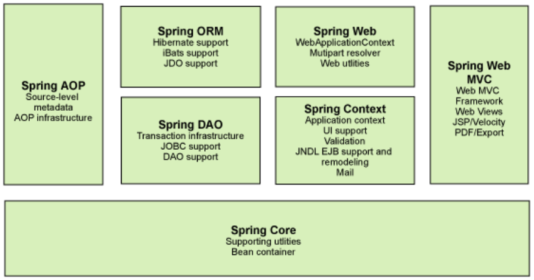
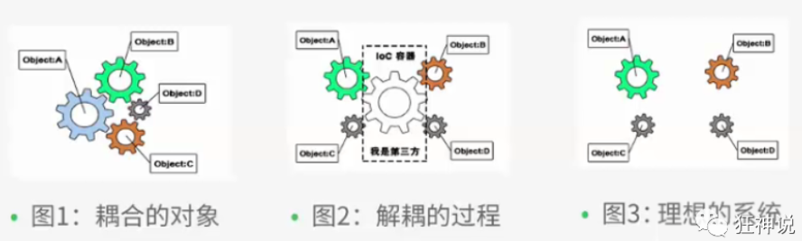
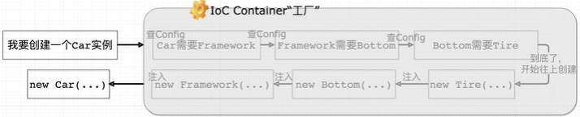
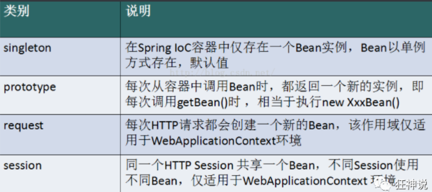
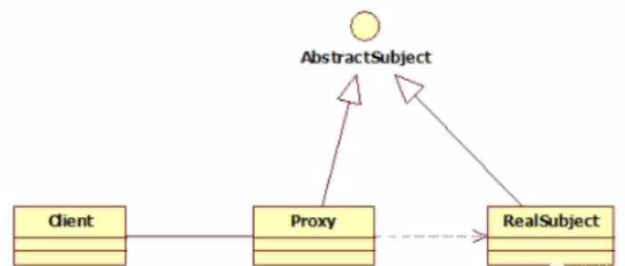
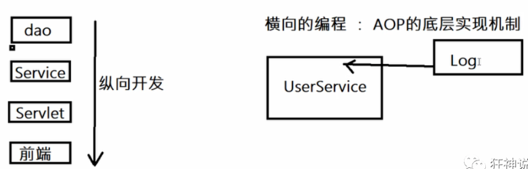
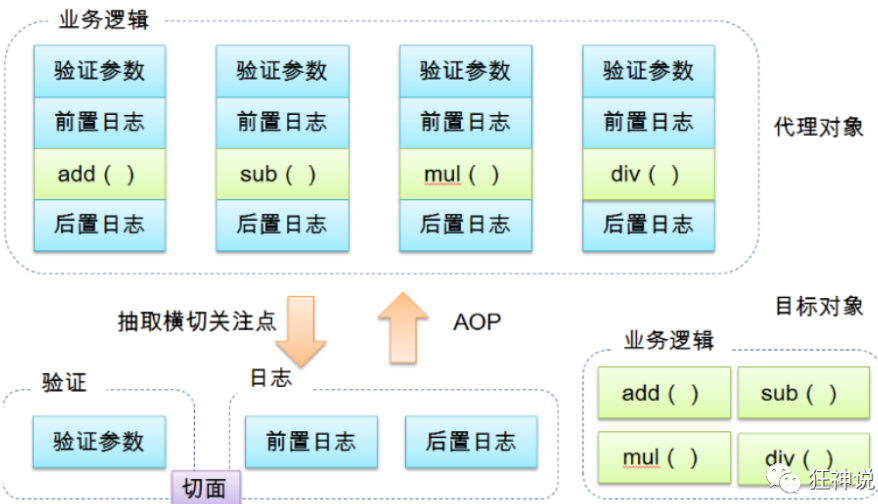
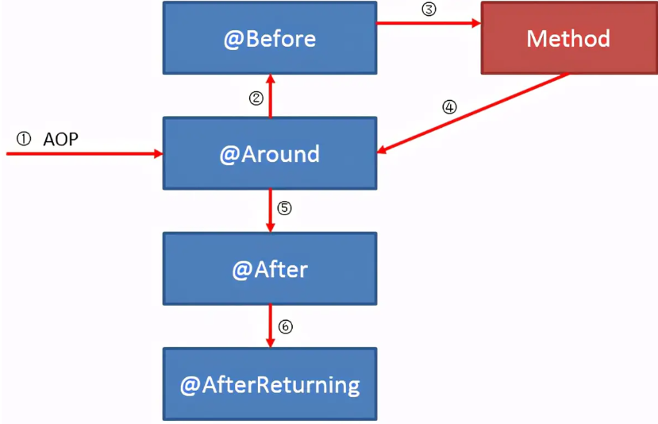
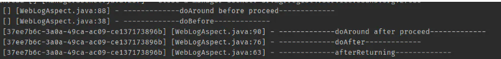
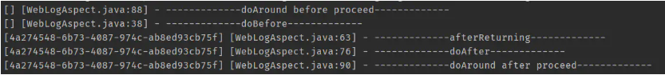

<h1 align="center" style="color: Navy">Spring</h1>

- [1. Spring介绍](#1-spring介绍)
  - [1.1. 优点](#11-优点)
  - [1.2. 组成](#12-组成)
  - [1.3. 扩展](#13-扩展)
  - [1.4. Maven依赖](#14-maven依赖)
- [2. IOC](#2-ioc)
  - [2.1. IOC对象创建](#21-ioc对象创建)
- [3. Spring配置](#3-spring配置)
- [4. 依赖注入](#4-依赖注入)
  - [4.1. 构造器注入](#41-构造器注入)
  - [4.2. Set方式注入](#42-set方式注入)
    - [4.2.1. 常量注入](#421-常量注入)
    - [4.2.2. Bean注入](#422-bean注入)
    - [4.2.3. 数组注入](#423-数组注入)
    - [4.2.4. List注入](#424-list注入)
    - [4.2.5. Map注入](#425-map注入)
    - [4.2.6. set注入](#426-set注入)
    - [4.2.7. Null注入](#427-null注入)
    - [4.2.8. Properties注入](#428-properties注入)
  - [4.3. 拓展方式注入](#43-拓展方式注入)
  - [4.4. bean的作用域](#44-bean的作用域)
- [5. Bean的自动装配](#5-bean的自动装配)
  - [5.1. 自动装配说明](#51-自动装配说明)
  - [5.2. 自动装配方式](#52-自动装配方式)
    - [5.2.1. byName](#521-byname)
    - [5.2.2. byType](#522-bytype)
    - [5.2.3. 注解（重点）](#523-注解重点)
      - [5.2.3.1. 准备工作](#5231-准备工作)
      - [5.2.3.2. 使用](#5232-使用)
      - [5.2.3.3. 小结](#5233-小结)
- [6. 使用注解开发](#6-使用注解开发)
  - [6.1. Bean的实现](#61-bean的实现)
  - [6.5. 小结](#65-小结)
- [7. 使用Java的方式配置Spring](#7-使用java的方式配置spring)
- [8. 代理模式](#8-代理模式)
  - [8.1. 介绍](#81-介绍)
  - [8.2. 静态代理](#82-静态代理)
  - [8.3. 动态代理](#83-动态代理)
- [9. AOP](#9-aop)
  - [9.1. 介绍](#91-介绍)
  - [9.2. Spring中的AOP](#92-spring中的aop)
    - [9.2.1. 通过Spring API实现](#921-通过spring-api实现)
  - [10.2. Mybatis-Spring使用](#102-mybatis-spring使用)
- [11. 声明式事务](#11-声明式事务)
  - [11.1. 交由容器管理事务](#111-交由容器管理事务)

# 1. Spring介绍
## 1.1. 优点
1. Spring是一个开源的免费的框架（容器）
2. Spring是一个轻量级的、非入侵式的框架
3. 控制反转(IOC)，面向切面编程(AOP)
4. 支持事务的处理，对框架整合的支持

## 1.2. 组成


## 1.3. 扩展
- Spring Boot
    - 一个快速开发的脚手架
    - 基于SpringBoot可以快速开发单个微服务
    - 约定大于配置
- Spring Cloud
    - SpringCloud是基于SpringBoot实现的

## 1.4. Maven依赖
```xml
<dependency>
    <groupId>org.springframework</groupId>
    <artifactId>spring-webmvc</artifactId>
    <version>5.2.0.RELEASE</version>
</dependency>
```

# 2. IOC
1. UserDAO-接口
2. UserDAOImpl-实现类
3. UserService-业务接口
4. UserService-业务实现实现

使用一个set接口实现，发生革命性变化
```java
private UserDAO userDAO;
public void setDAO(UserDAO userDAO){
    this.userDAO = userDAO;
}
```
- 之前程序是主动创建对象，控制权在程序员手上
- 使用set注入后，程序不具有主动性，而是变成了被动的接收对象


IoC是Spring框架的核心内容，使用多种方式完美的实现了IoC，可以使用XML配置，也可以使用注解，新版本的Spring也可以零配置实现IoC。
Spring容器在初始化时先读取配置文件，根据配置文件或元数据创建与组织对象存入容器中，程序使用时再从Ioc容器中取出需要的对象。


## 2.1. IOC对象创建
```xml
<!-- 第一种根据index参数下标设置 -->
<bean id="userT" class="com.kuang.pojo.UserT">
   <!-- index指构造方法 , 下标从0开始 -->
   <constructor-arg index="0" value="kuangshen2"/>
</bean>
<!-- 第二种根据参数名字设置 -->
<bean id="userT" class="com.kuang.pojo.UserT">
   <!-- name指参数名 -->
   <constructor-arg name="name" value="kuangshen2"/>
</bean>
<!-- 第三种根据参数类型设置 -->
<bean id="userT" class="com.kuang.pojo.UserT">
   <constructor-arg type="java.lang.String" value="kuangshen2"/>
</bean>
```

# 3. Spring配置
1. 配置别名
    ```xml
    <!--设置别名：在获取Bean的时候可以使用别名获取-->
    <alias name="userT" alias="userNew"/>
    <!--
    id 是bean的标识符,要唯一,如果没有配置id,name就是默认标识符
    如果配置id,又配置了name,那么name是别名
    name可以设置多个别名,可以用逗号,分号,空格隔开
    如果不配置id和name,可以根据applicationContext.getBean(. class)获取对象;
    class是bean的全限定名=包名+类名
    -->
    <bean id="hello" name="hello2 h2,h3;h4" class="com.kuang.pojo.Hello">
        <property name="name" value="Spring"/>
    </bean>
    ```
2. import
    ```xml
    <!-- 团队的合作通过import来实现 -->
    <import resource="{path}/beans.xml"/>
    ```

# 4. 依赖注入
依赖注入（Dependency Injection,DI）。
- 依赖 : 指Bean对象的创建依赖于容器，Bean对象的依赖资源。
- 注入 : 指Bean对象所依赖的资源, 由容器来设置和装配。
## 4.1. 构造器注入

## 4.2. Set方式注入
要求被注入的属性, 必须有set方法, set方法的方法名由`set + 属性首字母大写`, 如果属性是boolean类型, 没有set方法, 是is。
**示例类**，成员变量定义（不包含get/set，构造器）
```java
public class Student {

    private String name;
    private Address address;
    private String[] books;
    private List<String> hobbys;
    private Map<String,String> card;
    private Set<String> games;
    private String wife;
    private Properties info;
}
```

### 4.2.1. 常量注入
```xml
<bean id="student" class="com.kuang.pojo.Student">
    <property name="name" value="小明"/>
</bean>
```
### 4.2.2. Bean注入
```xml
<bean id="addr" class="com.kuang.pojo.Address">
    <property name="address" value="重庆"/>
</bean>

<bean id="student" class="com.kuang.pojo.Student">
    <property name="name" value="小明"/>
    <property name="address" ref="addr"/>
</bean>
```

### 4.2.3. 数组注入
```xml
<bean id="student" class="com.kuang.pojo.Student">
    <property name="name" value="小明"/>
    <property name="address" ref="addr"/>
    <property name="books">
        <array>
            <value>西游记</value>
            <value>红楼梦</value>
            <value>水浒传</value>
        </array>
    </property>
</bean>
```

### 4.2.4. List注入

```xml
<property name="hobbys">
    <list>
        <value>听歌</value>
        <value>看电影</value>
        <value>爬山</value>
    </list>
</property>
```

### 4.2.5. Map注入

```xml
<property name="card">
    <map>
        <entry key="中国邮政" value="456456456465456"/>
        <entry key="建设" value="1456682255511"/>
    </map>
</property>
```

### 4.2.6. set注入

```xml
<property name="games">
    <set>
        <value>LOL</value>
        <value>BOB</value>
        <value>COC</value>
    </set>
</property>
```

### 4.2.7. Null注入
```xml
<property name="wife"><null/></property>
```

### 4.2.8. Properties注入
```xml
<property name="info">
     <props>
         <prop key="学号">20190604</prop>
         <prop key="性别">男</prop>
         <prop key="姓名">小明</prop>
     </props>
</property>
```

## 4.3. 拓展方式注入
1. P命名空间注入 : 需要在头文件中加入约束文件
    ```xml
    <!-- 加入约束 :  -->
    <beans xmlns:p="http://www.springframework.org/schema/p"></beans>
     <!--P(属性: properties)命名空间 , 属性依然要设置set方法-->
    <bean id="user" class="com.kuang.pojo.User" p:name="狂神" p:age="18"/>
    ```
2. c 命名空间注入 : 需要在头文件中加入约束文件
    ```xml
    <!-- 加入约束 :  -->
    <beans xmlns:c="http://www.springframework.org/schema/c"></beans>
    <!--C(构造: Constructor)命名空间 , 属性依然要设置set方法-->
    <bean id="user" class="com.kuang.pojo.User" c:name="狂神" c:age="18"/>
    ```

## 4.4. bean的作用域
在Spring中，那些组成应用程序的主体及由Spring IoC容器所管理的对象，被称之为bean。简单地讲，**bean就是由IoC容器初始化、装配及管理的对象。**


# 5. Bean的自动装配
## 5.1. 自动装配说明
- 自动装配是使用spring满足bean依赖的一种方法
- spring会在应用上下文中为某个bean寻找其依赖的bean。

Spring中bean有三种**装配机制**，分别是：
1. xml中显式配置；
2. java中显式配置；
3. 隐式的bean发现机制和自动装配。

这里我们主要讲第三种：**自动化的装配bean**。
Spring的自动装配需要从两个角度来实现，或者说是两个操作：
1. 组件扫描(component scanning)：spring会自动发现应用上下文中所创建的bean；
2. 自动装配(autowiring)：spring自动满足bean之间的依赖，也就是我们说的IoC/DI；

组件扫描和自动装配组合发挥巨大威力，使得显式的配置降低到最少。

**推荐不使用自动装配xml配置, 而使用注解.**

## 5.2. 自动装配方式
### 5.2.1. byName
```xml
<bean id="user" class="com.kuang.pojo.User" autowire="byName">
    <property name="str" value="qinjiang"/>
</bean >
```


### 5.2.2. byType
使用`autowire="byType"`首先需要保证：同一类型的对象，在spring容器中唯一。如果不唯一，会报不唯一的异常。
```xml
<bean id="user" class="com.kuang.pojo.User" autowire="byType">
   <property name="str" value="qinjiang"/>
</bean >
```

### 5.2.3. 注解（重点）
#### 5.2.3.1. 准备工作
利用注解的方式注入属性。
1、在spring配置文件中引入context文件头
 ```xml
<!-- 加入xmlns:context -->
xmlns:context="http://www.springframework.org/schema/context"
<!-- 在xsi:schemaLocation添加以下内容 -->
xsi:schemaLocation ="http://www.springframework.org/schema/context
    http://www.springframework.org/schema/context/spring-context.xsd"
 ```
2、开启属性注解支持
```xml
<context:annotation-config/>
 ```
#### 5.2.3.2. 使用
`@Autowired`是按类型自动转配的，不支持id匹配。
需要导入spring-aop的包。
```java
//如果允许对象为null，设置required = false,默认为true
@Autowired(required = false)
public Cat getCat(){
    return this.cat;
}
```

`@Qualifier`
@Autowired是根据类型自动装配的，加上@Qualifier则可以根据byName的方式自动装配。@Qualifier不能单独使用。
```java
@Autowired
@Qualifier(value = "cat2")
private Cat cat;
@Autowired
@Qualifier(value = "dog2")
private Dog dog;
```

`@Resource`
1. @Resource如有指定的name属性，先按该属性进行byName方式查找装配；
2. 其次再进行默认的byName方式进行装配；
3. 如果以上都不成功，则按byType的方式自动装配。
4. 都不成功，则报异常。

#### 5.2.3.3. 小结
`@Autowired`与`@Resource`异同：
1. @Autowired与@Resource都可以用来装配bean。都可以写在字段上，或写在setter方法上。
2. @Autowired默认按类型装配（属于spring规范），默认情况下必须要求依赖对象必须存在，如果要允许null 值，可以设置它的required属性为false，如：`@Autowired(required=false)` ，如果我们想使用名称装配可以结合@Qualifier注解进行使用
3. @Resource（属于J2EE复返），默认按照名称进行装配，名称可以通过name属性进行指定。如果没有指定name属性，当注解写在字段上时，默认取字段名进行按照名称查找，如果注解写在setter方法上默认取属性名进行装配。当找不到与名称匹配的bean时才按照类型进行装配。但是需要注意的是，如果name属性一旦指定，就只会按照名称进行装配。
4. 它们的作用相同都是用注解方式注入对象，但执行顺序不同。@Autowired先byType，@Resource先byName。

# 6. 使用注解开发

## 6.1. Bean的实现
我们之前都是使用 bean 的标签进行bean注入，但是实际开发中，我们一般都会使用注解！
1. 配置扫描哪些包下的注解
    ```xml
    <!--指定注解扫描包-->
    <context:component-scan base-package="com.kuang.pojo"/>
    ```
2. 在指定包下编写类，增加注解
   ```java
    @Component("user")
    // 相当于配置文件中 <bean id="user" class="当前注解的类"/>
    public class User {
        private String name = "秦疆";
    }
    ```
## 6.2. 属性注入
1. 可以不用提供set方法，直接在直接名上添加@value("值")
    ```java
    @Component("user")
    // 相当于配置文件中 <bean id="user" class="当前注解的类"/>
    public class User {
        @Value("秦疆")
    // 相当于配置文件中 <property name="name" value="秦疆"/>
        private String name;
    }
    ```
2. 如果提供了set方法，在set方法上添加`@Value("值")`;
    ```java
    @Component("user")
    public class User {

        private String name;

        @Value("秦疆")
        public void setName(String name) {
            this.name = name;
        }
    }
    ```

## 6.3. 衍生注解
@Component三个衍生注解
为了更好的进行分层，Spring可以使用其它三个注解，功能一样，目前使用哪一个功能都一样。
1. @Controller：web层
2. @Service：service层
3. @Repository：dao层

写上这些注解，就相当于将这个类交给Spring管理装配了！

## 6.4. 作用域
`@scope`
- singleton：默认的，Spring会采用单例模式创建这个对象。关闭工厂 ，所有的对象都会销毁。
- prototype：多例模式。关闭工厂 ，所有的对象不会销毁。内部的垃圾回收机制会回收
```java
@Controller("user")
@Scope("prototype")
public class User {
   @Value("秦疆")
   public String name;
}
```

## 6.5. 小结
**XML与注解比较**
1. XML可以适用任何场景 ，结构清晰，维护方便
2. 注解不是自己提供的类使用不了，开发简单方便
**xml与注解整合开发** ：推荐最佳实践
1. xml管理Bean
2. 注解完成属性注入
3. 使用过程中，可以不用扫描，扫描是为了类上的注解

`<context:annotation-config/> `作用：
- 进行注解驱动注册，从而使注解生效
- 用于激活那些已经在spring容器里注册过的bean上面的注解，也就是显示的向Spring注册
- 如果不扫描包，就需要手动配置bean
- 如果不加注解驱动，则注入的值为null！

# 7. 使用Java的方式配置Spring
JavaConfig 原来是 Spring 的一个子项目，它通过 Java 类的方式提供 Bean 的定义信息，在 Spring4 的版本， JavaConfig 已正式成为 Spring4 的核心功能。

```java
//编写一个实体类，Dog
@Component  //将这个类标注为Spring的一个组件，放到容器中！
public class Dog {
   public String name = "dog";
}

//新建一个config配置包，编写一个MyConfig配置类
@Configuration  //代表这是一个配置类
public class MyConfig {
   @Bean //通过方法注册一个bean，这里的返回值就Bean的类型，方法名就是bean的id！
   public Dog dog(){
       return new Dog();
  }
}

//测试
@Test
public void test2(){
   ApplicationContext applicationContext =
           new AnnotationConfigApplicationContext(MyConfig.class);
   Dog dog = (Dog) applicationContext.getBean("dog");
   System.out.println(dog.name);
}

//导入其他配置
@Configuration  //代表这是一个配置类
public class MyConfig2 {
}

@Configuration
@Import(MyConfig2.class)  //导入合并其他配置类，类似于配置文件中的 inculde 标签
public class MyConfig {
   @Bean
   public Dog dog(){
       return new Dog();
  }
}
```

# 8. 代理模式
## 8.1. 介绍
为什么要学习代理模式，因为AOP的底层机制就是动态代理！
代理模式：
- 静态代理
- 动态代理
学习aop之前, 我们要先了解一下代理模式。


## 8.2. 静态代理
静态代理**角色分析**
- 抽象角色: 一般使用接口或者抽象类来实现
- 真实角色: 被代理的角色
- 代理角色: 代理真实角色; 代理真实角色后, 一般会做一些附属的操作.
- 客户: 使用代理角色来进行一些操作.

我们在不改变原来的代码的情况下，实现了对原有功能的增强，这是AOP中最核心的思想。**AOP**：纵向开发，横向开发


静态代理的**好处**:
- 可以使得我们的真实角色更加纯粹. 不再去关注一些公共的事情.
- 公共的业务由代理来完成. 实现了业务的分工.
- 公共业务发生扩展时变得更加集中和方便.

**缺点**:
类多了, 多了代理类, 工作量变大了. 开发效率降低.
我们想要静态代理的好处，又不想要静态代理的缺点，所以, 就有了动态代理!

**代码实现**
1. Rent.java 即抽象角色
    ```java
    //抽象角色：租房
    public interface Rent {
    public void rent();
    }
    ```
2. Host.java 即真实角色
    ```java
    //真实角色: 房东，房东要出租房子
    public class Host implements Rent{
    public void rent() {
        System.out.println("房屋出租");
    }
    }
    ```
3. Proxy.java 即代理角色
    ```java
    //代理角色：中介
    public class Proxy implements Rent {

        private Host host;
        public Proxy() { }
        public Proxy(Host host) {
            this.host = host;
        }

        //租房
        public void rent(){
            seeHouse();
            host.rent();
            fare();
        }
        //看房
        public void seeHouse(){
            System.out.println("带房客看房");
        }
        //收中介费
        public void fare(){
            System.out.println("收中介费");
        }
    }
    ```
4. Client.java 即客户
   ```java
    //客户类，一般客户都会去找代理！
    public class Client {
        public static void main(String[] args) {
            //房东要租房
            Host host = new Host();
            //中介帮助房东
            Proxy proxy = new Proxy(host);

            //你去找中介！
            proxy.rent();
        }
    }
   ```

## 8.3. 动态代理
动态代理的角色和静态代理的一样
- 动态代理的代理类是动态生成的. 静态代理的代理类是我们提前写好的
- 动态代理分为两类 : 一类是基于接口动态代理 , 一类是基于类的动态代理
  - 基于接口的动态代理----JDK动态代理
  - 基于类的动态代理--cglib
  - 现在用的比较多的是 javasist 来生成动态代理.
  - 我们这里使用JDK的原生代码来实现，其余的道理都是一样的！

JDK的动态代理需要了解两个类。核心: **InvocationHandler**和**Proxy**   

动态代理的**好处**
- 可以使得我们的**真实角色更加纯粹**. 不再去关注一些公共的事情.
- 公共的业务由**代理来完成**. 实现了业务的分工.
- 公共业务发生**扩展**时变得更加集中和方便.
- 一个动态代理, 一般代理**某一类业务**
- 一个动态代理可以代理多个类，代理的是**接口**！

**代码实现**
```java
public class ProxyInvocationHandler implements InvocationHandler {
    private Object target;

    public void setTarget(Object target) {
        this.target = target;
    }

    public Object getProxy() {
        return Proxy.newProxyInstance(this.getClass().getClassLoader(), 
        target.getClass().getInterfaces(), this);
    }
    
    //在invoke方法可以添加日志、校验等功能，而不用修改底层类。
    @Override
    public Object invoke(Object proxy, Method method, Object[] args) throws Throwable {
        log(method.getName());
        return method.invoke(target, args);
    }

    public void log(String msg){
        System.out.println("执行了" + msg + "方法");
    }
}

public class Client {
    public static void main(String[] args) {
        //真实角色
        UserService userService = new UserServiceImpl();

        ProxyInvocationHandler pih = new ProxyInvocationHandler();
        //设置代理角色
        pih.setTarget(userService);
        //动态生成代理类.note:proxy和上面的userService虽然都是UserService对象，但存在不同。
        //前者会调用invoke方法实现类方法的调用,后者直接调用类方法。
        UserService proxy = (UserService) pih.getProxy();
        proxy.query();
    }
}
```

# 9. AOP
## 9.1. 介绍
AOP（Aspect Oriented Programming）意为：**面向切面编程**，通过预编译方式和**运行期动态代理**实现程序功能的统一维护的一种技术。AOP是OOP的延续，是软件开发中的一个热点，也是Spring框架中的一个重要内容，是函数式编程的一种衍生范型。利用AOP可以对业务逻辑的各个部分进行隔离，从而使得业务逻辑各部分之间的**耦合度降低**，提高程序的可重用性，同时提高了开发的效率。


- 横切关注点：跨越应用程序多个模块的方法或功能。即是，与我们业务逻辑无关的，但是我们需要关注的部分，就是**横切关注点**。如日志, 安全,缓存,事务等等 ....
- 切面（ASPECT）：横切关注点被模块化的特殊对象。即，它是一个**类**。
- 通知（Advice）：切面必须要完成的工作。即，它是类中的一个**方法**。
- 目标（Target）：被通知对象。
- 代理（Proxy）：向目标对象应用通知之后创建的对象。
- 切入点（PointCut）：切面通知-执行的 **地点**(即**类位置**)的定义。
- 连接点（JointPoint）：与切入点匹配的执行点。


## 9.2. Spring中的AOP
### 9.2.1. 通过Spring API实现
1. 配置XML文件依赖
   ```xml
    <!-- 加入xmlns:aop -->
    xmlns:aop="http://www.springframework.org/schema/aop"
    <!-- 在xsi:schemaLocation添加以下内容 -->
    xsi:schemaLocation ="http://www.springframework.org/schema/aop 
        http://www.springframework.org/schema/aop/spring-aop.xsd"
    ```
2. 配置AOP
    ```xml
    <bean id="log" class="com.log.Log"/>
    <bean id="afterLog" class="com.log.AfterLog"/>
    <!--  配置AOP  -->
    <aop:config>
        <!--   切入点    -->
        <aop:pointcut id="pointcut" expression="execution(* com.service.UserServiceImpl.*(..))"/>
        <!--   执行环绕增强    -->
        <aop:advisor advice-ref="log" pointcut-ref="pointcut"/>
        <aop:advisor advice-ref="afterLog" pointcut-ref="pointcut"/>
    </aop:config>
    ```

### 9.2.2. 自定义类实现AOP
1. 定义切入类
    ```java 
    public class DiyPointcut {
        public void before(){
            System.out.println("---------方法执行前---------");
        }
        public void after(){
            System.out.println("---------方法执行后---------");
        }
    }
    ```
2. 配置AOP
    ```xml
    <!--注册bean-->
    <bean id="diy" class="com.kuang.config.DiyPointcut"/>

    <!--aop的配置-->
    <aop:config>
        <!--使用AOP的标签实现-->
        <aop:aspect ref="diy">
            <aop:pointcut id="diyPonitcut" expression="execution(* com.kuang.service.UserServiceImpl.*(..))"/>
            <aop:before pointcut-ref="diyPonitcut" method="before"/>
            <aop:after pointcut-ref="diyPonitcut" method="after"/>
        </aop:aspect>
    </aop:config>
    ```

### 9.2.3. 注解实现AOP
1. 配置xml
    ```xml
    <aop:aspectj-autoproxy/>
    ```
2. 定义切入类
    ```java
    @Aspect
    @Component
    public class AnnotationPointCut {
        @Before("execution(* com.service.UserServiceImpl.*(..))")
        public void before(){
            System.out.println("方法执行前");
        }
        @After("execution(* com.service.UserServiceImpl.*(..))")
        public void after(){
            System.out.println("方法执行后");
        }
        @Around("execution(* com.service.UserServiceImpl.*(..))")
        public void around(ProceedingJoinPoint joinPoint) throws Throwable {
            System.out.println("环绕前");
            //执行方法
            Object proceed = joinPoint.proceed();
            System.out.println("环绕后");
        }
    }
    ```

### AOP执行顺序
1. Spring5.2.7之前按照AspectJ定义：
    
    
2. Spring5.2.7开始，在相同`@Aspect`类中，根据其类型按照从高到低的优先级进行执行：@Around，@Before ，@After，@AfterReturning，@AfterThrowing。
    
# 10. 整合Mybatis
## 10.1. Maven依赖
```xml
<dependencies>
    <!-- jdbc需要与spring-core版本一致 -->
    <dependency>
        <groupId>org.springframework</groupId>
        <artifactId>spring-jdbc</artifactId>
        <version>5.2.0.RELEASE</version>
    </dependency>
    <dependency>
        <groupId>org.aspectj</groupId>
        <artifactId>aspectjweaver</artifactId>
        <version>1.9.4</version>
    </dependency>
    <dependency>
        <groupId>org.mybatis</groupId>
        <artifactId>mybatis-spring</artifactId>
        <version>2.0.7</version>
    </dependency>
            <dependency>
        <groupId>org.mybatis</groupId>
        <artifactId>mybatis</artifactId>
        <version>3.5.2</version>
    </dependency>
</dependencies>
```

## 10.2. Mybatis-Spring使用
1. 编写Spring-dao.xml
   此文件配置与Mybatis-Spring相关的参数
    ```xml
    <!--配置数据源：数据源有非常多，可以使用第三方的，也可使使用Spring的-->
    <bean id="dataSource" class="org.springframework.jdbc.datasource.DriverManagerDataSource">
        <property name="driverClassName" value="com.mysql.jdbc.Driver"/>
        <property name="url" value="jdbc:mysql://localhost:3306/mybatis?useSSL=true&amp;useUnicode=true&amp;
        characterEncoding=utf8"/>
        <property name="username" value="root"/>
        <property name="password" value="123456"/>
    </bean>
    <!--  sqlSessionFactory-关联MyBatis  -->
    <bean id="sqlSessionFactory" class="org.mybatis.spring.SqlSessionFactoryBean">
        <property name="dataSource" ref="dataSource"/>
        <property name="configLocation" value="mybatis-config.xml"/>
        <property name="mapperLocations" value="classpath:com/mybatis/mapper/*.xml"/>
    </bean>
    <!--  注册sqlSessionTemplate，关联sqlSessionFactory；  -->
    <bean id="sqlSession" class="org.mybatis.spring.SqlSessionTemplate">
        <constructor-arg index="0" ref="sqlSessionFactory"/>
    </bean>
    ```
2. 实现Mapper接口，同样基于IOC思想
    ```java
    public class UserMapperImpl implements UserMapper{
        private SqlSession sqlSession;

        public void setSqlSession(SqlSession sqlSession){
            this.sqlSession = sqlSession;
        }

        @Override
        public List<User> selectByExample(UserExample example) {
            UserMapper userMapper = sqlSession.getMapper(UserMapper.class);
            return userMapper.selectByExample(example);
        }
    }
    ```
3. 注册Bean实现(applicationContext.xml)
    此文件依然作为IOC的bean配置文件(当然也可以用注解)
    ```xml
    <!-- 导入spring-dao配置 -->
    <import resource="spring-dao.xml"/>
    <bean id="userMapper" class="com.mybatis.mapper.UserMapperImpl">
        <property name="sqlSession" ref="sqlSession"/>
    </bean>
    ```
4. 测试
    ```java
    ApplicationContext context = new ClassPathXmlApplicationContext("applicationContext.xml");
    UserMapper userMapper = context.getBean("userMapper", UserMapper.class);
    List<User> users = userMapper.selectByExample(new UserExample());
    users.forEach(System.out::println);
    ```

# 11. 声明式事务
事务四个属性ACID
- 原子性（atomicity）
事务是原子性操作，由一系列动作组成，事务的原子性确保动作要么全部完成，要么完全不起作用
- 一致性（consistency）
一旦所有事务动作完成，事务就要被提交。数据和资源处于一种满足业务规则的一致性状态中
- 隔离性（isolation）
可能多个事务会同时处理相同的数据，因此每个事务都应该与其他事务隔离开来，**防止数据损坏**
- 持久性（durability）
事务一旦完成，无论系统发生什么错误，结果都不会受到影响。通常情况下，事务的结果被写到持久化存储器中

## 11.1. 交由容器管理事务
1. 配置XML文件依赖
    ```xml
    <!-- 加入xmlns:th -->
    xmlns:tx="http://www.springframework.org/schema/tx"
    <!-- 在xsi:schemaLocation添加以下内容 -->
    xsi:schemaLocation ="http://www.springframework.org/schema/tx 
        http://www.springframework.org/schema/tx/spring-tx.xsd"
    ```
2. 声明式事务
    ```xml
    <!--  声明式事务  -->
    <bean id="transactionManager" class="org.springframework.jdbc.datasource.DataSourceTransactionManager">
        <property name="dataSource" ref="dataSource"/>
    </bean>
    ```
3. 配置事务通知
    ```xml
    <tx:advice id="txAdvice" transaction-manager="transactionManager">
        <!--   给哪些方法配置事务    -->
        <tx:attributes>
            <tx:method name="add" propagation="REQUIRED"/>
            <tx:method name="delete" propagation="REQUIRED"/>
            <tx:method name="update" propagation="REQUIRED"/>
            <tx:method name="query" read-only="true"/>
            <tx:method name="*" propagation="REQUIRED"/>
        </tx:attributes>
    </tx:advice>
    ```
4. 配置事务切入
    ```xml
    <aop:config>
        <aop:pointcut id="txPointCut" expression="execution(* com.mybatis.mapper.*.*(..))"/>
        <aop:advisor advice-ref="txAdvice" pointcut-ref="txPointCut"/>
    </aop:config>
    ```