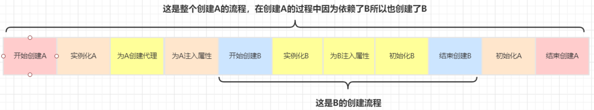

# 面试介绍
## 自我介绍
面试官下午好，我是赵立峰。很荣幸参加本次面试，下面我简单做一下自我介绍。我本科期间就读于上海大学，本科专业为电气工程，期间主要参与了电赛和机器人大赛，并带领上海大学自强队获得机器人大赛的亚军。大四保研至本校之后，开始了为期5个月的实习。实习期间主要负责嵌入式软件开发，比如设计温控系统等。研究生专业为控制科学与工程，研一研二获得了两次学业一等奖学金，主要的研究方向为车联网，进行车联网协同与安全方面的研究，并发表过一篇EI会议。研究生期间通过自学熟悉了SSM框架，javaWeb开发，MySQL数据库，Redis缓存数据库以及RabbitMQ消息队列。并用Spring Boot做了一个电商平台秒杀系统的小项目。虽然没有真正从事过Java开发相关的实习工作，但本人对软件行业有着浓厚的兴趣，并且有信心快速融入团队。以上就是我的自我介绍，谢谢。

## 秒杀项目介绍
该项目使用SpringBoot进行项目框架搭建，集成Thymeleaf服务端页面模板，集成MyBatis和Druid连接池访问数据库，集成了Redis缓存。
在用户登录上，实现了用户密码两次MD5入库，利用Redis实现分布式Session。将前端页面（商品列表页、详情页和订单详情页）静态化，将HTML缓存在浏览器中。在服务器端，通过Redis预减库存减少对数据库的访问，通过内存标记来减少对Redis的访问，通过RabbitMQ消息队列异步下单缓解数据库压力。通过Jmeter做压测，吞吐量有所提高。为了防止恶意刷单，隐藏了秒杀地址，做了图形验证码，接口限流防刷等。

## 实习介绍
在实习期间主要参与研发手持光谱仪。通过分析物体的拉曼光谱，实现对爆炸物、毒品的快速检测。本人主要负责的是温控模块。因为光谱仪分析受温度影响特别大，所以要确保环境温度维持在0度或者10度，并且波动不能超过1度。首先是芯片选型，通过对比性能和成本最终选择了MAX1968。然后设计芯片的外围电路以及采样电路，并通过主控板连接。开发stm32固件，运用模糊pid算法，最终实现温度的自适应控制。目前产品性能良好，已正式售出。

## 竞赛介绍
我们参加的是篮球机器人项目，主要分为硬件组、视觉组、机械组、运动组。我是硬件组组长，主要负责主控板的设计，传感器的选型搭建。主控板需要支持运动组所需的相关协议，比如底盘电机的can总线协议，红外遥控、雷达信号接收，以及显示屏的显示等，并且需要聚合升压电路转换，驱动电磁弹射。

## 面试经验
1. 一定在听到问题之后，先思考一下再回答。


## 面试问题
1. 开多线程导入数据库表，如何保证几个字段的组合唯一。
2. `synchronized`与`lock`使用场景
3. `synchronized`为什么是非公平锁
4. 重量级锁、轻量级锁、偏向锁
5. 锁升级

# 设计模式

## Spring设计模式
工厂模式、单例设计模式、代理模式、模板模式、观察者模式、适配器模式、装饰者模式、装饰者模式、

## 工厂模式


## 单例模式
> 通过反射机制，仍然会很容易破坏单例模式。

### 饿汉式
```java
//线程安全但浪费内存空间。类即便没有用到也会实例化对象。
public class Hungry {
    private Hungry(){}

    public static final Hungry HUNGRY = new Hungry();

    public static Hungry getInstance(){
        return HUNGRY;
    }
}
```

### 懒汉式
懒汉式属于即用即创建，节省了内存空间，但线程不安全。
```java
public class Lazy {
    private Lazy(){
        System.out.println(Thread.currentThread().getName());
    }

    private static Lazy LAZY;

    public static Lazy getInstance(){
        if (LAZY==null) LAZY = new Lazy();
        return LAZY;
    }
}
```
为了保证线程安全，需要做以下**措施**：
1. **双重检测锁**(Double Check Lock-DCL)
   为了防止多线程同时创建出来多个**对象**，破坏了单例模式。若不加双重检测锁，会出现以下结果：
   **测试方法**：
   ```java
    public static void main(String[] args) {
        for (int i = 0; i < 100; i++) {
            new Thread(()->{
                Lazy lazy = Lazy.getInstance();
            },String.valueOf(i)).start();
        }
    }
   ```
   **输出结果**：
   ```java
    0
    1
    //表示实际创建了两个实例对象
   ```
2. `volatile`关键字-**防止指令重排**
    **常规情况**下，创建一个实例对象依次执行以下三个步骤
    1. 分配内存空间
    2. 执行构造方法，初始化对象
    3. 把这个对象指向这个空间
    
    CPU和编译器为了提升程序执行的效率，会按照一定的规则允许进行**指令优化**（即指令重排）。若指令重排后的执行顺序为132，则会让其他线程拿到还未初始化完毕的对象，造成**空指针**异常。

**懒汉式最终呈现形式**：
```java
public class Lazy {
    private Lazy(){
        System.out.println(Thread.currentThread().getName());
    }

    private volatile static Lazy LAZY;

    public static Lazy getInstance(){
        if (LAZY==null){
            synchronized (Lazy.class){
                if (LAZY==null) LAZY = new Lazy();
            }
        }
        return LAZY;
    }
}
```

对于**静态域**的延迟初始化，可以使用`lazy initialization holder class`模式
```java
private static class FieldHolder{
    static final FieldHolder field = computeFieldValue();
}

private static FieldType getField(){return FieldHolder.field;}
```

## 代理模式
### 动态代理
动态代理核心方法为`Proxy.newProxyInstance()`，实现的是接口。反射核心方法为`***.class.getDeclaredConstructor().newInstance()`，实现的是类。
```java
//要实现动态代理类的接口
public interface Vehicle {
    void run(int speed);
}

//接口的实现类1
public class Car implements Vehicle{
    @Override
    public void run(int speed) {
        System.out.println("启动");
        System.out.println("踩离合");
        System.out.println("拉手刹");
        System.out.println("半联动状态");
        System.out.println("踩油门");
        System.out.println("以" + speed +"公里/每小时的速度运行");
    }
}

//接口的实现类2
public class Bicycle implements Vehicle{
    @Override
    public void run(int speed) {
        System.out.println("上车");
        System.out.println("踩脚踏板启动");
        System.out.println("以" + speed +"公里/每小时的速度运行");
    }
}

//Vehicle接口的动态代理处理
public class VehicleInvocationHandler implements InvocationHandler {
    private Object target;

    public Object getProxy(){
        return Proxy.newProxyInstance(this.getClass().getClassLoader(),target.getClass().getInterfaces(),this);
    }

    public VehicleInvocationHandler(Object target) {
        this.target = target;
    }

    @Override
    public Object invoke(Object proxy, Method method, Object[] args) throws Throwable {
        log(method.getName());
        return method.invoke(target,args);
    }

    private void log(String msg){
        System.out.println("执行了" + msg + "方法");
        System.out.println(target.getClass().getSimpleName() + "开始运行了");
    }
}
```
```java
//测试：
public class Client {
    public static void main(String[] args) {
        VehicleInvocationHandler vih = new VehicleInvocationHandler(new Car());
        Vehicle vehicle = (Vehicle) vih.getProxy();
        vehicle.run(10);
    }
}
//输出结果:
执行了run方法
Car开始运行了
启动
踩离合
拉手刹
半联动状态
踩油门
以10公里/每小时的速度运行
```

**原理解析：**
调用`Proxy.newProxyInstance`方法，返回的是一个临时的类`Proxy0`，其实现了传入的接口。以下为执行反编译得到的类信息：
```java
public final class $Proxy0 extends Proxy implements Vehicle {
    //核心方法
    public final void run(int speed)
	{
		try
		{
            //h-VehicleInvocationHandler
            //m3-run方法
			super.h.invoke(this, m3, speed);
			return;
		}
		catch (Error ) { }
		catch (Throwable throwable)
		{
			throw new UndeclaredThrowableException(throwable);
		}
	}
}
```

# Spring
## 循环依赖
### 表现形式
```java
@Component
public class A {
    // A中注入了B
	@Autowired
	private B b;
}

@Component
public class B {
    // B中也注入了A
	@Autowired
	private A a;
}
// 自己依赖自己
@Component
public class A {
    // A中注入了A
	@Autowired
	private A a;
}
```
### 解决前提条件
1. 出现循环依赖的Bean必须要是单例
2. 依赖注入的方式不能全是构造器注入的方式


### 三级缓存流程
- 无AOP情况：
    
- 有AOP情况：
    
- 三级缓存流程
    
- 二级缓存流程
    

### 总结
1. ”Spring是如何解决的循环依赖？“
    答：Spring通过三级缓存解决了循环依赖，其中一级缓存为单例池（singletonObjects）,二级缓存为早期曝光对象earlySingletonObjects，三级缓存为早期曝光对象工厂（singletonFactories）。当A、B两个类发生循环引用时，在A完成实例化后，就使用实例化后的对象去创建一个对象工厂，并添加到三级缓存中，如果A被AOP代理，那么通过这个工厂获取到的就是A代理后的对象，如果A没有被AOP代理，那么这个工厂获取到的就是A实例化的对象。当A进行属性注入时，会去创建B，同时B又依赖了A，所以创建B的同时又会去调用getBean(a)来获取需要的依赖，此时的getBean(a)会从缓存中获取，第一步，先获取到三级缓存中的工厂；第二步，调用对象工工厂的getObject方法来获取到对应的对象，得到这个对象后将其注入到B中。紧接着B会走完它的生命周期流程，包括初始化、后置处理器等，之后将A放进二级缓存，移除三级缓存。当B创建完后，会将B再注入到A中，此时A再完成它的整个生命周期。**若A的属性注入中，还有类与A产生了循环依赖，则此类会从二级缓存中得到A对象，防止再去三级缓存中再触发一次AOP增强。**至此，循环依赖结束！
2. ”为什么要使用三级缓存呢？二级缓存能解决循环依赖吗？“
    答：如果要使用二级缓存解决循环依赖，意味着所有Bean在实例化后就要完成AOP代理，这样违背了Spring设计的原则，Spring在设计之初就是通过AnnotationAwareAspectJAutoProxyCreator这个后置处理器来在Bean生命周期的最后一步来完成AOP代理，而不是在实例化后就立马进行AOP代理。

# Spring Boot
## Spring Boot自动装配
**全部加载，按需配置**
### 启动类注解@SpringBootApplication
   其属于三个注解的集合：
    - `@EnableAutoConfiguration`(**自动装配核心**)：启用 SpringBoot 的自动配置机制
    - `@Configuration`：允许在上下文中注册额外的 bean 或导入其他配置类
    - `@ComponentScan`： 扫描被@Component (@Service,@Controller)注解的 bean，注解默认会扫描**启动类所在的包下所有的类**，可以自定义不扫描某些 bean。如下图所示，容器中将排除TypeExcludeFilter和AutoConfigurationExcludeFilter。
### @EnableAutoConfiguration
`@EnableAutoConfiguration`注解：
```java
@AutoConfigurationPackage
@Import(AutoConfigurationImportSelector.class)
public @interface EnableAutoConfiguration {}
```
1. @AutoConfigurationPackage
    指定了默认的包规则
   ```java
    @Import(AutoConfigurationPackages.Registrar.class)  //给容器中导入一个组件
    public @interface AutoConfigurationPackage {}

    //利用Registrar给容器中导入一系列组件
    //将指定的一个包下的所有组件导入进来？MainApplication 所在包下。
   ```
2. @Import({AutoConfigurationImportSelector.class})
    1. 利用`getAutoConfigurationEntry(annotationMetadata)`;给容器中批量导入一些组件
    2. 调用List<String> configurations = getCandidateConfigurations(annotationMetadata, attributes)获取到所有需要导入到容器中的配置类
    3. 利用工厂加载 Map<String, List<String>> loadSpringFactories(@Nullable ClassLoader classLoader)；得到所有的组件
    4. 从META-INF/spring.factories位置来加载一个文件。
	默认扫描我们当前系统里面所有META-INF/spring.factories位置的文件
    spring-boot-autoconfigure-2.3.4.RELEASE.jar包里面也有META-INF/spring.factories
    以上即为全部加载的过程。
    
3. 按需开启自动配置项
   根据条件装配规则`@Conditional`完成按需装配
   - `@ConditionalOnBean`：当容器里有指定 Bean 的条件下
   -  `@ConditionalOnMissingBean`：当容器里没有指定 Bean 的情况下 
   - @ConditionalOnSingleCandidate：当指定 Bean 在容器中只有一个，或者虽然有多个但是指定首选 Bean
   - `@ConditionalOnClass`：当类路径下有指定类的条件下
   - `@ConditionalOnMissingClass`：当类路径下没有指定类的条件下
   - @ConditionalOnProperty：指定的属性是否有指定的值
   - @ConditionalOnResource：类路径是否有指定的值
   - @ConditionalOnExpression：基于 SpEL 表达式作为判断条件
   - `@ConditionalOnJava`：基于 Java 版本作为判断条件
   - @ConditionalOnJndi：在 JNDI 存在的条件下差在指定的位置
   - `@ConditionalOnNotWebApplication`：当前项目不是 Web 项目的条件下
   - `@ConditionalOnWebApplication`：当前项目是 Web 项 目的条件下
4. 修改默认配置
   SpringBoot默认会在底层配好所有的组件。但是如果用户自己配置了以用户的优先

### 总结
- SpringBoot先加载所有的自动配置类  xxxxxAutoConfiguration
- 每个自动配置类按照条件进行生效，默认都会绑定配置文件指定的值。xxxxProperties里面拿。xxxProperties和配置文件进行了绑定
- 生效的配置类就会给容器中装配很多组件
- 只要容器中有这些组件，相当于这些功能就有了
- 定制化配置
  - 用户直接自己@Bean替换底层的组件
  - 用户去看这个组件是获取的配置文件什么值就去修改。
   
# JUC并发编程
## 死锁
### 产生死锁的原因
1. 因为系统资源不足。
2. 进程运行推进的顺序不合适。
3. 资源分配不当等。
### 死锁的四个必要条件
1. 互斥条件：一个资源每次只能被一个进程使用。
2. 请求与保持条件：一个进程因请求资源而阻塞时，对已获得的资源保持不放。
3. 不剥夺条件:进程已获得的资源，在末使用完之前，不能强行剥夺。
4. 循环等待条件:若干进程之间形成一种头尾相接的循环等待资源关系。

# 计网
## 可靠数据传输
ARQ-`automatic repeat request`自动重传协议
### rdt
主要利用有限状态机完成具有比特差错的丢包信道的可靠数据传输。
### 回退N步(GBN协议)
GBN也称为滑动窗口协议。[GBN操作示意](https://media.pearsoncmg.com/aw/ecs_kurose_compnetwork_7/cw/content/interactiveanimations/go-back-n-protocol/index.html "GBN操作示意")。
主要包含以下**三个参数**
- `base`-基序号。定义为最早未确认分组（报文）的序号
- `nextseqnum`-下一个序号。定义为最小的未使用序号
- `N`-滑动窗口长度。主要用来做流量控制，是对发送方施加的限制。

序号范围可被**分割为4段：**
- $[0, base-1]$： 对应于已经发送并被确认的分组
- $[base, nextseqnum-1]$：对应已经发送但未被确认的分组
- $[nextseqnum, base+N-1]$：对应于那些要被立即发送的分组，如果有数据来自上层的话
- $[base+N, ...]$：不能使用的序号

**发送方与接收方行为：**
- 发送方：**采用累计确认方式**。当超时时，GBN协议需要发送方重新发送$[base, nextsequm-1]$区间内的分组。
- 接收方：**丢弃所有失序分组，发送连续接收分组的序号**。如果一个序号`n`的分组被正确接收到，并且按序（即上次交付给上层的数据是序号为`n-1`的分组），则接收方为分组`n`发送一个`ACK`，并将该分组中的数据部分交付给上层。所有其他情况下，接收方丢弃该分组，并且为最近按序接收的分组重新发送`ACK`。**核心**：如果分组`k`已接收并交付，则所有序号比`k`小的分组也已经交付。

<center></center>

### 选择重传(SR协议)
选择重传协议通过让发送方仅重传那些它怀疑在接收方出错（即丢失或受损）的分组，而避免的不必要的重传。[SR操作示意](https://media.pearsoncmg.com/aw/ecs_kurose_compnetwork_7/cw/content/interactiveanimations/selective-repeat-protocol/index.html "SR操作示意")。

**SR协议中，发送方和接收方的窗口并不总是一致，因此需要注意窗口长度必须小于等于序号空间大小的一半。**

<center></center>

## TCP
### 概念
1. TCP是**面向连接**的。即它们必须相互发送某些预备报文段，以建立确保数据传输的参数。
2. TCP连接提供的是**全双工服务**。如果进程A和进程B建立了TCP连接，则应用层数据即可从进程B流向进程A，或从进程A流向进程B。
3. TCP连接总是**点对点**的。即在单个发送方与单个接收方之间的连接。
4. **三次握手**：由于在客户端和服务端之间共发送了三个报文段，因此叫做三次握手。

### TCP报文段

- 16比特的**源端口、目标端口**：计算机上的进程要和其他进程通信是要通过计算机端口的，而一个计算机端口某个时刻只能被一个进程占用，所以通过指定源端口和目标端口，就可以知道是哪两个进程需要通信。源端口、目标端口是用 16 位表示的，可推算计算机的端口个数为 2^16 个。
- 32比特的**序号字段、确认号字段**：
  - **序列号**：表示**本报文段所发送数据的第一个字节的编号**，展示了TCP是**面向字节流**的。在 TCP 连接中所传送的字节流的每一个字节都会按顺序编号。由于序列号由 32 位表示，所以每 2^32 个字节，就会出现序列号回绕，再次从 0 开始。那如何区分两个相同序列号的不同 TCP 报文段就是一个问题了，后面会有答案，暂时可以不管。
  - **确认号**：表示**接收方期望收到发送方下一个报文段的第一个字节数据的编号**。也就是告诉发送发：我希望你（指发送方）下次发送的数据的第一个字节数据的编号是这个确认号。也就是告诉发送方：我希望你（指发送方）下次发送给我的 TCP 报文段的序列号字段的值是这个确认号。
- 16比特的**接收窗口字段**：用于流量控制。该字段用于指示接收方愿意接受的字节数量。
- 4比特的**首部长度字段**：由于 TCP 首部包含一个长度可变的选项部分，所以需要这么一个值来指定这个 TCP 报文段到底有多长。或者可以这么理解：就是表示 TCP 报文段中数据部分在整个 TCP 报文段中的位置。该字段的单位是 32 位字，即：4 个字节。
- 可选与变长的**选项字段**：其最大长度可根据 TCP 首部长度进行推算。TCP 首部长度用 4 位表示，那么选项部分最长为：(2^4-1)*4-20=40 字节。一般为空。
- 6比特的**标志字段**：实践中，PSH、URG和紧急数据指针较少使用。
  - URG：表示本报文段中发送的数据是否包含紧急数据。URG=1，表示有紧急数据。后面的紧急指针字段只有当 URG=1 时才有效。
  - `ACK`：表示是否前面的确认号字段是否有效。ACK=1，表示有效。只有当 ACK=1 时，前面的确认号字段才有效。TCP 规定，连接建立后，ACK 必须为 1。
  - PSH：告诉对方收到该报文段后是否应该立即把数据推送给上层。如果为 1，则表示对方应当立即把数据提交给上层，而不是缓存起来。
  - RST：只有当 RST=1 时才有用。如果你收到一个 RST=1 的报文，说明你与主机的连接出现了严重错误（如主机崩溃），必须释放连接，然后再重新建立连接。或者说明你上次发送给主机的数据有问题，主机拒绝响应。
  - `SYN`：在建立连接时使用，用来同步序号。当 SYN=1，ACK=0 时，表示这是一个请求建立连接的报文段；当 SYN=1，ACK=1 时，表示对方同意建立连接。SYN=1，说明这是一个请求建立连接或同意建立连接的报文。只有在前两次握手中 SYN 才置为 1。
  - `FIN`：标记数据是否发送完毕。如果 FIN=1，就相当于告诉对方：“我的数据已经发送完毕，你可以释放连接了”

### 超时重传时间间隔
1. $RTT$：**往返时间**
2. $SampleRTT$：从某个报文段被发出（即交给IP）到对该报文段的确认被收到之间的**时间量**。
3. $EstimatedRTT$：TCP所维护的$SampleRTT$**均值**。
   计算公式：$EstimatedRTT = (1-\alpha)\cdot EstimatedRTT + \alpha \cdot SampleRTT$。通常，$\alpha=0.125$。
4. $DevRTT$：用来测量$RTT$的**变化**
   计算公式：$DevRTT = (1-\beta)\cdot DevRTT + \beta \cdot |SampleRTT-EstimatedRTT|$。通常，$\beta=0.25$。
5. $TimeoutInterval$：**重传超时间隔**。
   计算公式：$TimeoutInterval = EstimatedRTT + 4\cdot DevRTT$。
   $TimeoutInterval$初始值为`1s`。当出现超时后，$TimeoutInterval$值将**加倍**，以免即将被确认的后继报文段过早出现超时。但只要收到报文段并更新$EstimatedRTT$，就使用上述公式再次计算$TimeoutInterval$。

### 可靠数据传输
1. 超时间隔加倍
   每当有超时事件发生，TCP重传时，都会将下一次的超时间隔设置为先前值的两倍。而不是使用推算得来的时间。这种策略提供了一个**形式受限的拥塞控制**。因为定时器过期很可能是由网络拥塞引起的，即太多的分组到达源与目的地之间路径上的一台（或多台）路由器的队列中，造成分组丢失或长时间的排队时延。**在拥塞的时候，如果源持续重传分组，会使拥塞更加严重。**
2. 快速重传
   **冗余ACK**：就是再次确认某个报文段的ACK，而发送方之前已经收到对该报文段的确认。当有报文段丢失时，接收方会对已经接收到的最后一个按序字节数据进行重复确认（即产生一个冗余ACK）。
   **快速重传**：发送方一旦收到3个冗余ACK，TCP即执行快速重传。即在该报文段的定时器过期之前重传丢失的报文段。
3. GBN和SR选择
   TCP确认是**累积式**的，从原理上讲是形同GBN的。但是TCP的实现可以应用**选择确认**机制，它允许TCP接收方有选择性地确认失序报文段，而不是累积地确认最后一个正确接收的有序报文段。从这方面讲，TCP的差错恢复机制被分类为GBN和SR协议的混合体是最准确的。

### 流量控制
TCP通过让发送方维护一个称为接收窗口的变量来提供流量控制。通俗地说，接受窗口用于给发送方一个指示-该接收方还有多少可用的缓存空间。考虑主机A向主机B发送数据。我们定义以下变量：
- $LastByteRead$：主机B上的应用进程从缓存读出的数据流的最后一个字节的编号
- $LastByteRcvd$：从网络中到达的并放入主机B接收缓存中的数据流的最后一个字节的编号
- $RcvBuffer$：主机B接收缓存大小

1. 由于TCP不允许缓存溢出，必须成立：$LastByteRcvd - LastByteRead \leq RcvBuffer$。
2. 接收窗口用`rwnd`表示，根据缓存可用空间的数量来设置：$rwnd=RcvBuffer - [LastByteRcvd-LastByteRead]$。
3. 主机B将`rwnd`放入到发送给主机A的报文段接收窗口字段中，通知主机A它在该连接的缓存中还有多少可用空间。初始值为$rwnd=RcvBuffer$。
4. 主机A跟踪变量$LastByteSent$和$LastByteAcked$，整个流量过程需满足$LastByteSent-LastByteAcked\leq rwnd$。
5. 当主机B的接收窗口为0即`WIN=0`时，主机A继续发送只有一个字节数据的报文段。这些报文段将会被接收方确认。最终缓存开始清空，并且确认报文里将包含一个非0的rwnd值。

<center></center>

### TCP连接管理
- TCP连接
  1. 客户端TCP向服务端TCP发送一个特殊的TCP报文段，其不包含应用层数据。报文段首部`SYN=1`，表明想要发起连接。客户端会随机选择一个初始序号`client_isn`，并放入序号字段`SEQ`中。此报文段称为**SYN报文段**。
  2. 服务端提取出TCP SYN报文段，为该TCP连接分配TCP缓存和变量，并向TCP发送允许连接的报文段。首部主要包含三个重要信息：SYN标志位`SYN=1`，确认号`ACK=client_isn+1`，序列号`server_isn`。此报文段称为**SYNACK报文段**。
  3. 在收到SYNACK报文段后，客户也要给该连接分配缓存和变量。客户主机向服务器发送另外一个报文段：`SYN=0`，`ACK=server_isn+1`。**该阶段可以在报文段负载中携带客户到服务器的数据**。
  > 在建立连接后的每一个报文段中，SYN比特都将置为0。
- TCP连接断开
  1. 客户端发起关闭连接命令：`FIN=1`
  2. 服务器收到FIN报文段后，先向发送方回送一个确认ACK报文段。
  3. 待数据传输完毕后，服务器发送它自己的终止FIN报文段。
  4. 客户对服务器的终止报文段进行确认，发送ACK报文段。此时，在两台主机上用于该连接的所有资源都被释放了。
  > 客户端发送完ACK报文段后，进入`TIME_WAIT`状态，通常为30秒。等待后，连接就正式关闭。

### TCP拥塞控制
|参数名|全称|中文|含义|
|---|---|---|---|
|$cwnd$|congestion window|拥塞窗口|限制TCP发送方能向网络中发送流量的速率|
|$MSS$|Maximum Segment Size|最大报文段长度|在报文段里应用层数据的最大长度，典型值1460|
|$RTT$|Round Trip Time|连接往返时间|数据发送时刻到接收到确认的时刻的差值|
|$ssthresh$|slow start threshold|慢启动阈值|TCP从慢启动转移至拥塞避免模式的中间值|
#### 拥塞的代价
1. 当分组的到达速率接近链路容量时，分组经历巨大的排队时延
2. 发送方必须执行重传以补偿因为缓存溢出而丢弃的分组
3. 发送方在遇到大时延时所进行的不必要重传会引起路由器利用其链路带宽来转发不必要的分组副本。
4. 当一个分组沿一条路径被丢弃时，每个上游路由器用于转发该分组到丢弃该分组而使用的传输容量最终被浪费掉了。
#### 拥塞控制方法
**主要思想**：
- **一个丢失的报文段表意味着拥塞**，因此当丢失报文段时应当降低TCP发送方的速率。比如超时或者3个冗余ACK。
- **一个确认报文段指示该网络正在向接收方交付发送方的报文段**，因此，当对先前未确认报文段的确认到达时，能够增加发送方的速率。
- **带宽探测**。给定ACK指示源到目的地路径无拥塞，而丢包事件指示路径拥塞，TCP调节其传输速率的策略是**增加其速率以响应到达的ACK，除非出现丢包事件，此时才减小传输速率**。

**拥塞控制算法**：
1. 慢启动
   - $cwnd$的值以1个$MSS$开始，并且每当传输的报文段首次被确认就增加一个$MSS$。
   - 如果存在一个由超时指示的丢包事件（即拥塞），TCP发送方将$cwnd$置1，并重新开始慢启动过程。并且设置$ssthresh=cwnd/2$。
   - 当$cwnd=ssthresh$，结束慢启动并且TCP转移至拥塞避免模式
   - 当检测到3个冗余ACK，TCP执行一种快速重传，进入快速恢复阶段。
2. 拥塞避免
   - 一旦进入拥塞避免状态，$cwnd$值约是上一次遇到拥塞时的值的一半。
   - 每个$RTT$只将$cwnd$的值增加一个$MSS$。
3. 快速恢复
   - 对引起TCP进入快速恢复状态的缺失报文段，对于收到的每个冗余的ACK，$cwnd$值增加一个$MSS$。
   - 将当前的$ssthresh=0.5\cdot cwnd$。`Tahoe`会设置$cwnd = 1MSS$，`Reno`会设置$cwnd=ssthresh+3MSS$。
> 总结：TCP拥塞控制被称为加性增，乘性减。

示例：**TCP Reno：**
<center></center>

示例：**TCP Tahoe：**
<center></center>

示例：**多个连接共享**
<center></center>