# 项目总览
## 项目介绍
### 结束点介绍
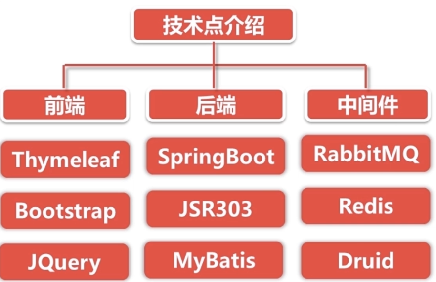
### 项目组成
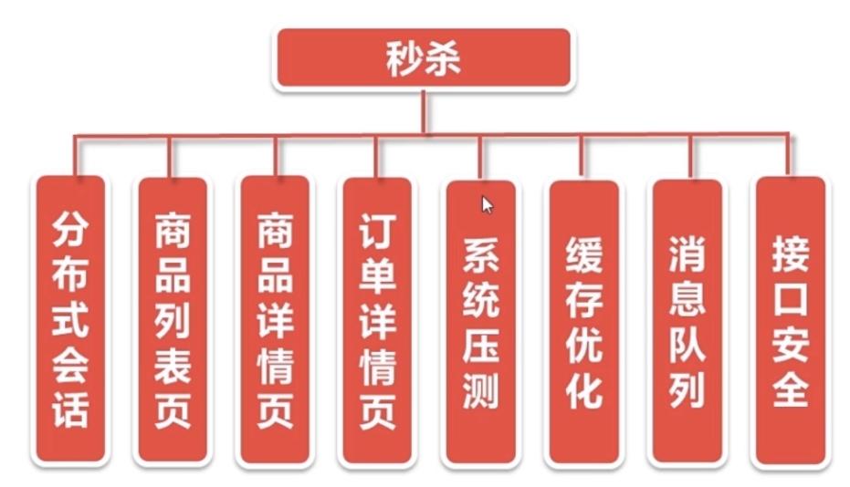


# 中间件安装
## Redis
Redis基于Redis-6.2.1。Redis服务的文件设置在
```xml
/usr/local/redis/redis.conf # 配置文件
/usr/local/redis/redis.log # 日志文件
/usr/local/redis/data # 数据文件
```

### 新添启动方式
在 /etc/systemd/system 下新建redis.service，并添加以下内容
```
[Unit]
Description=Redis
After=network.target
 
[Service]
Type=forking
ExecStart=/usr/local/bin/redis-server /usr/local/redis/redis.conf
ExecReload=/usr/local/bin/redis-server -s reload
ExecStop=/usr/local/bin/redis-server -s stop
PrivateTmp=true
 
[Install]
WantedBy=multi-user.target
```
完成了`systemctl`方式启动服务。
```shell
systemctl enable redis                  # 开机自启redis服务
systemctl disable redis                 # 取消开机自启
systemctl start redis.service　         # 启动redis服务
systemctl stop redis.service　          # 停止服务
systemctl restart redis.service　       # 重新启动服务
systemctl status redis.service          # 查看服务当前状态
systemctl list-units --type=service     # 查看所有已启动的服务
systemctl daemon-reload                 # 加载服务配置文件
```

## RabbitMQ
安装在`/usr/local/software`目录下。
1. 启动
    ```shell
    /sbin/service rabbitmq-server start 
    ```
2. 查看服务状态
    ```shell
    /sbin/service rabbitmq-server status
    ```
3. 开启web管理插件
    ```shell
    rabbitmq-plugins enable rabbitmq_management
    ```
4. 关闭服务
   ```shell
   /sbin/service rabbitmq-server stop 
   ```
5. systemctl命令
    ```shell
    #启动服务
    systemctl start rabbitmq-server.service
    
    #设置开机启动
    systemctl enable rabbitmq-server.service
    
    #停止开机启动
    systemctl disable rabbitmq-server.service
    
    #重新启动服务
    systemctl restart rabbitmq-server.service
    
    #查看服务当前状态
    systemctl status rabbitmq-server.service
    
    #查看所有已启动服务
    systemctl list-units --type=service

    #查看rabbimq状态
    rabbitmqctl status

    #重启rabbitmq服务器
    rabbitmqctl start_app
    ```

## Nginx
Nginx是一个高性能的HTTP和反向代理Web服务器。
代理服务器。用来解决服务器负载均衡问题。
**正向代理**：代理客户端。比如VPN。
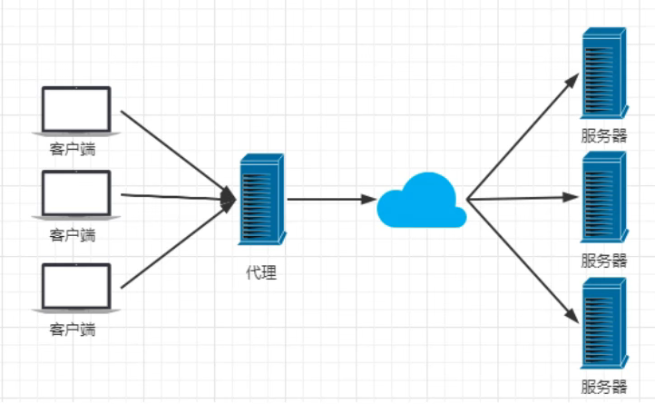


### Nginx功能
1. **反向代理**：代理服务端。让用户无感访问浏览器，只需关注域名，不需关注要访问哪一个服务器。
    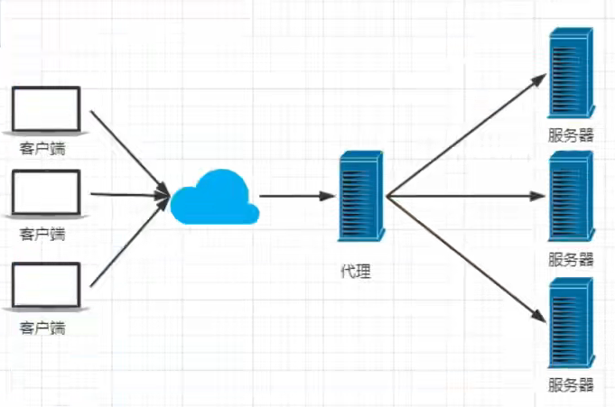
2. **负载均衡**：具有高性能的服务器处理更多的请求。即使用**加权轮询**的方式。
    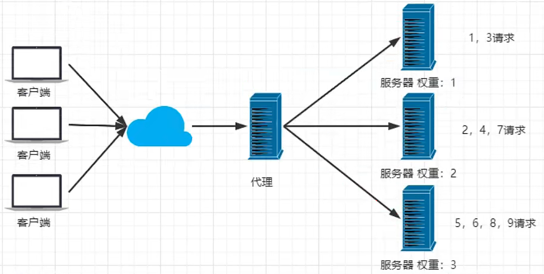
3. **动静分离**：
    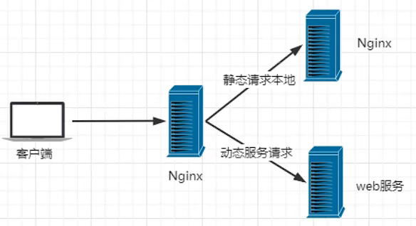

### Nginx安装
安装在`/usr/local/nginx`中。
1. 打开nginx
    ```shell
    cd /usr/local/nginx/sbin
    ./nginx
    ```
2. 关闭nginx
    ```shell
    cd /usr/local/nginx/sbin
    ./nginx -s stop
    ```
3. 重启nginx
    ```shell
    ./nginx -s reload
    ```

### Nginx配置
Nginx的配置文件放在`/usr/local/nginx/conf/nginx.conf`中。在一台服务器上分别运行两个jar项目。端口号分别为8080和8081。下面的配置实现了访问服务器80端口，nginx根据负载均衡的设置参数，反向代理至8080和8081端口的功能。（若部署有服务器，同样可以反向代理至指定ip和端口）。
```conf
# 在http{}里面作修改
http{
    # 反向代理的处理流
    upstream serverPoolMiaosha{
        server 127.0.0.1:8080 weight=3; # 权重越高，收到的请求越多。规则为加权轮询
        server 127.0.0.1:8081 weight=1;
    }
    server {
        listen 80; # http默认端口80。若为https则为443端口。server实时监听80端口
        # 访问根目录
        location / {
            root html;
            index index.html index.htm;
            proxy_pass http://serverPoolMiaosha; 
        }
    }
}
```

# 登录功能实现

## MD5
### 目的
**对登录密码进行两次MD5处理**
1. 用户端：`PASS = MD5 (明文+固定Salt)`。防止传输过程中明文密码被窃取。
2. 服务端：`PASS = MD5 (用户输入+随机Salt)`。防止数据库被盗，引发**彩虹表攻击**得到明文密码。

### 实现
1. 导入依赖
    ```xml
    <dependency>
        <groupId>commons-codec</groupId>
        <artifactId>commons-codec</artifactId>
    </dependency>
    <dependency>
        <groupId>org.apache.commons</groupId>
        <artifactId>commons-lang3</artifactId>
    </dependency>
    ```
2. 编写工具类
    ```java
    public class MD5Util {
        public static String md5(String src){
            return DigestUtils.md5Hex(src);
        }

        private static final String salt = "1a2b3c4d"; //防止彩虹表攻击

        //服务端md5加密
        public static String inputPassFormPass(String inputPass){
            //做此处理，若salt设置为"1a2b3c4d".攻击者通过查询彩虹表攻击密码“123456”得到的结果为“12123456c3”。
            String str = "" + salt.charAt(0)+salt.charAt(2) + inputPass + salt.charAt(5) + salt.charAt(4);
            return md5(str);
        }

        //客户端md5加密
        public static String formPassToDBPass(String formPass,String salt){
            //做此处理，攻击者通过查询彩虹表攻击密码“123456”得到的结果为“12123456c3”。
            String str = "" + salt.charAt(0)+salt.charAt(2) + formPass + salt.charAt(5) + salt.charAt(4);
            return md5(str);
        }

        public static String inputPassToDBPass(String input,String saltDB){
            String formPass = inputPassFormPass(input);
            String dbPass = formPassToDBPass(formPass,saltDB);
            return dbPass;
        }

    }
    ```
3. 服务端做相同md5处理。（一般在点击登录的时候做处理，并传入后端）
    要求：
    1. salt与后端代码中的salt相同。
    2. 字符串的预处理与后端代码中的salt相同。
    ```js
    var g_passsword_salt="1a2b3c4d"
    var pass = $("#password").val();
    var salt = g_passsword_salt;
    var str = "" + salt.charAt(0) + salt.charAt(2) + pass + salt.charAt(5) + salt.charAt(4);
    var password = md5(str);
    ```
4. 客户端对服务端传来的formPass通行证再做md5。然后校验得到的值是否与数据库存的md5值一致。（注：**数据库中存的密码为经过两次md5加密后的密码**，非明文密码）


## JSR303校验
### 目的
1. 因某些变量会频繁的比较，降低了代码可读性。因此将通用的有效性验证转移至注解。

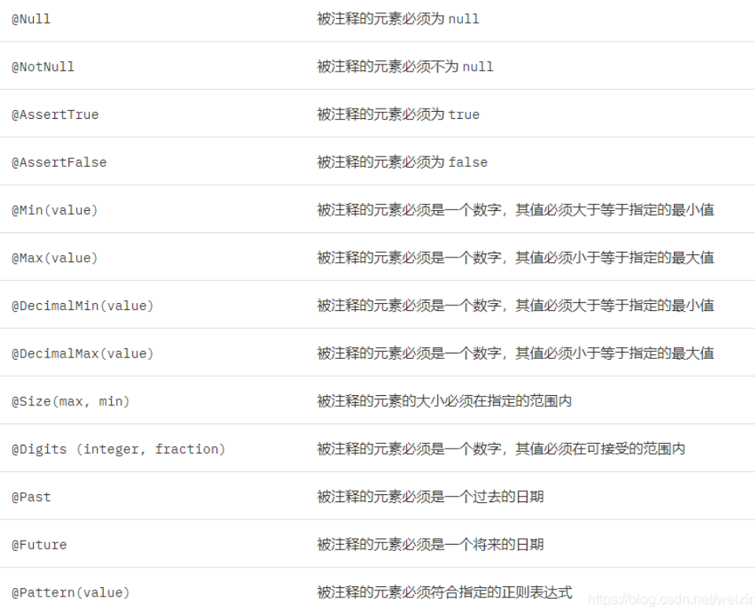
### 实现
1. 导入依赖
    ```xml
    <dependency>
        <groupId>org.springframework.boot</groupId>
        <artifactId>spring-boot-starter-validation</artifactId>
    </dependency>
    ```
2. 加入注解使用
    ```java
    @ToString
    @Data
    public class LoginVo {

        @NotNull
        @IsMobile
        private String mobile;

        @NotNull
        @Length(min = 32)
        private String password;
    }
    ```
3. 告诉spring这个数据需要校验`@Valid`
    ```java
    public Result<Boolean> doLogin(HttpServletResponse response, @Valid LoginVo loginVo){
        //登录
        userService.login(response,loginVo);
        return Result.success(true);
    }
    ```
4. 声明自定义验证类
    ```java
    public class IsMobileValidator implements ConstraintValidator<IsMobile,String> {
    private boolean required = false;

    @Override
    public void initialize(IsMobile constraintAnnotation) {
        required = constraintAnnotation.required();
    }

    @Override
    public boolean isValid(String value, ConstraintValidatorContext context) {
        if (required){
           return ValidatorUtil.isMobile(value);
        }else {
            if (StringUtils.isEmpty(value)){
                return true;
            }else {
                return ValidatorUtil.isMobile(value);
            }
        }
    }
    }
    ```
5. 声明自定义注解
    ```java
    @Target({ METHOD, FIELD, ANNOTATION_TYPE, CONSTRUCTOR, PARAMETER})
    @Retention(RUNTIME)
    @Documented
    @Constraint(validatedBy = {IsMobileValidator.class})
    public @interface IsMobile {

        boolean required() default true;

        String message() default "手机号码格式有误";

        Class<?>[] groups() default { };

        Class<? extends Payload>[] payload() default { };
    }
    ```

## 分布式session
### 目的
1. 解决分布式服务器session共享问题。用户随意发请求，所有服务器都有token来识别。不会出现请求发到不同服务器导致之前的请求不能识别的问题

### 实现
向redis（**redis必须是集群**）中设置token来实现。
1. 在登录的同时向redis中设置token或更新token的TTL。
    ```java
    private void addCookie(HttpServletResponse response,String token,MiaoshaUser user){
        redisService.set(MiaoshaUserKey.token,token,user);
        Cookie cookie = new Cookie(COOKIE_NAME_TOKEN,token);
        cookie.setMaxAge(MiaoshaUserKey.token.expireSeconds());
        cookie.setPath("/");
        response.addCookie(cookie);
    }
    ```
2. 配置参数解析器。作用：在redis中查找用户的token并返回用户对象
    ```java
    @Service
    public class UserArgumentResolver implements HandlerMethodArgumentResolver {
        MiaoshaUserService userService;

        @Autowired
        public void setUserService(MiaoshaUserService userService) {
            this.userService = userService;
        }

        //只有域中需要该类对象，才会调用参数解析器。
        @Override
        public boolean supportsParameter(MethodParameter parameter) {
            Class<?> clazz = parameter.getParameterType();
            return clazz== MiaoshaUser.class;
        }

        //参数解析器
        @Override
        public Object resolveArgument(MethodParameter parameter, ModelAndViewContainer mavContainer, NativeWebRequest webRequest, WebDataBinderFactory binderFactory) throws Exception {
            HttpServletRequest request = webRequest.getNativeRequest(HttpServletRequest.class);
            HttpServletResponse response = webRequest.getNativeResponse(HttpServletResponse.class);
            //session中的token。一些手机端会以参数传递的方式传递token。
            String paramToken = request.getParameter(MiaoshaUserService.COOKIE_NAME_TOKEN); 
            //cookie中的token。
            String cookieToken = getCookieValue(request,MiaoshaUserService.COOKIE_NAME_TOKEN);
            if (StringUtils.isEmpty(cookieToken)&&StringUtils.isEmpty(paramToken)){
                return "login";
            }
            String token = StringUtils.isEmpty(paramToken)?cookieToken:paramToken;
            return  userService.getByToken(response,token);
        }

        private String getCookieValue(HttpServletRequest request, String cookieNameToken) {
            Cookie[] cookies = request.getCookies();
            for (Cookie cookie : cookies) {
                if (cookie.getName().equals(cookieNameToken)){
                    return cookie.getValue();
                }
            }
            return null;
        }
    }
    ```
    ```java
    //向redis中查询token值
    public MiaoshaUser getByToken(HttpServletResponse response,String token) {
        if (StringUtils.isEmpty(token)){
            return null;
        }
        MiaoshaUser user = redisService.get(MiaoshaUserKey.token, token, MiaoshaUser.class);
        if (user!=null){
            //延长有效期
            addCookie(response,token,user);
        } 
        return user;
    }
    ```
3. 在WebConfig里添加自定义的参数解析器
    ```java
    @Configuration
    public class WebConfig implements WebMvcConfigurer {
    UserArgumentResolver userArgumentResolver;

    @Autowired
    public void setUserArgumentResolver(UserArgumentResolver userArgumentResolver) {
        this.userArgumentResolver = userArgumentResolver;
    }

    @Override
    public void addArgumentResolvers(List<HandlerMethodArgumentResolver> resolvers) {
        resolvers.add(userArgumentResolver);
    }
    }
    ```


# 数据库及页面设计
## 数据库设计
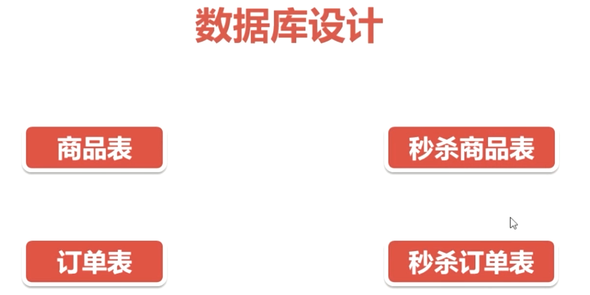
在后端连接数据库时，数据库配置需要修改为上海时区。否则Mysql存入时间和读取时间不一致。
`url: jdbc:mysql://localhost:3306/miaosha?useUnicode=true&characterEncoding=utf-8&serverTimezone=Asia/Shanghai&rewriteBatchedStatements=TRUE`

## 页面设计
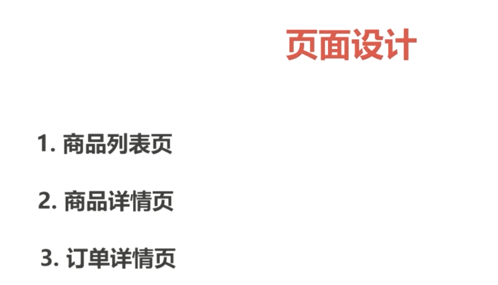


# JMeter压测
## JMeter命令行
1. 在windows上录好jmx
2. 命令行：`sh jmeter.sh -n -t XXX.jmx -l result.jtl`。配置了jmeter的环境变量可以直接调用：`jmeter -n -t XXX.jmx -l result.jtl`。
3. 把result.jtl从linux上导入到windows中的jmeter聚合报告

## redis-benchmark
`redis-benchmark -h 127.0.0.1 -p 6379 -c 100 -n 100000`-模拟100个并发发10万个请求。
`redis-benchmark -h 127.0.0.1 -p 6379 -q -d 100`- 测试获取大小为100字节的数据包的性能。
`redis-benchmark -t set,lpush -n 100000 -q`- 测试`set`,`lpush`操作的性能。
`redis-benchmark -n 100000 -q script load "redis.call('set','foo','bar')"`- 测试部分数值存取的性能。

## Jmeter测试数据
1. **商品列表测试**：针对goods/to_list
    Linux中开5000个线程，循环10次，也就是发50000个请求。中途没有报错。得到以下结果：
    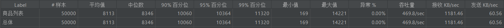
2. **秒杀测试**
    Linux中开5000个线程，循环10次，也就是发50000个请求。中途没有报错。得到以下结果：
    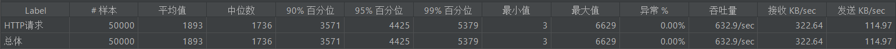
    出现了超卖问题：
    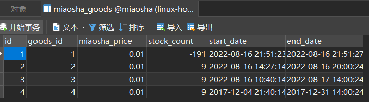

# 页面优化技术
## 页面缓存+URL缓存+对象缓存
### 页面缓存
1. 取缓存
   ```java
    //取缓存
    String html = redisService.get(GoodsKey.getGoodsDetail, ""+goodsId, String.class);
    if (!StringUtils.isEmpty(html)){
        return html;
    }
   ```
2. 手动渲染缓存
    ```java
    WebContext webContext = new WebContext(request,response,request.getServletContext(),response.getLocale(),model.asMap());
    html = thymeleafViewResolver.getTemplateEngine().process("goods_detail", webContext);
    ```
3. 输出结果
    ```java
    //做页面缓存
    if (!StringUtils.isEmpty(html)){
        redisService.set(GoodsKey.getGoodsDetail,""+goodsId,html);
    }
    ```
4. Jmeter测试数据
    针对`goods/to_list`。Linux中开5000个线程，循环10次，也就是发50000个请求。中途没有报错。得到以下结果：
    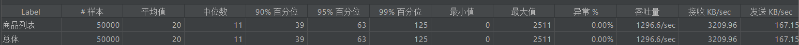
### 对象缓存

```java
//对象缓存
public MiaoshaUser getById(long id){
    //取缓存
    MiaoshaUser user = redisService.get(MiaoshaUserKey.getById, "" + id, MiaoshaUser.class);
    if (user!=null){
        return user;
    }
    //取数据库
    user = miaoshaUserDao.getById(id);
    if (user!=null){
        redisService.set(MiaoshaUserKey.getById, "" + id, MiaoshaUser.class);
    }
    return user;
}
```

### URL缓存
1. 在application.yml添加缓存配置
    ```yml
    spring:
        resources:
            add-mappings: true
            chain: # resolver的相关配置
            cache: true
            enabled: true
            html-application-cache: true
            static-locations: classpath:/static/
            cache:
            cachecontrol:
                max-age: 3600
                cache-public: true
                no-cache: false
                no-store: false
                must-revalidate: false
    ```
2. 浏览器取消禁用缓存

添加以上配置，浏览器会优先读取resolver缓存和html缓存。其中，`max-age`设置的是缓存的最大时长。

## 页面静态化，前后端分离

### GET POST区别
1. GET幂等，不会对服务端产生影响
2. POST非幂等，会对服务端产生影响


## 静态资源优化
1. JS/CSS压缩，减少流量
2. 多个JS/CSS组合，减少连接数
3. CDN就近访问
    CDN(Content delivery network)，即内容分发网络。


# 秒杀系统问题解决
## 超卖问题
### 重复下订单
当同一个用户，同时发不同请求下秒杀时，会出现重复订单，进而出现超卖问题。因此，除了订单表，还引入了秒杀订单表。同一用户只能下一个秒杀订单。**解决步骤：**
1. 设置秒杀订单表的唯一索引
    ```sql
    CREATE UNIQUE INDEX ON miaosha_order (user_id,goods_id);
    ```
2. 创建订单时，同时将订单相关信息写入redis。方便快速查询，避免调用mysql
    ```java
    redisService.set(OrderKey.getMiaoshaOrderByUidGid,""+user.getId()+"_"+goods.getId(),MiaoshaOrder.class);
    ```
3. 查询Redis，判断用户是否下过秒杀订单
    ```java
    public MiaoshaOrder getMiaoshaOrderByUserIdGoodsId(Long userId, long goodsId) {
        return redisService.get(OrderKey.getMiaoshaOrderByUidGid,""+userId+"_"+goodsId,MiaoshaOrder.class);
    }
    ```

# 接口优化
**思路：减少数据库访问**
1. 系统初始化，把商品库存数量加载到Redis
2. 收到请求，Redis预减库存，库存不足，直接返回，否则进入3
3. 请求入队，立即返回排队中
4. 请求出队，生成订单，减少库存
5. 客户端轮询，是否秒杀成功

## Redis预减库存
之前读库存是从mysql中读取的，这方面的工作其实可以转移至redis中。因此做了redis预减库存的操作。
1. 在MiaoshaController初始化时，需要将库存信息添加值redis中。
    类需`implements InitializingBean`接口
    ```java
    @Override
    public void afterPropertiesSet() throws Exception {
        List<GoodsVo> goodsList = goodsService.listGoodsVo();
        if (goodsList==null){
            return;
        }
        for (GoodsVo goods : goodsList) {
            redisService.set(GoodsKey.getMiaoshaGoodsStock,""+goods.getId(),goods.getStockCount());
            localOverMap.put(goods.getId(),false);
        }
    }
    ```
2. 做秒杀请求发来时，读取redis缓存中的数据，而不是向数据库发请求查询库存。
    ```java
    //预减库存
    long stock = redisService.decr(GoodsKey.getMiaoshaGoodsStock,""+goodsId);
    if (stock<0){
        localOverMap.put(goodsId,true);
        return Result.error(CodeMsg.MIAOSHA_OVER);
    }
    ```

## 内存标记
虽然redis的性能十分强大，但是面对高并发的情况，redis也有可能出现问题。因此从类的设计上考虑，引入了一个内存标记map。存放库存是否为空的状态。这样秒杀请求进来后，先找内存标记，查看库存是否被标记为空。若不为空，再查询redis。
```java
//内存标记，减少redis访问
Boolean over = localOverMap.get(goodsId);
if (over){
    return Result.error(CodeMsg.MIAOSHA_OVER);
}
```

## 入队缓冲
入队缓冲的实现是用rabbitmq消息队列。针对秒杀请求，只需生产者将消息send出去，等待消费者处理即可。
1. 配置秒杀队列(方式：direct)
    ```java
    @Configuration
    public class MQConfig {
        public static final String MIAOSHA_QUEUE = "miaosha.queue";
        @Bean
        public Queue miaoshaQueue(){
            return new Queue(MIAOSHA_QUEUE,true);
        }
    }
    ```
2. 编写生产者代码
    ```java
    @Service
    public class MQSender {
        RabbitTemplate rabbitTemplate;

        @Autowired
        public void setRabbitTemplate(RabbitTemplate rabbitTemplate) {
            this.rabbitTemplate = rabbitTemplate;
        }

        public void sendMiaoshaMessage(MiaoshaMessage mm) {
            String msg = RedisService.beanToString(mm);
            rabbitTemplate.convertAndSend(MQConfig.MIAOSHA_QUEUE,msg);
        }
    }
    ```
3. 编写消费者代码。
    ```java
    @Service
    public class MQReceiver {
        GoodsService goodsService;
        OrderService orderService;
        MiaoshaService miaoshaService;

        @Autowired
        public MQReceiver(GoodsService goodsService, OrderService orderService, MiaoshaService miaoshaService) {
            this.goodsService = goodsService;
            this.orderService = orderService;
            this.miaoshaService = miaoshaService;
        }

        @RabbitListener(queues = MQConfig.MIAOSHA_QUEUE)
        public void receive(String message){
            MiaoshaMessage mm = RedisService.stringToBean(message, MiaoshaMessage.class);
            MiaoshaUser user = mm.getUser();
            long goodsId = mm.getGoodsId();
            //判断是否还有库存
            GoodsVo goods = goodsService.getGoodsVoByGoodsId(goodsId);
            Integer stockCount = goods.getStockCount();
            if (stockCount<=0){
                return ;
            }
            //判断是否已经秒杀到
            MiaoshaOrder order = orderService.getMiaoshaOrderByUserIdGoodsId(user.getId(),goodsId);
            if (order!=null){
                return ;
            }
            //事务操作：减库存 下订单 写入秒杀订单
            miaoshaService.miaosha(user,goods);
        }
    }
    ```
4. 在点击秒杀的请求处理中，将当前秒杀消息入队列。
    ```java
    //入队
    MQSender sender;
    MiaoshaMessage mm = new MiaoshaMessage();
    mm.setUser(user);
    mm.setGoodsId(goodsId);
    sender.sendMiaoshaMessage(mm);
    ```
5. 秒杀队列的前端显示。
    ```js
    function getMiaoshaResult(goodsId) {
        g_showLoading();
        $.ajax({
            url: "/miaosha/result",
            type: "GET",
            data: {
                goodsId: goodsId,
            },
            success: function (data) {
                if (data.code === 0) {
                    var result = data.data;
                    if (result < 0) {
                        layer.msg("对不起，秒杀失败");
                    } else if (result == 0) { //继续轮询
                        setTimeout(function(){
                            getMiaoshaResult(goodsId);
                        },50)
                    } else {
                        layer.confirm("恭喜你，秒杀成功！查看订单 ?", {btn: ["确定", "取消"]},
                            function () {
                                window.location.href="/order_detail.htm?orderId=" + result;
                            },
                            function () {
                                layer.closeAll();
                            });
                    }
                } else {
                    layer.msg(data.msg);
                }
            },
            error: function () {
                layer.msg("客户端请求有误")
            }
        });
    }
    ```
    后端隔50ms就向redis查询当前用户的秒杀订单是否存在。
    ```java
    /**
     * 秒杀结果轮询。
     * @param model-model
     * @param user-当前秒杀用户
     * @param goodsId-秒杀的商品id
     * @return 成功:返回订单id；失败:返回-1；排队中:返回0
     * @author zhaolifeng
     * @date 2022/8/18 15:21
     */
    @GetMapping(value = "/result",produces = "application/json")
    @ResponseBody
    public Result<Long> miaoshaResult(Model model, MiaoshaUser user,
                                   @RequestParam("goodsId") long goodsId) {
        model.addAttribute("user", user);
        if (user == null) {
            return Result.error(CodeMsg.SESSION_ERROR);
        }
        long result = miaoshaService.getMiaoshaResult(user.getId(),goodsId);
        return Result.success(result);
    }
    ```

## JMeter压测
针对`miaosha/do_miaosha`。Linux中开5000个线程，循环10次，也就是发50000个请求对商品秒杀。中途没有报错。得到以下结果：
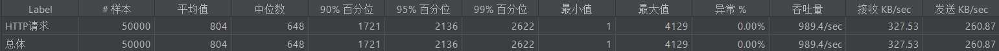
**没有出现超卖问题。**

# 安全优化

## 秒杀接口地址隐藏
思路：秒杀开始之前，先去请求接口获取秒杀地址
1. 前端改造：点击秒杀会先调用获取秒杀地址的函数。
    ```js
    function getMiaoshaPath() {
        var goodsId = $("#goodsId").val();
        g_showLoading();
        $.ajax({
            url: "/miaosha/path",
            type: "GET",
            data: {
                goodsId: goodsId,
                verifyCode: $("#verifyCode").val(),
            },
            success: function (data) {
                if (data.code === 0) {
                    var path = data.data;
                    doMiaosha(path);
                } else {
                    layer.msg(data.msg);
                }
            },
            error: function (data) {
                if (data!=null&&data.responseJSON!=null){
                    layer.msg(data.responseJSON.msg);
                }else {
                    layer.msg("客户端请求有误");
                }
            }
        });
    }
    ```
2. 接口改造，带上PathVariable参数
    ```java
    @PostMapping(value = "/{path}/do_miaosha", produces = "application/json")
    @ResponseBody
    public Result<Integer> miaosha(Model model, MiaoshaUser user,@RequestParam("goodsId") long goodsId,
    @PathVariable("path") String path){

    }
    ```
3. 添加生成地址的接口
    ```java
    @AccessLimit(seconds = 5,maxCount=5)
    @GetMapping(value = "/path")
    @ResponseBody
    public Result<String> getMiaoshaPath(MiaoshaUser user,
                                         @RequestParam("goodsId") long goodsId,
                                         @RequestParam(value = "verifyCode") Integer verifyCode) {
        boolean check = miaoshaService.checkVerifyCode(user,goodsId,verifyCode);
        if (!check){
            return Result.error(CodeMsg.VERIFY_CODE_INCORRECT);
        }
        String path = miaoshaService.createMiaoshaPath(user,goodsId);
        return Result.success(path);
    }
    ```
4. 秒杀收到请求，先验证PathVariable
   ```java
    //验证path
    boolean check = miaoshaService.checkPath(user,goodsId,path);
    if (!check){
        return Result.error(CodeMsg.REQUEST_ILLEGAL);
    }
   ```

## 数学公式验证码
思路：点击秒杀之前，先输入验证码，分散用户的请求
1. 添加生成验证码的接口
   ```java
    @GetMapping(value = "/verifyCode")
    @ResponseBody
    public Result<String> getMiaoshaverifyCode(HttpServletResponse response, MiaoshaUser user,
                                               @RequestParam("goodsId") long goodsId) {
        if (user == null) {
            return Result.error(CodeMsg.SESSION_ERROR);
        }
        BufferedImage image = miaoshaService.createVerifyCode(user,goodsId);
        try {
            OutputStream out = response.getOutputStream();
            ImageIO.write(image,"JPEG",out);
            out.flush();
            out.close();
            return null;
        }catch (Exception e){
            e.printStackTrace();
            return Result.error(CodeMsg.MIAOSHA_FAIL);
        }
    }
   ```
2. 在获取秒杀路径的时候，验证验证码
    ```java
    public boolean checkVerifyCode(MiaoshaUser user, long goodsId, Integer verifyCode) {
        if (user==null||goodsId<=0||verifyCode==null){
            return false;
        }
        Integer codeOld = redisService.get(MiaoshaKey.getMiaoshaVerifyCode, user.getId()+","+goodsId, Integer.class);
        if (codeOld==null||!codeOld.equals(verifyCode)){
            return false;
        }
        redisService.delete(MiaoshaKey.getMiaoshaVerifyCode, user.getId()+","+goodsId);
        return true;
    }
    ```
3. ScriptEngine使用
    ```java
    private int calc(String exp) {
        try {
            ScriptEngineManager manager = new ScriptEngineManager();
            ScriptEngine engine = manager.getEngineByName("JavaScript");
            return (Integer) engine.eval(exp);
        }catch (Exception e){
            e.printStackTrace();
            return 0;
        }
    }
    ```

## 接口防刷
思路：对接口做限流
1. 自定义访问控制注解
   ```java
    @Retention(RetentionPolicy.RUNTIME)
    @Target(ElementType.METHOD)
    public @interface AccessLimit {
        int seconds() default -1;
        int maxCount() default -1;
        boolean needLogin() default true;
    }
   ```
2. 编写访问控制过滤器
   ```java
    @Service
    public class AccessInterceptor extends HandlerInterceptorAdapter {

        MiaoshaUserService userService;
        RedisService redisService;

        @Autowired
        public void setRedisService(RedisService redisService) {
            this.redisService = redisService;
        }

        @Autowired
        public void setUserService(MiaoshaUserService userService) {
            this.userService = userService;
        }

        @Override
        public boolean preHandle(HttpServletRequest request, HttpServletResponse response, Object handler) throws Exception {
            if (handler instanceof HandlerMethod){
                MiaoshaUser user = getUser(request, response);
                UserContext.setUser(user);
                HandlerMethod hm = (HandlerMethod) handler;
                AccessLimit accessLimit = hm.getMethodAnnotation(AccessLimit.class);
                if (accessLimit==null){
                    return true;
                }
                int seconds = accessLimit.seconds();
                int maxCount = accessLimit.maxCount();
                boolean needLogin = accessLimit.needLogin();
                String key = request.getRequestURI();
                if (needLogin){
                    if (user==null){
                        RedirectUtil.redirect(request,response,"/");
                        render(response, CodeMsg.USER_NOT_LOGIN);
                        return false;
                    }
                    key += "_" + user.getId();
                }
                if (seconds==-1){
                    AccessKey ak = AccessKey.withExpire(seconds);
                    Integer count = redisService.get(ak,key,Integer.class);
                    if (count==null){
                        redisService.set(ak,key,1);
                    }else if (count<maxCount){
                        redisService.incr(ak,key);
                    }else {
                        render(response,CodeMsg.ACCESS_LIMIT_REACHED);
                        return false;
                    }
                }
            }
            return super.preHandle(request, response, handler);
        }
        
        private MiaoshaUser getUser(HttpServletRequest request,HttpServletResponse response){
            String paramToken = request.getParameter(MiaoshaUserService.COOKIE_NAME_TOKEN);
            String cookieToken = getCookieValue(request,MiaoshaUserService.COOKIE_NAME_TOKEN);
            if (StringUtils.isEmpty(cookieToken)&&StringUtils.isEmpty(paramToken)){
                return null;
            }
            String token = StringUtils.isEmpty(paramToken)?cookieToken:paramToken;
            return  userService.getByToken(response,token);
        }

        private String getCookieValue(HttpServletRequest request, String cookieNameToken) {
            Cookie[] cookies = request.getCookies();
            if (cookies==null||cookies.length<=0){
                return null;
            }
            for (Cookie cookie : cookies) {
                if (cookie.getName().equals(cookieNameToken)){
                    return cookie.getValue();
                }
            }
            return null;
        }

        private void render(HttpServletResponse response, CodeMsg cm) throws Exception{
            response.setContentType(MediaType.APPLICATION_JSON_VALUE);
            OutputStream out = response.getOutputStream();
            String str = JSON.toJSONString(Result.error(cm));
            out.write(str.getBytes(StandardCharsets.UTF_8));
            out.flush();
            out.close();
        }

    }
   ```
3. 在WebConfig里添加过滤器
   ```java
    @Override
    public void addInterceptors(InterceptorRegistry registry) {
        registry.addInterceptor(accessInterceptor);
    }
   ```
4. 添加注解
   ```java
    @AccessLimit(seconds = 5,maxCount=5)
    @GetMapping(value = "/path")
    @ResponseBody
    public Result<String> getMiaoshaPath(MiaoshaUser user,
                                         @RequestParam("goodsId") long goodsId,
                                         @RequestParam(value = "verifyCode") Integer verifyCode) {
        boolean check = miaoshaService.checkVerifyCode(user,goodsId,verifyCode);
        if (!check){
            return Result.error(CodeMsg.VERIFY_CODE_INCORRECT);
        }
        String path = miaoshaService.createMiaoshaPath(user,goodsId);
        return Result.success(path);
    }
   ```